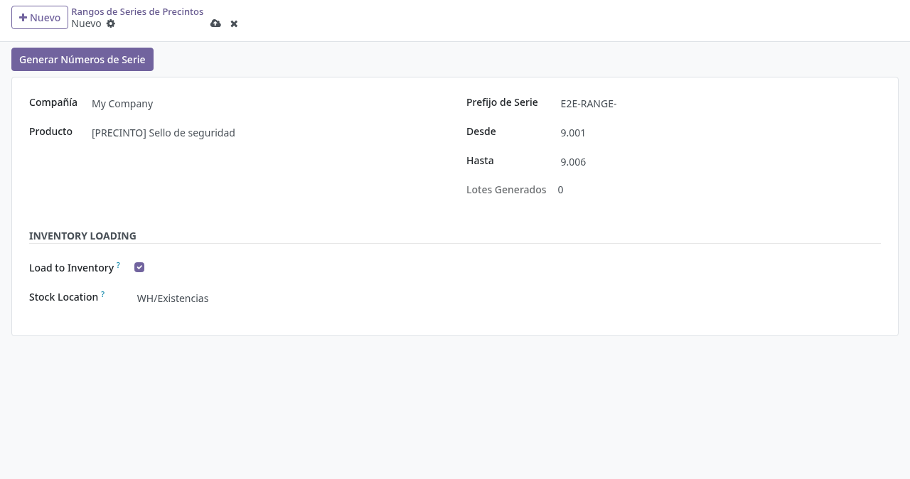
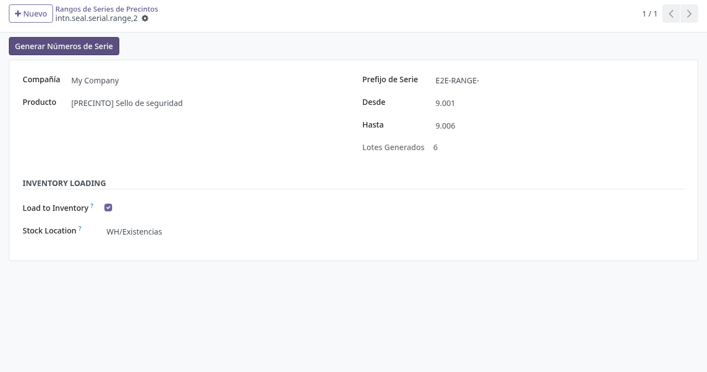
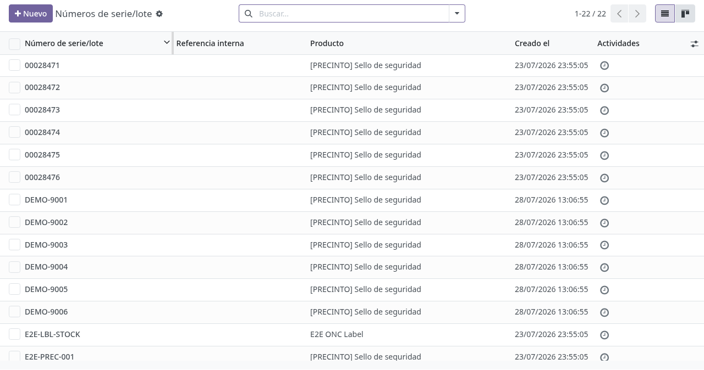
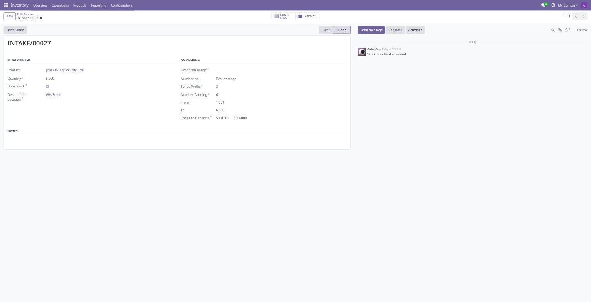
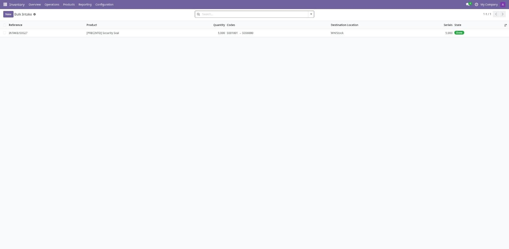
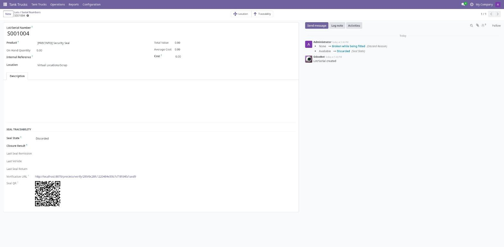
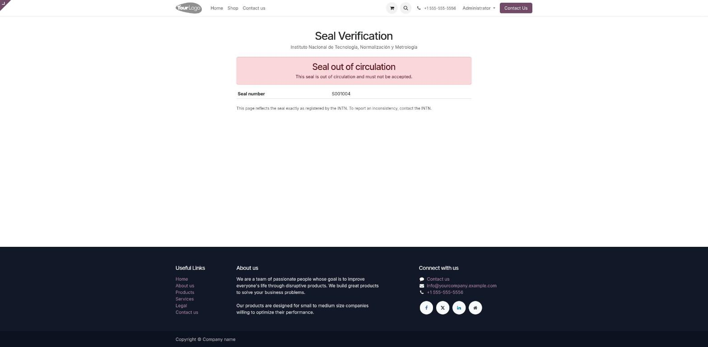

# Carga de precintos en inventario (alta de series y códigos)

## Para quién es esta guía

- **Administrador de inventario / almacén** — da de alta los precintos físicos que llegan al INTN y los deja disponibles para su uso.
- **Usuario de cisternas** — consulta el estado de cada precinto y detecta faltantes antes de una remisión.

## Qué resuelve este proceso

Antes de poder **remitir** o **homologar** un precinto, ese precinto tiene que existir en el sistema como **número de serie (lote) del producto Sello de seguridad (código PRECINTO)** y tener stock en una ubicación interna. Esta guía cubre ese paso previo: cómo se generan los códigos de los precintos y cómo quedan cargados en inventario.

Un precinto = un lote/número de serie. Su código es siempre **prefijo de serie + número** (por ejemplo, prefijo `S` y número `28471` → código `S28471`; sin prefijo, `00028471`). El sistema no inventa códigos: reproduce la numeración impresa en el precinto físico.

> No confundir con **Seals / Labels → Ranges** (menú de cisternas). Aquel es el **rango administrativo de numeración** por organismo, que se reparte a los expedientes mediante **Issuances** (emisiones). Este proceso es el **alta física en inventario**. Los dos se relacionan por el número: la emisión muestra en *Issued Seal Lots* los lotes cuyo código coincide con el intervalo emitido, y queda vacía si esos lotes nunca se generaron en inventario.

## Configuración previa

- Producto **Sello de seguridad** (código `PRECINTO`) instalado con el módulo de precintos, con seguimiento por **número de serie**.
- Ubicación interna de depósito donde se guardan los precintos (por ejemplo, el stock del almacén principal).
- **Ubicaciones de Precinto** configuradas en **Inventario → Configuración → Ubicaciones de Precinto**, cada una asociada a su ubicación de stock: es lo que después se elige en la remisión.
- Permisos de inventario para el menú **Inventario → Configuración**.

## Pasos por rol

### Administrador — Alta por rango (recomendado)

1. Abrir **Inventario → Configuración → Rangos de Series de Precintos**.

2. Crear un registro y completar:
   - **Compañía**: la compañía dueña del stock.
   - **Producto**: el producto de precintos (**[PRECINTO] Sello de seguridad**).
   - **Prefijo de Serie**: el prefijo impreso en los precintos (por defecto `S`). Puede dejarse vacío si la numeración es solo numérica.
   - **Desde** / **Hasta**: primer y último número del talonario recibido. Ambos deben ser positivos y **Hasta ≥ Desde**.
   - **Lotes Generados**: contador de solo lectura; indica cuántos códigos de ese intervalo ya existen como número de serie.

   

3. En el grupo **Inventory Loading** (este bloque y sus dos campos se muestran en inglés):
   - Activar **Load to Inventory** para que, además de crear los códigos, se cargue **1 unidad de stock por precinto**.
   - Con esa opción activada, **Stock Location** es obligatorio: la ubicación interna donde quedan físicamente los precintos.
   - Si no se activa, los códigos se crean pero **sin stock**: no se podrán capturar en una remisión hasta cargarles existencias.

4. Pulsar **Generar Números de Serie**. El sistema:
   - Crea un número de serie por cada número del intervalo (`prefijo` + `número`), salteando los que ya existían.
   - Deja cada precinto nuevo en estado **Disponible** (*Available*).
   - Si se pidió cargar a inventario, genera una **recepción** (Inventario → Recepciones) con una línea por precinto y la valida, de modo que las existencias quedan con un documento que dice de dónde salieron. Los precintos que ya tenían stock quedan **fuera de la recepción**, así que volver a pulsar el botón no infla el stock.
   - Si un número del intervalo ya existe **escrito de otra forma** (por ejemplo `P24001` cuando este rango escribiría `P024001`), se reutiliza el existente en lugar de crear un segundo registro del mismo precinto, y queda constancia en el historial de la carga.
   - **Lotes Generados** pasa a mostrar cuántos números del intervalo existen, contados por número y no por la grafía exacta.

   

5. Verificar el resultado en **Inventario → Productos → Lotes/Números de serie**, filtrando por el prefijo: cada código debe figurar con **Cantidad a la mano = 1** en la ubicación elegida.

   

### Administrador — Alta masiva genérica (Bulk Intake)

Para cargar un lote entero de cualquier producto —precintos u otro—, **Inventario → Operaciones → Bulk Intake**. Se indica producto, cantidad y ubicación, y cómo se numeran las unidades:

- **Correlativo**: el sistema sigue desde el último código registrado de esa serie. Se cargan 6.000 y arrancan solos donde terminaron los anteriores.
- **Rango explícito**: se escribe el número inicial impreso en el talonario, que es lo habitual cuando cada caja trae su propia numeración.
- **Sin número de serie**: para productos no trazados, donde sólo importa la cantidad.

**Codes to Generate** muestra el primer y el último código antes de escribir nada. Al pulsar **Register** se crean los códigos y se genera la recepción; los botones **Serials** y **Receipt** llevan a una y otra.

### Administrador — Alta manual (excepciones)

Para altas puntuales (un precinto suelto, una corrección):

1. Abrir **Inventario → Productos → Lotes/Números de serie → Nuevo**.
2. Completar el **Número de serie** con el código exacto del precinto y elegir el producto **Sello de seguridad**. Al guardar, el precinto queda automáticamente en estado **Disponible**.
3. Cargar la existencia desde **Inventario → Operaciones → Ajustes de inventario** (1 unidad en la ubicación correspondiente).

### Usuario de cisternas — Control antes de usarlos

1. Para una vista de conjunto, usar **Camiones Tanque → Operaciones → Reports → Seal Reports Wizard**, informe **Seal Status**, que lista todos los precintos con su estado actual (opcionalmente filtrado por estado).
2. El lote guarda además el ciclo de vida completo del precinto en el grupo **Trazabilidad de Precinto** de su formulario: **Estado del precinto**, **Resultado de cierre**, **Tipo de incidente**, y la **última remisión**, **último vehículo** y **última devolución** en que participó.

### Administrador — Etiquetas y verificación por QR

Cada precinto tiene su propia dirección pública de verificación y su QR, visibles en el grupo **Trazabilidad de Precinto** del lote.

1. Para imprimir, seleccionar los precintos en **Inventario → Productos → Lotes/Números de serie** y usar la acción de informe **Seal QR Labels** (hoja de 3 × 8 etiquetas). Cada etiqueta lleva el número y el QR.
2. Quien escanee el QR llega a una página pública que dice si el precinto **está en uso**, **todavía no fue emitido**, **ya fue devuelto** o **está fuera de circulación**, junto con la chapa del camión, la remisión y la fecha.
3. La página no pide usuario: está pensada para el playero, el fiscalizador o el comprador, que no tienen acceso al sistema. Lo que la protege es el token de la dirección, sin el cual no se puede recorrer la numeración probando números correlativos. Una dirección con token equivocado responde *Seal not found*.

> La acción **Print Labels** del alta masiva imprime la etiqueta estándar de Odoo con código de barras Code128, útil para lectura con pistola. El QR es para verificación por celular.

## Estados que verá en pantalla

| Estado del precinto | Significado | Cómo se llega |
|---------------------|-------------|----------------|
| Pendiente (*Pending*) | Recibido, todavía no cargado a stock | Alta manual sin existencias |
| Disponible (*Available*) | Cargado y listo para remitir | Alta por rango con **Load to Inventory** |
| Usado (*Used*) | Asignado en una remisión confirmada | Confirmación de la remisión |
| Devuelto (*Returned*) | Volvió del cliente tras su uso | Confirmación de la devolución |
| Descartado (*Discarded*) | Fuera de circulación (cortado/destruido) | Homologación anual coincidente, o devolución irregular |
| Cancelado (*Cancelled*) | Anulado antes de usarse | Devolución con disposición *Cancelado antes de su uso* |

## Casos especiales

- **Solo se remiten precintos Disponibles.** Un código sin stock, o ya usado/devuelto/descartado, es rechazado por el widget de captura de la remisión (*"Only available seal lots can be assigned"*).
- **Series consecutivas.** Lo normal es que los precintos de una remisión formen un intervalo sin saltos, pero **un salto no impide confirmarla**: queda anotado en el historial de la remisión indicando qué números faltan. Es lo que ocurre cuando se descarta un precinto y se toma el siguiente.
- **Idempotencia.** Regenerar un rango ya generado no duplica códigos ni suma stock: solo completa lo que falte.
- **Códigos duplicados.** El mismo número de serie no puede existir dos veces para el mismo producto y compañía. Además, un número que ya existe escrito de otra forma (con o sin ceros a la izquierda) se reutiliza en lugar de duplicarse: el precinto físico es el mismo.
- **Coherencia con los rangos administrativos.** Si el área usa **Seals / Labels → Ranges / Issuances**, el prefijo y los números de este alta deben coincidir con los del rango del organismo; si no, la emisión quedará sin lotes vinculados.

## Si algo no funciona

| Problema | Causa habitual | Qué hacer |
|----------|----------------|-----------|
| *"A stock location is required to load serials to inventory."* | **Load to Inventory** activado sin ubicación | Elegir la ubicación interna de depósito |
| *"Invalid range limits."* | **To** menor que **From**, o números ≤ 0 | Corregir el intervalo |
| *"This serial range already exists."* | Ya hay un registro idéntico | Reutilizar el existente y volver a generar |
| **Lotes Generados** queda en 0 tras generar | Producto equivocado o prefijo distinto al de los lotes existentes | Verificar producto y prefijo |
| El widget de la remisión avisa *"Seal … was not found."* | El código no existe como lote del producto de precintos | Generar el rango que contiene ese número |
| El widget avisa que el precinto *no está disponible en la ubicación* | Códigos creados sin **Load to Inventory** | Regenerar con la opción activada, o hacer un ajuste de inventario |

## Guías relacionadas

- [Precintos: remisión y devolución](precintos-remision-devolucion.md)
- [Homologación de rangos de precintos](homologacion-rangos-precintos.md)
- [Constancia de entrega](constancia-entrega.md)
