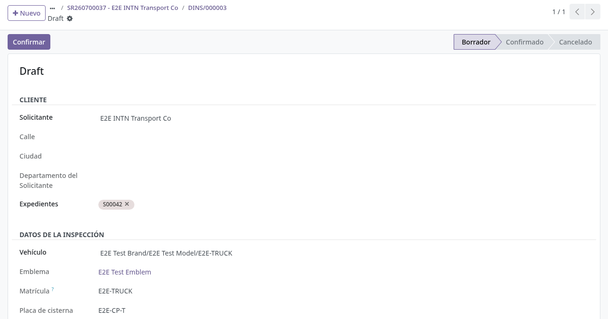
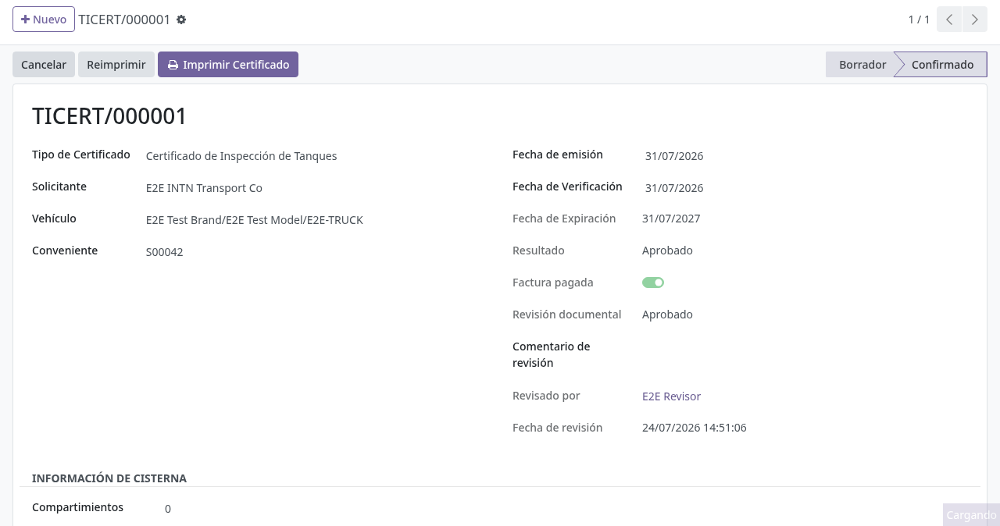
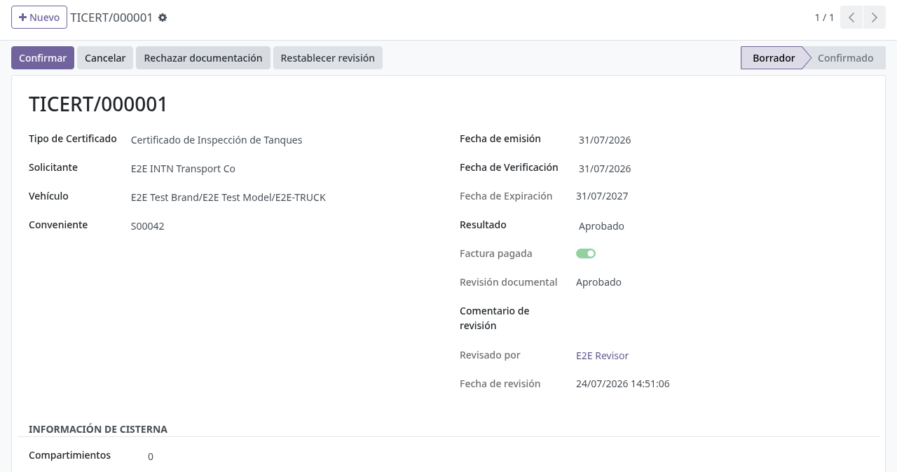
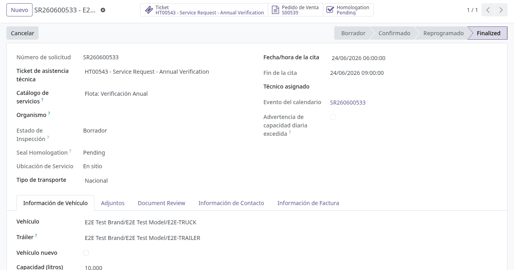

# Certificados de cisterna

## Para quién es esta guía

- **Usuario de cisternas (técnico)** — crea, confirma e imprime los certificados.
- **Revisor de documentación** — aprueba la documentación del certificado cuando aplica revisión.
- **Operador** — verifica que la solicitud de servicio vinculada quede finalizada.

## Qué resuelve este proceso

Emite la documentación oficial del resultado de la inspección (aprobado, rechazado o imposibilidad) y puede cerrar las solicitudes de servicio vinculadas al mismo expediente. Cubre el certificado de verificación (VCC, emitido desde el **Registro de medición**), el DINS (**Inspección de Tanques**) con su certificado LIE (**Certificado de Inspección de Tanques**), el certificado hidrostático y las prórrogas.

## Configuración previa

- Grupo **Usuario de Cisterna** para los menús de **Camiones Tanque → Operaciones**; grupo **Gestor de Cisternas** para la configuración del área.
- **Funcionarios autorizados** ONM vigentes cargados en **Camiones Tanque → Configuración → Authorized Officials**: sin un funcionario autorizado vigente no se pueden emitir ni imprimir certificados de flota.
- **Patrones de medida** vigentes en **Camiones Tanque → Configuración → Patrones de Medida** (los certificados de medición validan que cada patrón esté en el catálogo y vigente a la fecha).
- Grupo **Measurement Certificate Reprint** para quien deba reimprimir certificados de medición desde el registro.
- Política de revisión documental y de pago activa según corresponda al expediente.

## Antes de empezar

- Inspecciones técnicas completadas cuando el certificado nace de una verificación (ver [Verificación técnica en planta](verificacion-tecnica.md)).
- Para **Verificación Inicial** o **Periódica**: cadena visual → inspección de tanque (DINS) → hidrostática → medición confirmadas; **pago** del expediente antes de confirmar la hidrostática o el certificado de medición (el LIE no exige pago).
- Revisión documental **aprobada** en la solicitud de servicio y, si aplica, en el certificado de portal.

## Pasos por rol

### Usuario cisternas (técnico)

1. Crear el certificado desde la verificación terminada. Para el LIE: abrir la **Inspección de Tanques** confirmada y pulsar **Create Inspection Certificate**; se crea el **Certificado de Inspección de Tanques** en borrador con solicitante, vehículo, compartimientos, fecha y expediente precargados (también puede crearse desde **Camiones Tanque → Operaciones → Certificado de Inspección de Tanques**). El certificado de medición y el hidrostático nacen con sus registros de la cadena técnica.

   

2. Completar los datos del certificado: tipo, solicitante y vehículo, fechas (la **fecha de vencimiento** se calcula sola: fecha de verificación más los días de validez del tipo, 365 por defecto) y el resultado (**Aprobado / Rechazado / Imposibilidad**; con imposibilidad el motivo es obligatorio).
3. Si aplica, asignar **precintos** u otros datos de cisterna (compartimientos, capacidad, válvulas internas Abierto/Cerrado, dimensiones y patrones en el certificado de medición).
4. Solicitar la **revisión documental** si los adjuntos deben aprobarse.
5. Pulsar **Confirmar** cuando todo esté correcto; el certificado pasa a **Confirmado**, se genera el número definitivo, el código QR de verificación en línea y —cuando el tipo lo exige— se guarda el **PDF oficial emitido**. Confirmar el **Certificado de Inspección de Tanques** crea y confirma en el mismo paso el certificado de portal LIE, heredando la revisión aprobada de la solicitud.

   

6. **Imprimir Certificado** (visible solo confirmado). Para reimprimir: el botón de reimpresión pide el **motivo**, aumenta el número de versión y deja registro de cada impresión; en el registro de medición está reservado al grupo **Measurement Certificate Reprint**.
7. Para listados del área, usar **Camiones Tanque → Reportes → Reportes de Certificados**: elegir fechas (por fecha de verificación) y resultado, y generar con **Imprimir Reporte** (PDF) o **Exportar Excel** (planilla "INFORME DE CERTIFICADOS DE VERIFICACIÓN" con certificado, vehículo, chapa, solicitante, fechas, resultado, capacidad y compartimientos). **Camiones Tanque → Reportes → Reporte de Imposibilidad** lista los casos con resultado imposibilidad (certificados y/o servicios) en PDF o Excel.

### Revisor de documentación

1. Abrir el certificado de portal vinculado al LIE.
2. **Aprobar documentación** del certificado (si no heredó ya *Aprobado* de la solicitud). Los botones **Observar / Aprobar documentación / Rechazar documentación** son del grupo **INTN Document Reviewer**; observar y rechazar exigen comentario.

   

### Operador

1. Abrir la solicitud vinculada (mismo pedido de venta).
2. Verificar que la solicitud quede **Finalizada** al confirmarse el certificado del mismo expediente. Los certificados intermedios de la cadena (medición e hidrostática) no finalizan la solicitud; el cierre lo dispara el certificado final del expediente.

   

3. Si un certificado confirmado necesita más plazo, cargar una **prórroga** en **Camiones Tanque → Configuración → Prórrogas de Certificado**: elegir empresa de transporte, vehículo y su certificado confirmado (la fecha de inicio se propone con el vencimiento actual), definir la fecha de fin y **Confirmar**; el vencimiento del certificado se extiende y queda anotado en su historial. Cancelar la prórroga revierte el vencimiento anterior.

## Estados que verá en pantalla

| Estado | Significado | Qué hacer |
|--------|-------------|-----------|
| Borrador | En preparación | Completar y confirmar |
| Confirmado | Certificado vigente; QR y PDF disponibles | Entregar al cliente; las solicitudes pueden finalizar |
| Expirado | Fuera de vigencia (lo marca una tarea diaria automática) | Renovar el trámite o gestionar prórroga |
| Cancelado | Anulado | No usar como documento válido |

| Resultado | Significado |
|-----------|-------------|
| Aprobado | El vehículo cumple |
| Rechazado | No cumple |
| Imposibilidad | No se pudo completar la inspección (motivo obligatorio) |

## Casos especiales

- **Confirmación combinada**: confirmar el Certificado de Inspección de Tanques (LIE) desde el DINS crea y confirma el certificado de portal en el mismo paso cuando la revisión de la solicitud ya está aprobada.
- **Funcionario autorizado**: emitir o imprimir un certificado de flota exige un funcionario ONM autorizado vigente; si falta, aparece *"Only an authorized official may emit fleet certificates."*
- **Pago por tipo de certificado**: el certificado de verificación (medición) y el hidrostático exigen expediente vinculado y factura pagada; el LIE de inspección de tanques no exige pago.
- **Una inspección, un certificado**: cada DINS puede pertenecer a un solo Certificado de Inspección de Tanques; el sistema bloquea reutilizarla.
- **Reimpresión**: siempre con motivo y registro de versión; en el registro de medición requiere el grupo **Measurement Certificate Reprint** (solicitarlo al administrador).
- **Vencimiento automático**: una tarea diaria pasa a **Expirado** los certificados confirmados con fecha vencida.
- El cliente consulta y descarga el certificado desde el portal (ver [Certificados (portal)](../../portal/cisternas/certificados.md)).

## Si algo no funciona

| Problema | Causa habitual | Qué hacer |
|----------|----------------|-----------|
| No deja confirmar: *"Document review must be approved before confirming (current state: …)"* | Revisión documental sin aprobar (con enforcement activo) | Aprobar la revisión (ver [Gestión de solicitudes ONM](gestion-solicitudes-onm.md)) |
| *"Cannot confirm certificate: invoice must be paid first. Related sale order: …"* / *"…a linked sale order (expediente) is required before confirmation."* | Pago pendiente o certificado sin expediente | Regularizar el pago (ver [Caja y pagos](../ventas-caja/contabilidad-caja-pagos.md)) y vincular el expediente |
| *"Cannot confirm certificate: Expiration date is required."* | Falta la fecha de vencimiento (no aplica a imposibilidad) | Completar la fecha de verificación para que se calcule el vencimiento |
| Desactivé la revisión y sigue bloqueado | El ajuste solo quita el control de revisión; faltan pago, funcionario autorizado o pasos de la cadena técnica | Leer el mensaje exacto del error y completar lo que falte (ver [Verificación técnica](verificacion-tecnica.md)) |
| *"At least one confirmed tank inspection is required."* | LIE sin inspecciones de tanque confirmadas | Confirmar el DINS y vincularlo |
| *"Pattern … is not valid on …"* | Patrón de medida vencido a la fecha | Actualizar el catálogo de Patrones de Medida |
| No imprime | Falta el funcionario autorizado vigente o el permiso de reimpresión | Cargar el funcionario en Configuración o solicitar el rol al administrador |
| Cliente no ve el certificado | Regla de portal, pago pendiente o partner incorrecto | Verificar la empresa del usuario y el estado de pago |
| La solicitud no finaliza sola | Certificado en otro expediente, o es un certificado intermedio (medición/hidrostática) | Vincular al mismo pedido de venta y confirmar el certificado final |
| *"Extension end date must be after current certificate expiration date (…)"* | Prórroga con fecha anterior al vencimiento vigente | Corregir la fecha de fin de la prórroga |

## Guías relacionadas

- [Verificación técnica en planta](verificacion-tecnica.md)
- [Precintos: remisión y devolución](precintos-remision-devolucion.md)
- [Gestión de solicitudes ONM](gestion-solicitudes-onm.md)
- Trámite del cliente en portal: [Certificados](../../portal/cisternas/certificados.md)
