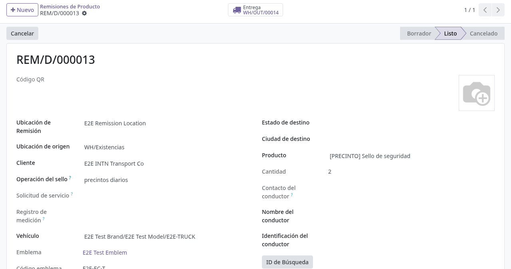
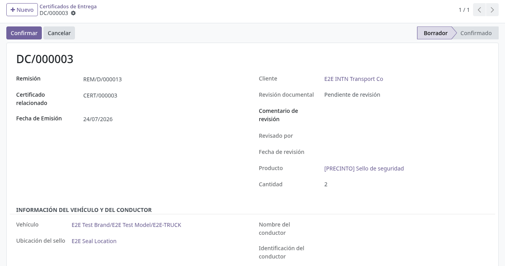
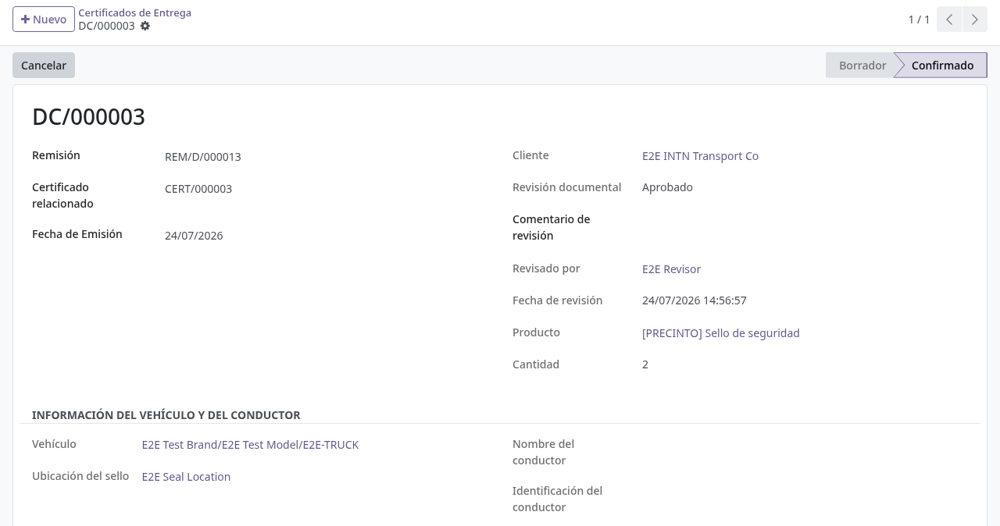
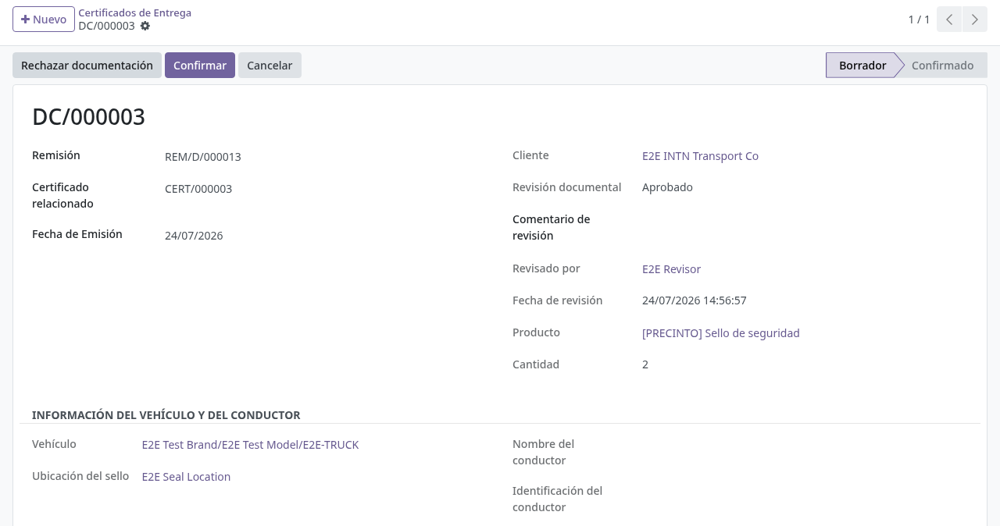

# Constancia de entrega

## Para quién es esta guía

- **Usuario de cisternas** — emite la constancia de entrega tras la remisión de precintos y el certificado VCC.
- **Revisor documental** — deja registrada la revisión de la documentación cuando el procedimiento la exige.

## Qué resuelve este proceso

Genera un documento oficial de **constancia de entrega** (Certificado de Entrega) que referencia la remisión de precintos y el certificado asociado, para cerrar documentalmente el precintado. El documento imprimible es la **"Constancia para precintado de camiones cisterna"**, con numeración propia y código QR de verificación en línea.

## Configuración previa

- Usuario interno con acceso al menú **Inventario** (la constancia vive en **Inventario → Productos → Certificados de Entrega**).
- Grupo **INTN Document Reviewer** para quien deba registrar la revisión documental (botones de aprobar/observar/rechazar).

## Antes de empezar

- Remisión de precintos **confirmada** (estado *Listo*; ver [Precintos: remisión y devolución](precintos-remision-devolucion.md)).
- Certificado VCC emitido y confirmado, si se lo va a referenciar (ver [Certificados de cisterna](certificados-cisterna.md)).

## Pasos por rol

### Usuario de cisternas

1. Completar la remisión de precintos y el certificado según el caso. Ambos documentos deben quedar confirmados.

   

2. Abrir **Inventario → Productos → Certificados de Entrega** y pulsar **Nuevo**.

3. Completar el formulario. La constancia queda en **Borrador**:
   - **Remisión** (obligatorio): elegir la remisión de precintos; no se pueden crear remisiones desde aquí.
   - **Certificado relacionado**: el certificado (por ejemplo el VCC) que respalda la entrega.
   - **Fecha de Emisión**: por defecto, la fecha del día.
   - **Número de certificado**: se genera automáticamente al guardar.
   - Los demás datos se completan solos desde la remisión y son de solo lectura: **Cliente**, **Producto**, **Cantidad**, y el grupo **Información del Vehículo y del Conductor** (**Vehículo**, **Ubicación del sello**, **Nombre del conductor**, **Identificación del conductor**).

   

4. Revisar en pantalla los datos que se imprimirán.

5. Si el procedimiento exige revisión documental, esperar el registro del revisor (campo **Document review** en *Approved*) antes de confirmar (paso del revisor).

6. Pulsar **Confirmar** (visible solo en Borrador). La constancia pasa a **Confirmado** y aparece la pestaña **Código QR** con la imagen del QR y el enlace público de verificación. Imprimir el PDF **"Constancia para precintado de camiones cisterna"** desde el menú Imprimir.

   

7. Entregar la copia al cliente según el procedimiento interno. El QR impreso lleva al enlace de consulta en línea de la constancia.

8. Si la constancia fue un error, **Cancelar** (disponible mientras no esté cancelada); desde Cancelado, **Restablecer a Borrador** permite reabrirla.

### Revisor documental

1. Cuando aplique revisión, abrir la constancia y usar los botones de revisión (visibles solo para el grupo **INTN Document Reviewer**; se muestran en inglés):
   - **Approve document**: marca la revisión como *Approved* y registra quién y cuándo revisó.
   - **Observe**: marca *Observed*; exige escribir antes el **Review comment** (si falta, avisa *"Enter a review comment before marking as observed."*).
   - **Reject document**: marca *Rejected*; también exige el comentario (*"Enter a review comment before rejecting the document."*).

   Cada transición queda anotada en el historial del documento.

   

## Estados que verá en pantalla

| Estado | Significado | Qué hacer |
|--------|-------------|-----------|
| Borrador | En preparación | Completar la remisión y el certificado de referencia y confirmar |
| Confirmado | Constancia válida; QR disponible | Imprimir y archivar |
| Cancelado | Anulada | Restablecer a borrador si hay que corregir |

Estados de la revisión documental (campo **Document review**): *Pending review* (pendiente), *Observed* (observada), *Approved* (aprobada), *Rejected* (rechazada).

## Casos especiales

- **La remisión manda:** cliente, producto, cantidad, vehículo y conductor se copian de la remisión elegida; si algo está mal, se corrige en la remisión, no en la constancia.
- **La revisión documental no bloquea la confirmación** de la constancia: es un registro de control con sus botones y su historial, pero el botón **Confirmar** solo valida el estado de la remisión. Aplicar la revisión previa cuando el procedimiento interno la exija.
- La constancia tiene enlace de portal propio (el mismo que codifica el QR), por el que puede consultarse el documento en línea.

## Si algo no funciona

| Problema | Causa habitual | Qué hacer |
|----------|----------------|-----------|
| No puede elegir la remisión o el certificado | Aún no existen | Completar primero los procesos de certificado y precintos |
| Al confirmar aparece *"Cannot confirm certificate: Remission must be confirmed first."* | La remisión sigue en borrador o cancelada | Confirmar la remisión (ver [Precintos: remisión y devolución](precintos-remision-devolucion.md)) |
| *"Only draft certificates can be confirmed."* | La constancia no está en Borrador | Usar **Restablecer a Borrador** si está cancelada |
| PDF en blanco o con error | Plantilla o datos incompletos | Revisar los campos obligatorios; escalar a soporte TI |
| El cliente no ve el archivo | Enlace de portal no compartido o usuario de otra empresa | Verificar el enlace público del QR y la empresa del usuario |

## Guías relacionadas

- [Certificados de cisterna](certificados-cisterna.md)
- [Precintos: remisión y devolución](precintos-remision-devolucion.md)
- [Multas y bloqueos](multas-bloqueos.md)
- Trámite del cliente en portal: [Solicitud de verificación ONM](../../portal/cisternas/solicitud-verificacion-onm.md)
