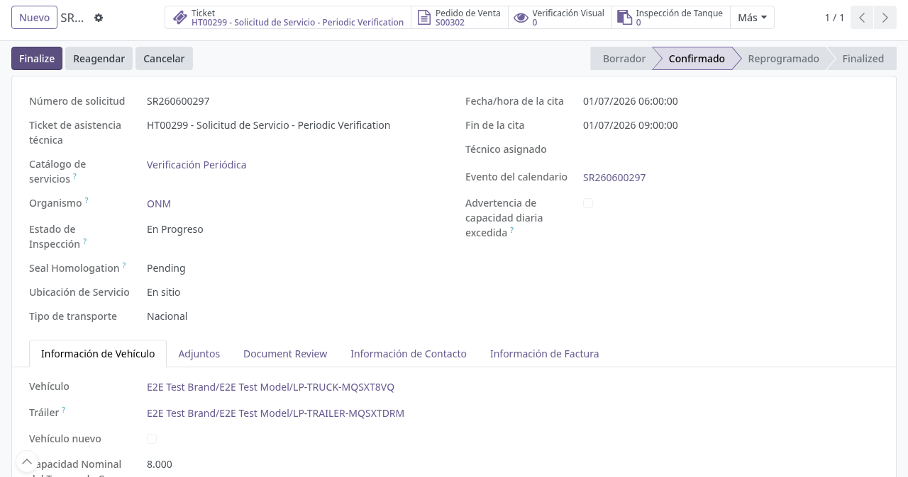

# Gestión de solicitudes de cisternas (ONM) en backoffice

## Para quién es esta guía

- **Operador cisternas** — confirma las solicitudes y da seguimiento del trámite en planta.
- **Revisor** — aprueba, observa o rechaza la documentación adjunta por el cliente.

## Qué resuelve este proceso

Da seguimiento en Odoo a las solicitudes de cisternas que el cliente creó desde el portal (habilitación inicial, verificación periódica, eventual, complementaria o modificaciones de certificados): revisión documental, confirmación y continuación de la cadena técnica según el tipo.

## Configuración previa

- Grupo de seguridad **Usuario de Cisterna** para ver el menú **Camiones Tanque → Operaciones → Solicitudes de Servicio**; grupo **Gestor de Cisternas** para marcar inasistencias.
- Grupo **INTN Document Reviewer** para aprobar/observar/rechazar los adjuntos.
- Catálogo de tipos de servicio ONM cargado (Verificación Inicial, Periódica, Eventual, Complementaria, Modificaciones de certificados).

## Antes de empezar

- El cliente ya creó la solicitud desde el portal, con vehículo, cita y adjuntos, y quedó en estado **Borrador** con la revisión documental **Pendiente de revisión**.

## Pasos por rol

### Revisor

1. Abrir **Camiones Tanque → Operaciones → Solicitudes de Servicio** (se abre primero la vista de calendario de citas; se puede cambiar a lista) y entrar a la solicitud.

2. Revisar los adjuntos del cliente en la pestaña de adjuntos y el estado en la pestaña **Document Review** (estado, comentario, revisor y fecha). Decidir con los botones de cabecera:
   - **Aprobar documentación** si cumple los requisitos → la revisión pasa a *Aprobado*. Queda registrado quién y cuándo aprobó; no se envía correo.
   - **Observar** si hay que corregir sin rechazar → la revisión pasa a *Observado* y el cliente recibe un correo con la observación. Antes hay que escribir el comentario de revisión; si falta, el sistema avisa *"Ingrese un comentario de revisión antes de marcar como observado."*
   - **Rechazar documentación** si debe subsanar → la revisión pasa a *Rechazado* y el cliente recibe el correo para volver a subir los documentos desde el portal. También exige comentario (*"Ingrese un comentario de revisión antes de rechazar el documento."*).
   - **Restablecer revisión** vuelve la revisión a *Pendiente de revisión* para un nuevo ciclo (por ejemplo, tras recibir correcciones).

3. Cuando el cliente reenvía las correcciones desde el portal, la revisión vuelve sola a *Pendiente de revisión* y queda la nota en el historial; repetir la revisión.

### Operador cisternas

1. Localizar la solicitud en **Camiones Tanque → Operaciones → Solicitudes de Servicio** (estado Borrador o Confirmado según el flujo interno).

2. Verificar los datos del formulario:
   - **Catálogo de servicios** (obligatorio): define el tipo de servicio; el **Organismo** y el **Estado de Inspección** solo se muestran para Verificación Inicial y Periódica.
   - **Fecha de cita**: obligatoria para confirmar; la hora de fin se calcula sola (tres horas después). **Técnico asignado** es obligatorio (en solicitudes creadas desde el portal se asigna uno por defecto).
   - Pestaña **Información del vehículo**: datos del camión (año, chapa, chasis, código, emblema), remolque, capacidad y producto a transportar.
   - Pestaña de contactos: en la habilitación inicial se cargan representante legal, contacto de la empresa y conductor; en los demás tipos, contacto principal y suplente.
   - En **Modificaciones de certificados**: el subtipo de modificación (emblema, RUC, razón social, o razón social y emblema) y los valores anteriores, que se completan solos.
   - Pestaña de facturación: pedido de venta vinculado (expediente) y estado de pago.

3. Verificar la documentación. Si intenta **Confirmar** sin que la revisión esté aprobada, el sistema bloquea con el mensaje *"Document review must be approved before confirming (current state: …)"* y no permite avanzar.

4. Cuando la revisión esté en *Aprobado*, pulsar **Confirmar** (visible solo en Borrador). Al confirmar, el sistema:
   - Verifica que el vehículo no tenga multas impagas ni bloqueos (ver [Multas y bloqueos](multas-bloqueos.md)).
   - Verifica la cita: fecha asignada, día hábil, horario laboral del INTN y cupo disponible de agenda.
   - Exige el **Organismo** en Verificación Inicial y Periódica.
   - Confirma automáticamente el **presupuesto** vinculado (el expediente pasa a pedido de venta).
   - Pasa la solicitud a **Confirmado**, avanza el ticket de mesa de ayuda y envía el correo de confirmación al cliente.
   - En Verificación Inicial y Periódica, el **Estado de Inspección** queda **En Progreso**.

   

5. Continuar según el tipo de servicio. Con la solicitud en Confirmado aparecen los botones estadísticos **Verificación Visual**, **Inspección de Tanque**, **Prueba Hidrostática** y **Registro de Medida** (crean y abren cada registro), y en la verificación periódica también **Homologation**:
   - **Verificación Inicial** o **Periódica**: seguir la cadena técnica (verificación visual → inspección de tanque → hidrostática → medición) en [verificacion-tecnica.md](verificacion-tecnica.md) y el certificado en [certificados-cisterna.md](certificados-cisterna.md). Regularizar el **pago** del pedido de venta cuando el sistema lo exija.
   - **Complementaria**: no activa el ciclo de inspección; gestionar precintos u operaciones asociadas si aplica.
   - **Eventual**: no exige organismo ni ciclo de inspección automático al confirmar; regularizar el pago del expediente si corresponde.
   - **Modificaciones de certificados**: no hay cadena técnica de inspección; al confirmar, la inspección permanece en borrador y no se exige organismo. Gestionar el certificado modificado según [certificados-cisterna.md](certificados-cisterna.md) si corresponde.

6. Otras acciones de cabecera según el caso:
   - **Reagendar** (en Borrador o Confirmado): abre el asistente de reprogramación; solo admite mover la cita dentro del mismo día, en día hábil, y deja la solicitud en **Reprogramado** con la nota del motivo.
   - **Marcar inasistencia** (solo Gestor de Cisternas, con la solicitud Confirmada): registra la inasistencia del vehículo y pasa la solicitud a estado *No Show*.
   - **Finalizar**: cierra la solicitud en **Finalizado** si la revisión está aprobada y las facturas del expediente están pagadas. Normalmente no hace falta: al confirmarse el certificado final del mismo expediente, la solicitud se finaliza sola y se envía el correo de cierre al cliente.
   - **Cancelar**: anula la solicitud, elimina la cita del calendario y, en Inicial/Periódica, deja la inspección en **Cancelado**. Las solicitudes no se pueden borrar (*"No puede eliminar solicitudes de servicio. Por favor, cancélelas."*).

## Estados que verá en pantalla

| Estado | Significado | Qué hacer |
|--------|-------------|-----------|
| Borrador | Creada desde el portal, documentación aún sin aprobar | Revisar documentación y confirmar cuando corresponda |
| Confirmado | Cita vigente; en Inicial/Periódica la inspección queda En Progreso | Continuar operaciones en planta según el tipo |
| Reprogramado | Cita movida con el asistente de reagendado | Atender en la nueva hora |
| Finalizado (*Finalized*) / Cancelado | Cierre del trámite | Consultar certificados o el motivo de cancelación |
| No Show | Inasistencia marcada manualmente | Coordinar nueva cita según política |

Estado de inspección (solo Verificación Inicial y Periódica): **Borrador → En Progreso → Aprobado / Rechazado → Sellado** (tras emitir precintos) o **Cancelado** (imposibilidad o cancelación).

Estado de la revisión documental: **Pendiente de revisión / Observado / Aprobado / Rechazado**.

## Casos especiales

- **Complementaria y Eventual:** a diferencia de Verificación Inicial/Periódica, no activan el ciclo de inspección ni exigen organismo al confirmar.
- **Modificaciones de certificados:** al confirmar, la inspección permanece en borrador y no se exige organismo; el flujo se cierra según las reglas de negocio del certificado.
- **Certificado previo obligatorio:** para los tipos que no son la habilitación inicial, el vehículo debe tener un certificado vigente; si no, el sistema bloquea con *"This vehicle has no valid certificate. An Initial Verification must be completed before requesting this service type."*
- **Reapertura automática:** si una solicitud ya Finalizada recibe una revisión documental observada, rechazada o vuelta a pendiente, el sistema la reabre a **Confirmado** y lo anota en el historial.
- **Límite de facturas vencidas:** el cliente no puede crear solicitudes nuevas si supera el máximo de facturas vencidas configurado (mensaje *"You cannot request a new service because you have … overdue invoices…"*).
- **Alta de vehículos desde el portal:** el cliente puede haber registrado camión y remolque desde el mismo formulario (incluso en ventana emergente) antes de enviar; verifique que los datos del conjunto sean correctos.

## Si algo no funciona

| Problema | Causa habitual | Qué hacer |
|----------|----------------|-----------|
| No deja **Confirmar**: *"Document review must be approved before confirming (current state: …)"* | Documentación no aprobada | El revisor debe **Aprobar documentación** (ver [../registro-documentos/revision-documental.md](../registro-documentos/revision-documental.md)) |
| *"This vehicle has unpaid fines…"* / *"This vehicle has an active block…"* | Multa impaga o vehículo bloqueado | Revisar multas y bloqueos (ver [multas-bloqueos.md](multas-bloqueos.md)) |
| *"Debe asignar una fecha de cita"* / *"No se pueden confirmar citas los fines de semana"* | Cita sin fecha o en fin de semana | Asignar una fecha hábil |
| *"You cannot book on this date: scheduling limit reached, the next available date is: …"* | Cupo diario de agenda completo | Usar la fecha sugerida |
| *"El organismo es requerido para este tipo de servicio."* | Organismo vacío en Inicial/Periódica | Completar el campo Organismo |
| No se puede confirmar la hidrostática | Pago del pedido de venta pendiente | Regularizar el pago antes de avanzar en la cadena técnica |
| No deja **Finalizar**: *"The service request cannot be finalized until all posted customer invoices are paid."* | Facturas del expediente sin pagar | Regularizar el pago (ver [Caja y pagos](../ventas-caja/contabilidad-caja-pagos.md)) |
| El cliente no ve la solicitud | Sesión con el usuario de otra empresa | Verificar que inició sesión con el partner correcto |

## Guías relacionadas

- Verificación técnica de cisternas: [verificacion-tecnica.md](verificacion-tecnica.md)
- Certificados de cisterna: [certificados-cisterna.md](certificados-cisterna.md)
- Multas y bloqueos: [multas-bloqueos.md](multas-bloqueos.md)
- Revisión documental: [../registro-documentos/revision-documental.md](../registro-documentos/revision-documental.md)
- Solicitud de servicio unificada: [../registro-documentos/solicitud-servicio-unificada.md](../registro-documentos/solicitud-servicio-unificada.md)
- Trámite del cliente en portal: [../../portal/cisternas/solicitud-verificacion-onm.md](../../portal/cisternas/solicitud-verificacion-onm.md)
