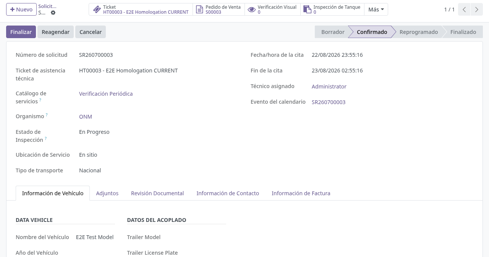
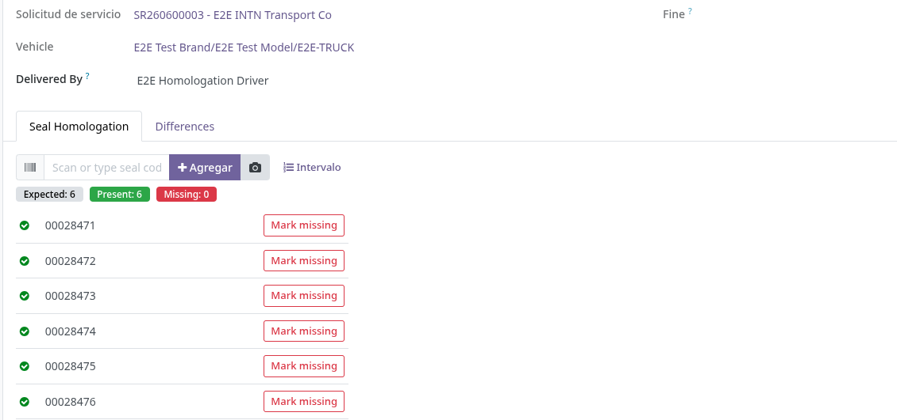
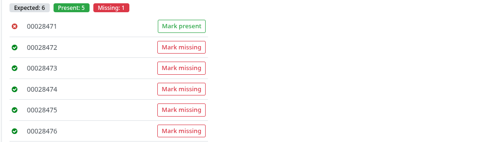
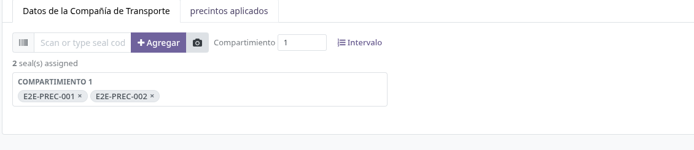
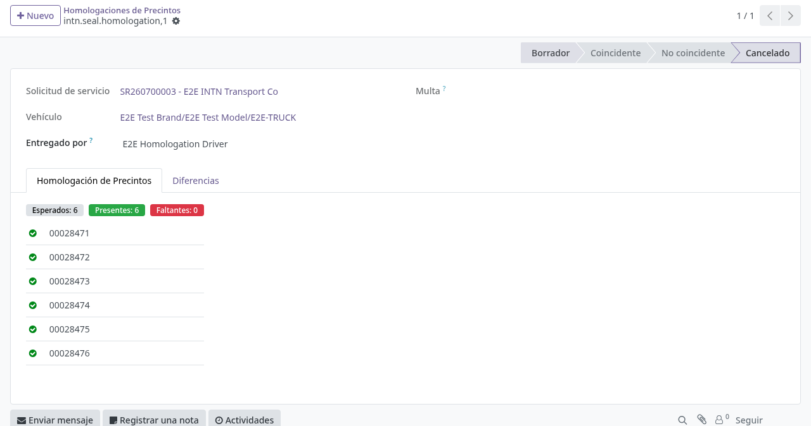

# Homologación de precintos (verificación anual)

## Para quién es esta guía

- **Usuario de cisternas** — homologa los precintos en la **verificación anual** y emite los nuevos precintos.
- **Jefe de cisternas** — cancela o corrige homologaciones erróneas y administra los rangos.

## Qué resuelve este proceso

En la verificación anual, la homologación contrasta los precintos **instalados** en la cisterna (según el último precintado anual confirmado) contra los precintos que el conductor entrega para revisión. Si coinciden, la homologación queda **Coincidente** (homologada) y habilita la emisión de los nuevos precintos; si no coinciden, se genera automáticamente una multa por **Desajuste de precintos**.

> Cambio de proceso: la homologación ya **no asigna un rango numérico** manualmente. Ahora funciona como una **lista de verificación por lote de inventario** (número de serie del precinto), con un widget de captura por escáner. La asignación de rangos numéricos vive en el menú **Rangos** y la emisión en **Emisiones**, como pasos separados. Los menús y los estados de la homologación están traducidos (*Coincidente* / *No coincidente*); el widget de captura conserva algunos textos en inglés (*Mark missing*, *Mark present*, *Remove*).

## Configuración previa

- Grupo de seguridad **Usuario de Cisterna** (Ajustes → Usuarios) para ver el menú **Camiones Tanque → Operaciones → Precintos / Etiquetas** (homologaciones, rangos y emisiones).
- Grupo **Gestor de Cisternas** para las tareas de supervisión del área.
- Rangos de precintos cargados en **Precintos / Etiquetas → Rangos** y lotes del producto de precintos (código PRECINTO) cargados en inventario.

## Antes de empezar

- Solicitud de **verificación anual** (catálogo *Fleet: Periodic Verification*) confirmada (ver [Solicitud de verificación ONM](../../portal/cisternas/solicitud-verificacion-onm.md) y [Gestión de solicitudes ONM](gestion-solicitudes-onm.md)). Al crearse esa solicitud, su estado de homologación nace en **Pending**.
- Certificado de medición **confirmado y con resultado Aprobado** (requisito para emitir los precintos nuevos).
- Vehículo sin multas impagas ni bloqueos activos (ver [Multas y bloqueos](multas-bloqueos.md)).
- El vehículo debe tener una **remisión de precintado anual confirmada** previa (o, en su defecto, la remisión confirmada de su habilitación/verificación anual), que sirve de **base de precintos instalados**.

## Pasos por rol

### Usuario de cisternas

1. Abrir la solicitud de **verificación anual**. En la caja de botones aparece el botón estadístico **Homologación** (solo en solicitudes de flota de tipo verificación anual), que muestra el estado de homologación: **No requerida / Pendiente / Coincidente / No coincidente**.

   

2. Pulsar **Homologación**. Si aún no existe, el sistema crea el registro de homologación y toma una **instantánea de los precintos instalados** en el vehículo (lista *Expected Seals*, tomada de la última remisión anual confirmada). Cada precinto instalado se precarga como una línea marcada como presente. El registro también puede abrirse desde **Camiones Tanque → Operaciones → Precintos / Etiquetas → Homologaciones**.

3. En la pestaña **Homologación de Precintos**, revisar la lista contra los precintos físicos entregados por el conductor:
   - Escanear o escribir el número de serie en el campo de captura y pulsar **Add** (o Enter); con cámara disponible, el ícono de cámara escanea el código. El botón **Range** permite cargar un intervalo contiguo de series (**From** / **To**, máximo 200) con **Add range**.
   - Los contadores **Expected / Present / Missing** (y **Extra** si aparece un precinto que no estaba instalado) se actualizan en vivo.
   - Para un precinto que falte o esté manipulado, pulsar **Mark missing** (queda con la X roja); para reincorporarlo, **Mark present** (tilde verde). Un precinto ajeno a la base se quita con **Remove**.
   - **Todo precinto marcado como faltante exige un motivo** (*No está en el camión*, *Roto*, *Violado*, *Número ilegible*, *Reemplazado sin aviso*, *Otro*), que se elige en la lista de la pestaña. Con *Otro* hay que escribir además el detalle. De ahí sale el texto de la multa, así que sin motivo el sistema no deja validar.
   - En el campo **Delivered By** puede registrarse el conductor o la persona que entregó los precintos.

   

4. Con la revisión lista, pulsar **Validar** (visible solo en borrador). El sistema compara los entregados presentes contra los instalados (Expected):
   - **Coinciden** (sin faltantes ni sobrantes) → la homologación pasa a **Coincidente**, el estado de homologación de la solicitud pasa a **Coincidente** y los precintos instalados anteriores se retiran del circuito: sus lotes quedan en estado *Discarded* con motivo *Cortado en la verificación anual*, y **salen del inventario mediante un desecho** (`stock.scrap`) por cada precinto, igual que el descarte de una remisión. Antes sólo se cambiaba el estado, con lo que un precinto "descartado" podía seguir figurando con existencias.
   - **No coinciden** → la homologación pasa a **No coincidente**, el detalle (instalados, entregados, faltantes, sobrantes **y qué pasó con cada faltante**) queda en la pestaña **Diferencias**, y se crea y confirma automáticamente una multa de tipo **Desajuste de precintos** vinculada al vehículo y a la solicitud (ver [Multas y bloqueos](multas-bloqueos.md)). El texto de la multa incluye los motivos.

   

   > Si aún está en borrador y la base de instalados cambió, usar **Refresh Installed Seals** para volver a tomar la instantánea antes de validar.

5. Con la homologación en **Coincidente**, registrar la **emisión de precintos** en **Camiones Tanque → Operaciones → Precintos / Etiquetas → Emisiones**:
   - Crear la emisión indicando la **Solicitud de servicio** (el expediente y el organismo se completan solos), el **Range** (solo se pueden elegir rangos en estado *Available* o *Partially Allocated*) y la **Quantity** (por defecto 1).
   - Pulsar **Confirmar**. El sistema toma automáticamente los números siguientes del rango (campos *Issued From* / *Issued To*), avanza el contador del rango y muestra en la pestaña **Issued Seal Lots** los lotes de precinto cuyos números de serie coinciden con lo emitido.
   - La confirmación exige que la homologación esté en **Coincidente** y que el certificado de medición exista, esté confirmado y aprobado. Al confirmar, la solicitud pasa a estado de inspección **Sellado** con resultado **Aprobado**.

6. Aplicar físicamente los precintos nuevos en una **remisión de precintos** de operación **Precintado Anual**, pestaña **precintos aplicados**: capturar cada precinto por número de serie y asignarlo al **compartimiento** correspondiente. Los precintos se muestran como *chips* removibles agrupados por compartimiento (ver [Precintos: remisión y devolución](precintos-remision-devolucion.md)).

   

7. Continuar con la remisión y la constancia si el procedimiento lo exige (ver [Precintos: remisión y devolución](precintos-remision-devolucion.md) y [Constancia de entrega](constancia-entrega.md)).

### Jefe de cisternas

1. Revisar las homologaciones erróneas en **Precintos / Etiquetas → Homologaciones**.

2. Pulsar **Cancel** en el registro de homologación; queda en estado **Cancelled**.

   

3. Corregir los datos y volver a validar en un nuevo registro si corresponde.

4. Administrar los **rangos** en **Precintos / Etiquetas → Rangos**: cada rango define **Organism**, **Series** (prefijo, por ejemplo S), **Type** (*Seal*, *Label* o *Ring*), **From**, **To** (la cantidad se calcula sola) y **Next Number** (próximo número a emitir). Un rango sin uso puede reiniciarse con **Reset**; **Cancel** lo anula. No se permiten rangos superpuestos del mismo organismo, serie y tipo, y los campos de numeración quedan bloqueados una vez que el rango tuvo emisiones.

## Estados que verá en pantalla

| Estado (homologación) | Significado | Qué hacer |
|-----------------------|-------------|-----------|
| Draft (borrador) | En edición; base de instalados precargada | Revisar la lista y validar |
| Coincidente (homologada) | Entregados = instalados | Emitir precintos y precintar |
| No coincidente | Faltan o sobran precintos | Ver **Diferencias**; se generó multa de Desajuste de precintos |
| Cancelled (cancelada) | Anulada | No usar; rehacer si corresponde |

| Estado (solicitud – inspección) | Significado |
|---------------------------------|-------------|
| En Progreso | Verificación en planta |
| Sellado | Emisión de precintos confirmada |
| Rechazado / Cancelado | No continúa la homologación |

| Estado (rango) | Significado |
|----------------|-------------|
| Available | Sin emisiones; editable |
| Partially Allocated | Con emisiones parciales |
| Fully Allocated | Agotado |
| Cancelled | Anulado |

## Casos especiales

- **Sin base de instalados:** si el vehículo no tiene una remisión de precintado (anual o de habilitación) confirmada previa, la lista *Expected Seals* queda vacía y **Validar** se bloquea con el aviso *"No installed-seal baseline was found for this vehicle. The vehicle has no confirmed enabling/annual sealing remission to homologate against."*
- **Desajuste (No coincidente):** la multa de **Desajuste de precintos** se crea y confirma sola con el detalle de las diferencias. Mientras la homologación siga en No coincidente, **no se puede aprobar la verificación visual** de esa solicitud (*"No se puede aprobar la verificación visual: la homologación de precintos no coincide. Resuelva la multa del precinto o vuelva a homologar los precintos antes de aprobar."*) ni **confirmar la emisión** de precintos nuevos.
- **Solo verificación anual:** la homologación aplica únicamente a solicitudes de flota de verificación anual; en otros tipos el botón no aparece y validar da el error *"La homologación solo aplica a solicitudes de verificación anual."*
- **Emisión sin movimiento de stock:** la emisión asigna números del rango y referencia los lotes existentes por número de serie; el movimiento físico de inventario ocurre en la **remisión** (ver [Precintos: remisión y devolución](precintos-remision-devolucion.md)).
- **Un precinto por lista:** el mismo número de serie no puede repetirse dentro de una homologación (*"Duplicate seal in the same homologation is not allowed."*).

## Si algo no funciona

| Problema | Causa habitual | Qué hacer |
|----------|----------------|-----------|
| No aparece el botón **Homologación** | El tipo de servicio no es verificación anual de flota | Verificar el tipo de solicitud |
| **Validar** avisa que no hay base (*"No installed-seal baseline was found for this vehicle…"*) | El vehículo no tiene remisión de precintado confirmada previa | Confirmar primero el precintado (remisión anual/habilitación) |
| *"Mark at least one delivered seal as present."* | Todas las líneas quedaron marcadas como faltantes | Marcar como presentes los precintos realmente entregados |
| *"Say what happened to these seals before validating: …"* | Se marcó un precinto como faltante sin elegir el motivo | Completar **What happened** en la línea de cada precinto listado |
| *"'Other' explains nothing on its own. Add the details for: …"* | Se eligió el motivo *Otro* sin escribir el detalle | Escribir qué pasó en la columna de detalle |
| *"No se puede confirmar la emisión: la homologación de precintos debe estar coincidente para la verificación anual."* | Homologación pendiente o en No coincidente | Homologar antes de emitir |
| *"Cannot confirm issuance: the measurement certificate must be confirmed first."* / *"…must be approved."* / *"…measurement record is missing…"* | Certificado de medición ausente, sin confirmar o no aprobado | Completar la cadena técnica y el certificado de medición (ver [Verificación técnica](verificacion-tecnica.md)) |
| *"This range is exhausted."* / *"Not enough numbers available in this range."* | Rango sin números disponibles | Elegir otro rango o cargar uno nuevo en **Rangos** |
| *"Overlapping ranges are not allowed for the same organism, series, and type."* | Rango nuevo pisa uno existente | Ajustar la numeración del rango |
| No pasa a **Sellado** | Emisión de precintos no confirmada | Confirmar la emisión en **Emisiones** |
| Vehículo bloqueado al agendar | Multa de vehículo impaga o bloqueo activo | Regularizar en [Multas y bloqueos](multas-bloqueos.md) |

## Guías relacionadas

- [Multas y bloqueos](multas-bloqueos.md)
- [Precintos: remisión y devolución](precintos-remision-devolucion.md)
- [Constancia de entrega](constancia-entrega.md)
- [Gestión de solicitudes ONM](gestion-solicitudes-onm.md)
- Trámite del cliente en portal: [Solicitud de verificación ONM](../../portal/cisternas/solicitud-verificacion-onm.md)
