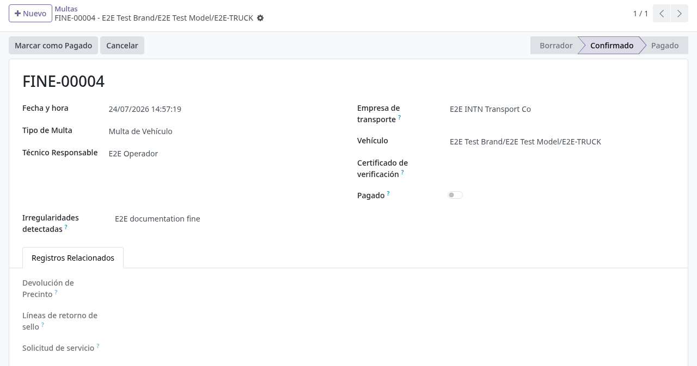
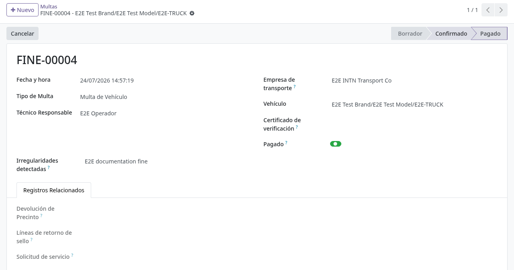
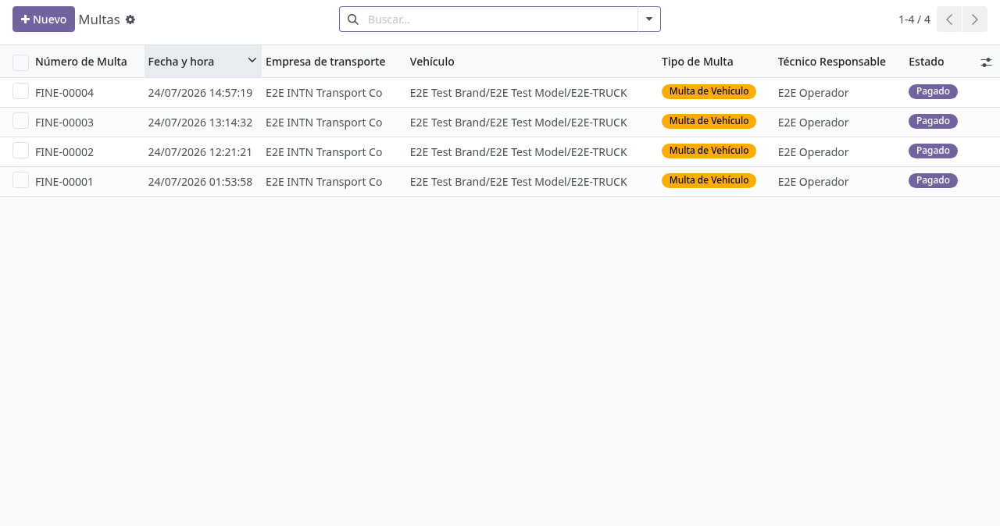

# Multas, inasistencia y bloqueos

## Para quién es esta guía

- **Usuario de cisternas** — confirma multas, registra el pago y desbloquea vehículos para permitir nuevas solicitudes.

> El cliente ve el bloqueo desde el portal al intentar solicitar servicio. Esa parte está documentada en [Multas y bloqueos (portal)](../../portal/cisternas/multas-y-bloqueos.md).

## Qué resuelve este proceso

Registra sanciones por irregularidades o por no presentarse a la cita, bloquea nuevas solicitudes del vehículo hasta regularizar la situación y cancela automáticamente las solicitudes vencidas sin inspección.

## Configuración previa

- Grupo de seguridad **Usuario de Cisterna** (Ajustes → Usuarios) para ver el menú **Camiones Tanque** y sus operaciones.
- Acción programada **Multas: Crear multas para no-show de verificación** activa (se ejecuta a diario) para generar los bloqueos por inasistencia.

## Antes de empezar

- Conocer el vehículo afectado y, cuando aplique, la solicitud vinculada.
- Tener claro el tipo de multa, porque el botón de cierre cambia según el tipo (pagar vs. levantar bloqueo).

## Pasos por rol

### Usuario de cisternas

1. Abrir el menú **Camiones Tanque → Operaciones → Multas**. Se muestra el listado de multas de vehículos.

2. Localizar la multa del vehículo (el buscador permite filtrar y agrupar). Según su origen puede estar en **Borrador**, **Confirmado**, **Pagado**, **Bloqueo Levantado** o **Cancelado**.

   

3. Si necesita crear una multa manualmente, pulsar **Nuevo** y completar el formulario. Campos del formulario:
   - **Número de Multa**: se genera automáticamente al guardar (mientras tanto figura como borrador).
   - **Fecha y hora** (obligatorio): por defecto toma el momento actual.
   - **Vehículo** (obligatorio): solo se pueden elegir camiones; los remolques no aparecen en la lista.
   - **Empresa de transporte** (obligatorio): al elegir el vehículo se completa sola con la empresa propietaria.
   - **Tipo de Multa** (obligatorio): **Multa de Vehículo** (valor por defecto), **Bloqueo de Vehículo**, **Irregularidad del sello** o **Desajuste de precintos**.
   - **Irregularidades detectadas** (obligatorio): descripción de los hechos que motivan la multa.
   - **Técnico Responsable** (obligatorio): por defecto, el usuario que crea la multa.
   - **Certificado de verificación**, **Devolución de Precinto**, **Solicitud de servicio**: vínculos opcionales al expediente de origen. Al elegir una devolución de precintos, el sistema completa solo el vehículo, la empresa y propone el tipo (**Irregularidad del sello** si hay precintos irregulares; si no, **Desajuste de precintos**) con un texto inicial de irregularidades.

4. Pulsar **Confirmar** (visible solo en Borrador). La multa pasa a **Confirmado** y desde ese momento aplica el bloqueo según su tipo (ver "Casos especiales"). Si estaba vinculada a una devolución de precintos, queda enlazada también desde esa devolución.

5. Cuando el cliente regulariza:
   - Para multas de tipo **Multa de Vehículo**, **Irregularidad del sello** o **Desajuste de precintos**: pulsar **Marcar como Pagado** (visible solo con la multa en Confirmado). La multa pasa a **Pagado** y en el historial del vehículo queda el mensaje de que la multa fue pagada y el vehículo vuelve a ser elegible para inspección.
   - Para multas de tipo **Bloqueo de Vehículo** (inasistencia): pulsar **Levantar Bloqueo** (visible solo con la multa en Confirmado y tipo bloqueo). La multa pasa a **Bloqueo Levantado** y en el historial del vehículo queda el mensaje de que el bloqueo fue levantado.

   

6. Confirmar que el vehículo queda liberado: en la ficha del vehículo desaparece la alerta roja *"Este vehículo tiene multas pendientes. No puede ser programado para verificación hasta que la multa sea pagada."* o la alerta amarilla *"Este vehículo tiene un bloqueo activo. No puede ser programado para verificación hasta que el bloqueo sea levantado."*

7. Si la multa fue un error, pulsar **Cancelar** (disponible mientras no esté cancelada ni con bloqueo levantado); queda en **Cancelado** y deja de aplicar. Desde **Cancelado**, **Bloqueo Levantado** o **Pagado** se puede usar **Restablecer a Borrador** para reabrirla.

8. Revisar las solicitudes canceladas por inasistencia y coordinar una nueva cita con el cliente.

   

## Estados que verá en pantalla

| Estado (multa) | Significado | Qué hacer |
|----------------|-------------|-----------|
| Borrador | Registrada, aún no aplicada | Confirmar si procede |
| Confirmado | Activa; aplica el bloqueo según el tipo | Marcar como pagada, o levantar el bloqueo si es tipo bloqueo |
| Pagado | Cobrada | El vehículo queda liberado |
| Bloqueo Levantado | Bloqueo levantado | El vehículo puede volver a solicitar |
| Cancelado | Anulada | No bloquea |

Tipos de multa y su botón de cierre:

| Tipo | Origen | Botón de cierre |
|------|--------|-----------------|
| Multa de Vehículo | Irregularidad en la verificación (carga manual) | Marcar como Pagado |
| Bloqueo de Vehículo | Inasistencia a la cita (acción programada diaria) | Levantar Bloqueo |
| Irregularidad del sello | Devolución con precintos irregulares (dañados, manipulados o no devueltos) | Marcar como Pagado |
| Desajuste de precintos | Homologación o devolución cuyos precintos no coinciden | Marcar como Pagado |

## Casos especiales

- **Qué bloquea nuevas solicitudes:** el sistema impide crear, confirmar o reprogramar solicitudes de flota del vehículo en dos situaciones: una multa de tipo **Multa de Vehículo** confirmada y sin pagar, o una multa de tipo **Bloqueo de Vehículo** confirmada. Las multas de **Irregularidad del sello** y **Desajuste de precintos** confirmadas se cobran con **Marcar como Pagado**, pero no impiden por sí solas agendar nuevas solicitudes.
- **El bloqueo aplica solo a solicitudes de flota** con vehículo ya registrado; las solicitudes de alta de vehículo nuevo no se ven afectadas.
- **Inasistencia (no-show):** la acción programada diaria busca solicitudes de flota en borrador o confirmadas cuya fecha de cita ya pasó, con cita en calendario y sin inspección registrada. Para cada una: crea una multa de tipo **Bloqueo de Vehículo** con el motivo *"Did not attend the scheduled inspection/review."*, la confirma automáticamente, **cancela** la solicitud y elimina la cita del calendario. Tras levantar el bloqueo, el cliente debe crear una nueva solicitud. Si la solicitud ya tiene una multa asociada, no se duplica.
- **Desajuste de precintos por homologación:** al validar una homologación cuyos precintos no coinciden con los instalados, el sistema crea y confirma automáticamente una multa de tipo **Desajuste de precintos** con el detalle de las diferencias (ver [Homologación y precintos](homologacion-rangos-precintos.md)).
- **Irregularidad en devolución de precintos:** al confirmar una devolución con precintos marcados como irregulares, el sistema crea y confirma automáticamente la multa de tipo **Irregularidad del sello** (o **Desajuste de precintos** si el problema es que los precintos no coinciden con la remisión), enlazada a la devolución.
- **Sin importe en el sistema:** la multa no registra monto; el cobro se gestiona fuera de este formulario y aquí solo se marca como pagada.

## Si algo no funciona

| Problema | Causa habitual | Qué hacer |
|----------|----------------|-----------|
| Al crear o confirmar una solicitud aparece *"This vehicle has unpaid fines. Payment is required before scheduling a new inspection."* (o *"…before confirming the inspection appointment."*) | Multa de Vehículo confirmada sin pagar | **Marcar como Pagado** en la multa del vehículo |
| Aparece *"This vehicle has an active block. The block must be lifted before scheduling a new inspection."* (o *"…before confirming the inspection appointment."* / *"…before rescheduling the inspection."*) | Bloqueo de Vehículo confirmado (inasistencia) | **Levantar Bloqueo** en la multa de tipo bloqueo |
| El cliente sigue bloqueado tras pagar | Multa no marcada como pagada, o bloqueo no levantado | Completar el paso de cierre según el tipo de multa |
| *"Only draft fines can be confirmed."* | Intento de confirmar una multa que no está en Borrador | Usar **Restablecer a Borrador** primero si corresponde |
| *"Only vehicle fines can be marked as paid."* | Intento de marcar como pagada una multa de tipo Bloqueo de Vehículo | Usar **Levantar Bloqueo** |
| *"Only block-type records can be unblocked."* / *"Only confirmed records can be unblocked."* | Botón usado en una multa que no es de tipo bloqueo o no está confirmada | Verificar tipo y estado de la multa |
| Multa automática inesperada | Inasistencia a una cita pasada detectada por la acción programada | Explicar al cliente; gestionar el pago o la cancelación según política |
| No aparece el menú de multas | Sin permiso de cisternas | El administrador asigna el grupo **Usuario de Cisterna** |
| Solicitud cancelada sola y cita eliminada | Acción programada de inasistencia | Crear una nueva solicitud tras levantar el bloqueo |

## Guías relacionadas

- [Homologación y precintos](homologacion-rangos-precintos.md)
- [Gestión de solicitudes ONM](gestion-solicitudes-onm.md)
- Trámite del cliente en portal: [Multas y bloqueos](../../portal/cisternas/multas-y-bloqueos.md)
