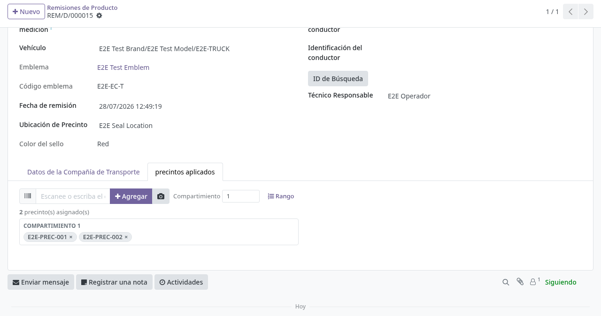
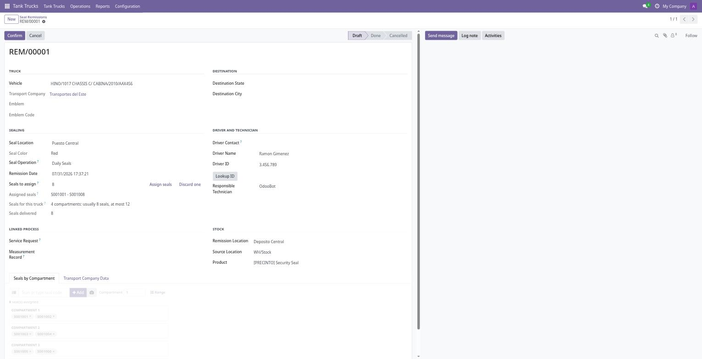
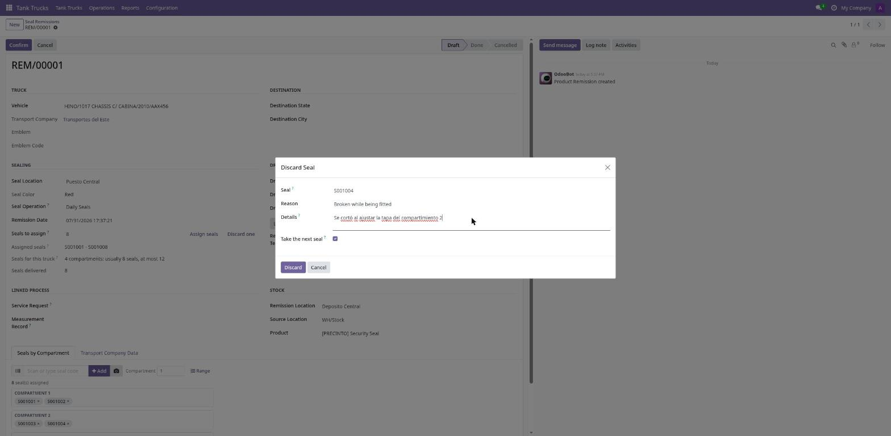
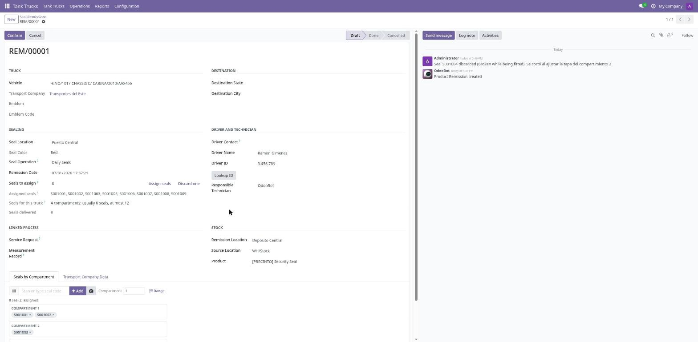
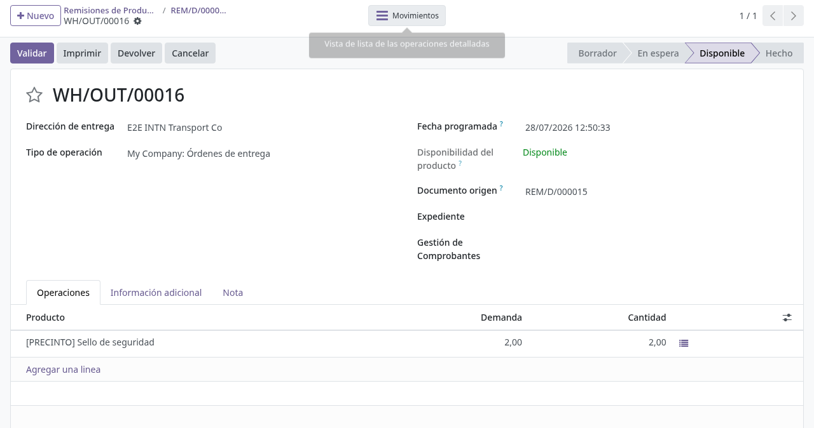
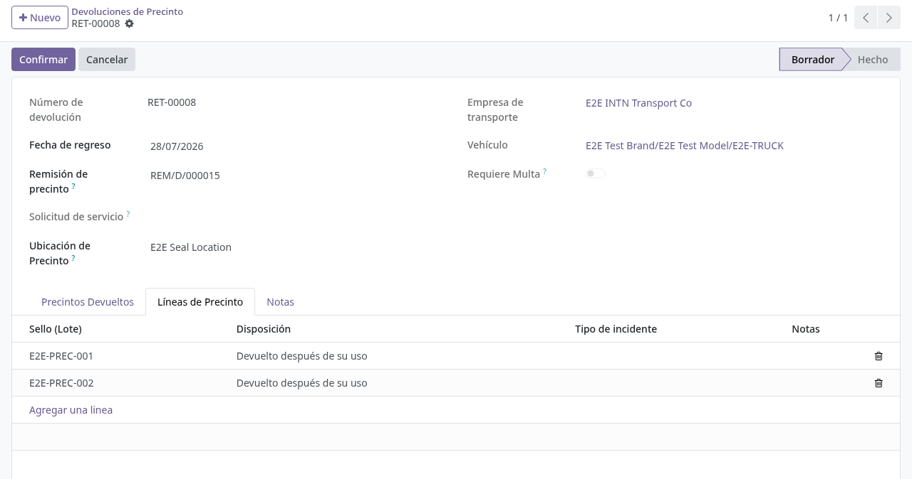
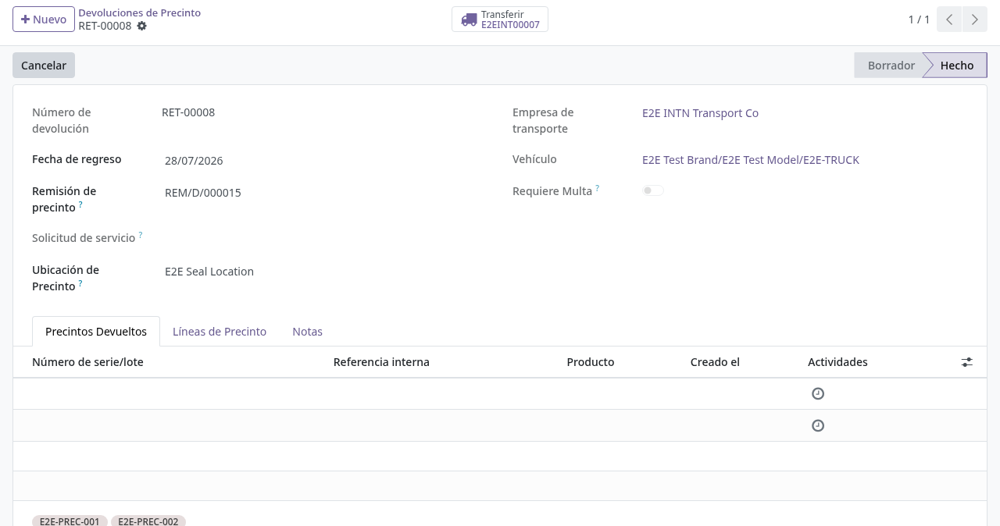
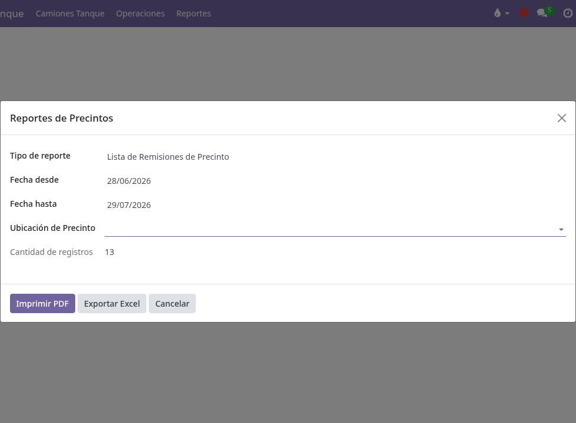

# Precintos: remisión y devolución

## Para quién es esta guía

- **Usuario de cisternas** — registra la entrega (remisión) y la devolución de precintos, y genera informes.
- **Jefe de cisternas (operador)** — confirma o cancela los movimientos y resuelve discrepancias de stock.

## Qué resuelve este proceso

Controla la salida de precintos al cliente (remisión) y su devolución, con trazabilidad de stock por número de serie e informes por período. Cada precinto es un lote/número de serie del producto **Sello de seguridad** (código PRECINTO) y mantiene su propio ciclo de vida (disponible, usado, devuelto, descartado, cancelado).

## Configuración previa

- Grupo de seguridad **Usuario de Cisterna** (Ajustes → Usuarios) para el menú **Camiones Tanque**.
- Producto de precintos y sus lotes (números de serie) cargados en inventario por administración.
- **Ubicaciones de Precinto** configuradas (menú **Inventario → Configuración → Ubicaciones de Precinto**), cada una con su ubicación de stock asociada.
- El vehículo debe tener un **certificado vigente** (confirmado y no vencido) para poder remitirle precintos.

## Antes de empezar

- El vehículo ya tiene un certificado vigente y confirmado (ver [Certificados de cisterna](certificados-cisterna.md)); sin eso, la remisión no se puede confirmar.
- Contar con los lotes de precintos disponibles en la ubicación de origen correcta.
- Identificar el cliente, el vehículo y el expediente asociado al movimiento.

## Pasos por rol

### Usuario cisternas — Remisión (entrega de precintos)

1. Abrir **Camiones Tanque → Operaciones → Remisiones de Precinto**. (El mismo listado también aparece en Inventario como **Remisiones de Producto**.)

2. Crear una nueva remisión y completar la cabecera:
   - **Ubicación de Remisión** (obligatorio) y **Ubicación de origen** (obligatorio; depósito interno del que salen los precintos).
   - **Cliente** (obligatorio): empresa de transporte.
   - **Operación del sello**: **precintos diarios** (valor por defecto) o **Precintado Anual**. El precintado anual es el que luego sirve de base para la homologación (ver [Homologación](homologacion-rangos-precintos.md)).
   - **Vehículo** y **Ubicación de Precinto**: pueden dejarse para después, pero son obligatorios para poder confirmar. Al elegir el vehículo se completan solos el **Emblema** y su código.
   - **Solicitud de servicio** y **Registro de medición**: vínculos al expediente; deben corresponder al mismo vehículo de la remisión.
   - **Producto** (obligatorio) y **Cantidad**: la cantidad se actualiza sola según los precintos capturados en la pestaña de precintos aplicados.
   - **Fecha de remisión** (por defecto, el momento actual), **Estado de destino** y **Ciudad de destino**.
   - **Contacto del conductor**, **Nombre del conductor** e identificación, y **Técnico Responsable** (por defecto, el usuario actual).
   - **Color del sello**: se calcula solo según el año (por ejemplo 2026 = rojo).

   

3. En la pestaña **Datos de la Compañía de Transporte**, revisar la tabla de **Productos** (combustibles que transporta: Gas-oil, Alconafta, Nafta 85/86, Nafta 95/96, Kerosene, JET, Avigas, Fuel-oil; se precargan con cantidad 0 al elegir la ubicación) y completar la **Observación** si aplica.

4. Asignar los precintos. El camino normal **no requiere capturarlos uno a uno**:
   - **Precintos a asignar** viene propuesto a partir del camión (compartimientos × 2, que es lo más frecuente). Debajo, **Precintos para este camión** recuerda cuántos suele llevar y cuál es su tope. La cantidad es editable: cuántas bocas se precintan depende de qué lleve el camión en ese viaje.
   - Pulsar **Assign seals**: el sistema toma de la góndola los siguientes precintos disponibles **por orden numérico** y los reparte entre los compartimientos. **Precintos asignados** muestra el resultado como intervalo (por ejemplo `S001001 - S001008`).
   - Los precintos quedan reservados desde ese momento: no se los ofrece a otra remisión aunque todavía esté en borrador.
   - Volver a pulsar el botón no duplica nada: sólo completa hasta la cantidad pedida.

   

5. **Si un precinto se descarta** (se rompe al colocarlo, viene fallado, se pierde), pulsar **Discard one**:
   - Elegir el precinto, el **motivo** y, si el motivo es *Otro*, el detalle.
   - Dejando tildado **Take the next seal**, el sistema asigna automáticamente el siguiente disponible y la remisión mantiene la cantidad acordada.
   - El precinto descartado sale del inventario con un **desecho** (`stock.scrap`), queda en estado *Discarded* con su motivo, y el descarte se registra en el historial de la remisión.

   

   

6. **Captura manual (excepción)**. En la pestaña **Precintos por compartimiento** se puede capturar cada precinto con el widget, para correcciones o cuando no se sigue el orden de góndola:
   - Escanear o escribir el número de serie en el campo de captura y pulsar **Add** (o Enter). Si el equipo tiene cámara, el ícono de cámara permite escanear el código de barras.
   - Indicar el número de **compartimiento** antes de agregar; cada precinto queda como un *chip* agrupado bajo su compartimiento, con una **×** para quitarlo.
   - Con **Range** se agrega un intervalo contiguo de series (desde/hasta, máximo 200), útil para tiras de precintos consecutivos.
   - El widget avisa si el código no existe, si ya está asignado en la remisión o si no está disponible en la ubicación elegida.
   - Solo se pueden capturar precintos en estado **Disponible** de la ubicación de origen.

7. Revisar los datos y pulsar **Confirmar** (visible solo en Borrador). Al confirmar, el sistema:
   - Verifica que el vehículo tenga certificado vigente, que los precintos estén disponibles y que no se supere el tope del camión (compartimientos × 3).
   - Si la numeración tiene un salto —lo normal cuando se descartó un precinto— **no lo impide**: deja constancia en el historial indicando qué números faltan.
   - Genera automáticamente la **orden de entrega** de inventario hacia el cliente y la valida; queda accesible desde el botón superior de entrega.
   - Marca cada precinto como **Usado (asignado en ruta)** y registra en el lote la última remisión y el último vehículo.
   - La remisión pasa a **Hecho** y aparece el **código QR** de verificación en línea.

   

8. Imprimir la **Nota de Remisión de Precintos** (PDF del programa de precintado) desde el menú Imprimir, con los precintos aplicados por compartimiento.

### Usuario cisternas — Devolución

1. Abrir **Camiones Tanque → Operaciones → Devoluciones de Precinto**.

2. Crear la devolución y completar:
   - **Remisión de precinto** (obligatorio): solo se pueden elegir remisiones ya confirmadas. Al elegirla se completan la **Empresa de transporte**, el **Vehículo** y se precarga una línea por cada precinto de la remisión.
   - **Fecha de regreso** (obligatorio; por defecto hoy) y **Ubicación de Precinto** (obligatorio; adónde vuelven los precintos).
   - En la pestaña **Precintos Devueltos** se marcan rápidamente los precintos que el cliente entregó físicamente.
   - En la pestaña **Líneas de Precinto** se asigna a cada precinto su destino final (**Disposición**): **Devuelto después de su uso**, **Devuelto no utilizado (devolución a stock)**, **Cancelado antes de su uso** o **Irregular (daño, alteración, no devuelto)**. Para las líneas irregulares es obligatorio el **Tipo de incidente**: **Roto**, **manipulado**, **No devuelto** u **Otro**.

   

3. Si los precintos marcados no coinciden con los de la remisión, el formulario muestra el aviso rojo *"LAS DEVOLUCIONES DE PRECINTOS NO COINCIDEN CON LAS PRECINTOS DE LA REMISIÓN. SE REQUIERE UN REGISTRO DE MULTA PARA CONFIRMAR."* y el campo **Requiere Multa** queda activado.

4. **Confirmar** la devolución (visible solo en Borrador). Al confirmar, el sistema:
   - Completa automáticamente como **Irregular / No devuelto** los precintos de la remisión que no se hayan registrado.
   - Si hay precintos irregulares o desajuste, **crea y confirma automáticamente la multa** (tipo **Irregularidad del sello** o **Desajuste de precintos**) enlazada a la devolución, y programa una actividad interna de seguimiento del caso irregular.
   - Genera y valida la **transferencia interna** que regresa al depósito los precintos con disposición devuelto / devuelto sin uso.
   - Actualiza el estado de cada precinto: los devueltos sin uso vuelven a **Disponible**; los usados quedan como devueltos; los cancelados e irregulares quedan fuera de circulación.

   

### Usuario cisternas — Informes

1. Abrir **Camiones Tanque → Operaciones → Reports → Seal Reports Wizard** (asistente de informes de precintos).
2. Elegir el tipo de informe: **Seal Returns List** (devoluciones del período), **Seal Status** (estado actual de cada precinto, con filtro opcional por estado) o **Seal Remissions List** (remisiones del período).
3. Completar las fechas desde/hasta (obligatorias, salvo en el informe de estado) y, si se desea, la ubicación de precintado. El asistente muestra cuántos registros encontró.
4. Pulsar **Print PDF** o **Export Excel** para generar el informe.

   

### Jefe de cisternas (operador)

1. Revisar remisiones o devoluciones pendientes.
2. **Confirmar** o **Cancelar** según la política del área. Una remisión confirmada solo puede cancelarse si su orden de entrega fue cancelada o validada; desde Cancelado existe **Restablecer a Borrador**.
3. Resolver discrepancias de stock con almacén.

## Estados que verá en pantalla

| Estado (remisión) | Significado | Qué hacer |
|-------------------|-------------|-----------|
| Borrador | En preparación | Completar cabecera y precintos aplicados, luego confirmar |
| Listo | Movimiento aplicado; entrega de stock generada | Imprimir la nota; no se edita sin cancelar |
| Cancelado | Anulada | No cuenta como entrega válida |

| Estado (devolución) | Significado | Qué hacer |
|---------------------|-------------|-----------|
| Borrador | En preparación | Completar disposición de cada precinto y confirmar |
| Hecho | Ciclo cerrado; stock y estados de precintos actualizados | Archivar; atender la multa si se generó |
| Cancelado | Anulada | No cuenta como devolución válida |

Estados del precinto (número de serie): **Disponible**, **Usado (asignado en ruta)**, devuelto, descartado, cancelado (los tres últimos se muestran en inglés: *Returned*, *Discarded*, *Cancelled*).

## Casos especiales

- El movimiento de inventario se genera automáticamente al **Confirmar**; una remisión confirmada no se edita (*"You can only modify remissions in draft state."*) y solo se cancela si su entrega fue cancelada o validada.
- **Series consecutivas:** lo habitual es que los precintos de una remisión formen una secuencia sin saltos, pero un salto **no bloquea** la confirmación: queda anotado en el historial con los números que faltan. Es lo que ocurre cuando se descarta un precinto y se toma el siguiente.
- **Descarte:** un precinto descartado sale del inventario con un desecho y no vuelve a ofrecerse. El motivo queda en el lote y en el historial de la remisión.
- **Reserva en borrador:** los precintos asignados a una remisión en borrador ya no se ofrecen a otra, para que dos operadores trabajando a la vez no reciban los mismos números.
- **Un precinto, una remisión:** el mismo número de serie no puede repetirse dentro de la remisión ni usarse si no está disponible.
- La devolución siempre nace de la **remisión origen** (campo obligatorio) y cierra uno a uno los precintos de esa remisión: lo que el cliente no devuelve queda automáticamente como irregular **No devuelto**.
- La **remisión anual confirmada** define los "precintos instalados" del vehículo que luego usa la homologación (ver [Homologación](homologacion-rangos-precintos.md)); la constancia de entrega referencia la remisión (ver [Constancia de entrega](constancia-entrega.md)).

## Si algo no funciona

| Problema | Causa habitual | Qué hacer |
|----------|----------------|-----------|
| *"Cannot create remission: vehicle does not have a valid certificate."* | El vehículo no tiene certificado confirmado y vigente | Emitir/renovar el certificado (ver [Certificados de cisterna](certificados-cisterna.md)) |
| *"Vehicle is required to confirm a seal remission."* / *"Seal location is required to confirm a seal remission."* | Falta el vehículo o la ubicación de precintado | Completar esos campos antes de confirmar |
| *"Only available seal lots can be assigned. Invalid lots: …"* | Precintos ya usados, devueltos o descartados | Capturar precintos en estado Disponible |
| *"Seal serial numbers must be consecutive without gaps."* | Series salteadas en la captura | Corregir la lista para que sea un rango continuo |
| *"Lot … is not available in location …"* / no hay stock | Lotes o ubicación de origen incorrectos | Revisar el inventario con almacén |
| El widget avisa *"Seal … was not found."* | El número de serie no existe como lote del producto de precintos | Verificar el código o cargar el lote en inventario |
| *"Cannot confirm return: a fine record is required when there are irregular seals."* | Falta el módulo/registro de multas para el caso irregular | Verificar con el administrador la instalación del módulo de multas |
| Informe vacío (*"No records found for the selected criteria."*) | Rango de fechas sin movimientos confirmados | Ampliar las fechas o verificar las confirmaciones |
| La devolución no enlaza la remisión | La remisión no está confirmada | Confirmar primero la remisión origen |

## Guías relacionadas

- [Certificados de cisterna](certificados-cisterna.md)
- [Constancia de entrega](constancia-entrega.md)
- [Homologación de rangos de precintos](homologacion-rangos-precintos.md)
- [Multas y bloqueos](multas-bloqueos.md)
