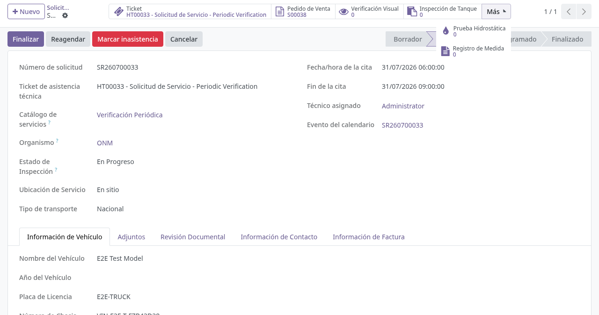
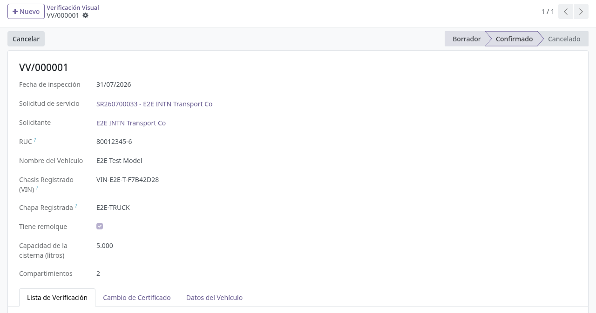
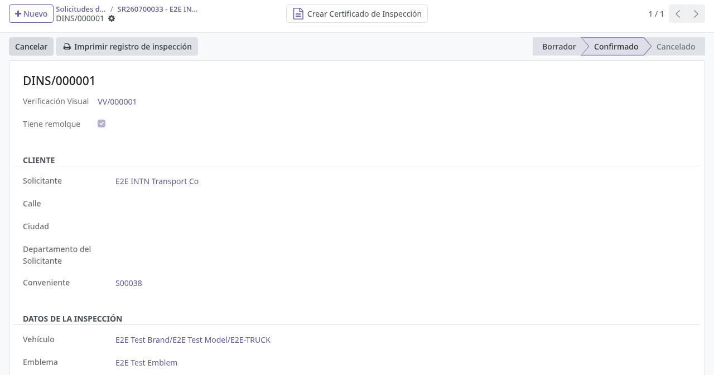
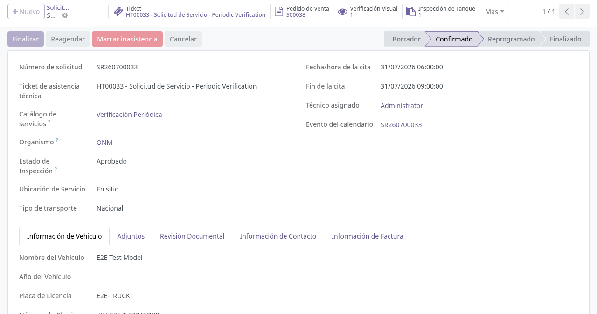
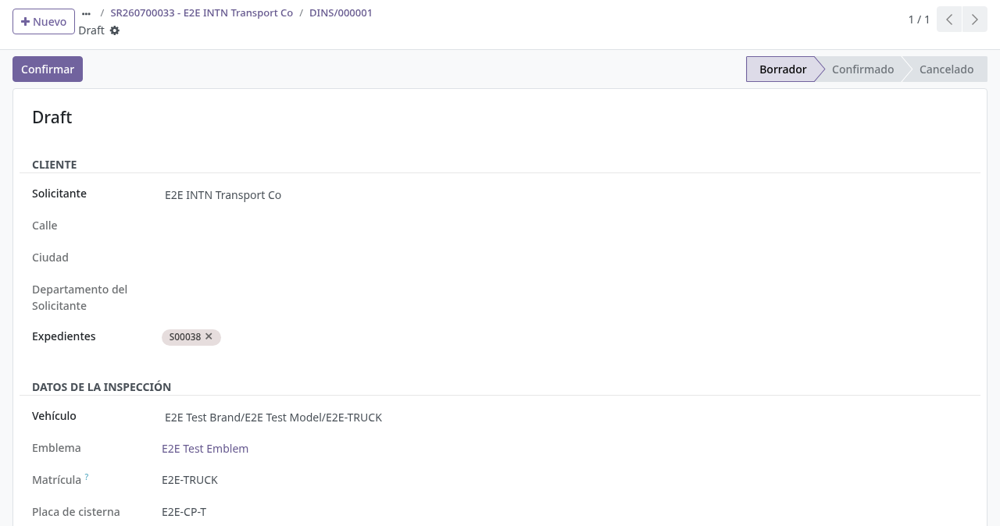

# Verificación técnica en planta

## Para quién es esta guía

- **Técnico / inspector de cisternas** — registra en planta la inspección física del vehículo.
- **Jefe de cisternas (operador)** — supervisa, confirma o reabre los registros de inspección.

## Qué resuelve este proceso

Registra en orden la inspección física del vehículo (verificación visual, inspección de tanque, prueba hidrostática y registro de medición) como base para emitir los certificados de cisterna.

## Configuración previa

- Grupo de seguridad **Usuario de Cisterna** (Ajustes → Usuarios) para el menú **Camiones Tanque → Operaciones**; el grupo **Gestor de Cisternas** permite además reabrir registros cancelados.
- Productos, ubicaciones y catálogos de verificación configurados por administración.

## Antes de empezar

- Solicitud de servicio **confirmada** para habilitación o verificación anual (ver [Gestión de solicitudes ONM](gestion-solicitudes-onm.md)). Los botones de inspección solo aparecen con la solicitud en Confirmado.
- Vehículo presente en planta según la cita agendada.

## Pasos por rol

### Técnico cisternas

1. Abrir la **solicitud de servicio** confirmada del vehículo (**Camiones Tanque → Operaciones → Solicitudes de Servicio**).

   

2. Desde los botones estadísticos de la solicitud, abrir los registros en este orden lógico de la cadena técnica (cada botón crea el registro si no existe y lo abre; también están en **Camiones Tanque → Operaciones** como **Verificación Visual**, **Inspección de Tanques**, **Prueba hidrostática: estanqueidad** y **Registro de medición**):
   - **Verificación Visual**
   - **Inspección de Tanque**
   - **Prueba Hidrostática**
   - **Registro de Medida**

3. Completar la **Verificación visual**:
   - Verificar la cabecera: fecha de inspección (por defecto hoy), solicitante y RUC, datos registrados del vehículo (chasis, chapa), **capacidad de la cisterna en litros** y **cantidad de compartimientos** (ambos obligatorios).
   - En la pestaña de checklist, resolver cada uno de los ítems ONM, agrupados en tres secciones: verificación **documental** (número de chasis, chapa), **estado del camión** (tanque externo/interno, neumáticos, válvula interna, precintos, inscripciones obligatorias) e **identificación** (emblema, datos de la empresa transportista, código del camión). Cada línea se marca con el tilde verde (**cumple**) o la X roja (**no cumple**); al marcar "no cumple" es obligatorio escribir la observación.
   - El **resultado de la inspección** se calcula solo: **Aprobado** si todo cumple, **Rechazado** si hay algún ítem que no cumple (con el resumen de motivos), **Imposibilidad** si se marca la casilla de imposibilidad (que oculta el checklist y exige el motivo).
   - Si el problema es solo un error de tipeo en chapa o chasis, usar **Apply Document Correction** (visible en borrador) para aplicar la corrección documental sin rechazar; queda anotado en la solicitud.
   - Pulsar **Confirmar**. Con resultado Rechazado, el sistema genera el **PDF de rechazo**, lo adjunta y lo publica en la solicitud para el cliente. El resultado se traslada a la solicitud: Aprobado → inspección **Aprobado**; Rechazado → **Rechazado**; Imposibilidad → **Cancelado**.

   

4. Completar la **Inspección de tanque** (DINS) y confirmarla; queda vinculada a la solicitud:
   - Solo puede crearse con la verificación visual **confirmada**; si no, el sistema avisa *"Confirm the visual verification before creating the tank inspection."*
   - Completar **compartimientos inspeccionados**, **fecha de inspección** y **técnico de inspección** (obligatorios). El número DINS se asigna al confirmar.
   - En **Resultados de la inspección** hay una línea por compartimiento (hasta 7): marcar **Cumple** (equivale a *Below 10% LIE*) o no cumple (*Above 10% LIE*); las líneas que exceden los compartimientos inspeccionados quedan como **No Aplicable**.
   - Tras confirmar aparecen **Imprimir registro de inspección** y el botón **Create Inspection Certificate**, que crea el **Certificado de Inspección de Tanques** (LIE) precargado (ver [Certificados de cisterna](certificados-cisterna.md)).

   

5. Completar la **Prueba hidrostática** y el **Registro de medición**, confirmando cada uno para cerrar la cadena:
   - **Prueba hidrostática**: revisar datos de cliente, vehículo y tanque (o remolque, si el conjunto tiene acoplado), la **presión de proyecto** (por defecto 30 kPa) y los **ítems inspeccionados**: prueba de estanqueidad, prueba hidrostática, presión de prueba (kPa), duración (horas) y cantidad de manómetros. Elegir el **resultado** (**Aprobado / Rechazado / Imposibilidad**; por defecto aparece Rechazado, cambiarlo según lo verificado). Con Imposibilidad, el motivo es obligatorio. Al confirmar se emite el certificado hidrostático; la confirmación exige **expediente vinculado y factura pagada** y la **revisión documental aprobada**.
   - **Registro de medición**: completar dimensiones de compartimientos, tanque y neumáticos, los **patrones de medida** (solo patrones vigentes del catálogo) y las válvulas internas (**Abierto/Cerrado**). En la pestaña **Seals** deben estar cargados los precintos por compartimiento; sin ellos no se puede confirmar. La confirmación exige además la **inspección de tanque confirmada**, el pago del expediente y la revisión documental, y emite el certificado de medición (base del VCC).

   

6. Si el sistema lo ofrece, generar el **certificado** o informe desde el registro correspondiente (ver [Certificados de cisterna](certificados-cisterna.md)).

   

7. Volver a la solicitud para verificar que todos los enlaces estén completos antes de cerrar el caso.

### Jefe de cisternas (operador)

1. Revisar los registros de inspección del vehículo desde los menús de **Operaciones**.
2. **Confirmar** los registros completos o **Cancelar** los que requieran corrección (el botón Cancelar solo aparece en registros confirmados y pide confirmación). **Convert to Draft** reabre un registro cancelado y es exclusivo del grupo **Gestor de Cisternas**.

## Estados que verá en pantalla

| Estado (cada registro técnico) | Significado | Qué hacer |
|--------------------------------|-------------|-----------|
| Borrador | En edición | Completar datos y confirmar |
| Confirmado | Inspección registrada | Pasar al siguiente paso o al certificado |
| Cancelado | Anulado | Solo el gestor puede volverlo a borrador |

La prueba hidrostática y el registro de medición muestran el estado de su certificado, que además puede quedar **Expirado** al vencer.

Resultado de la verificación visual / hidrostática: **Aprobado / Rechazado / Imposibilidad**.

## Casos especiales

- **Orden obligatorio de la cadena:** la inspección de tanque exige la verificación visual confirmada, y el registro de medición exige la inspección de tanque confirmada. La visual y la medición se crean juntas desde la solicitud (quedan enlazadas).
- **Rechazo en la visual:** exige al menos un ítem "no cumple" con observación; no se puede aprobar con ítems incumplidos (*"Cannot approve the inspection when items do not comply."*). El PDF de rechazo se publica automáticamente al cliente.
- **Imposibilidad:** marca la inspección de la solicitud como **Cancelado**; el motivo es obligatorio y el checklist se oculta.
- **Homologación (verificación anual):** si la homologación de precintos quedó en *Mismatched*, no se puede aprobar la verificación visual hasta resolver la multa o rehomologar (ver [Homologación](homologacion-rangos-precintos.md)).
- Los registros técnicos **no se pueden eliminar**: se cancelan (*"Tank inspection records cannot be deleted; cancel them instead."*).
- El **cliente** solo descarga informes ya pagos desde el portal; esa descarga no forma parte de la operación en planta (ver [Certificados (portal)](../../portal/cisternas/certificados.md)).

## Si algo no funciona

| Problema | Causa habitual | Qué hacer |
|----------|----------------|-----------|
| Botones de inspección no visibles | Solicitud no confirmada o sin permiso de cisternas | Confirmar la solicitud; verificar el grupo **Usuario de Cisterna** |
| *"Complete every checklist item before confirming the verification."* / *"All verification items must be checked."* | Ítems del checklist sin resolver | Marcar cumple/no cumple en todos los ítems |
| *"Observation is required when an item does not comply."* | Ítem rechazado sin observación | Escribir la observación del ítem |
| *"Tank inspection requires a confirmed visual verification."* | Se intentó crear/guardar la inspección de tanque antes de confirmar la visual | Confirmar la verificación visual primero |
| *"Confirm the tank inspection before confirming the measurement record."* | Medición confirmada antes que el DINS | Confirmar la inspección de tanque |
| *"Cannot confirm this measurement record without first loading the corresponding seals."* | Pestaña Seals vacía en la medición | Cargar los precintos por compartimiento |
| *"Cannot confirm certificate: invoice must be paid first. Related sale order: …"* | Pago del expediente pendiente (hidrostática/medición) | Regularizar el pago (ver [Caja y pagos](../ventas-caja/contabilidad-caja-pagos.md)) |
| *"Document review must be approved before confirming (current state: …)"* | Revisión documental sin aprobar | Aprobar la revisión en la solicitud (ver [Gestión de solicitudes ONM](gestion-solicitudes-onm.md)) |
| Falta un enlace desde la solicitud | Registro no creado | Usar el botón que crea/abre el registro desde la solicitud |
| Cliente no descarga el PDF | Pago pendiente o permiso de portal | Revisar el expediente y el pago (ver [Caja y pagos](../ventas-caja/contabilidad-caja-pagos.md)) |

## Guías relacionadas

- [Gestión de solicitudes ONM](gestion-solicitudes-onm.md)
- [Certificados de cisterna](certificados-cisterna.md)
- [Precintos: remisión y devolución](precintos-remision-devolucion.md)
- [Homologación de rangos de precintos](homologacion-rangos-precintos.md)
- Trámite del cliente en portal: [Solicitud de verificación ONM](../../portal/cisternas/solicitud-verificacion-onm.md)
