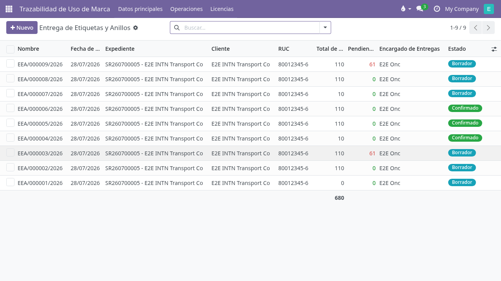
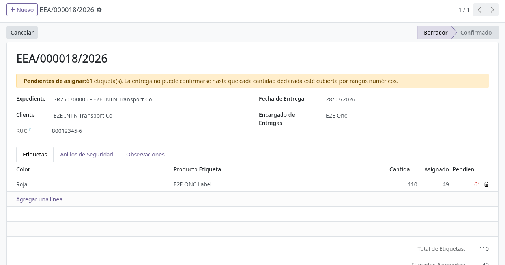
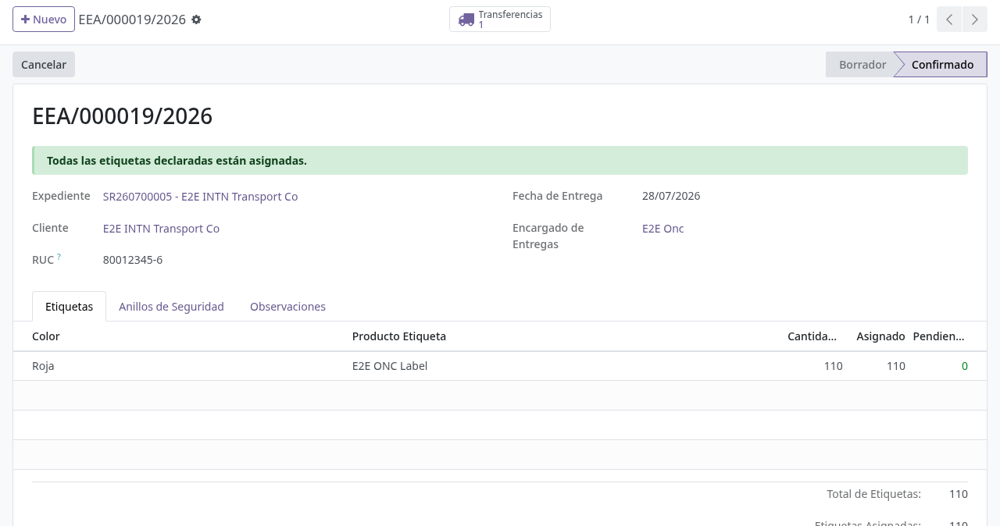

# Entrega de etiquetas y anillos (ONC-FOR-078)

## Para quién es esta guía

- **Encargado de Entregas / Operador ONC** (grupo **Entrega de Etiquetas y Anillos**) — registra la entrega física de etiquetas y anillos al cliente, carga la numeración e imprime el formulario para la firma.
- **Personal ONC** (grupo **Brand Service Requests Manager**) — mismo acceso, más la administración de los colores de etiqueta y la configuración de productos de anillo.

## Qué resuelve este proceso

Deja constancia oficial de qué etiquetas y anillos se entregaron a una empresa, con la numeración exacta. Como la imprenta descarta etiquetas por fallas, la numeración entregada casi nunca es un tramo corrido: el sistema permite cargar **varios tramos discontinuos** por color y no deja confirmar la entrega hasta que la suma de los tramos coincida exactamente con la cantidad declarada. Al confirmar, la numeración queda congelada para auditoría y se descuenta el stock.

Reemplaza el llenado manual del formulario **ONC-FOR-078**, que el sistema ahora genera en PDF listo para firmar.

## Configuración previa

- Usuario interno con acceso a la aplicación **Trazabilidad de Uso de Marca** y el grupo **Entrega de Etiquetas y Anillos** (Ajustes → Usuarios). Los usuarios con **Brand Service Requests Manager** ya lo tienen incluido.
- **Colores de etiqueta cargados en cada producto.** En **Datos principales → Color de Etiqueta** vienen los seis colores del formulario: Roja, Amarilla, Celeste, Gris, Naranja y Verde. Cada producto de etiqueta debe tener el suyo en su ficha, pestaña **Brand Usage**, campo **Color de Etiqueta**. Sin este dato la entrega no se puede confirmar.
- **Productos de anillo configurados**: Ajustes → Inventario → sección **Etiquetas de Marca INTN** → **Productos de Anillos de Seguridad**, campos **Producto Anillo Chico** y **Producto Anillo Grande**. Sin ellos no se pueden confirmar entregas que incluyan anillos.
- **Tipo de operación de entrega de etiquetas** marcado en Inventario (el mismo que ya usa Gestión de Comprobantes). Sin él aparece "Debe configurar un tipo de operación de entrega de etiquetas".
- El **expediente** debe existir como solicitud de servicio del cliente.

### Correspondencia de colores en los productos migrados

Los seis productos de etiqueta que vienen del sistema anterior comparten el mismo nombre y **no traen el color**: hay que cargarlo una vez, a mano. Se los distingue por el correlativo con el que vienen (campo **Next Control Number** en la ficha del producto):

| Correlativo del producto | Numeración típica en el formulario | Color a asignar |
|---|---|---|
| 48184 | 1001 | Roja |
| 148469 | 106873 | Amarilla |
| 464670 | 10017 | Celeste |
| 941932 | 100287 | Gris |
| 50790 | 100157 | Naranja |
| 1205254 | 100091 | Verde |

> Esta correspondencia se dedujo del rango de numeración de cada producto. **Confírmela con el responsable del ONC antes de cargarla**: si un color queda mal asignado, el formulario impreso saldrá con el color equivocado.

## Antes de empezar

- Tener a mano los tramos de numeración realmente entregados, incluidas las etiquetas descartadas por error de impresión.
- Contar las cantidades físicas de anillos chicos y grandes que se entregan.

## Pasos por rol

### Encargado de Entregas / Operador ONC

1. Abrir **Trazabilidad de Uso de Marca → Operaciones → Entrega de Etiquetas y Anillos** y presionar **Nuevo**.

   

2. Completar la cabecera:
   - **Expediente** — la solicitud de servicio del cliente. Al elegirla, el sistema completa solo el **Cliente**.
   - **Cliente** y **RUC** — el RUC se toma de la ficha del cliente y no se edita acá.
   - **Fecha de Entrega** — viene con la fecha de hoy.
   - **Encargado de Entregas** — viene con el usuario que está cargando.

3. En la pestaña **Etiquetas**, agregar una línea por color entregado. Al hacer clic en la línea se abre una ventana con el detalle:
   - **Producto Etiqueta** — el producto correspondiente al color. El campo **Nombre del Color** se completa solo.
   - **Cantidad Total** — cuántas etiquetas de ese color se entregan físicamente (por ejemplo, 110).
   - En **Rangos Numéricos**, una fila por tramo: **Serie** (por ejemplo, "S"), **Número Desde** y **Número Hasta**. La **Cantidad** de cada fila se calcula sola.

4. Controlar el contador **Pendientes de Asignar**. Aparece arriba del formulario, en un recuadro amarillo, y también en cada línea de color. Mientras no llegue a cero, el botón **Confirmar** no aparece.

   

5. En la pestaña **Anillos de Seguridad**, cargar **Anillos Chicos** y **Anillos Grandes** con las cantidades físicas entregadas.

6. Si corresponde, escribir en la pestaña **Observaciones** (por ejemplo, el motivo de los saltos de numeración).

7. Cuando **Pendientes de Asignar** llega a **0**, el recuadro pasa a verde y aparece el botón **Confirmar**. Al presionarlo, el sistema valida la numeración, congela los rangos y genera la transferencia de stock (botón **Transferencias** arriba a la derecha).

   

8. Imprimir el formulario: menú **Imprimir → ONC-FOR-078 Entrega de Etiquetas y Anillos**. El PDF replica el formulario oficial e incluye al pie los recuadros **Firma y Aclaración ONC** y **Firma y Aclaración Cliente**.

### Ejemplo: entrega con etiquetas descartadas por error de impresión

Se entregan **110 etiquetas rojas**. La imprenta descartó la 1050 y la 1101.

| Paso | Qué carga el operador | Pendientes de Asignar |
|---|---|---|
| Se declara la cantidad total | Cantidad Total = 110 | **110** |
| Primer tramo | S 1001 → 1049 (49 etiquetas) | **61** |
| Se descarta la 1050; segundo tramo | S 1051 → 1100 (50 etiquetas) | **11** |
| Se descarta la 1101; tercer tramo | S 1102 → 1112 (11 etiquetas) | **0** |

Con el contador en 0 aparece **Confirmar**. Las etiquetas 1050 y 1101 nunca se registran como entregadas: no forman parte de ningún tramo.

## Estados que verá en pantalla

| Estado | Significado | Qué hacer |
|--------|-------------|-----------|
| **Borrador** | La entrega se está cargando. Todo es editable. | Completar colores, rangos y anillos hasta que Pendientes de Asignar llegue a 0. |
| **Confirmado** | La entrega quedó registrada. La numeración está congelada y el stock descontado. | Imprimir el ONC-FOR-078 y recolectar las firmas. Solo se pueden seguir editando las **Observaciones**. |
| **Cancelado** | La entrega se anuló y su transferencia también. | Los números vuelven a quedar disponibles para otra entrega. |

## Casos especiales

- **Se cargaron más etiquetas de las declaradas.** El contador muestra un número negativo (por ejemplo, −10): se cargaron 10 de más. Corregir un tramo o ajustar la Cantidad Total; el sistema no borra lo cargado.
- **Entrega de solo anillos.** Es válida: se puede confirmar sin ninguna línea de etiquetas.
- **Series distintas con la misma numeración.** Están permitidas: dos tramos con la misma numeración pero distinta serie no se consideran repetidos.
- **Una entrega parecida a otra anterior.** Usar **Duplicar**: la copia vuelve a Borrador, conserva colores y rangos, y no arrastra ni el número ni la transferencia. Corregir los números antes de confirmar.
- **Corregir una entrega ya confirmada.** No se puede editar: hay que **Cancelar** y cargar una nueva. Si la transferencia de stock ya fue validada, primero hay que revertir el movimiento en Inventario.
- **Cliente sin RUC.** La entrega se confirma igual, pero el PDF sale con el campo vacío. Conviene completar el RUC en la ficha del cliente antes de imprimir.

## Si algo no funciona

| Problema | Causa habitual | Qué hacer |
|----------|----------------|-----------|
| "No se puede confirmar: quedan N etiquetas pendientes de asignar en el color X" | La suma de los tramos no llega a la Cantidad Total declarada. | Agregar el tramo faltante o corregir la Cantidad Total. |
| "El color X no tiene rangos numéricos cargados" | Se declaró una cantidad pero no se cargó ningún tramo. | Cargar los rangos o eliminar esa línea de color. |
| "El producto X no tiene color de etiqueta configurado" | Falta el **Color de Etiqueta** en la ficha del producto. | Cargarlo según la tabla de correspondencia de esta guía. |
| "El producto X está cargado en más de una línea de color" | Se agregó dos veces el mismo producto. | Unificar en una sola línea con todos sus tramos. |
| "El rango S a-b se solapa con el rango S c-d de la misma entrega" | Dos tramos de la misma entrega comparten números. | Revisar los extremos: es habitual repetir el número final de un tramo como inicial del siguiente. |
| "El rango S a-b del producto X se solapa con la entrega EEA/…" | Esos números ya fueron entregados en otra entrega confirmada. | Verificar la numeración real. El mensaje indica con qué entrega choca. |
| "El número final no puede ser menor que el inicial" | Se invirtieron Desde y Hasta. | Corregir el orden. |
| "La serie es obligatoria" | Quedó vacío el campo Serie. | Cargar la serie (habitualmente "S"). |
| "Las cantidades de anillos no pueden ser negativas" | Se escribió un número negativo. | Corregir la cantidad. |
| "Configure el producto de anillo chico/grande en los ajustes de la compañía" | Falta la configuración de productos de anillo. | Ajustes → Inventario → **Etiquetas de Marca INTN**. |
| "Debe configurar un tipo de operación de entrega de etiquetas" | Falta marcar el tipo de operación en Inventario. | Marcarlo en el tipo de operación de salida correspondiente. |
| "La entrega no está en borrador y sus rangos numéricos están congelados para auditoría" | Se intenta editar una entrega confirmada. | Cancelar y cargar una nueva, o editar solo las Observaciones. |
| "La transferencia … ya fue validada" | Se intenta cancelar una entrega cuyo stock ya salió. | Revertir el movimiento en Inventario y volver a intentar. |
| El botón **Confirmar** no aparece | Quedan etiquetas pendientes, o la entrega no tiene ni etiquetas ni anillos. | Revisar el recuadro **Pendientes de Asignar**. |

## Guías relacionadas

- [Trazabilidad y etiquetas](trazabilidad-etiquetas.md) — licencias, saldos, impresión y comprobantes.
- [Gestión de certificación ONC](gestion-certificacion-onc.md)
