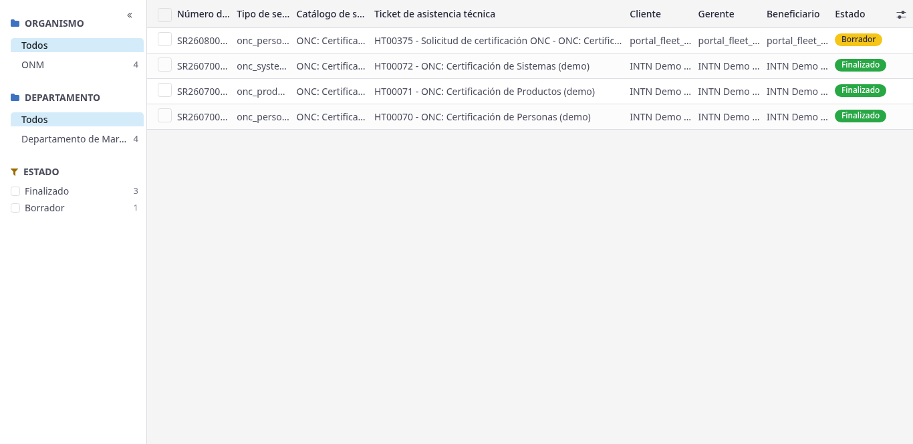
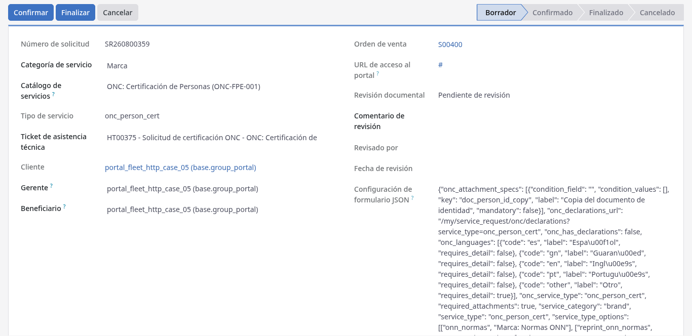
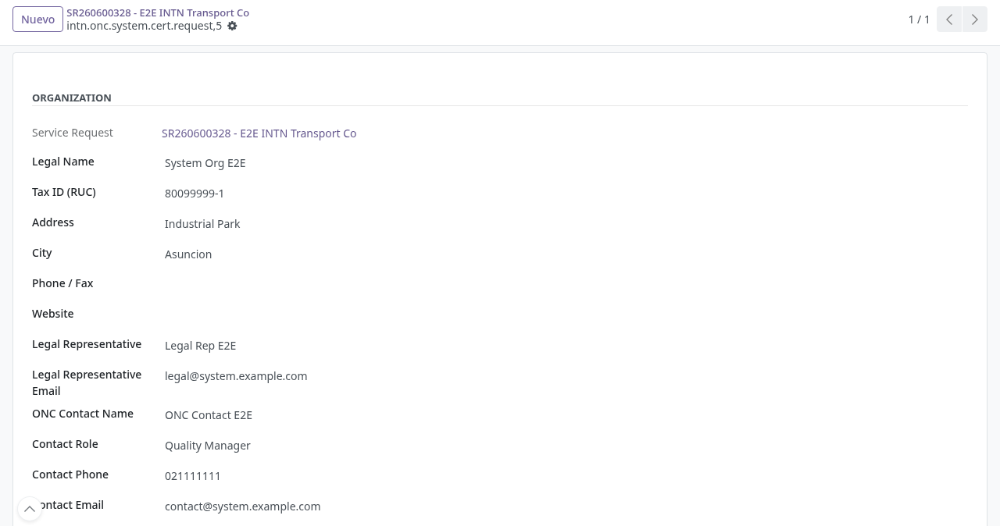
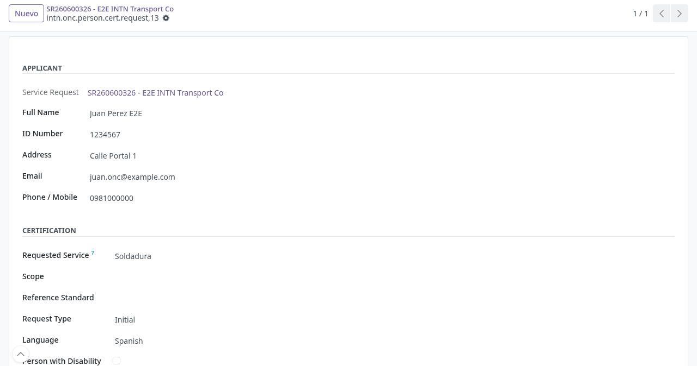

# Gestión de certificación ONC en backoffice

## Para quién es esta guía

- **Usuario ONC** (grupo **Brand Service Requests Manager**) — revisa las solicitudes de certificación que el cliente envió desde el portal, en **Trazabilidad de Uso de Marca**.
- **Revisor ONC** (grupo **ONC Certification Reviewer**) — completa las secciones internas de evaluación que el cliente no ve (por ejemplo, el estudio de factibilidad de personas).

## Qué resuelve este proceso

Da seguimiento en Odoo a las solicitudes de certificación ONC de **productos** (**ONC-FOR-001**), **personas** (**ONC-FPE-001**) y **sistemas de gestión** (**ONC-FSG-001**) creadas desde el portal, verificando alcance y esquema contra lo declarado por el cliente y completando la evaluación interna del ONC.

## Configuración previa

- Usuario interno con acceso a la aplicación **Trazabilidad de Uso de Marca**.
- Para ver el menú **Certificación ONC** (**Operaciones → ONC Certification**): pertenecer al grupo **Brand Service Requests Manager** o **ONC Certification Reviewer** (Ajustes → Usuarios). Es una única entrada; hasta agosto de 2026 aparecían dos con el mismo nombre y una de ellas no mostraba las solicitudes.
- Para el estudio de factibilidad de personas: pertenecer al grupo de seguridad **ONC Certification Reviewer**.
- Módulo `intn_onc_certification_requests` instalado y actualizado.

## Antes de empezar

- El cliente ya envió la solicitud desde el portal; el sistema creó automáticamente:
  - la solicitud de servicio (número `SR…`) en estado **Borrador**, con la categoría **Brand**;
  - el **ticket** para el equipo **ONC Certification Requests**, con nombre "ONC certification request - «tipo de servicio»";
  - el **pedido de venta** (expediente) del servicio;
  - el registro del **formulario ONC**, enlazado a la solicitud.
- Estas solicitudes **no** envían el correo automático de ATC de otras familias de servicio; la comunicación con el cliente se hace por el ticket y el portal.
- La revisión de los adjuntos se hace con el circuito de [revisión documental](../registro-documentos/revision-documental.md); la solicitud no puede confirmarse mientras la revisión no esté aprobada.

## Pasos por rol

### Usuario ONC

1. Abrir **Trazabilidad de Uso de Marca → Operaciones → Certificación ONC**, donde llegan las solicitudes que el cliente envió desde el portal. La lista muestra solo solicitudes ONC, con las columnas **Número de solicitud**, **Tipo de servicio**, **Catálogo de servicio**, **Ticket de asistencia técnica**, **Cliente**, **Manager**, **Beneficiary** y **Estado** (etiqueta amarilla para **Borrador**, verde para **Confirmado**/**Finalizado**, roja para **Cancelado**).

   

2. Abrir la solicitud de interés y revisar:
   - el **Ticket** de atención y sus mensajes;
   - el **Pedido de Venta** (expediente creado automáticamente; con el precio del servicio si está configurado);
   - la pestaña **Adjuntos** con los documentos subidos por el cliente (clasificados también en el gestor documental);
   - el grupo **ONC Links**, que muestra el enlace de solo lectura al formulario ONC según el tipo de certificación.

3. Abrir el formulario institucional enviado desde el portal con el botón **ONC Form** de la parte superior, o con el enlace del grupo **ONC Links**. Si el botón indica "ONC form record not found.", el formulario no quedó enlazado (ver problemas al final).

4. En **ONC-FOR-001** (productos), verificar contra lo declarado en el portal:
   - grupo **Applicant**: razón social, representante legal, correo, dirección, ciudad y datos de contacto;
   - grupo **Manufacturer** (solo si el fabricante difiere del solicitante);
   - grupo **Certification Scheme**: esquema elegido, **Departamento del INTN** (se completa solo a partir del esquema) y tipo de solicitud y período de certificación cuando el esquema los exige (los esquemas 2, 4, 5 y 6 piden tipo y período; el 1b no);
   - grupo **Scope**: producto/familia/proceso, marca comercial, tipo/modelo, presentación y norma de referencia;
   - grupo **QMS Clarifications**: sistema de gestión implementado, certificación ISO, producto similar certificado;
   - grupos **Billing** y **Declaration**: datos de facturación, lugar y fecha de la declaración, firmante autorizado y aceptación de las declaraciones.
   - Los adjuntos obligatorios dependen del esquema; verifique que coincidan con el esquema declarado.

   

5. En **ONC-FSG-001** (sistemas), verificar la razón social y el alcance del sistema contra lo declarado en el portal: grupos **Organization** (datos legales y de contacto) y **Service** (servicio solicitado, norma, alcance propuesto), y las pestañas **Personnel** (personal por área con total calculado), **Sites** (sedes con dirección, personal, turnos y procesos), **Documents** (casillas de documentos declarados) y **Authenticity** (quién completó el formulario, cargo y fecha).

   

6. Con la revisión documental aprobada, avanzar el expediente con los botones de la solicitud: **Confirmar** (pasa a Confirmado), **Finalize** (cierra el servicio), **Reagendar** o **Cancelar** según corresponda.

### Revisor ONC

1. En **ONC-FPE-001** (personas), revisar los datos del solicitante (grupos **Applicant** y **Certification**: certificación solicitada, alcance, norma de referencia, tipo de solicitud, **idiomas** declarados, discapacidad declarada, fecha y aceptación de las declaraciones). El campo **Languages** admite más de un idioma, como el formulario en papel; el catálogo de idiomas se administra en **Datos principales → Catálogos ONC → ONC Languages**.

   Si el solicitante eligió **Otros** en certificación, alcance o norma, el texto que escribió aparece en el campo **Other …** de al lado. Es la señal de que a ese catálogo le falta una entrada: cargarla en **Catálogos ONC** evita que el próximo solicitante vuelva a escribirla a mano.

2. Completar la sección **Feasibility Study (ONC internal)**, visible solo para el grupo **ONC Certification Reviewer** (el cliente nunca la ve). Cada punto se responde con **Yes / No / N/A**:
   - **ONC provides requested service** — el ONC presta el servicio solicitado;
   - **Application form complete** — el formulario está completo;
   - **Applicant meets requirements** — el solicitante cumple los requisitos;
   - **Special needs exist** (+ detalle) y **Special needs can be met**;
   - **Examiner available** y **Verifier available** — hay examinador y verificador disponibles;
   - **Evaluation tools available** — hay herramientas de evaluación;
   - **Subcontracted evaluation venue** (+ detalle) — sede de evaluación subcontratada.

   Cerrar con **Process Continues** (Yes/No), el **Applicant File Number** (número de expediente del solicitante) y las **Feasibility Notes**.

   

## Administrar los catálogos y las declaraciones (ONC, sin desarrollo)

Desde agosto de 2026 las listas de los tres formularios y el texto de las declaraciones los administra el ONC, sin pedir un desarrollo ni un despliegue.

### Catálogos

**Trazabilidad de Uso de Marca → Datos principales → Catálogos ONC**, visible para el grupo **ONC Certification Reviewer**:

| Entrada | Alimenta | Notas |
|---------|----------|-------|
| Certification Schemes | Esquema de ONC-FOR-001 | Lleva el **departamento** que atiende cada esquema |
| Requested Certifications | Certificación de ONC-FPE-001 | Define sus **alcances** y su **norma** (la cascada del portal) |
| Certification Scopes | Alcances de ONC-FPE-001 | Se asocian a una o varias certificaciones |
| Reference Standards | Norma de ONC-FPE-001 y ONC-FSG-001 | Compartida por los dos formularios |
| Request Kinds | Tipo de solicitud de FOR-001 y FPE-001 | **Service Types** decide en qué formulario aparece cada opción |
| Requested Services | Servicio solicitado de ONC-FSG-001 | — |
| ONC Languages | Idiomas de ONC-FPE-001 | — |

Tres columnas se repiten en todos:

- **Code** — la clave técnica. **No la cambie**: es lo que el portal envía y contra lo que casan los documentos condicionales. Renombrar el **Name** es seguro; cambiar el **Code** rompe solicitudes ya cargadas.
- **Requires Detail** — marque esta casilla en la entrada "Otros". Es lo que hace que el portal abra un campo de texto libre cuando el cliente la elige.
- **Service Types** — lista separada por comas (`onc_product_cert`, `onc_person_cert`, `onc_system_cert`). En blanco, la opción aparece en todos los formularios que usan ese catálogo.

Para armar la cascada de personas: cargue los alcances y la norma primero, y después ábralos desde la certificación en **Portal cascade**. El portal ofrecerá sólo esos alcances cuando el cliente elija esa certificación.

### Declaraciones

El texto que el cliente acepta al enviar el formulario se edita en el **catálogo de servicios** del servicio correspondiente, pestaña **Declaration**. Editarlo cambia lo que muestra el portal de inmediato.

Cada edición deja en el registro del catálogo una nota con el **texto anterior**, quién lo cambió y cuándo, de modo que queda el historial cuando una resolución nueva reemplaza a la anterior. Si borra la declaración, el portal vuelve a mostrar la transcripción que trae el sistema: el cliente nunca queda sin ver qué está aceptando.

### El Esquema Tipo 6 y el DCPS

La reestructuración del INTN de julio de 2026 creó el **Departamento de Certificación de Procesos y Servicios (DCPS)** y el **Esquema Tipo 6** dejó de pertenecer a Certificación de Productos. ONC-FOR-001 sigue siendo un único formulario —su título es "Productos, Procesos o Servicios"— y es el esquema el que dice qué departamento atiende: el cliente lo ve como subtítulo de cada opción, y la solicitud queda con el campo **ONC Department**, que está en la lista de **Certificación ONC** para filtrar y derivar.

## Estados que verá en pantalla

| Estado (solicitud) | Significado | Qué hacer |
|--------------------|-------------|-----------|
| Borrador | Creada desde el portal, pendiente de INTN | Revisar datos, adjuntos y revisión documental |
| Confirmado | En trámite | Seguir el expediente y la evaluación según el tipo |
| Reprogramado | Reagendada | Continuar cuando corresponda |
| Finalizado | Servicio cerrado | El cliente consulta resultados |
| Cancelado | No continúa | Revisar el motivo |

## Casos especiales

- **Personas (ONC-FPE-001):** el **Feasibility Study (ONC internal)** solo lo ve y completa el grupo **ONC Certification Reviewer**; el cliente nunca ve esa sección.
- **Productos (ONC-FOR-001):** los adjuntos obligatorios dependen del esquema (1b, 2, 4, 5 o 6) que eligió el cliente; verifique que coincidan con el esquema declarado. Además, el propio esquema determina qué secciones del formulario aplican (por ejemplo, el 1b no pide tipo de solicitud ni período).
- **Sistemas (ONC-FSG-001):** el certificado de otro organismo y las autorizaciones de funcionamiento solo son obligatorios si el cliente marcó que cuenta con otra certificación o que requiere autorizaciones.
- **Reenvío duplicado:** si el cliente envía dos veces el mismo formulario por un problema de conexión, el sistema reutiliza la misma solicitud (no se duplican expedientes).
- **Pedido de venta en cero:** si el servicio no tiene precio configurado, el expediente se crea con total 0; coordine con ventas/caja la valorización.

## Si algo no funciona

| Problema | Causa habitual | Qué hacer |
|----------|----------------|-----------|
| No ve el estudio de factibilidad | Sin grupo revisor | Solicitar el grupo **ONC Certification Reviewer** a TI |
| No aparece el botón **ONC Form** | Vista desactualizada o tipo no ONC | Actualizar el módulo `intn_onc_certification_requests`; verificar que la solicitud sea de tipo ONC; usar el enlace **ONC Links** |
| Mensaje "ONC form record not found." | El formulario no quedó enlazado a la solicitud | Buscar el registro por el número de solicitud y reenlazarlo, o pedir soporte a TI |
| Mensaje "No ONC form linked to this request type." | La solicitud no es de un tipo ONC | Verificar el tipo de servicio de la solicitud |
| No puede **Confirmar** la solicitud | Revisión documental pendiente o rechazada | Completar la [revisión documental](../registro-documentos/revision-documental.md) antes de confirmar |
| No aparece el menú **Certificación ONC** | Módulo no instalado o sin grupos | Instalar `intn_onc_certification_requests`; pedir el grupo **Brand Service Requests Manager** u **ONC Certification Reviewer** |

## Guías relacionadas

- Etiquetas y trazabilidad de uso de marca: [trazabilidad-etiquetas.md](trazabilidad-etiquetas.md)
- Revisión documental: [../registro-documentos/revision-documental.md](../registro-documentos/revision-documental.md)
- Trámite del cliente en portal: [../../portal/marcas-onc/certificacion-onc.md](../../portal/marcas-onc/certificacion-onc.md)
