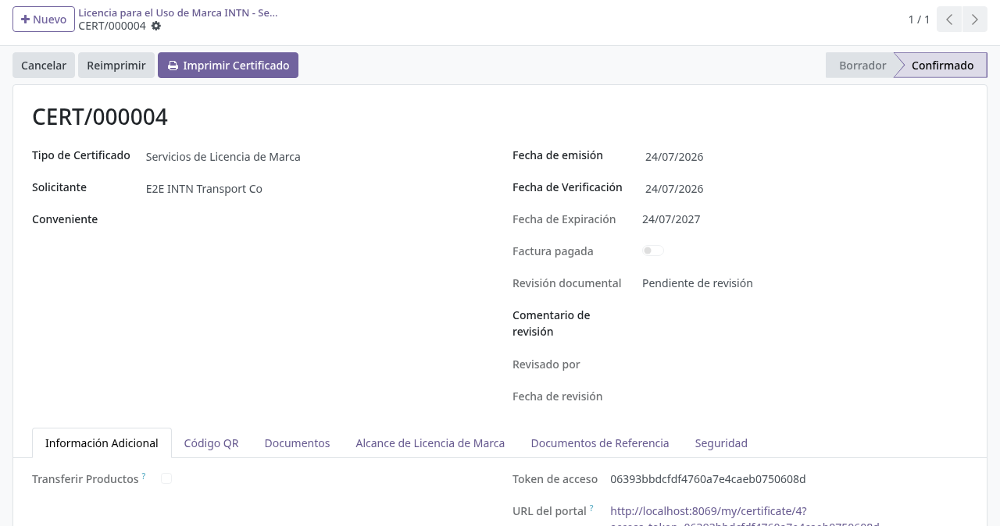
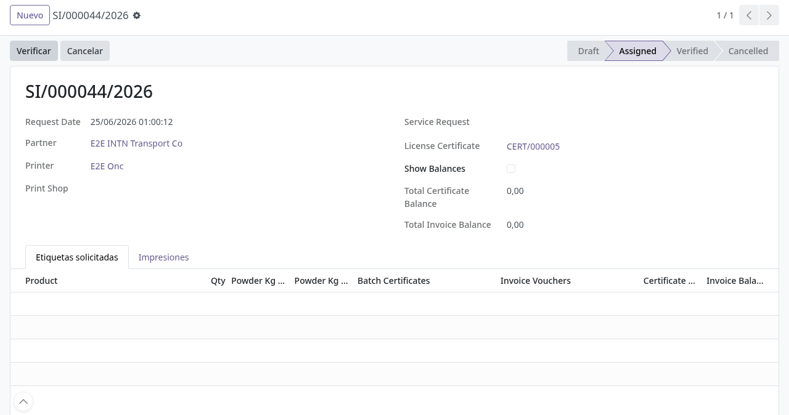
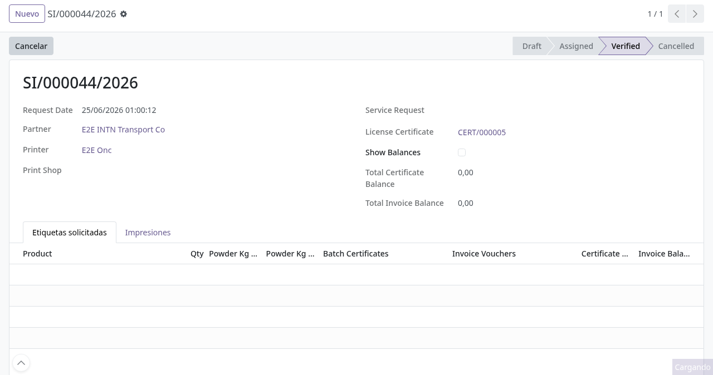
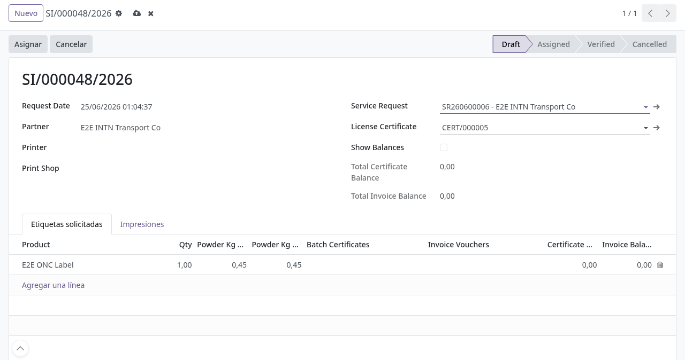

# Trazabilidad de etiquetas ONC en backoffice

## Para quién es esta guía

- **Personal ONC** (grupo **Brand Service Requests Manager**) — administra licencias, saldos, pedidos de impresión, comprobantes y entregas.
- **Impresor** (grupo **Brand Labels Printer**) — crea y asigna pedidos, ejecuta la impresión y la verificación sin necesitar el grupo de manager.
- **Muestreo** (grupo **Brand Sampling**) — registra actas de extracción, informes de muestreo y solicitudes de ensayo.

## Qué resuelve este proceso

Controla quién imprime etiquetas oficiales ONC, cuántas unidades consume de los **saldos** del cliente (certificados de lote, facturas/comprobantes de anillos y saldo de impresión), qué **número de control** lleva cada etiqueta y en qué **estado** queda cada pedido, dentro de la aplicación **Trazabilidad de Uso de Marca**.

## Configuración previa

- Usuario interno con acceso a **Trazabilidad de Uso de Marca**. Los menús se habilitan por grupo:
  - **Datos principales** (solo manager): **Marcas**, **Fabricantes**, **Normas**, **Reglamentos**, **Determinaciones**, **Color de Anillos**, **Impresoras** (también impresor), **Etapas**, **Sub Etapas**, **Métodos de Pago** y **Saldos de Impresión**.
  - **Operaciones**: **Impresión de Etiquetas**, **Solicitudes de Impresión**, **Control de Etiquetas**, **Imprentas**, **Facturas/Comprobantes**, **Gestión de Comprobantes**, **Entrega de Etiquetas y Anillos**, **Nota de Rechazo**, **Acta de extracción de muestras**, **Informe de Muestreo**, **Solicitud de Ensayos y/o Inspección**, **Generar Reporte de Solicitudes de Impresión**, **Solicitudes**, **Certificación ONC** y **Solicitud de Normas**.
  - **Licencias** (solo manager): **Licencia para el Uso de Marca INTN - Servicios**, **Certificado de Conformidad de Lotes de Productos**, **Licencia de Conformidad** y **Licencia de Conformidad Esquema Tipo 2**.
- Cliente con **licencia de uso de marca** (tipo **Brand License Services**) confirmada y con **código de uso de marca** cargado en su ficha.
- **Saldos** cargados: certificados de lote confirmados (kg), facturas/comprobantes de anillos confirmados y, si se usa, el registro de **Saldos de Impresión** del cliente.
- En inventario: la **ubicación de impresión de etiquetas** y la **ubicación de etiquetas impresas** marcadas, una **impresora de etiquetas** activa y el **tipo de operación de entrega de etiquetas** configurado (sin ellos aparecen los mensajes "Label print location is not configured.", "Label printed location is not configured.", "No active label printer is configured." y "A label delivery operation type must be configured.").
- Secuencias de numeración configuradas: las solicitudes se numeran `SI/000000/AÑO` y las impresiones `I/000000/AÑO` (si el nombre queda en `/`, falta la secuencia).

## Antes de empezar

- El cliente envió el pedido desde el portal (queda registrado con el mensaje "Print request … submitted from the customer portal." en el chatter) o lo pidió por correo y el ONC lo carga a mano.
- Los pedidos del portal llegan en estado **Draft** (borrador), con el cliente y las líneas ya cargadas.

## Pasos por rol

### Personal ONC

1. Revisar la licencia del cliente en **Licencias → Licencia para el Uso de Marca INTN - Servicios**: tipo de certificado **Brand License Services**, solicitante, fechas de emisión/verificación/expiración, estado de la **revisión documental** y pestañas **Información Adicional**, **Código QR**, **Documents**, **Brand License Scope**, **Reference Documents** y **Safety**. Para confirmarla, el cliente debe tener su **código de uso de marca**; si falta, aparece "The applicant must have a brand usage code before confirming the license.". Una tarea diaria marca como **vencidas** las licencias con fecha de expiración pasada y actualiza el estado de uso de marca del cliente.

   

2. Abrir **Operaciones → Solicitudes de Impresión** y crear (o completar) la solicitud:
   - **Request Date** (fecha), **Partner** (cliente) — al elegirlo se cargan automáticamente su **License Certificate** (licencia vigente) y las etiquetas disponibles;
   - **Printer** (impresor asignado), **Print Shop** (imprenta, si la impresión es externa), **Service Request** (expediente vinculado, si existe);
   - **Show Balances** para ver los saldos totales (**Total Certificate Balance** y **Total Invoice Balance**);
   - en la pestaña **Etiquetas solicitadas**, una línea por producto: **Product**, **Qty**, kilos de polvo por unidad y total, **Batch Certificates** (certificados de lote que respaldan la impresión) e **Invoice Vouchers** (facturas/comprobantes de anillos), con el saldo de cada uno.

   La solicitud queda en estado **Draft**.

3. Pulsar **Asignar**. La acción:
   - exige un impresor (si falta: "A printer user is required.");
   - descuenta los saldos: kilos de los certificados de lote según los kg de polvo de cada línea, unidades de los comprobantes y el **saldo de impresión** general del cliente (si el saldo no alcanza: "Insufficient print balance.");
   - crea una **Impresión** por línea (pestaña **Impresiones**) y le asigna el rango correlativo de **números de control** de esa etiqueta (Control Start / Control End);
   - deja la solicitud en **Assigned**.

   

4. Ejecutar la impresión en **Operaciones → Impresión de Etiquetas** (puede hacerlo el impresor):
   - **Imprimir Primera Etiqueta**: reserva el primer lote disponible en la ubicación de impresión y habilita la primera línea (si no hay stock: "Insufficient stock in the label print location.");
   - **Imprimir**: abre el asistente para elegir la **impresora** y las líneas a imprimir; las líneas pasan a **Done**;
   - **Verificar**: abre el asistente de verificación para marcar las líneas impresas como **Verified**. Cuando todas las líneas quedan verificadas, la impresión pasa a **Verified** y el sistema genera la **transferencia interna** de las etiquetas (con sus lotes) desde la ubicación de impresión hacia la de etiquetas impresas;
   - **Request Reprint** / **Authorize Reprint**: si hubo fallas, el impresor solicita la reimpresión de líneas y el responsable la autoriza; el pedido vuelve a imprimirse;
   - botón **Scrap**: registra el desecho de etiquetas dañadas desde la ubicación de impresión;
   - la pestaña **Registro de Impresión** muestra secuencia, **número de control**, impresora y estado de cada etiqueta (**Pending → Ready → Done → Verified**).

5. Verificar la solicitud: cuando todas las impresiones del pedido quedan verificadas, la solicitud pasa a **Verified**, se crea automáticamente el registro de **Gestión de Comprobantes** con los rangos de numeración impresos, y el cliente recibe el aviso de que puede **retirar las etiquetas en la oficina del ONC**.

   

6. Completar la entrega en **Operaciones → Gestión de Comprobantes**:
   - **Actualizar Cantidades**: ajusta las cantidades realmente entregadas;
   - **Crear Expediente**: genera el pedido de venta con las etiquetas (y los anillos, si el cliente los compra al INTN) para el cobro con las áreas de expediente y caja;
   - **Confirmar**: valida los comprobantes de anillos y descuenta su saldo. Si el cliente no compra anillos al INTN, exige facturas de compra de anillos válidas (mensajes: "When the customer does not purchase rings, ring purchase invoices are required for label …", "Ring purchase invoices do not match the ring required for label …", "Insufficient ring balance for label …");
   - **Crear Transferencias**: genera la entrega de las etiquetas con sus lotes (botón **Entregas** para seguirlas);
   - **Cancelar** si la gestión no continúa.

   Si hay un **expediente** vinculado a la solicitud, coordinar el cobro con las áreas de expediente y caja.

   

7. Para **cancelar** un pedido ya asignado, pulsar **Cancelar**: el estado pasa a **Cancelled**, las impresiones se cancelan y los saldos consumidos (certificados, comprobantes y saldo de impresión) se revierten.

### Impresor

- Con el grupo **Brand Labels Printer** puede crear y editar solicitudes de impresión, asignarlas, ejecutar los pasos de impresión y verificación, y consultar los saldos (solo lectura), sin necesitar el grupo de manager. No puede eliminar solicitudes.

### Muestreo (grupo Brand Sampling)

1. Registrar el **Acta de extracción de muestras** (cliente, producto, lugar de muestreo, normas, detalle del lote y de la muestra) y pulsar **Confirmar**: el acta recibe su número de secuencia.
2. Cargar el **Informe de Muestreo** vinculado al acta (fechas de recepción/ejecución, departamento ejecutor, lote, presentación, volumen) y confirmarlo.
3. Emitir la **Solicitud de Ensayos y/o Inspección** con las muestras y sus **determinaciones** (catálogo de **Datos principales → Determinaciones**) y confirmarla.
4. Con los resultados, el manager emite el **Certificado de Conformidad de Lotes de Productos** (Licencias): producto, identificación y tamaño del lote en kg, fabricante, marca, origen y vencimiento. Al **Confirmar** recibe número y su saldo en kg queda disponible para respaldar impresiones de etiquetas. Los certificados y licencias impresos llevan **código QR** de verificación pública; la página de verificación solo valida registros confirmados.

## Estados que verá en pantalla

| Registro | Estados | Notas |
|----------|---------|-------|
| Solicitud de impresión | **Draft → Assigned → Verified**, **Cancelled** | Asignar consume saldos; cancelar los revierte |
| Impresión (por línea de pedido) | **Assigned → Verified**, **Reprint**, **Cancelled** | Solo las canceladas pueden eliminarse |
| Etiqueta (línea de impresión) | **Pending → Ready → Done → Verified** (o **Reprint**) | Cada una con su número de control |
| Gestión de comprobantes | **Draft → Confirmed**, **Cancelled** | Solo en borrador puede eliminarse |
| Facturas/Comprobantes | **Draft → Confirmed**, **Cancelled** | El número de factura + timbrado no puede repetirse |
| Certificado de lote / licencias de conformidad | **Draft → Confirmed**, **Cancelled** | Numeración al confirmar |

## Casos especiales

- **Rol printer suficiente:** un usuario con el grupo **Brand Labels Printer** puede asignar, imprimir y verificar sin ser manager.
- **Reversión de saldo:** al cancelar un pedido asignado, los saldos consumidos vuelven a estar disponibles.
- **Reimpresión controlada:** las etiquetas falladas se reimprimen con autorización (**Request Reprint** → **Authorize Reprint**) y el desecho se registra con **Scrap**, manteniendo la trazabilidad de los números de control.
- **Impresión externa:** si la impresión se hace en un proveedor externo, registre la **Imprenta** (Print Shop) en el pedido.
- **Pedidos del portal:** los clientes pueden crear pedidos y consultar su estado desde el portal (solo lectura sobre los registros); el aviso de retiro les llega automáticamente al verificar.
- **Control de etiquetas vendidas:** las planillas Excel que sube el cliente quedan en **Operaciones → Control de Etiquetas**, con la cantidad de filas leídas.
- **Nota de rechazo:** si una factura de expediente se rechaza, se registra una **Nota de Rechazo** con el motivo, ligada al pedido de venta.
- **Informe de auditoría:** **Operaciones → Generar Reporte de Solicitudes de Impresión** emite el informe por rango de fechas, cliente, certificados y comprobantes.

## Si algo no funciona

| Problema | Causa habitual | Qué hacer |
|----------|----------------|-----------|
| No permite **Asignar** — "A printer user is required." | Impresor vacío | Elegir un usuario impresor en el pedido |
| Mensaje "Insufficient print balance." | La cantidad supera el saldo de impresión del cliente | Ajustar las líneas o ampliar el saldo en **Datos principales → Saldos de Impresión** |
| Mensaje "Insufficient stock in the label print location." | Sin etiquetas en la ubicación de impresión | Reponer stock de etiquetas (con lotes) en esa ubicación |
| Mensaje "Label print location is not configured." / "Label printed location is not configured." | Ubicaciones de inventario sin marcar | Configurar las ubicaciones de impresión e impresas con TI |
| Mensaje "A label delivery operation type must be configured." | Falta el tipo de operación de entrega | Configurarlo en inventario antes de **Crear Transferencias** |
| Mensaje "No active label printer is configured." | Sin impresora activa | Cargar la impresora en **Datos principales → Impresoras** |
| El nombre del pedido queda en `/` | Secuencia de numeración no configurada | Configurar la secuencia para que numere el pedido |
| No puede confirmar la licencia — "The applicant must have a brand usage code before confirming the license." | Cliente sin código de uso de marca | Cargar el código en la ficha del cliente y reintentar |
| Mensaje "Only cancelled print jobs can be deleted." / "Only draft voucher management records can be deleted." | Intento de borrar registros en curso | Cancelar (o dejar en borrador) antes de eliminar; conservar la trazabilidad |
| Mensaje "Invoice number and stamp must be unique." | Factura de anillos duplicada | Verificar número y timbrado del comprobante |

## Guías relacionadas

- Entrega física de etiquetas y anillos (ONC-FOR-078): [entrega-etiquetas-anillos.md](entrega-etiquetas-anillos.md)
- Gestión de certificación ONC: [gestion-certificacion-onc.md](gestion-certificacion-onc.md)
- Trámite del cliente en portal: [../../portal/marcas-onc/etiquetas-trazabilidad.md](../../portal/marcas-onc/etiquetas-trazabilidad.md)
