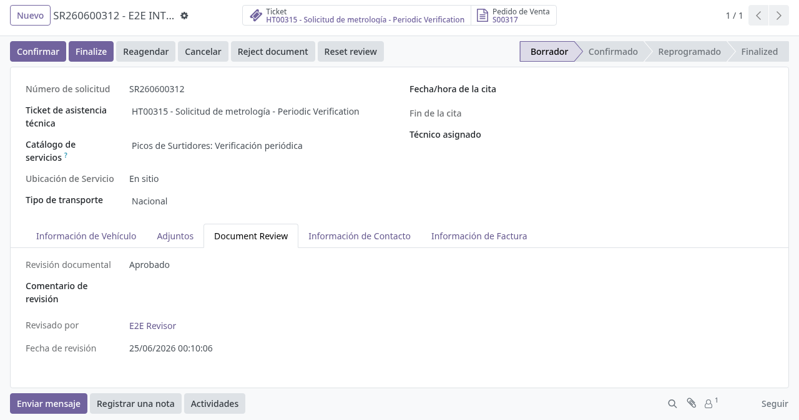
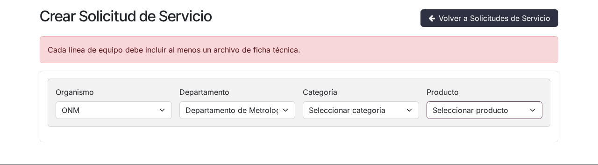
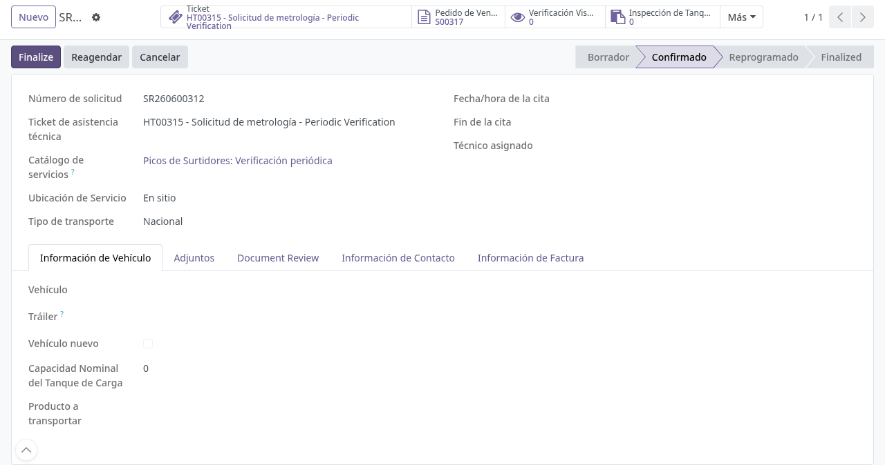

# Gestión de solicitudes de picos de surtidores en backoffice

## Para quién es esta guía

- **Operador INTN** — revisa las líneas de equipo y los adjuntos, y confirma la solicitud. Requiere el grupo de seguridad **Usuario de Cisterna**.
- **Revisor documental** — aprueba u observa la documentación adjunta por el cliente. Requiere el grupo de seguridad **Revisor de documentos INTN**.

## Qué resuelve este proceso

Da seguimiento en Odoo a las solicitudes de metrología de picos de surtidores que el cliente creó desde el portal: revisión de líneas de equipo y fichas técnicas, revisión documental y confirmación del expediente, con la misma mecánica que el resto de servicios INTN. Al crearse una solicitud desde el portal, el sistema genera automáticamente un **ticket de mesa de ayuda**, un **presupuesto de venta** vinculado, un correo de aviso al equipo de Atención al Cliente (si está configurada la casilla) y una publicación en el canal interno de ATC.

## Dónde se trabaja

- Menú **Camiones Tanque → Operaciones → Solicitudes metrología surtidores** (visible para el grupo Usuario de Cisterna).
- La lista muestra: número de solicitud, ticket, tipo de servicio, cliente y estado (con filtros *Enviado*, *Confirmada*, *Cancelada*, y agrupaciones por tipo de servicio, estado o cliente).
- Los catálogos propios de metrología se administran en **Camiones Tanque → Configuración → Metrology** (submenús **Instrument Types**, **Instrument Brands**, **Instrument Models**, **Measure Units** y **Classification Rules**; visibles solo para el grupo **Gestor de Cisternas**).

## Configuración previa

- Usuario interno con el grupo **Usuario de Cisterna** para ver y gestionar las solicitudes.
- Grupo **Revisor de documentos INTN** para poder aprobar, observar o rechazar los adjuntos.
- Catálogo de servicios de metrología cargado. Las filas estándar son: *Picos de Surtidores: Aprobación de modelo*, *Picos de Surtidores: Verificación inicial*, *Picos de Surtidores: Verificación eventual*, *Picos de Surtidores: Verificación periódica* y *Picos de Surtidores: Verificación complementaria*.
- Catálogos de emblemas, marcas, modelos y fabricantes cargados (los usa el cliente al completar cada línea de instrumento).

## Antes de empezar

- El cliente ya creó la solicitud desde el portal, con una línea por equipo (máximo 10 por solicitud) y al menos una ficha técnica por línea, y quedó en estado borrador (*Enviado*).
- La revisión documental de la solicitud arranca en **Pendiente de revisión**.

## Qué se ve en el formulario

- **Cabecera izquierda:** número, tipo de solicitud (fila del catálogo), tipo de servicio (solo lectura), ticket, cliente, fecha declarada y persona de contacto.
- **Cabecera derecha:** pedido de venta vinculado, enlace del portal, dirección, ciudad, departamento, correos y teléfonos que el cliente cargó, y los campos de revisión documental (estado, comentario, revisor y fecha).
- **Pestaña Equipo:** una línea por instrumento con tipo de instrumento, emblema, marca, modelo, número de serie, fabricante, año de fabricación, rango de funcionamiento, número de aprobación de modelo (si tiene), cantidad de picos y las fichas técnicas adjuntas. Mientras la solicitud está en borrador se muestra un aviso recordando que cada línea debe tener al menos una ficha técnica, y las líneas **sin ficha se resaltan en rojo**.
- **Botones superiores:** acceso rápido al **Ticket** y al **Pedido de venta**.

## Pasos por rol

### Revisor documental

1. Abrir la solicitud de metrología que llegó desde el portal, visible en **Camiones Tanque → Operaciones → Solicitudes metrología surtidores**.

2. Revisar los adjuntos y las fichas técnicas de cada línea y decidir con los botones de cabecera:
   - **Aprobar documentación** — deja la revisión en *Aprobado* (no exige comentario).
   - **Observar** — exige escribir antes el **Comentario de revisión**; si falta, el sistema muestra *"Ingrese un comentario de revisión antes de marcar como observado."*.
   - **Rechazar documentación** — también exige el comentario; si falta: *"Ingrese un comentario de revisión antes de rechazar el documento."*.
   - **Restablecer revisión** — vuelve la revisión a *Pendiente de revisión* para un nuevo ciclo.

3. Al observar o rechazar, el sistema **envía automáticamente un correo al cliente** con el comentario y el enlace a su solicitud en el portal, y registra una nota en el chatter (*"Revisión documental actualizada a …"*). El cliente ve la alerta con el comentario en el portal, corrige y reenvía; la revisión vuelve entonces a *Pendiente de revisión*.

   

### Operador INTN

1. Abrir la solicitud de metrología en Odoo y revisar las líneas de equipo y los adjuntos.

2. Si intenta **Confirmar** con datos incompletos, el sistema muestra un mensaje de error y no permite avanzar. Mensajes posibles:
   - *"Cada instrumento debe tener al menos una hoja técnica."* — alguna línea quedó sin ficha técnica.
   - *"Instrumento N: … es obligatorio."* — falta un dato obligatorio en la línea N (tipo de instrumento, emblema, marca, modelo, fabricante, número de serie, rango de funcionamiento o año de fabricación).
   - *"Instrumento N: La cantidad (picos) debe ser al menos 1."*
   - *"Instrument N: Model does not belong to the selected brand."* — el modelo elegido no pertenece a la marca seleccionada.
   - *"Debe agregar al menos un instrumento con sus datos técnicos."* — la solicitud quedó sin líneas (no aplica a aprobación de modelo).
   - Si el control de revisión documental está activo, también bloquea con *"Document review must be approved before confirming (current state: …)"* mientras la documentación no esté **Aprobada**.

   

3. Cuando la documentación esté **aprobada** y cada línea tenga su ficha, pulsar **Confirmar** en la cabecera (visible solo en borrador). Efectos:
   - La solicitud pasa a *Confirmada*.
   - Si el presupuesto de venta vinculado sigue en borrador o enviado, se **confirma automáticamente** como pedido de venta.

   

4. Continuar según el tipo de servicio:
   - **Verificación inicial**: antes de confirmar hay que emitir la **habilitación temporal** (además de la documentación aprobada) y luego seguir la cadena técnica de recepción, clasificación, verificación y devolución (ver [aprobación de modelo y verificación técnica de picos](aprobacion-modelo-picos.md)).
   - **Aprobación de modelo**: confirmar tras la documentación aprobada y seguir la misma cadena técnica (ver [aprobación de modelo y verificación técnica de picos](aprobacion-modelo-picos.md)).
   - **Verificación eventual / periódica / complementaria**: no llevan cadena técnica en el sistema; se confirma la solicitud y se continúa con la facturación y el trabajo de campo.
   - Si el servicio deriva a laboratorio, dar seguimiento según [solicitud de laboratorio METCI](metci-solicitud-laboratorio.md).

5. El cierre del expediente (paso a *Finalizada*) se hace con el botón **Finalizar** de la vista general de solicitudes de servicio, o automáticamente cuando se confirma el certificado vinculado al pedido de venta. En cualquier caso, el sistema bloquea la finalización si:
   - la solicitud está cancelada (*"Cancelled service requests cannot be finalized."*),
   - la documentación no está aprobada (*"The service request cannot be finalized until documentation is approved (current review state: …)"*), o
   - hay facturas de cliente publicadas sin pagar (*"The service request cannot be finalized until all posted customer invoices are paid."*).

   Al finalizar, el cliente recibe un correo de aviso (si la notificación está habilitada). Si después de finalizada la documentación se observa o rechaza, la solicitud **se reabre automáticamente a Confirmada** y queda registrado en el chatter.

## Estados que verá en pantalla

| Estado | Significado | Qué hacer |
|--------|-------------|-----------|
| Borrador (*Enviado* en la lista) | Creada desde el portal, pendiente de revisión | Revisar líneas y documentación, y confirmar |
| Confirmada | En trámite; el pedido de venta quedó confirmado | Continuar con la cadena técnica, laboratorio o trabajo de campo |
| Finalizada | Servicio cerrado | El cliente consulta resultados y documentos |
| Cancelada | No continúa | Registrar el motivo |

Además del estado general, la **revisión documental** tiene su propio estado: *Pendiente de revisión*, *Observado*, *Aprobado* o *Rechazado*.

## Casos especiales

- **Ficha por línea obligatoria:** la solicitud no se confirma si alguna línea de equipo no tiene ficha técnica adjunta. En el portal, mientras la solicitud sigue en borrador, el cliente puede subir la ficha faltante directamente sobre la línea (solo PDF).
- **Aprobación de modelo:** el formulario del cliente no lleva líneas de equipo; sus datos aparecen en una pestaña propia (ver la guía de aprobación de modelo).
- **Verificación inicial:** requiere emitir la habilitación temporal antes de confirmar (ver la guía de aprobación de modelo y verificación técnica).
- **Cancelación desde el portal:** el propio cliente puede cancelar su solicitud mientras está en borrador o confirmada.
- **Cantidad de líneas:** el formulario del portal admite hasta 10 instrumentos por solicitud; para más equipos el cliente debe crear otra solicitud.

## Si algo no funciona

| Problema | Causa habitual | Qué hacer |
|----------|----------------|-----------|
| No deja **Confirmar** | Falta la ficha en alguna línea | El cliente sube la ficha; el operador reintenta |
| No deja **Confirmar** | Documentación no aprobada | El revisor debe **Aprobar documentación** |
| No deja **Confirmar** | Datos incompletos en una línea | Completar el dato indicado en el mensaje ("Instrumento N: …") |
| No deja **Finalizar** | Facturas publicadas sin pagar o revisión no aprobada | Cobrar las facturas / aprobar la documentación |
| El cliente no recibió el aviso de observación | El cliente no tiene correo cargado | Cargar el correo en el contacto; queda nota en el chatter cuando no se pudo enviar |
| No aparece el tipo de servicio | Catálogo sin la fila de metrología | El administrador actualiza el catálogo de servicios |
| El cliente ve el formulario vacío | Usó una URL antigua de metrología | Los enlaces antiguos redirigen a la solicitud unificada; indicarle elegir la categoría **Picos de Surtidores** |

## Guías relacionadas

- Aprobación de modelo y verificación técnica de picos: [aprobacion-modelo-picos.md](aprobacion-modelo-picos.md)
- Solicitud de laboratorio METCI: [metci-solicitud-laboratorio.md](metci-solicitud-laboratorio.md)
- Trámite del cliente en portal: [../../portal/metrologia/solicitud-picos-surtidores.md](../../portal/metrologia/solicitud-picos-surtidores.md)
