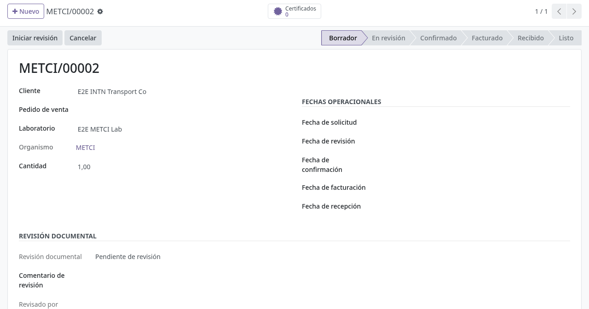
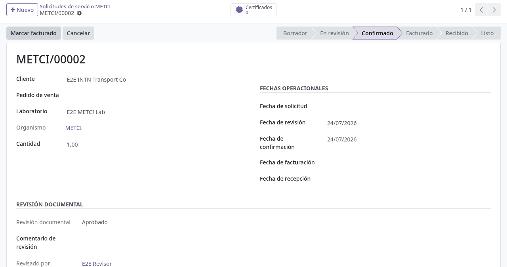
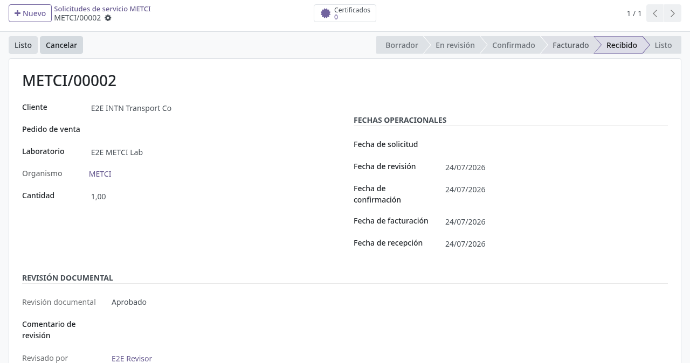
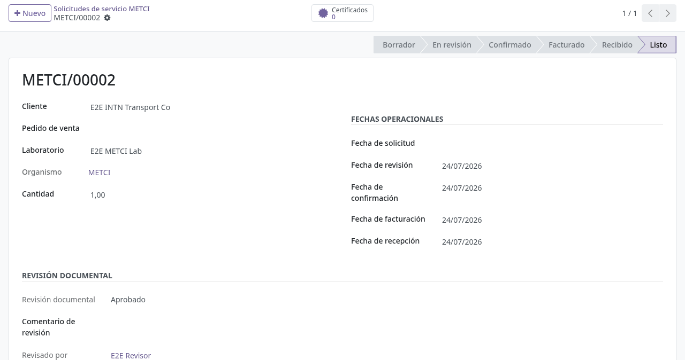
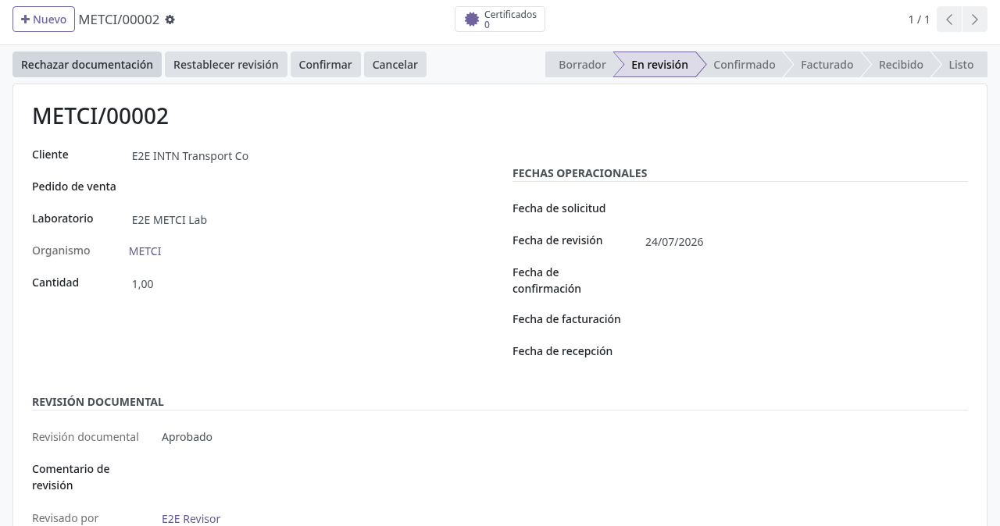

# Solicitud de laboratorio METCI en backoffice

## Para quién es esta guía

- **Usuario de laboratorio METCI** — gestiona las solicitudes en Odoo y avanza sus estados. Requiere el grupo de seguridad **MRP METCI** (o gestor de Fabricación).
- **Revisor documental** — aprueba u observa los adjuntos de la solicitud. Requiere el grupo **Revisor de documentos INTN**.

> El cliente queda **referenciado** en la solicitud; este proceso se gestiona en backend y no tiene un trámite de portal dedicado.

## Qué resuelve este proceso

Gestiona el ciclo de una solicitud de metrología METCI en laboratorio: revisión, confirmación, facturación, recepción de muestras y cierre, con certificados vinculados y fechas operativas por hito.

## Dónde se trabaja

- Menú **METCI → Servicios → Solicitudes de servicio**.
- El mismo menú METCI agrupa además: **Solicitud de Calibración** y **Control de Ingresos** (otros circuitos del laboratorio), la **Configuración** de catálogos (Marcas, Modelos, Instrumentos), la **Tabla operacional** y el **Reporte de solicitudes**.
- La lista de solicitudes muestra referencia, cliente, pedido de venta, laboratorio, organismo, cantidad y fechas; con filtros *Borrador*, *En curso* y *Listo*, filtros por fecha de solicitud/facturación y agrupaciones por laboratorio, estado o mes.

## Configuración previa

- Permiso **MRP METCI** para ver el menú METCI.
- **Laboratorio** definido en el catálogo de organización INTN; el **organismo** de la solicitud se completa solo a partir del laboratorio elegido.
- Grupo de revisión documental para aprobar/observar/rechazar adjuntos.

## Antes de empezar

- Tener identificados el cliente, el laboratorio y (si existe) el pedido de venta a vincular.
- Si el usuario trabaja con **acceso restringido por organismo**, solo podrá crear y ver solicitudes de sus organismos.

## Pasos por rol

### Usuario METCI

1. Crear una **nueva solicitud METCI**. Campos del formulario:
   - **Referencia**: numeración automática con formato `METCI/00001`.
   - **Cliente** (obligatorio), **Pedido de venta**, **Laboratorio** y **Organismo** (solo lectura; se deriva del laboratorio), **Cantidad**.
   - **Fechas operativas**: fecha de solicitud, de revisión, de confirmación, de facturación y de recepción. Las cuatro últimas se completan solas al pulsar cada botón de avance.

   

2. Adjuntar la documentación requerida (por el chatter / adjuntos del registro).

3. Pulsar **Iniciar revisión** (visible solo en borrador). La solicitud pasa a *En revisión*, se registra la fecha de revisión y la revisión documental queda en *Pendiente de revisión* (salvo que ya estuviera aprobada, en cuyo caso se conserva).

4. Con la revisión documental resuelta, pulsar **Confirmar** (visible solo en *En revisión*). La solicitud pasa a *Confirmado* y se registra la fecha de confirmación. Para usuarios con acceso restringido por organismo, el sistema exige laboratorio u organismo definido; si falta, bloquea con *"Set a laboratory or organism before confirming the request."*.

   

5. Pulsar **Marcar facturado** (visible solo en *Confirmado*) cuando ventas emita la factura. Se registra la fecha de facturación.

6. Pulsar **Marcar recibido** (visible solo en *Facturado*) al ingresar las muestras o equipos en laboratorio. Se registra la fecha de recepción.

   

7. Vincular y emitir **certificados** desde el botón superior **Certificados** (muestra el contador). El botón abre la lista de certificados de la solicitud y permite crear nuevos ya vinculados al cliente y al pedido de venta. La pestaña **Certificados** del formulario muestra la lista en solo lectura: número, tipo de certificado, fecha de verificación, estado y resultado.

8. Pulsar **Listo** (visible solo en *Recibido*) cuando el trabajo y los certificados estén completos.

   

9. **Cancelar** está disponible en cualquier estado salvo *Listo* y *Cancelado*. **Restablecer a borrador** solo aparece sobre una solicitud cancelada.

### Revisor documental

1. Abrir la solicitud METCI.

2. Usar los botones de cabecera **Observar**, **Aprobar documentación** o **Rechazar documentación** (observar y rechazar exigen escribir antes el **Comentario de revisión**). **Restablecer revisión** reinicia el ciclo. El estado, comentario, revisor y fecha quedan en el grupo **Document Review** del formulario, y cada cambio deja nota en el chatter.

   

## Estados que verá en pantalla

| Estado | Significado | Qué hacer |
|--------|-------------|-----------|
| Borrador | En captura | Completar datos e **Iniciar revisión** |
| En revisión | Control documental / técnico | Revisor decide; luego **Confirmar** |
| Confirmado | Aceptada para trabajo | **Marcar facturado** |
| Facturado | Cobro registrado | **Marcar recibido** |
| Recibido | Muestras en laboratorio | Ejecutar ensayos y certificados; **Listo** |
| Listo | Cerrada | Archivar |
| Cancelado | Anulada | Solo se puede **Restablecer a borrador** |

## Casos especiales

- El avance de estados sigue un orden fijo: **borrador → en revisión → confirmado → facturado → recibido → listo**; cada botón solo aparece en el estado anterior, no se pueden saltar pasos.
- **Acceso restringido por organismo:** el usuario restringido no puede crear solicitudes fuera de sus organismos (*"You cannot create METCI service requests outside your organisms."*), ni asignar un laboratorio de otro organismo (*"Laboratory does not belong to your organism."*), ni acceder a solicitudes ajenas (*"You are not allowed to access METCI requests from another organism."*). Si tiene un único organismo permitido, se asigna solo al crear.
- **Análisis:** la vista pivote (Análisis operacional METCI) cruza laboratorio, estado y cantidad; la **Tabla operacional** y el **Reporte de solicitudes** del menú generan los reportes del área.

## Si algo no funciona

| Problema | Causa habitual | Qué hacer |
|----------|----------------|-----------|
| No aparece **Confirmar** | La solicitud sigue en borrador | Pulsar antes **Iniciar revisión** |
| No deja **Confirmar** | Usuario restringido sin laboratorio/organismo | Completar el laboratorio (el organismo se deriva solo) |
| No avanza a facturado | Paso omitido | Seguir el orden: confirmado → facturado → recibido |
| Sin certificados | No creados desde la solicitud | Usar el botón **Certificados** para crearlos ya vinculados |
| El usuario no ve el menú METCI | Sin permiso **MRP METCI** | TI asigna el grupo de acceso |
| No puede tocar una solicitud de otro laboratorio | Restricción por organismo | Pedir el cambio al equipo del organismo dueño |

## Guías relacionadas

- Gestión de solicitudes de picos de surtidores: [gestion-solicitudes-picos.md](gestion-solicitudes-picos.md)
- Aprobación de modelo y verificación técnica de picos: [aprobacion-modelo-picos.md](aprobacion-modelo-picos.md)
