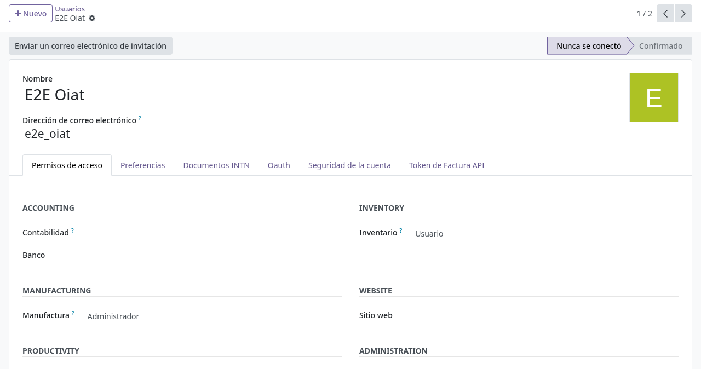
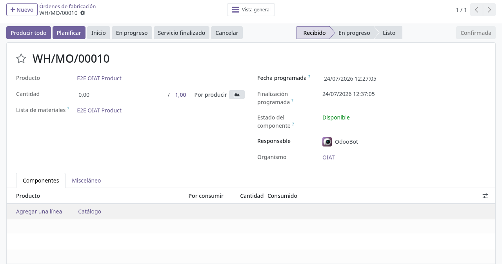
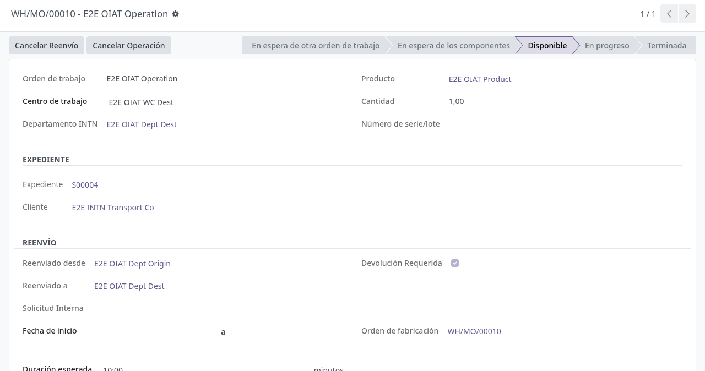
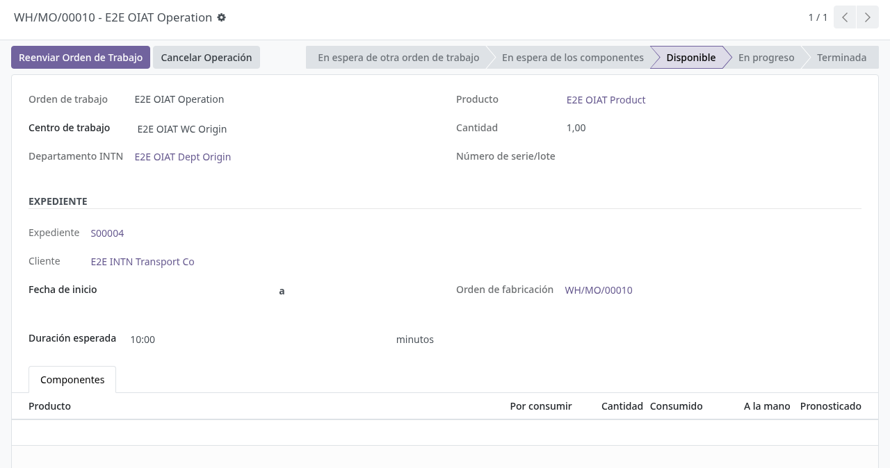
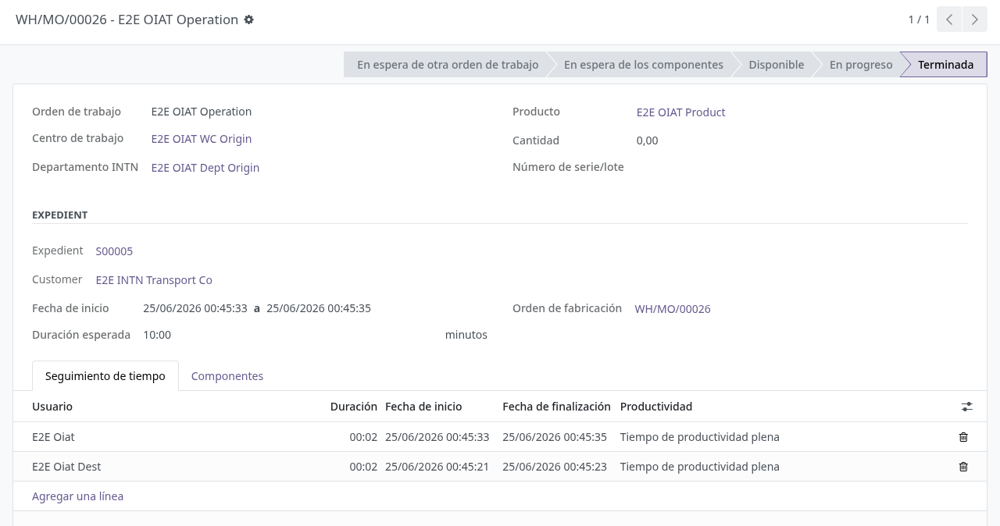

# Acceso por organismo en producción

## Para quién es esta guía

- **Usuario de organismo** (ONI, ONC, ONM, ONN, OIAT, DSE, METCI) — trabaja las órdenes de fabricación de su laboratorio.
- **Responsable de derivación** — reenvía operaciones a otro departamento.
- **Auditor MRP** (grupo *Administrador de Auditoría MRP*) — consulta órdenes de todos los organismos.
- **Administrador** — asigna los organismos y permisos a cada usuario.

## Qué resuelve este proceso

Cada laboratorio u organismo INTN ve **solo sus órdenes de fabricación** y puede **reenviar (derivar)** trabajo a otro departamento con o sin obligación de devolución. Así se aísla la operación de cada organismo dentro del mismo módulo de Fabricación.

## Cómo funciona el aislamiento (en términos funcionales)

- Existe un grupo base **Usuario de Organismo MRP** y un grupo por organismo: **MRP ONI**, **MRP ONC**, **MRP ONM**, **MRP ONN**, **MRP OIAT**, **MRP DSE** y **MRP METCI** (cada uno incluye el grupo base).
- Además del grupo, cada usuario tiene en su ficha la lista de **Organismos de fabricación** a los que pertenece. El filtro real lo hace esa lista: el usuario ve únicamente los registros cuyo campo **Organismo** esté entre sus organismos.
- El aislamiento aplica a: **órdenes de fabricación**, **órdenes de trabajo**, **centros de trabajo**, **desechos** (los desechos sin organismo son visibles para todos) y los **Reportes Estadísticos** de servicios.
- Quien tenga el rol de **administrador de Fabricación** (y por lo tanto el *Administrador de Auditoría MRP*) **ve todo**, sin filtro.
- Cada orden de fabricación toma su **Organismo** automáticamente: del producto (si el servicio tiene organización asignada) o, en su defecto, del único organismo del usuario que la crea. Un usuario restringido no puede crear órdenes fuera de sus organismos ni cambiar el organismo a otro ajeno (mensajes "You cannot create a manufacturing order outside your organisms." y "You are not allowed to access records from another organism.").
- En la orden de fabricación hay además un **estado de servicio** propio con botones **Received**, **In progress** y **Service done**, independiente del estado técnico de la orden, para seguir el servicio de cara al cliente.

## Configuración previa

- Grupo de acceso a **Fabricación** y grupo del **organismo** correspondiente (MRP ONI, MRP OIAT, etc.) por usuario, más su lista de **Organismos de fabricación** (ver rol Administrador).
- Cada departamento INTN con su **Centro de Trabajo de Producción** configurado en la ficha de departamento (imprescindible para reenviar). El centro de trabajo hereda el organismo de la jerarquía INTN; un mismo centro no puede pertenecer a dos organismos.
- En cada **centro de trabajo**, la lista de **Allowed Users** (grupo "Access" del formulario): solo esos usuarios pueden **iniciar** operaciones en ese centro. Si la lista está vacía, no se restringe.
- Grupo **Create Internal Request** para quien use el flujo de solicitud interna.
- Rol *Administrador de Auditoría MRP* para la vista transversal.

## Antes de empezar

- Para reenviar: la operación debe estar en estado **Listo** (Ready) y no estar ya reenviada.
- Las operaciones se ejecutan en orden: no se puede iniciar una operación si las anteriores de la misma orden no están terminadas ("You cannot start a work order while previous operations are not finished.").

## Pasos por rol

### Usuario de organismo

1. Abrir **Fabricación → Órdenes de fabricación**.

2. Ver solo las órdenes de **su organismo** (un usuario OIAT no ve las de ONI, y viceversa). La columna **Organismo** aparece en la lista.

   

3. Abrir la orden y sus **operaciones** (órdenes de trabajo). En la operación se ve el **Departamento INTN** (deducido del centro de trabajo) y el bloque **Expediente** con el pedido y el cliente (oculto para el usuario receptor de una derivación, que no debe ver el expediente ajeno).

   

4. Iniciar la operación (solo usuarios de la lista *Allowed Users* del centro de trabajo; si no, aparece "You are not allowed to start work orders on this work center."), registrar tiempos, cantidades y notas según el procedimiento del laboratorio.

5. Completar los informes del organismo (ver [oiat-informes-certificados.md](oiat-informes-certificados.md) y [oni-informes.md](oni-informes.md)).

### Derivar trabajo a otro departamento

1. Con la operación en estado **Listo**, pulsar **Reenviar Orden de Trabajo** (o **Internal Request** si usa ese flujo). Si la operación no está en Listo aparece "You can only forward a work order in Ready state."; si ya fue reenviada, "This work order is already forwarded.".

2. En el asistente, elegir el **Departamento Destino** (debe tener centro de trabajo configurado; si no, "The target department must have a Production Work Center configured."). Puede anotarse un **Motivo**.

   

3. Dejar marcada **Devolución Requerida** (viene marcada) si el trabajo debe volver al departamento origen al terminar; desmarcarla si debe cerrarse directamente.

4. Confirmar. La operación pasa al centro de trabajo del destino y muestra el bloque **Reenvío** con **Reenviado desde**, **Reenviado a** y si exige devolución.

   

5. El usuario destino inicia y **finaliza** la operación.

6. Al finalizar en destino:
   - con **Devolución Requerida**: la operación vuelve a **Listo** en el centro de trabajo de origen, para que el origen la termine y cierre;
   - sin devolución: la operación vuelve al origen ya **terminada** (queda cerrada automáticamente allí).

   

7. **Cancelar Reenvío** (visible solo con la operación aún en Listo): devuelve la operación al centro de origen si hubo un error. Fuera de Listo aparece "You can only cancel forwarding in Ready state.".

8. **Reenvío masivo:** en la lista de operaciones se pueden seleccionar varias y usar la acción **Forward multiple work orders**. Requisitos: todas en Listo ("You can only forward work orders that have not been started yet."), todas del mismo centro de trabajo ("You can only forward work orders from the same work center.") y ninguna ya reenviada ("One or more work orders are already forwarded."). También existen las acciones masivas **Start work orders** y **Finish work orders**.

### Cancelar una operación

1. Pulsar **Cancelar Operación** (disponible mientras la operación no esté terminada ni cancelada).

2. Completar el **Motivo de Cancelación** (obligatorio) y confirmar: la operación queda cancelada y el motivo registrado. Sobre una operación terminada aparece "A finished or cancelled work order cannot be cancelled.".

### Solicitud interna (alternativa)

1. Pulsar **Internal Request** en la operación en Listo (requiere el grupo *Create Internal Request*).

2. Completar el mismo asistente de reenvío; además del reenvío se genera una **referencia interna** con prefijo `SI-` (p. ej. SI-00001) que queda visible en el bloque Reenvío de la operación.

3. La devolución funciona igual que en el reenvío normal, según la casilla **Devolución Requerida**.

### Administrador

1. En **Ajustes → Usuarios y empresas → Usuarios**, abrir cada operador de laboratorio.

2. En la pestaña de permisos, sección **Organismos de fabricación**, cargar los organismos del usuario (puede tener varios). El campo **Organismo (obsoleto)** es el dato antiguo y solo se mantiene por compatibilidad.

3. En Fabricación, asignar el grupo del organismo (MRP ONI, MRP OIAT, …) que activa el filtro.

4. Guardar. El filtro de órdenes se aplica en el siguiente acceso.

### Auditor MRP

1. Acceder con el usuario auditor (grupo *Administrador de Auditoría MRP*, que incluye administración de Fabricación) para revisar órdenes de **todos** los organismos.

2. Consultar también **Fabricación → Reportes Estadisticos**: tabla dinámica de servicios prestados con fecha, servicio, expediente asociado, organización, departamento ejecutor y **Estado de Pago** (No facturado, Facturado, No pagado, Pagado, Cancelado). Los usuarios de organismo solo ven allí los servicios de sus organismos.

3. No modificar producción salvo política de auditoría.

## Estados que verá en pantalla

| Estado (operación) | Significado | Qué hacer |
|--------------------|-------------|-----------|
| Listo | Puede iniciar o reenviar | Iniciar o reenviar |
| En progreso | Trabajo en curso | Registrar producción |
| Hecho | Terminada | Siguiente operación o cerrar la orden |
| Reenviado (bloque Reenvío visible) | En otro departamento | El usuario destino trabaja |

| Opción en el reenvío | Efecto |
|----------------------|--------|
| Devolución Requerida (marcada) | Al terminar en destino, vuelve a **Listo** en origen |
| Sin devolución | Al terminar en destino, queda **terminada** en origen |

Estado de servicio de la orden de fabricación: **Received → In progress → Done** (botones *Received*, *In progress* y *Service done*).

## Casos especiales

- **DSE en producción:** el organismo DSE cuenta con el grupo **MRP DSE** para el aislamiento y un registro básico de inspecciones (ver [dse-inspecciones.md](dse-inspecciones.md)).
- **Centros de trabajo compartidos:** no es posible; cada centro pertenece a un solo organismo ("Work center … is already assigned to organism …" si se intenta vincularlo a otro).
- **Usuarios con varios organismos:** ven y pueden trabajar las órdenes de todos sus organismos; al crear una orden sin producto con organización, el organismo solo se completa solo si el usuario tiene uno único.

## Si algo no funciona

| Problema | Mensaje / causa | Qué hacer |
|----------|-----------------|-----------|
| No ve ninguna orden | Sin organismos en la ficha de usuario | El administrador carga los **Organismos de fabricación** |
| Ve órdenes de otro laboratorio | Organismos o grupo incorrectos | Corregir organismos y grupo del usuario |
| No puede crear una orden | "You cannot create a manufacturing order outside your organisms." | Verificar organismo del producto y del usuario |
| No puede cambiar el organismo de la orden | "You are not allowed to access records from another organism." | Solo un administrador puede reasignarla |
| No puede iniciar la operación | "You are not allowed to start work orders on this work center." | Agregarlo a *Allowed Users* del centro de trabajo |
| No puede iniciar por orden previa | "You cannot start a work order while previous operations are not finished." | Terminar antes las operaciones anteriores |
| No puede reenviar | "You can only forward a work order in Ready state." / "The target department must have a Production Work Center configured." / "The current work center is not mapped to an INTN department; cannot forward." | Poner la operación en Listo y configurar el centro de trabajo del departamento |
| La operación no vuelve a origen | No quedó marcada **Devolución Requerida** | Cancelar el reenvío si aún está en Listo; si no, reprocesar |
| No puede cancelar el reenvío | "You can only cancel forwarding in Ready state." / "The source department is missing a Production Work Center; cannot revert." | Cancelar antes de que inicien el trabajo; revisar el centro del departamento origen |
| El botón **Internal Request** está oculto | Sin el grupo *Create Internal Request* | TI asigna el grupo correspondiente |

## Guías relacionadas

- [Informes y certificados OIAT](oiat-informes-certificados.md)
- [Informes ONI](oni-informes.md)
- [Inspecciones DSE](dse-inspecciones.md)
- Solicitud de laboratorio METCI: [../metrologia/metci-solicitud-laboratorio.md](../metrologia/metci-solicitud-laboratorio.md)
