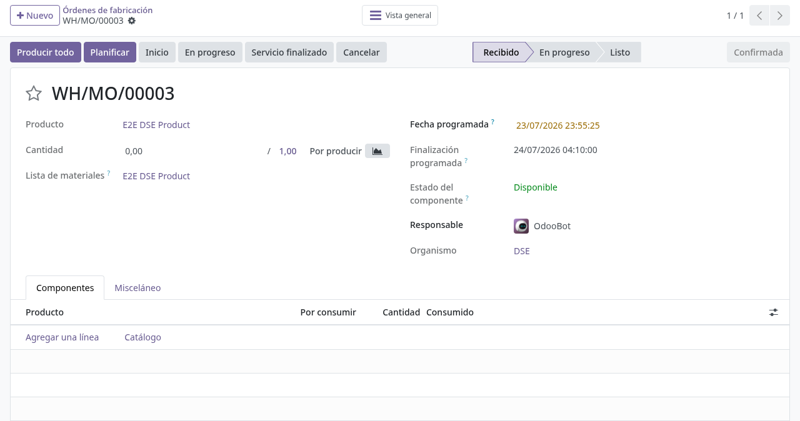
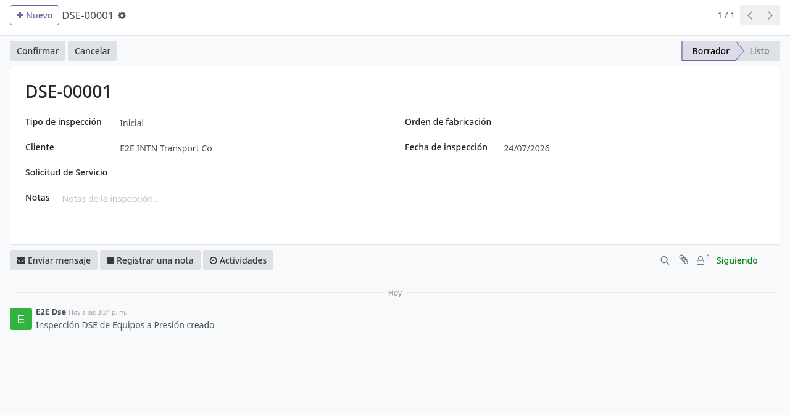
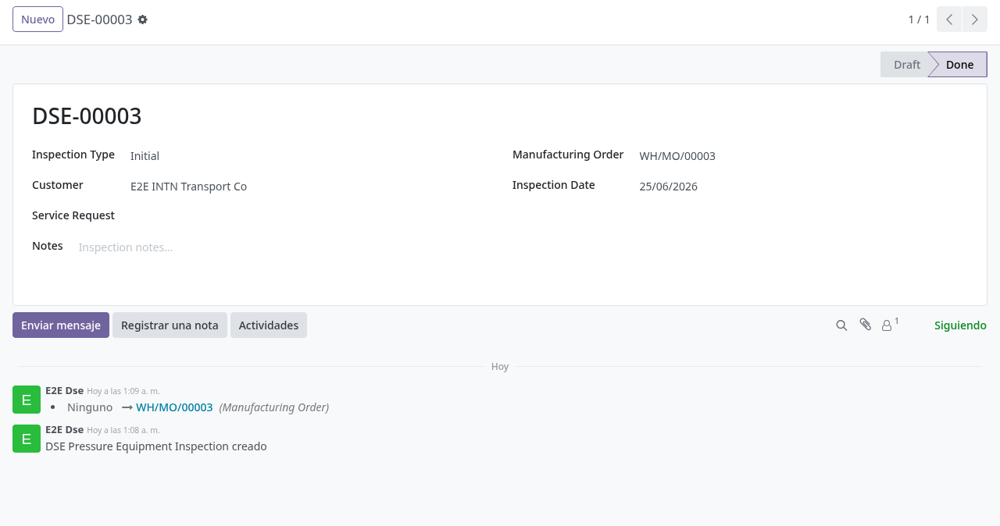

# Inspecciones DSE

## Para quién es esta guía

- **Inspector DSE** (grupo *DSE Inspector*) y **jefe DSE** — registran inspecciones de equipos a presión.
- **ATC** — apoya la apertura de expedientes y el seguimiento del cliente.

## Qué resuelve este proceso

Registra las inspecciones **iniciales** e **intermedias** de equipos a presión del organismo DSE y su constancia en PDF. **El alcance actual es parcial**: el sistema guarda la ficha de la inspección (tipo, cliente, fechas, vínculos y notas) y su ciclo borrador → confirmada, pero **no** captura todavía el detalle técnico del equipo ni emite el informe técnico completo al cliente; ese contenido sigue en los procedimientos en papel/planilla del organismo hasta el cutover.

## Dónde está en el menú

Dentro de la aplicación **Fabricación** aparece el menú **DSE Inspections**, visible solo para usuarios con el grupo **MRP DSE** (las etiquetas de esta sección se muestran hoy en inglés).

## Configuración previa

- Grupo del **organismo DSE** (**MRP DSE**) para ver el menú y para el aislamiento por organismo en Fabricación (ver [acceso-organismos.md](acceso-organismos.md)); grupo *DSE Inspector* para el personal inspector.
- Numerador de inspecciones (viene configurado): las inspecciones se numeran automáticamente `DSE-00001`, `DSE-00002`, …
- Procedimientos en papel/planilla vigentes para el contenido técnico hasta la migración.

## Antes de empezar

- Expediente y contacto gestionados por los flujos de [registro y aprobación de cuentas](../registro-documentos/aprobacion-cuentas-atc.md) y [expedientes y convenios de ventas](../ventas-caja/expedientes-ventas-convenios.md).
- Para **confirmar** una inspección es obligatorio tener vinculada la **orden de fabricación** del servicio; la inspección puede crearse antes, pero sin orden no se confirma.

## Pasos por rol

### Inspector DSE

1. Coordinar con ATC la apertura del expediente si aplica. Las órdenes de fabricación del organismo DSE se ven filtradas por organismo.

   

2. Abrir **Fabricación → DSE Inspections** y crear la inspección. Nace en **Borrador** (Draft) y al guardar recibe su número `DSE-…`. Completar:
   - **Tipo de inspección**: *Initial* (inicial) o *Intermediate* (intermedia) — obligatorio.
   - **Cliente** — obligatorio.
   - **Fecha de inspección** — obligatoria (viene con el día actual).
   - **Solicitud de servicio** y **Orden de fabricación** — vínculos opcionales en borrador; la orden es necesaria para confirmar.
   - **Notas** — texto libre con las observaciones de la visita.

   

3. Registrar el detalle técnico de la inspección en las herramientas actuales (Excel / guía DSE) hasta la migración.

4. Pulsar **Confirm** para cerrar la edición: la inspección pasa a **Done** (Confirmada). Si falta la orden de fabricación aparece "A manufacturing order is required to confirm the inspection.".

   

5. Imprimir la constancia con **DSE Inspection Report** (PDF) desde el menú de impresión.

6. Si la inspección se creó por error, usar **Cancel** (solo visible en Borrador): pasa a **Cancelled**. Desde Cancelled, **Reset to Draft** la reabre.

### Seguimiento desde la orden de fabricación

- La orden de fabricación muestra un botón inteligente **DSE Inspections** con la cantidad de inspecciones vinculadas; desde allí se listan y se pueden crear nuevas ya vinculadas a esa orden y a su cliente.
- La solicitud de servicio del cliente también queda vinculada a sus inspecciones DSE.

## Estados que verá en pantalla

| Estado | Significado | Qué hacer |
|--------|-------------|-----------|
| Draft (Borrador) | Inspección editable | Completar los datos y vincular la orden de fabricación |
| Done (Confirmada) | Edición cerrada | Imprimir la constancia PDF; el informe técnico sigue el procedimiento manual |
| Cancelled (Cancelada) | Sin efecto | **Reset to Draft** si debe reabrirse |

## Casos especiales

- **Alcance parcial:** el registro digital cubre la ficha y trazabilidad de la inspección (número, tipo, cliente, fechas, orden, solicitud y notas). El contenido técnico del equipo y el informe al cliente completo siguen fuera de Odoo hasta el cutover.
- **Sin niveles de aprobación:** a diferencia de OIAT/ONI, la inspección DSE no tiene aprobación escalonada; el mismo perfil confirma.

## Si algo no funciona

| Problema | Mensaje / causa | Qué hacer |
|----------|-----------------|-----------|
| No hay menú **DSE Inspections** | El usuario no tiene el grupo **MRP DSE** | TI asigna el grupo del organismo DSE |
| No deja confirmar | "A manufacturing order is required to confirm the inspection." | Vincular la orden de fabricación del servicio |
| No ve las órdenes DSE | Organismo no asignado al usuario | Ver [acceso-organismos.md](acceso-organismos.md) |

## Guías relacionadas

- [Acceso por organismo en producción](acceso-organismos.md)
- [Solicitud de servicio unificada](../registro-documentos/solicitud-servicio-unificada.md)
