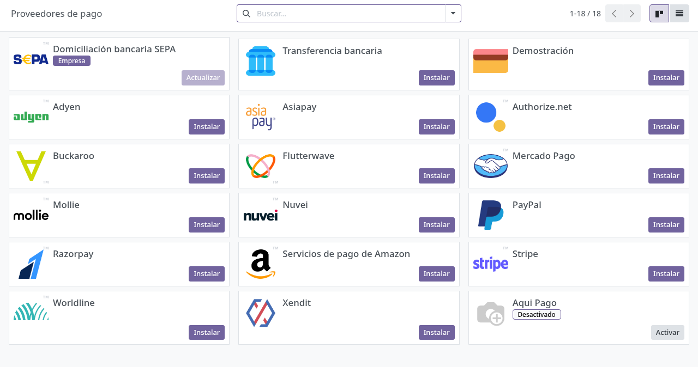
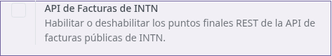

# Integraciones de sistemas (guía TI)

## Para quién es esta guía

- **Soporte TI y administradores Odoo** — configuran parámetros, tareas programadas y credenciales.
- **Responsables de integración** con DNIT (SIFEN), pasarela de pagos y aplicaciones de campo.
- **Proveedor externo** — app de básculas / precintos offline.

## Qué resuelve este proceso

Lista las conexiones externas que afectan a varios trámites (pagos, factura electrónica, consulta y pago de facturas por API, precintado offline) para planificar el despliegue y el soporte. Es una guía técnica, no de usuario final.

## Integraciones implementadas y su configuración real

### 1. Factura electrónica SIFEN (localización Paraguay)

- **Dónde se configura:** Contabilidad → Ajustes → bloque **Electronic Invoicing (Paraguay)**, con tres casillas: **Production**, **Test** y **Do Not Send to SIFEN**. Las mismas casillas están en la ficha de la compañía, pestaña **Electronic Invoicing**.
  - *Production / Test*: seleccionan el ambiente contra el cual se transmite.
  - *Do Not Send to SIFEN*: emite el documento sin transmitir (útil en desarrollo/contingencia).
- **Qué hace:** cada factura tiene el botón **Submit to SIFEN** y una pestaña **Electronic Invoice** con el **CDC** (código de control), el **QR e-kuatia**, el campo **Estado e-Invoice** y el estado del envío.
- **Estados SIFEN de la factura:** *Draft* → *Pending submission* → *Sent to SIFEN* → *Approved* o *Rejected*. El detalle del rechazo queda en **SIFEN Last Error**.
- **Cómo verificar:** emitir una factura de prueba en el ambiente Test, pulsar **Submit to SIFEN** y comprobar que quede en *Approved* con CDC y QR cargados.

### 2. Pasarela de pagos PagoPar

- **Dónde se configura:** el proveedor de pago **PagoPar** en la configuración de proveedores de pago (Ajustes → apartado de pagos). Campos propios:
  - **PagoPar Public Key** y **PagoPar Private Key** (visibles solo para administradores del sistema);
  - **PagoPar Payment Method Code** y **PagoPar Commission Percent**;
  - **Show on Invoices**: ofrece PagoPar como opción de pago de facturas en los flujos del portal INTN.

   

- **Métodos de pago instalados:** PIX, QR, Zimple, Credit Cards, Tigo Money, Bank Transfer, Personal Wallet, Mobile Payment, Wally, Claro Money, Wepa, Aqui Pago, Pago Express e Infonet Collections (todos "… - PagoPar").
- **Tareas programadas (vienen desactivadas; activarlas al pasar a producción):**
  - **Refresh PagoPar Commissions** (diaria): actualiza el porcentaje de comisión de cada método consultando a PagoPar con las claves cargadas.
  - **Rotate PagoPar Cashier Session** (diaria): rota la sesión de caja asociada a la caja PagoPar (los diarios/cajas PagoPar se marcan con la casilla **PagoPar Journal** / caja PagoPar).
- **Cómo funciona el circuito:** PagoPar notifica los pagos a Odoo por un aviso automático (webhook) y el cliente vuelve del pago a la vista portal de su factura. Cada aviso recibido queda registrado en el **PagoPar Notification Log** (fecha, factura, transacción, contenido y resultado *Success*/*Error*), que es el primer lugar a revisar ante un pago no aplicado.
- **Transferencia bancaria manual:** el cliente puede subir desde el portal el **comprobante de transferencia** de su factura; en la factura aparece la pestaña **Transfer Receipt** con la imagen, la fecha de subida y su estado (*Pending* → *Approved* / *Rejected* con los botones **Approve Transfer Receipt** y **Reject Transfer Receipt**).
- **Cómo verificar:** hacer un pago de prueba y comprobar que la transacción quede confirmada, que la factura pase a pagada y que el aviso figure como *Success* en el registro de notificaciones.

### 3. API de facturas INTN (consulta y pago por RUC)

- **Dónde se configura:** Contabilidad → Ajustes → bloque **INTN** → casilla **INTN Invoices API** ("Enable or disable the public INTN invoices REST API endpoints"). La casilla guarda la clave de configuración `intn_api_invoices.api_enabled`.

   

- **Credenciales:** cada sistema consumidor usa el token de un usuario Odoo. En la ficha del usuario, pestaña **API Invoice Token**, el botón **Generate Token** genera el **API Token** que el consumidor envía en la cabecera `Authorization`.
- **Qué ofrece:** consulta de facturas pendientes por RUC (el RUC se envía **sin guiones y sin dígito verificador**; el dígito se calcula solo), consulta de una factura puntual y registro del pago de una factura (validando RUC, moneda y monto, con mora opcional).
- **Respuestas de error reales:** "API deshabilitada", "Token no valido", "Envie el RUC sin guiones y sin digito verificador", "Faltan campos requeridos", "Factura no encontrada", "El RUC no corresponde a la factura", "La moneda no coincide con la factura", "El monto de factura no coincide", "Invoice not found", "No bank/cash journal found to register the payment.".
- **Cómo verificar:** con la casilla activada y un token generado, consultar el RUC de un cliente con facturas pendientes y comprobar que la lista responda; con la casilla desactivada debe responder "API deshabilitada".

### 4. App offline de precintos (proveedor externo)

- Coordinar la sincronización de la **app offline de precintos** con las operaciones de precintado; validar la sincronización en ambiente de prueba antes de operar en producción.

## Configuración previa

- Credenciales y ambientes de prueba acordados con INTN (claves PagoPar, certificado y datos SIFEN, tokens de API).
- Módulo de localización y facturación disponible para **SIFEN**, junto con contabilidad (ver [contabilidad, caja y pagos](../ventas-caja/contabilidad-caja-pagos.md)).

## Antes de empezar

- No activar pasarelas ni integraciones en producción sin una prueba previa en el ambiente `e2e_intn`.
- Las claves privadas (PagoPar, tokens) solo deben quedar en manos de administradores; el campo de clave privada se muestra oculto.

## Pasos por rol

### Administrador

1. Verificar el módulo de localización y facturación para **SIFEN** con contabilidad y marcar el ambiente correcto (**Production** / **Test** / **Do Not Send to SIFEN**).

2. Configurar el proveedor de pago **PagoPar**: claves pública y privada, casilla **Show on Invoices**, y activar las dos tareas programadas de PagoPar cuando pase a producción.

3. Activar la casilla **INTN Invoices API** solo cuando el sistema consumidor esté listo, y generar el **API Token** del usuario de integración (pestaña **API Invoice Token** del usuario).

4. Coordinar la sincronización de la **app offline de precintos** con las operaciones de precintado.

5. No activar pasarelas en producción sin la prueba previa en `e2e_intn`.

## Estados que verá en pantalla

Las integraciones no tienen un estado propio en una única pantalla; su efecto se observa en los documentos de cada trámite:

| Dónde mirar | Estado |
|-------------|--------|
| Factura, pestaña **Electronic Invoice** | SIFEN: *Draft / Pending submission / Sent to SIFEN / Approved / Rejected* + **SIFEN Last Error** |
| **PagoPar Notification Log** | Cada aviso de pago: *Success* / *Error* con su contenido |
| Factura, pestaña **Transfer Receipt** | Comprobante del portal: *Pending / Approved / Rejected* |
| Ficha del usuario, **API Invoice Token** | Token vigente del consumidor de la API |

## Casos especiales

- **Pago desde el portal:** mientras la pasarela no esté activa, el cliente completa el pago por el flujo manual de contabilidad (incluido el comprobante de transferencia subido desde el portal, que caja aprueba o rechaza).
- **Precintado offline:** la app de campo sincroniza con Odoo; validar la sincronización antes de operar en producción.
- **API apagada por defecto:** los endpoints responden "API deshabilitada" hasta activar la casilla; es la posición segura mientras no haya consumidor.

## Si algo no funciona

| Problema | Causa habitual | Qué hacer |
|----------|----------------|-----------|
| Factura electrónica rechazada | Certificado o datos SIFEN | Revisar **SIFEN Last Error** en la factura y los datos SIFEN con contabilidad |
| El pago del portal no redirige | Integración de pasarela pendiente o claves PagoPar mal cargadas | Usar el flujo manual (ver [contabilidad, caja y pagos](../ventas-caja/contabilidad-caja-pagos.md)); revisar claves y el **PagoPar Notification Log** |
| Pago PagoPar acreditado pero factura impaga | Aviso con resultado *Error* | Revisar el registro de notificaciones y reprocesar según su detalle |
| La API responde "API deshabilitada" | Casilla **INTN Invoices API** apagada | Activarla en Contabilidad → Ajustes → INTN |
| La API responde "Token no valido" | Token ausente o vencido | Regenerar el **API Token** del usuario de integración y actualizar el consumidor |
| Comisiones PagoPar desactualizadas | Tarea **Refresh PagoPar Commissions** desactivada | Activar la tarea programada diaria |

## Guías relacionadas

- [Contabilidad, caja y pagos](../ventas-caja/contabilidad-caja-pagos.md)
- [Registro y aprobación de cuentas ATC](../registro-documentos/aprobacion-cuentas-atc.md)
