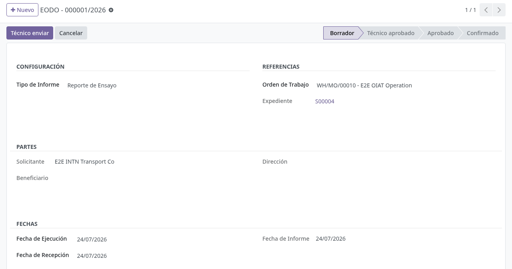
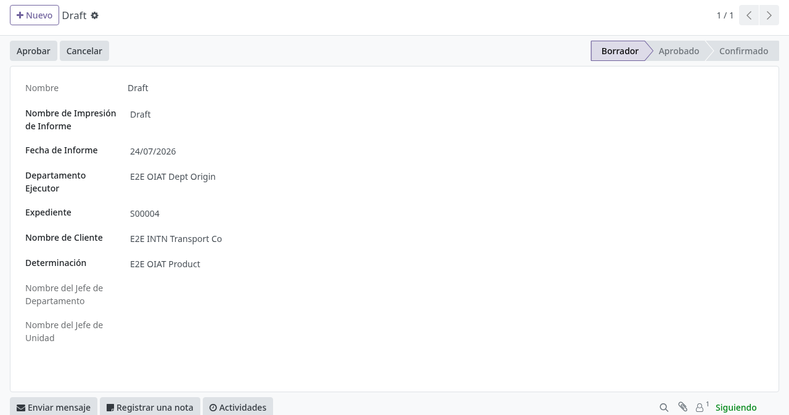
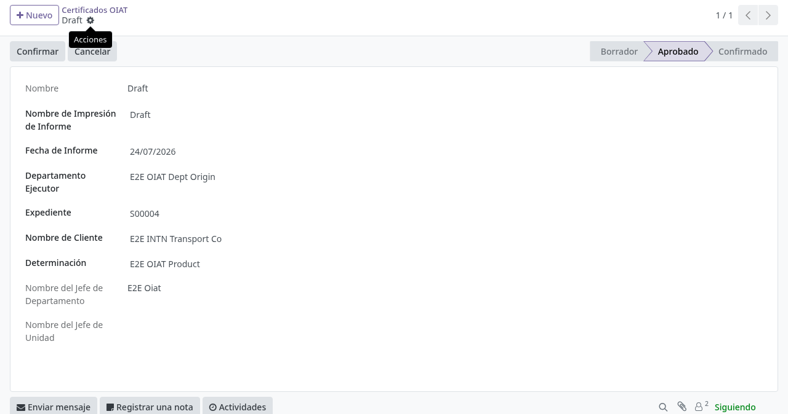
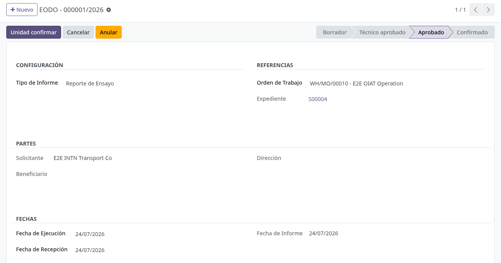
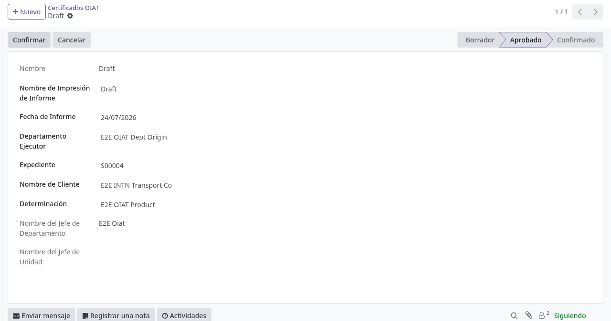

# Informes y certificados OIAT

## Para quién es esta guía

- **Técnico OIAT** (grupo *Técnico de Laboratorio OIAT*) — elabora los informes de laboratorio y los envía a aprobación.
- **Jefe de departamento** (grupo *Jefe de Departamento OIAT*) — aprueba el informe a nivel departamento; también puede cancelar, reabrir y anular.
- **Jefe de unidad** (grupo *Jefe de Unidad OIAT*) — da la confirmación final del informe (asigna el número oficial) y confirma el certificado.
- **Aprobador de certificado OIAT** (grupo *Aprobador de Certificado OIAT*) — aprueba el certificado final (rol distinto del que lo elabora).

## Qué resuelve este proceso

Emite informes y certificados del laboratorio OIAT con **segregación de funciones**: quien elabora el informe no es quien aprueba ni confirma. Todo informe pasa por **tres escalones**: el técnico envía, el jefe de departamento aprueba y el jefe de unidad confirma; recién en la confirmación se asigna el número oficial del documento. El certificado tiene su propio circuito: lo aprueba el *Aprobador de Certificado OIAT* y lo confirma el *Jefe de Unidad OIAT*.

## Dónde está en el menú

Dentro de la aplicación **Fabricación** aparece el menú **OIAT** (visible solo para los cuatro roles OIAT), con estas opciones:

| Menú | Contenido | Quién lo ve |
|------|-----------|-------------|
| OIAT → **Informes** | Informes de ensayo y técnicos | Los cuatro roles OIAT |
| OIAT → **Certificados** | Certificados OIAT | Los cuatro roles OIAT |
| OIAT → **Informes de Combustible** | Informes del laboratorio de combustibles | Los cuatro roles OIAT |
| OIAT → **Versiones de Informe** | Versiones de plantilla del informe | Solo *Jefe de Unidad OIAT* |
| OIAT → **Configuración ONA** | Logo ONA que se imprime en los informes | Solo *Jefe de Unidad OIAT* |

## Configuración previa

- Asignar los grupos OIAT según el rol: *Técnico de Laboratorio OIAT*, *Jefe de Departamento OIAT*, *Jefe de Unidad OIAT*, *Aprobador de Certificado OIAT*.
- En la ficha de cada **departamento INTN** ejecutante debe estar cargado:
  - el **Código de Secuencia de Laboratorio** (código corto, p. ej. AGRO), que determina qué numerador se usa;
  - la lista de **Técnicos de Laboratorio** del departamento: solo esos usuarios pueden enviar informes de ese departamento;
  - la **abreviatura** del departamento, que se antepone al número del informe. Solo el grupo *OIAT change the abbreviation of the correlative* puede modificarla; si se deja vacía se genera sola (con las iniciales del nombre).
- Deben existir los **numeradores** de informe (uno para ensayo y otro para técnico por cada código de departamento) y el numerador de certificados. Vienen creados los genéricos "GEN" y el de certificado.
- El producto/servicio ensayado debe tener asignado su **departamento ejecutor**; de ahí el informe deduce el departamento.
- Cada usuario debe tener asignado el **organismo OIAT** para ver solo sus órdenes (ver [acceso-organismos.md](acceso-organismos.md)).

## Antes de empezar

- El informe estándar nace de una **orden de trabajo** de Fabricación: al elegirla, el sistema completa solo el expediente, el cliente, la dirección y el departamento.
- Un informe **no interno** exige tener expediente (pedido de venta) vinculado; si la orden de trabajo no tiene expediente, el envío a aprobación se bloquea.
- Por cada orden de trabajo solo puede existir **un informe de cada tipo** (ensayo, ensayo parcial, técnico, técnico parcial).
- Los **informes de combustible** no parten de una orden de trabajo: se crean directo desde el **expediente** y una **Línea de Determinación** de ese expediente.

## Pasos por rol

### Recepción y confirmación de la solicitud

Antes de que exista una orden de trabajo, el trámite nace como una **solicitud de servicio** (categoría **OIAT**) que el cliente crea desde el portal: "Solicitud de muestra de alimentos" u otro tipo de muestra, o el catálogo de **Combustibles y Lubricantes** (ver diferencias en [Informes de combustible](#informes-de-combustible) más abajo). Al crearse, el sistema arma solo el ticket de Helpdesk, la solicitud y el pedido de venta (expediente); ese motor común está documentado en [Solicitud de servicio unificada](../registro-documentos/solicitud-servicio-unificada.md) y [Revisión documental transversal](../registro-documentos/revision-documental.md). Aquí se detalla solo lo propio de OIAT.

1. **Dónde encontrar la solicitud entrante:** hoy OIAT no tiene un menú propio en Fabricación para listar estas solicitudes (a diferencia de "Camiones Tanque → Solicitudes de Servicio" de flota/metrología). Dos accesos reales:
   - El aviso que se publica al crearse la solicitud en el canal de Discuss **Atención al Cliente (ATC)** incluye un enlace **"Open request"** que abre directo el formulario de la solicitud. A diferencia de flota/metrología, OIAT y ONI no tienen plantilla de correo propia para este aviso: solo llega por Discuss, sin correo adicional a bandejas de ATC.
   - Abrir el **ticket de Helpdesk** del cliente (creado junto con la solicitud) y pulsar el botón inteligente **Solicitudes de Servicio** en su cabecera: abre la lista de solicitudes vinculadas a ese ticket.

2. **Qué revisar:** el tipo de muestra, la cantidad y la determinación/servicio elegido, y los archivos que el cliente adjuntó a la solicitud o al ticket. OIAT no define una lista fija de documentos obligatorios (a diferencia de flota): se revisa lo que el cliente haya adjuntado.

3. **Revisión documental (si aplica):** con el grupo *Revisor de documentos INTN*, usar **Observar**, **Aprobar documentación**, **Rechazar documentación** o **Restablecer revisión** en la cabecera de la solicitud (el comentario de revisión es obligatorio para observar o rechazar). Si en **Ajustes → Ventas** está activa *Exigir documentación aprobada antes de confirmar*, la solicitud no podrá confirmarse mientras el estado de revisión no sea **Aprobado** (ver [Revisión documental transversal](../registro-documentos/revision-documental.md)).

4. **Confirmar:** pulsar **Confirmar** (visible solo en Borrador). El sistema, en este orden:
   - crea o reutiliza el pedido de venta (expediente);
   - bloquea con *"Document review must be approved before confirming (current state: …)"* si la revisión documental no está aprobada y la exigencia está activa;
   - bloquea con *"Cannot confirm the service request: no commercial partner is set. Link a helpdesk ticket with a customer or set a beneficiary."* si no hay cliente comercial vinculado;
   - bloquea con *"Cannot confirm the service request: no sale order line could be built. Check the service catalog and product configuration for …"* o *"No pricing rule matches this request. Contact support."* si el catálogo o el producto no está bien configurado;
   - confirma el pedido de venta si estaba en presupuesto o presupuesto enviado, y pasa la solicitud a **Confirmado**.

5. **Qué queda listo para el resto de esta guía:** confirmar la solicitud deja el **expediente (pedido de venta)** confirmado, pero **no crea sola** la orden de fabricación ni la orden de trabajo del laboratorio. Esa orden se carga en Fabricación como cualquier orden de fabricación, y queda enganchada al expediente cuando su campo **Origen** coincide con el número del pedido de venta (o cuando la orden nace de una línea de ese pedido bajo una ruta de fabricación). Recién con ese enganche, al elegir esa orden de trabajo en el informe (paso 2 del rol *Técnico OIAT* debajo), el sistema completa solo el expediente, el cliente y la dirección; si no quedó enganchada, esos datos no se autocompletan.

### Técnico OIAT

1. Abrir **Fabricación → OIAT → Informes** y crear el informe. El registro nace en **Borrador**.

   

2. Completar los campos obligatorios:
   - **Tipo de informe**: *Reporte de Ensayo*, *Informe Técnico*, *Informe Técnico Parcial* o *Informe de Ensayo Parcial* (el tipo define qué numerador se usará).
   - **Orden de Trabajo**: al elegirla se completan solos el **Expediente**, el solicitante, el beneficiario, la dirección y el departamento ejecutor.
   - **Fecha de ejecución** y **fecha de recepción** (la fecha de informe se carga sola con el día actual).

   El nombre del cliente y su dirección se toman solos del expediente al elegir la orden de trabajo; si la orden no tiene expediente con cliente, el guardado fallará por datos obligatorios del cliente.

3. Redactar el contenido en la pestaña **Cuerpos**: cuatro bloques de texto libre (Descripción 1 a 4). El bloque 3 trae el título "Abreviaturas" y el bloque 4 el título "Notas". La **versión** de plantilla se asigna sola con la última versión registrada.

4. Enviar a aprobación con el botón **Técnico enviar** (solo visible en Borrador y para técnicos). El sistema verifica que el usuario figure como **técnico de laboratorio del departamento** ejecutor y registra su nombre como responsable. El informe pasa a **Técnico aprobado**.

5. Tras las aprobaciones del jefe de departamento y del jefe de unidad, crear el **certificado OIAT** en **Fabricación → OIAT → Certificados** cuando el trámite lo requiera (ver rol Aprobador de certificado). El certificado queda en Borrador.

   

6. No pulsar los botones de aprobación sin el rol correspondiente: el sistema los rechaza con el mensaje "You do not have permission to perform this action.".

7. Una vez confirmado el documento, imprimirlo con el menú de impresión: **Informe OIAT (PDF)** o **Certificado OIAT (PDF)**.

   

### Jefe de departamento

1. Revisar los informes en estado **Técnico aprobado** (filtro *Under review* de la vista de informes).

2. Pulsar **Aprobar Departamento** (solo visible en ese estado y para jefes de departamento). El informe pasa a **Aprobado**, se registra el nombre del jefe y el **cliente del expediente queda suscrito** al documento (recibirá las novedades del chatter).

   

3. Si requiere correcciones, usar **Cancelar** (disponible en Borrador, Técnico aprobado y Aprobado): el informe pasa a **Cancelado** y se borran los nombres de los responsables. Con **Volver a borrador** (solo desde Cancelado) el técnico puede corregir y reenviar.

4. Si un informe ya aprobado o confirmado debe dejarse sin efecto, completar primero el **Motivo de anulación** y pulsar **Anular**. Si falta el motivo aparece "Provide the void reason before voiding.". El informe pasa a **Anulado**, su nombre de impresión queda con el prefijo "V" y se libera la orden de trabajo para poder emitir un informe nuevo del mismo tipo.

### Jefe de unidad

1. Revisar los informes en estado **Aprobado**.

2. Pulsar **Unidad confirmar**. En ese momento el sistema:
   - asigna el **número oficial**: abreviatura del departamento + correlativo del numerador del departamento (p. ej. `AGRO - 000123/2026`), usando el numerador de ensayo o el técnico según el tipo;
   - fija como **nombre de impresión** la **Entrada de Laboratorio** de la orden de trabajo (el código de entrada asignado al crearse la orden);
   - registra el nombre del jefe de unidad y deja el informe en **Confirmado**.

3. Si el numerador del departamento no existe, aparece "No ir.sequence found for code … Configure sequences.": pedir a TI que cree el numerador para ese código de departamento.

### Aprobador de certificado

1. Abrir el **certificado OIAT** en Borrador. Campos obligatorios: **Departamento ejecutor** y **Expediente**. Al elegir el expediente se completan solos el cliente, el departamento y la **determinación** (la lista de servicios del expediente unida con "y").

2. En el cuerpo del certificado se pueden usar los comodines `$solicitud`, `$solicitante`, `$determinacion` y `$departamento`: al guardar se reemplazan por el número de expediente, el cliente, la determinación y el departamento.

3. Verificar la coherencia con el informe confirmado y pulsar **Aprobar** (solo este rol ve el botón). El certificado pasa a **Aprobado** y el cliente del expediente queda suscrito al documento.

   

4. El **Jefe de Unidad OIAT** pulsa luego **Confirmar**: se asigna el número oficial con el numerador de certificados y el documento queda en **Confirmado**. Si el numerador falta, aparece "Certificate sequence is not configured.".

5. **Cancelar** (visible en Borrador y Aprobado) devuelve el certificado a Borrador y borra los responsables registrados.

## Informes de combustible

### Recepción: en qué se diferencia de una muestra OIAT normal

La solicitud de **Combustibles y Lubricantes** (variantes *Normal*, *MIC* y *Barcazas*) sigue la misma recepción y confirmación descrita arriba (mismo motor de solicitud, misma revisión documental, mismo botón **Confirmar** y los mismos bloqueos), pero el portal exige datos adicionales por cada servicio y bloquea la creación si faltan:

- **Número de solicitud VUI**, **número LPI**, **fecha y hora de descarga**, **lugar de descarga** y el **volumen** con su unidad de medida: si falta alguno, el cliente no puede enviar la solicitud (mensajes como "Service N: VUI request number is required.", "…LPI number is required.", "…unload date and time is required.", "…unload location is required.", "…fuel volume must be greater than 0.", "…fuel volume UoM is required.").
- **Licencia VUI**: es un adjunto obligatorio en el formulario del portal; sin él, el sistema bloquea la creación con "Attach the VUI License for Fuels and Lubricants.". Estos datos (VUI, LPI, licencia, descarga y volumen) quedan visibles en el **pedido de venta** (expediente), pestaña **OIAT Sample Data**.
- Una vez confirmada la solicitud, **no hace falta crear ninguna orden de fabricación**: el informe de combustible se arma directo desde el **Expediente** y la **Línea de Determinación** de ese expediente (ver debajo), a diferencia del resto de OIAT que sí depende de una orden de trabajo.

### Circuito del informe

En **Fabricación → OIAT → Informes de Combustible** el circuito es el mismo (Técnico enviar → Aprobar Departamento → Unidad confirmar, con los mismos roles y bloqueos), con estas diferencias:

- No parte de una orden de trabajo: los obligatorios son el **Expediente** y la **Línea de Determinación** de ese expediente. Si la línea pertenece a otro expediente, se bloquea con "The determination line must belong to the selected expedient.".
- El departamento ejecutor se deduce solo del servicio de la línea elegida.
- Tiene la casilla **Informe interno** visible en el formulario.
- Al confirmar, el número no lleva la abreviatura del departamento (solo el correlativo) y el nombre de impresión es ese mismo número.
- Se imprime con **Informe de Combustible OIAT (PDF)**.

## Estados que verá en pantalla

La **solicitud de servicio** (antes de llegar a la orden de trabajo) tiene su propio estado, distinto del informe:

| Estado de la solicitud | Significado | Qué hacer |
|-------------------------|-------------|-----------|
| Borrador | Recién creada desde el portal, aún no confirmada | Revisar documentación; pulsar **Confirmar** |
| Confirmado | Expediente (pedido de venta) confirmado | Cargar/enganchar la orden de fabricación; seguir con el informe |
| Cancelado | La solicitud no sigue adelante | No continuar con el informe de esa solicitud |

| Estado | Significado | Qué hacer |
|--------|-------------|-----------|
| Borrador | En edición; se puede borrar | El técnico completa los datos y pulsa **Técnico enviar** |
| Técnico aprobado | Enviado por el técnico; solo técnico y jefe de departamento pueden editar | El jefe pulsa **Aprobar Departamento** |
| Aprobado | Aprobado por el departamento; solo jefes de departamento y de unidad pueden editar | El jefe de unidad pulsa **Unidad confirmar** |
| Confirmado | Número oficial asignado; solo el jefe de unidad puede editar | Emitir certificado / imprimir el PDF |
| Cancelado | Devuelto para corrección | **Volver a borrador** y corregir |
| Anulado | Sin efecto; nombre de impresión con prefijo "V" | Emitir un informe nuevo si corresponde |

Certificado: **Borrador → Aprobado (aprobador de certificado) → Confirmado (jefe de unidad)**; **Cancelar** lo devuelve a Borrador.

## Casos especiales

- **Informe interno:** no exige expediente. Los informes no internos sí: sin expediente el envío se bloquea.
- **Informe duplicado:** al intentar crear un segundo informe del mismo tipo para la misma orden de trabajo aparece "This work order already has an OIAT report of this type.". Anular el informe anterior libera el cupo.
- **Solo se borran borradores:** en cualquier otro estado aparece "Only draft reports can be deleted.".
- **Edición bloqueada por estado:** si el rol no corresponde al estado, aparece "You cannot edit this record in its current state.".
- **Versiones y logo ONA:** el jefe de unidad mantiene las **Versiones de Informe** (la última creada se asigna sola a los informes nuevos) y la imagen de **Configuración ONA** que se imprime en los PDF.

## Si algo no funciona

| Problema | Mensaje / causa | Qué hacer |
|----------|-----------------|-----------|
| No encuentra la solicitud entrante | OIAT no tiene menú propio de solicitudes | Abrir el enlace del aviso en Discuss (ATC) o el botón **Solicitudes de Servicio** del ticket de Helpdesk |
| No deja **Confirmar** la solicitud | "Document review must be approved before confirming (current state: …)" | Un revisor debe **Aprobar documentación** primero |
| No deja **Confirmar** y no hay pedido de venta | "Cannot confirm the service request: no commercial partner is set. Link a helpdesk ticket with a customer or set a beneficiary." | Vincular un ticket con cliente o completar el **Beneficiario** |
| No se genera el pedido de venta | "Cannot confirm the service request: no sale order line could be built. Check the service catalog and product configuration for …" o "No pricing rule matches this request. Contact support." | Revisar el catálogo de servicio y el producto configurado |
| Solicitud de Combustibles no se puede enviar desde el portal | Falta VUI, LPI, fecha/lugar de descarga, volumen o la licencia VUI adjunta | Pedir al cliente que complete esos datos y adjunte la licencia VUI |
| El informe no autocompleta expediente/cliente al elegir la orden de trabajo | La orden de fabricación no quedó enganchada al pedido de venta | Completar el campo **Origen** de la orden de fabricación con el número del pedido de venta |
| No aparece el botón del paso | Los botones solo se ven con el rol y el estado correctos | TI asigna el grupo OIAT adecuado |
| Botón pulsado sin rol | "You do not have permission to perform this action." | Pedir el grupo correspondiente |
| El técnico no puede enviar | "The technician is not in this department." | Agregarlo a **Técnicos de Laboratorio** del departamento ejecutor |
| No confirma el informe | "The report is not approved." | Falta la aprobación del departamento |
| No confirma el certificado | "The certificate is not approved." | Falta la aprobación del aprobador de certificado |
| Falta numerador | "No ir.sequence found for code … Configure sequences." / "Certificate sequence is not configured." | TI crea el numerador del departamento o del certificado |
| No encuentra la orden de fabricación | Regla por organismo | Ver [acceso-organismos.md](acceso-organismos.md) |
| Informe de combustible bloqueado | "The determination line must belong to the selected expedient." | Elegir una línea del mismo expediente |
| No deja anular | "Provide the void reason before voiding." | Completar el **Motivo de anulación** |

## Guías relacionadas

- [Informes ONI](oni-informes.md)
- [Acceso por organismo en producción](acceso-organismos.md)
- Solicitud de laboratorio METCI: [../metrologia/metci-solicitud-laboratorio.md](../metrologia/metci-solicitud-laboratorio.md)
- Ciclo genérico de la solicitud (confirmar/finalizar/cancelar): [../registro-documentos/solicitud-servicio-unificada.md](../registro-documentos/solicitud-servicio-unificada.md)
- Revisión documental transversal: [../registro-documentos/revision-documental.md](../registro-documentos/revision-documental.md)
