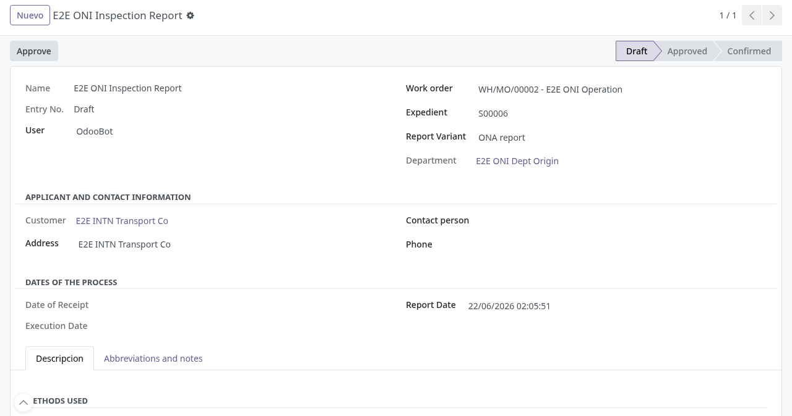
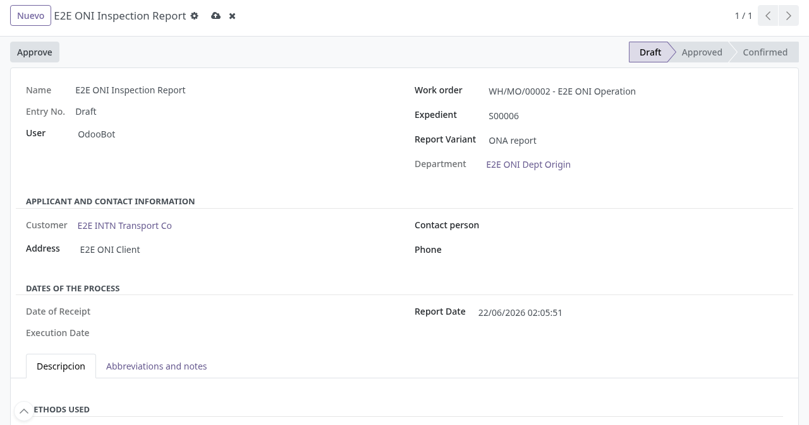
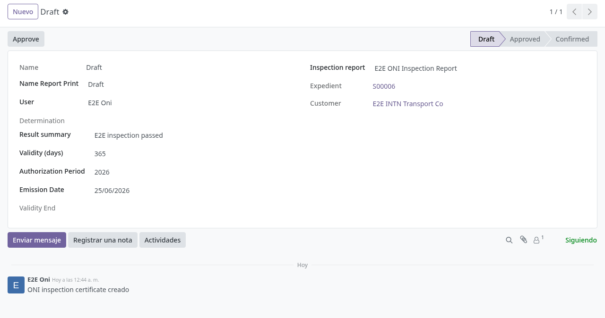
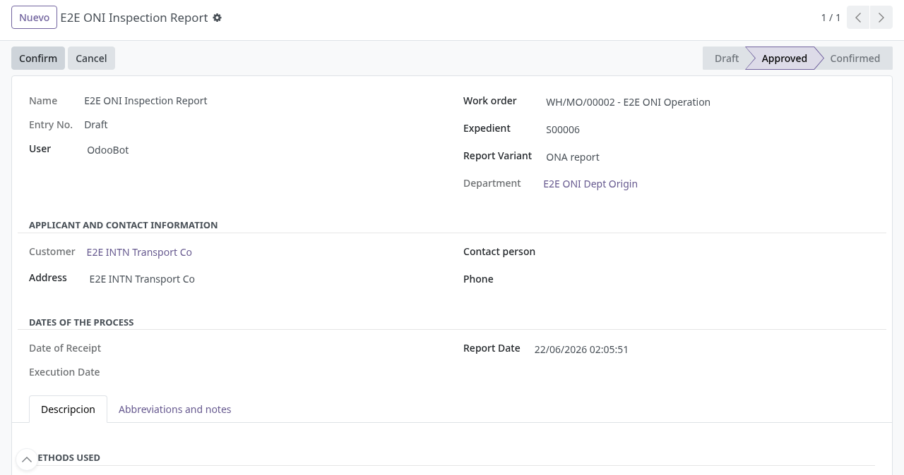
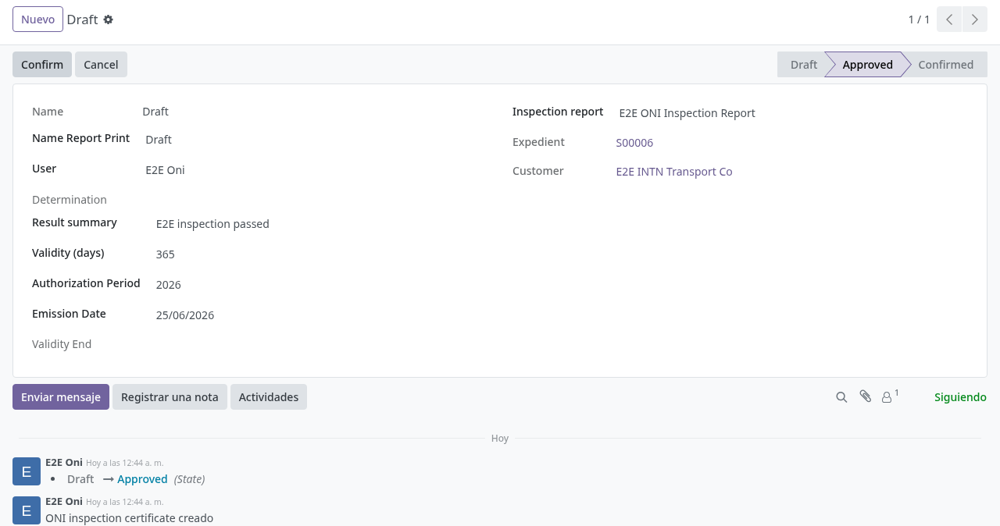

# Informes ONI

## Para quién es esta guía

- **Usuario ONI** — elabora informes de inspección, certificados, actas de registro y demás documentos ONI.
- **Aprobador de informes ONI** (grupo *ONI report approver*) — da el paso formal de **Approve** en cada documento.

## Qué resuelve este proceso

Gestiona la documentación de inspección del organismo ONI con un circuito uniforme en dos pasos formales separados de la edición diaria: el usuario redacta en **Borrador**, el aprobador pulsa **Approve** y luego, con **Confirm**, el documento recibe su **número oficial** y queda cerrado. Cada tipo de documento tiene su propio numerador.

> Nota: las etiquetas de menús y botones de esta sección se muestran hoy **en inglés** en pantalla (Approve, Confirm, Inspection reports, etc.).

## Dónde está en el menú

Dentro de la aplicación **Fabricación** aparece el menú **ONI** con estas opciones:

| Menú | Documento |
|------|-----------|
| ONI → **Inspection reports** | Informes de inspección |
| ONI → **Inspection certificates** | Certificados de inspección (nacen de un informe de inspección) |
| ONI → **Certificate of Noncompletion** | Constancias de ensayo no realizado |
| ONI → **Assay reports** | Informes de ensayo |
| ONI → **Technical reports** | Informes técnicos |
| ONI → **Technical maquila reports** | Informes técnicos de maquila |
| ONI → **Inspection logs** | Registros (actas) de inspección |
| ONI → **Sampling reports** | Informes de muestreo / no intervención |

## Configuración previa

- Grupo de acceso a Fabricación con el **organismo ONI** asignado al usuario (ver [acceso-organismos.md](acceso-organismos.md)).
- Grupo *ONI report approver* para quien deba pulsar **Approve** (lo asigna administración).
- Numeradores ONI: existe uno por tipo de documento (informe de inspección, certificado de inspección, ensayo con ONA, ensayo sin ONA, informe técnico, técnico maquila, acta de inspección, constancia de no realización y muestreo), todos con formato `000001/año`.
- Logos de los PDF: en **Ajustes** (Ajustes generales) está el bloque **Imagenes para reportes ONI** con cuatro imágenes: **Logo superior izquierdo**, **Logo superior derecho**, **Logo auxiliar 1** y **Logo auxiliar 2**.

## Antes de empezar

- Los informes de inspección, de ensayo, técnicos y de maquila se vinculan a una **orden de trabajo** de Fabricación; al elegirla se completa solo el **expediente** y el cliente. Verificar que sea la orden del organismo ONI.
- Por cada orden de trabajo solo puede existir **un** informe de inspección, **un** informe de ensayo, **un** informe técnico y **un** informe de maquila; el intento de duplicar se bloquea (p. ej. "This work order already has an ONI inspection report.").

## Pasos por rol

### Recepción y confirmación de la solicitud

Antes de que exista una orden de trabajo, el trámite nace como una **solicitud de servicio** (categoría **ONI**) que el cliente crea desde el portal: Seguridad Industrial, Textil, Muestreo, Inspección de Garrafas o Maquila. Los cinco servicios comparten exactamente el mismo ciclo de recepción descrito aquí (ninguno agrega validaciones o adjuntos obligatorios adicionales al crear la solicitud, ni siquiera Maquila). Al crearse, el sistema arma solo el ticket de Helpdesk, la solicitud y el pedido de venta (expediente); ese motor común está documentado en [Solicitud de servicio unificada](../registro-documentos/solicitud-servicio-unificada.md) y [Revisión documental transversal](../registro-documentos/revision-documental.md). Aquí se detalla solo lo propio de ONI.

1. **Dónde encontrar la solicitud entrante:** hoy ONI no tiene un menú propio en Fabricación para listar estas solicitudes (a diferencia de "Camiones Tanque → Solicitudes de Servicio" de flota/metrología). Dos accesos reales:
   - El aviso que se publica al crearse la solicitud en el canal de Discuss **Atención al Cliente (ATC)** incluye un enlace **"Open request"** que abre directo el formulario de la solicitud. ONI, igual que OIAT, no tiene plantilla de correo propia para este aviso: solo llega por Discuss, sin correo adicional a bandejas de ATC.
   - Abrir el **ticket de Helpdesk** del cliente (creado junto con la solicitud) y pulsar el botón inteligente **Solicitudes de Servicio** en su cabecera: abre la lista de solicitudes vinculadas a ese ticket.

2. **Qué revisar:** los datos propios del servicio elegido (por ejemplo, en Inspección de Garrafas: la capacidad exacta de cada garrafa) y los archivos que el cliente adjuntó a la solicitud o al ticket. ONI no define una lista fija de documentos obligatorios (a diferencia de flota): se revisa lo que el cliente haya adjuntado.

3. **Revisión documental (si aplica):** con el grupo *Revisor de documentos INTN*, usar **Observar**, **Aprobar documentación**, **Rechazar documentación** o **Restablecer revisión** en la cabecera de la solicitud (el comentario de revisión es obligatorio para observar o rechazar). Si en **Ajustes → Ventas** está activa *Exigir documentación aprobada antes de confirmar*, la solicitud no podrá confirmarse mientras el estado de revisión no sea **Aprobado** (ver [Revisión documental transversal](../registro-documentos/revision-documental.md)).

4. **Confirmar:** pulsar **Confirmar** (visible solo en Borrador). El sistema, en este orden:
   - crea o reutiliza el pedido de venta (expediente);
   - bloquea con *"Document review must be approved before confirming (current state: …)"* si la revisión documental no está aprobada y la exigencia está activa;
   - bloquea con *"Cannot confirm the service request: no commercial partner is set. Link a helpdesk ticket with a customer or set a beneficiary."* si no hay cliente comercial vinculado;
   - bloquea con *"Cannot confirm the service request: no sale order line could be built. Check the service catalog and product configuration for …"* o *"No pricing rule matches this request. Contact support."* si el catálogo o el producto no está bien configurado;
   - confirma el pedido de venta si estaba en presupuesto o presupuesto enviado, y pasa la solicitud a **Confirmado**.

5. **Qué queda listo para el resto de esta guía:** confirmar la solicitud deja el **expediente (pedido de venta)** confirmado, pero **no crea sola** la orden de fabricación ni la orden de trabajo. Esa orden se carga en Fabricación como cualquier orden de fabricación, y queda enganchada al expediente cuando su campo **Origen** coincide con el número del pedido de venta (o cuando la orden nace de una línea de ese pedido bajo una ruta de fabricación). Recién con ese enganche, al elegir esa orden de trabajo en el informe (paso 2 del rol *Usuario ONI* debajo), el sistema completa solo el expediente y el cliente; si no quedó enganchada, esos datos no se autocompletan.

### Usuario ONI

1. Abrir el menú **ONI** y elegir el tipo de documento. Crear el registro: nace en **Borrador** (Draft).

   

2. Completar los campos obligatorios según el documento:
   - **Informe de inspección**: orden de trabajo, expediente y cliente (se completan solos al elegir la orden), variante **ONA report** o **Report without ONA**, persona y teléfono de contacto, y el cuadro de **Methods Used** (tabla de ítems, requisitos inspeccionados y resultados). Las fechas de recepción y ejecución se toman solas del inicio y fin de la orden de trabajo. Trae textos precargados de abreviaturas y notas estándar del organismo.
   - **Informe de ensayo**: orden de trabajo, expediente, cliente y variante ONA / sin ONA (la variante define qué numerador se usa).
   - **Informe técnico**: orden de trabajo, expediente, contacto y descripción; trae la nota estándar de reproducción parcial.
   - **Informe técnico de maquila**: orden de trabajo, expediente, cliente, producto de exportación (se muestra solo desde la orden), materias primas y unidad de medida.
   - **Acta de inspección (Inspection log)**: entrada INTN (expediente), **método aplicado**, **propósito de la visita**, **fecha de validez** y fecha de inspección; campo libre de sugerencias y observaciones.
   - **Informe de muestreo (Sampling report)**: **Tipo de Informe** (*Informe de Muestreo* o *Informe de No Intervención*), expediente, orden de trabajo, **Acta INTN N°**, lugar de muestreo y descripción del servicio. La pestaña *Methods Used* solo aparece para el tipo *Informe de No Intervención*.

3. Guardar y avisar al aprobador (procedimiento interno / chatter).

4. No usar **Approve** sin el rol de aprobador: el botón solo es visible para ese grupo (excepción: en el informe de muestreo el botón hoy no está restringido por rol).

   

5. Crear el **certificado de inspección** vinculado cuando corresponda (menú *Inspection certificates*): se elige el **informe de inspección** de origen y se completan los obligatorios **Result summary** (resumen del resultado), **Validity (days)** (vigencia en días), el período de autorización y la fecha de emisión. El **fin de vigencia** se calcula solo: fecha de ejecución de la inspección + días de vigencia.

   

6. Si un ensayo no se pudo realizar, emitir la **constancia (Certificate of Noncompletion)**: se elige la **orden de fabricación** (cada orden admite una sola constancia; las ya usadas no se ofrecen), se ajusta el texto precargado ("Se deja constancia que por el momento no se realiza el ensayo de XXXX…") y la fecha de emisión. Este documento no tiene paso de aprobación: **Confirm** directo asigna el número y lo deja **Confirmado**; **Cancel** lo pasa a **Cancelado**.

### Aprobador de informes ONI

1. Abrir el documento pendiente en Borrador.

2. Revisar el contenido y la trazabilidad con la orden de trabajo / el expediente.

3. Pulsar **Approve**. El documento pasa a **Aprobado** (Approved). Sin el rol, el sistema responde "You do not have permission to perform this action.".

   

4. Pulsar **Confirm** (visible en estado Aprobado). En ese momento se asigna el **número oficial** y el documento pasa a **Confirmado** (Confirmed):
   - Informe de inspección, informe técnico y muestreo: número con las **iniciales del departamento** ejecutor, p. ej. `DIN N°: 000123/2026`. El informe de inspección usa el numerador propio del departamento si existe; si no, el numerador general ONI.
   - Certificado de inspección, ensayo, maquila y acta: número correlativo simple `000123/2026` (el ensayo usa numerador distinto según sea con ONA o sin ONA).

5. Aprobar y confirmar también el **certificado** vinculado cuando corresponda; requiere que exista antes la aprobación ("The certificate is not approved." si se salta el paso).

   

6. Imprimir el PDF desde el menú de impresión del documento (hay un PDF por tipo: *ONI inspection report (PDF)*, *ONI inspection certificate (PDF)*, *ONI assay report (PDF)*, *ONI technical report (PDF)*, *ONI technical maquila report (PDF)*, *ONI inspection log (PDF)*, *Certificate of Noncompletion (PDF)*, *Sampling Report (PDF)*).

## Estados que verá en pantalla

La **solicitud de servicio** (antes de llegar a la orden de trabajo) tiene su propio estado, distinto del informe:

| Estado de la solicitud | Significado | Qué hacer |
|-------------------------|-------------|-----------|
| Borrador | Recién creada desde el portal, aún no confirmada | Revisar documentación; pulsar **Confirmar** |
| Confirmado | Expediente (pedido de venta) confirmado | Cargar/enganchar la orden de fabricación; seguir con el informe |
| Cancelado | La solicitud no sigue adelante | No continuar con el informe de esa solicitud |

| Estado | Significado | Qué hacer |
|--------|-------------|-----------|
| Draft (Borrador) | Editable; sin número (figura "Draft") | El usuario ONI completa el registro |
| Approved (Aprobado) | Visado por el aprobador | Pulsar **Confirm** para numerar y cerrar |
| Done (Confirmado) | Número oficial asignado | Imprimir / archivar el PDF |
| Sin botón **Approve** | El usuario no es aprobador | Solicitar el rol a TI |

La constancia de no realización usa **Draft → Confirmed → Cancelled** (sin paso de aprobación).

## Casos especiales

- **Cancelar**: el botón **Cancel** está disponible en Aprobado y también en Confirmado; devuelve el documento a **Borrador** y su nombre de impresión vuelve a "Draft" (el número ya consumido no se reutiliza). Usarlo solo según el procedimiento interno.
- **Certificados y actas**: siguen el mismo esquema borrador → Approve → Confirm que los informes; el aprobador cierra cada documento por separado.
- **Variante ONA / sin ONA**: en informes de inspección y de ensayo define la presentación y, en ensayo, el numerador utilizado.
- **Numeración provisional**: mientras el informe de inspección está en borrador su nombre muestra las iniciales del departamento con el sufijo "-DRAFT".

## Si algo no funciona

| Problema | Mensaje / causa | Qué hacer |
|----------|-----------------|-----------|
| No encuentra la solicitud entrante | ONI no tiene menú propio de solicitudes | Abrir el enlace del aviso en Discuss (ATC) o el botón **Solicitudes de Servicio** del ticket de Helpdesk |
| No deja **Confirmar** la solicitud | "Document review must be approved before confirming (current state: …)" | Un revisor debe **Aprobar documentación** primero |
| No deja **Confirmar** y no hay pedido de venta | "Cannot confirm the service request: no commercial partner is set. Link a helpdesk ticket with a customer or set a beneficiary." | Vincular un ticket con cliente o completar el **Beneficiario** |
| No se genera el pedido de venta | "Cannot confirm the service request: no sale order line could be built. Check the service catalog and product configuration for …" o "No pricing rule matches this request. Contact support." | Revisar el catálogo de servicio y el producto configurado |
| El informe no autocompleta expediente/cliente al elegir la orden de trabajo | La orden de fabricación no quedó enganchada al pedido de venta | Completar el campo **Origen** de la orden de fabricación con el número del pedido de venta |
| No ve los registros ONI | Usuario sin organismo ONI | Ver [acceso-organismos.md](acceso-organismos.md) |
| El botón **Approve** no es visible | Falta el grupo *ONI report approver* | El administrador asigna el rol de aprobador |
| Approve pulsado sin rol | "You do not have permission to perform this action." | Pedir el rol de aprobador |
| No deja confirmar | "The report is not approved." / "The certificate is not approved." / "The log is not approved." | Aprobar primero el documento |
| Informe duplicado | "This work order already has an ONI inspection report." (y equivalentes para ensayo, técnico y maquila) | Usar el informe existente de esa orden de trabajo |
| No vincula con producción | La orden es de otro organismo | Verificar que sea la orden correcta |
| Falta numerador | "No se encuentra configurada la secuencia de informe de inspeccion" (informe de inspección) o "… sequence is not configured." en los demás | TI configura el numerador del documento |
| Constancia ya confirmada no se puede reconfirmar | "Only draft certificates can be confirmed." | La constancia solo se confirma desde Borrador |

## Guías relacionadas

- [Informes y certificados OIAT](oiat-informes-certificados.md)
- [Acceso por organismo en producción](acceso-organismos.md)
- Ciclo genérico de la solicitud (confirmar/finalizar/cancelar): [../registro-documentos/solicitud-servicio-unificada.md](../registro-documentos/solicitud-servicio-unificada.md)
- Revisión documental transversal: [../registro-documentos/revision-documental.md](../registro-documentos/revision-documental.md)
