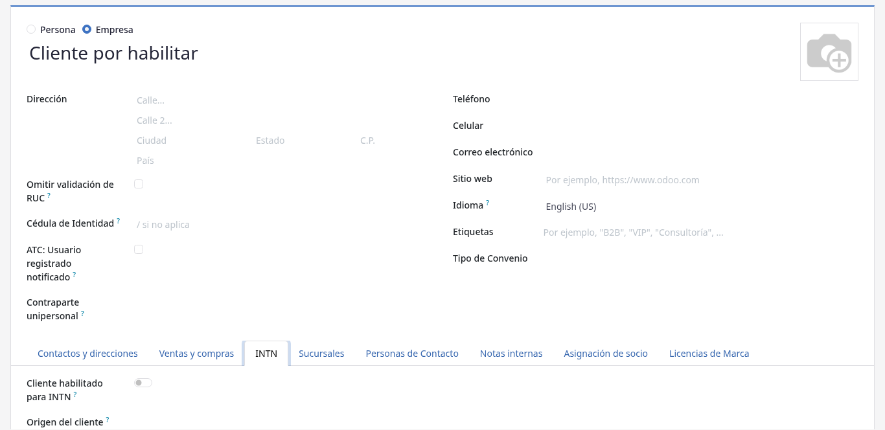
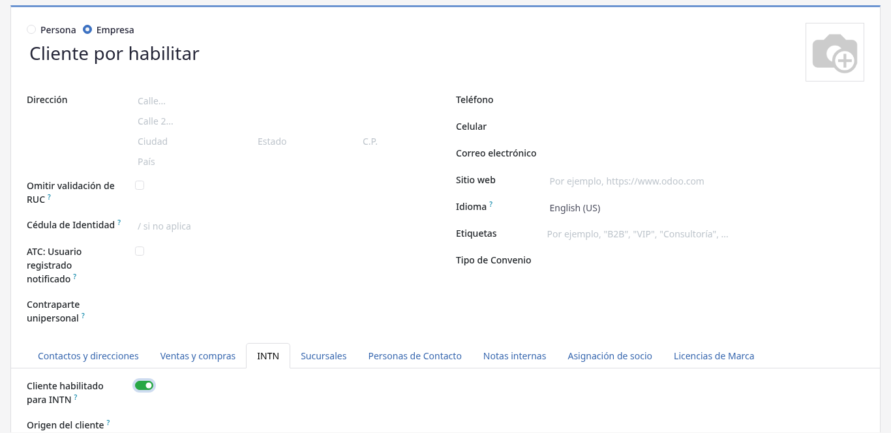

# Habilitación de cuentas de cliente por ATC

## Para quién es esta guía

- **Personal ATC** (Atención al Cliente) — usuarios internos del grupo de seguridad *Atención al Cliente (ATC)* (*Customer Attention (ATC)*). Revisan los registros nuevos y habilitan a las empresas para operar en el portal.

## Qué resuelve este proceso

Permite que INTN controle quién puede usar el portal, solicitar servicios y comprar. Una empresa se registra en línea y queda **pendiente** hasta que ATC verifica sus datos y la habilita. Mientras está pendiente:

- El cliente **no puede iniciar sesión** en el portal: al intentar entrar ve el mensaje *"Your account has been created successfully, but it is pending approval. We will contact you shortly to enable your access."* (su cuenta fue creada pero está pendiente de aprobación).
- En la tienda en línea solo ve los productos marcados como públicos; el catálogo completo queda oculto.
- No puede crear solicitudes de servicio ni comprar.

## Cómo llega el aviso a ATC

Al enviarse un registro nuevo de una empresa que aún no está habilitada, el sistema avisa **una sola vez** por dos vías:

1. **Canal de Discuss** *Atención al Cliente (ATC)* (*Customer Attention (ATC)*): se publica un mensaje que menciona a todos los miembros del grupo, con asunto *"New portal signup pending ATC approval: (nombre de la empresa)"*, el usuario/correo registrado (*Login*), el RUC (*VAT/RUC*) y un enlace *"Open partner"* que abre la ficha del contacto.
2. **Correo electrónico** con la plantilla *ATC: Nuevo registro en el portal pendiente de aprobación* a las direcciones de todos los usuarios del grupo ATC. Incluye: contacto, correo, RUC, teléfono, celular y un enlace *"Open partner in backend"* a la ficha del contacto.

Para no duplicar avisos, el contacto queda marcado internamente con la casilla *ATC: Usuario registrado notificado*; si la empresa intenta registrarse de nuevo no se reenvía el aviso.

## Configuración previa

- Usuario interno con el grupo *Atención al Cliente (ATC)*; la pertenencia al canal de Discuss del mismo nombre se deriva del grupo. La descripción del canal es *"Notificaciones de nuevas solicitudes de servicio."* porque también recibe los avisos de solicitudes nuevas.
- (Opcional) Integración de consulta de RUC: en **Ajustes → Sitio web**, bloque **INTN**, se configuran *RUC lookup integration* (Integración de búsqueda de identidad externa), la *URL base del servicio de identidad externa*, el *tiempo de espera* y la opción *Sync establishments from RUC* (crear/actualizar sucursales con los datos que devuelve el servicio). Con la integración activa, al ingresar el RUC en la ficha del contacto el sistema puede completar automáticamente nombre y teléfonos.

## Antes de empezar

- El cliente ya completó el formulario de registro en el sitio web (correo, RUC, razón social, celular, contraseña) y vio la pantalla *"Usuario registrado exitosamente"* con su cuenta en estado **Pendiente**.

## Pasos por rol

### ATC

1. Revisar el **correo** o el **canal de Discuss** de atención al cliente con el aviso de nuevo registro y abrir el enlace a la ficha del contacto.

   Alternativa sin aviso: en **Contactos**, usar el filtro **Pendiente de aprobación del INTN**, que lista todos los contactos aún no habilitados.

   

2. Verificar los datos del contacto:
   - **Nombre / razón social**, **RUC** (campo NIF), **correo**, **celular** y **teléfono**.
   - Pestaña **Sucursales** (*Branches*): sucursales de la empresa y la marca **Sede** (*Headquarters*); con la integración RUC activa pueden precargarse desde el servicio externo.
   - Pestaña **Personas de contacto**: personas vinculadas a la empresa. Al guardar una persona bajo una empresa, el sistema exige NIF, correo y teléfono; si faltan, muestra el error *"Contacts under company (empresa) must have: …"* con la lista de campos faltantes.
   - Pestaña **Empresas** (en contactos que son personas): empresas del portal que ese usuario representa y, si corresponde, las *sucursales limitadas* que puede ver.

3. Abrir la pestaña **INTN** de la ficha y activar el interruptor **Cliente habilitado para INTN**.

   En la misma pestaña puede completarse **Origen del cliente** (*Nacional* / *Extranjero*).

   

4. **Guardar**. El efecto es inmediato: el cliente ya puede iniciar sesión, ver el catálogo completo y crear solicitudes según las reglas del sistema.

5. **Avisar al cliente si corresponde.** El sistema **no** envía ningún correo automático al cliente cuando se lo habilita; la pantalla de registro le anticipó que *"nuestro equipo se pondrá en contacto con usted pronto"*, por lo que ATC debe contactarlo por el canal habitual (correo o teléfono) si quiere confirmarle la habilitación.

## Estados que verá en pantalla

La empresa no tiene un "estado" con nombre propio: la habilitación es el interruptor de la pestaña INTN.

| Situación | Cómo se ve | Qué hacer |
|-----------|------------|-----------|
| Registro nuevo pendiente | Interruptor **Cliente habilitado para INTN** apagado; el contacto aparece con el filtro **Pendiente de aprobación del INTN** | Verificar datos y habilitar |
| Cliente habilitado | Interruptor **Cliente habilitado para INTN** encendido | El cliente ya puede iniciar sesión, crear solicitudes y comprar |

## Casos especiales

- **El cliente sigue bloqueado tras habilitarlo:** suele deberse a una sesión antigua; pedirle que cierre sesión y vuelva a entrar.
- **Registro con proveedor externo (MITIC):** el formulario de registro ofrece el botón *"Iniciar sesión con Identidad Electrónica (Solo Paraguayos)"*. La verificación de datos por ATC es la misma; confirmar que RUC y contacto correspondan a la empresa. Los datos de identidad que provienen de MITIC no se editan manualmente.
- **Persona física y empresa unipersonal con el mismo RUC:** el sistema admite dos contactos principales que comparten RUC si se vinculan entre sí como *contraparte unipersonal* desde la ficha; ambos deben usar el mismo RUC y ser contactos de primer nivel (sin empresa matriz).
- **La empresa tiene varios usuarios de portal:** el control de inicio de sesión se hace sobre la ficha del contacto que entra; si un usuario adicional sigue viendo el mensaje de cuenta pendiente, active **Cliente habilitado para INTN** también en su propia ficha. Para restringir a un usuario a ciertas sucursales, usar el campo de sucursales limitadas de la pestaña **Empresas**.

## Si algo no funciona

| Problema | Causa habitual | Qué hacer |
|----------|----------------|-----------|
| El cliente no puede entrar al portal tras registrarse (ve el mensaje de cuenta pendiente de aprobación) | Empresa no habilitada | Activar **Cliente habilitado para INTN** en la pestaña INTN del contacto |
| El cliente solo ve algunos productos en la tienda | Cuenta aún no habilitada: solo se muestran los productos públicos | Habilitar la cuenta |
| ATC no recibe el aviso de nuevo registro | El usuario no está en el grupo *Atención al Cliente (ATC)* o no tiene correo cargado | El administrador asigna el grupo y verifica el correo del usuario |
| Llega el aviso por Discuss pero no por correo | Los usuarios del grupo ATC no tienen dirección de correo en su contacto | Completar el correo de los usuarios ATC |
| El RUC no completa datos automáticamente | Integración RUC desactivada o servicio externo sin conexión | El administrador revisa **Ajustes → Sitio web → INTN** (integración, URL y tiempo de espera) |
| Al guardar una persona de contacto aparece *"Contacts under company … must have: …"* | Falta NIF, correo o teléfono en la persona | Completar los campos indicados en el mensaje |
| Cliente habilitado pero sigue bloqueado | Sesión antigua o usuario incorrecto | Pedir al cliente que cierre sesión y vuelva a entrar |

## Guías relacionadas

- Solicitud de servicio unificada (backoffice): [solicitud-servicio-unificada.md](solicitud-servicio-unificada.md)
- Trámite del cliente en portal: [../../portal/cuenta/registro-y-aprobacion.md](../../portal/cuenta/registro-y-aprobacion.md)
