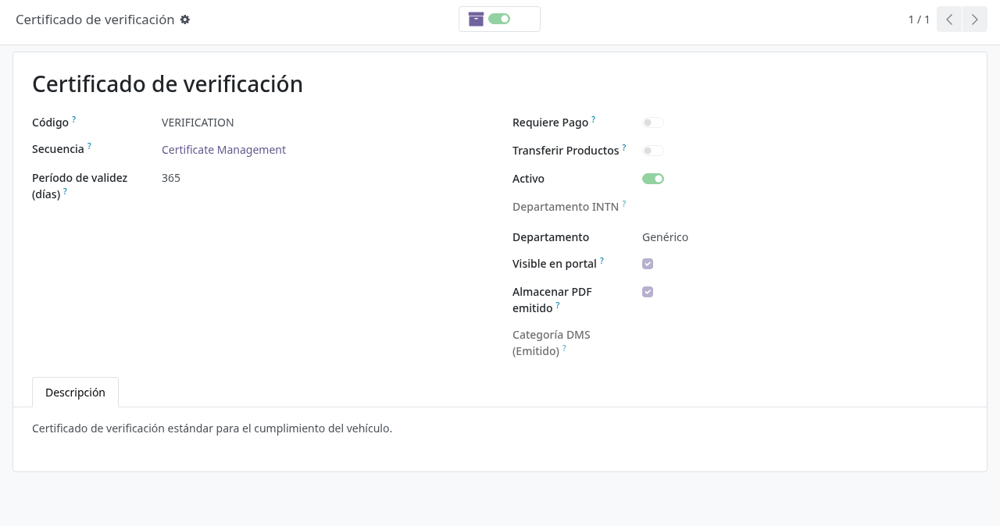
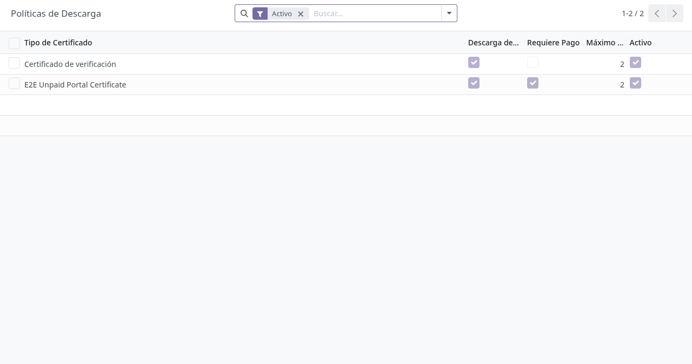
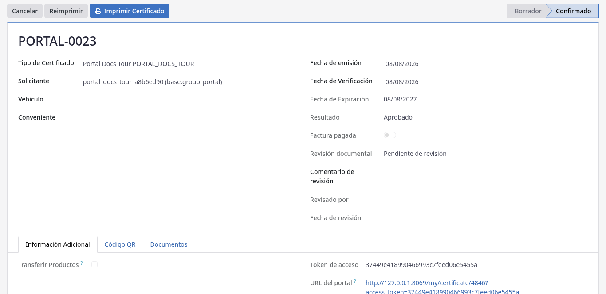
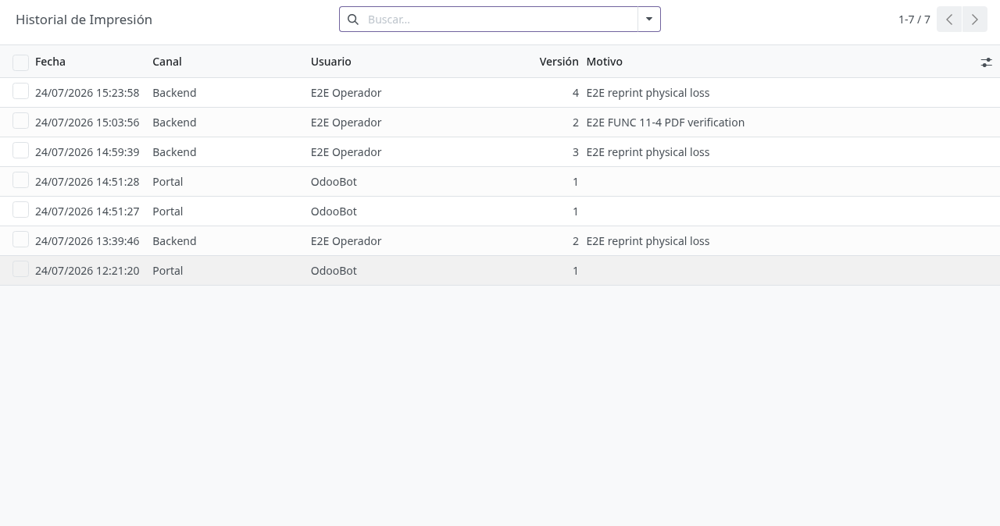
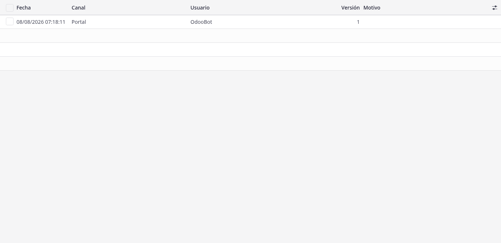

# Documentos internos (DMS) y auditoría de impresión

## Para quién es esta guía

- **Usuario interno** — consulta certificados, informes y adjuntos en el DMS y revisa el historial de impresiones y descargas.
- **Auditor de documentos INTN** (grupo *INTN Documents / Auditor (all departments)*) — ve certificados de **todos** los departamentos para tareas de fiscalización.
- **Administrador** — configura tipos de certificado, políticas de descarga y departamentos documentales.

## Qué resuelve este proceso

Centraliza en Odoo la consulta de los PDF oficiales (certificados emitidos, informes de solicitudes de flota, adjuntos) con control de **pago**, **tope de descargas en el portal** y registro de quién imprimió o descargó cada documento. El cliente ve solo sus archivos en el portal ([mis-documentos.md](../../portal/documentos-pagos/mis-documentos.md)); esta guía cubre la cara interna.

## Dónde está en el backend

Menú **Ajustes → Técnico → INTN Documents**:

| Submenú | Contenido | Quién lo ve |
|---------|-----------|-------------|
| **Certificates** (Certificados) | Todos los expedientes de certificado, con búsqueda por cliente, tipo, fecha de verificación y fecha de emisión | Usuarios internos, filtrados por departamento documental |
| **Print History** (Historial de impresión) | Registro de auditoría de impresiones y descargas | Usuarios internos |
| **Download Policies** (Políticas de descarga) | Políticas de descarga del portal por tipo de certificado | Solo administradores del sistema |

## Configuración previa

### 1. Tipos de certificado

En el formulario del **tipo de certificado**, además de sus campos habituales, se configuran:

| Campo | Efecto |
|-------|--------|
| *INTN Department* (departamento INTN) | Departamento interno dueño de los certificados de este tipo; controla la visibilidad por usuario |
| *Departamento* (Fleet / Metrology / Generic) | Clasificación simple usada por los filtros y por los grupos de visibilidad |
| *Visible en portal* | Si se desmarca, los certificados de este tipo **no aparecen** en Mis documentos del cliente |
| *Almacenar PDF emitido* | Al confirmar el certificado se genera y guarda el PDF oficial |
| *DMS Category (Emitted)* | Categoría DMS aplicada al PDF emitido cuando se sincroniza en la carpeta del expediente |

### 2. Políticas de descarga del portal

En **INTN Documents → Download Policies** se crea **una política por tipo de certificado** (el sistema impide duplicados) con:

| Campo | Efecto |
|-------|--------|
| *Portal Download Allowed* (descarga en portal permitida) | Si se desactiva, el cliente **nunca** puede descargar este tipo desde el portal (ve *"Download is disabled for this certificate type."*) |
| *Requires Payment* (requiere pago) | Activo: la descarga sigue las reglas de facturas pagadas del expediente. Inactivo: se descarga sin exigir pago |
| *Portal Max Downloads* (máximo de descargas) | Tope de descargas del cliente **por versión del documento**; `0` = sin tope. Por defecto **2** |

Si un tipo no tiene política, rigen los valores por defecto: descarga permitida, pago requerido y el tope global.

### 3. Valores por defecto globales

En **Ajustes → Técnico → Parámetros del sistema** existen dos parámetros (ambos con valor inicial `2`):

- `intn_documents.portal_max_downloads_default` — tope por defecto para **certificados**.
- `intn_documents.portal_report_max_downloads_default` — tope por defecto para **informes de solicitudes de flota** descargados desde el portal.

### 4. Visibilidad por departamento

- Grupos de seguridad (ocultos, se asignan desde la ficha del usuario): *INTN Documents / Fleet*, */ Metrology*, */ Generic* — limitan los certificados visibles al departamento correspondiente; *INTN Documents / Auditor (all departments)* — ve todo.
- Para el control fino por departamento INTN: en la ficha del usuario (**Ajustes → Usuarios**), pestaña **INTN Documents** (visible solo para administradores), campo *Document Departments*: el usuario del grupo con alcance por departamento solo ve certificados cuyos tipos pertenecen a esos departamentos (los tipos sin departamento asignado son visibles para todos).

## Antes de empezar

- El certificado o la solicitud ya existe en el backend; el PDF oficial se guarda al **confirmar** el certificado (si su tipo tiene *Almacenar PDF emitido*).

## Pasos por rol

### Usuario interno

1. Al **confirmar** un certificado, el PDF oficial se genera y guarda automáticamente como adjunto del expediente (**Documentos → Emitted PDF**, versión 1) y se sincroniza como archivo en la carpeta DMS del expediente con la categoría configurada. No lo reemplace por una impresión manual sin procedimiento.

   

2. Consulte el certificado en **INTN Documents → Certificates** (o desde el flujo del área) y abra el adjunto o la carpeta DMS vinculada. La pestaña **Documents** del certificado muestra: *Emitted PDF*, *Document Version* (versión vigente) y el historial de impresiones.

3. Para una **reimpresión** con motivo: botón **Reprint** en el certificado (visible solo en confirmados). Se abre un asistente con el campo **Reason** obligatorio (ejemplo del propio formulario: *pérdida física*). Al confirmar:
   - La **versión del documento aumenta en 1** y se registra una entrada de auditoría de canal *Backend* con el motivo.
   - Se descarga el PDF oficial guardado.
   - Errores posibles: *"Only confirmed certificates can be reprinted."* (no confirmado) y *"A reason is required for reprinting."* (motivo vacío).

4. Revise el **historial de impresión y descarga**: botón inteligente **Prints** del certificado, pestaña **Documents**, o el menú **Print History**. Cada registro guarda: fecha, canal (*Portal* / *Backend*), usuario, versión, motivo y **dirección IP** (en descargas del portal). Cada descarga del cliente en el portal crea un registro automáticamente.

   

   

5. Si el cliente reclama una descarga bloqueada, verifique en orden (es el orden real de evaluación):
   1. La política del tipo permite descarga en portal.
   2. Las facturas del expediente están pagadas (salvo que la política no exija pago).
   3. El tope de descargas de la versión vigente no se agotó (compare el tope de la política con las entradas de canal *Portal* del historial para la versión actual).

### Auditor de documentos

1. Acceda con un usuario del grupo *INTN Documents / Auditor (all departments)*.

2. Busque certificados de **cualquier** departamento según la necesidad de fiscalización; el historial de impresión permite reconstruir quién descargó qué, cuándo, por qué canal y desde qué IP.

## Estados que verá en pantalla

No hay un único estado del documento. Indicadores útiles en el backend:

| Indicador | Significado | Qué hacer |
|-----------|-------------|-----------|
| *Emitted PDF* cargado en la pestaña Documents | Documento oficial disponible | Consultar o abrir el adjunto |
| Certificado en borrador | Aún sin confirmar; sin PDF oficial y no visible en el portal | Confirmar el certificado para generar el PDF |
| *Document Version* mayor a 1 | Hubo reimpresiones con motivo | Revisar el historial de impresión |
| Registro en Print History | Alguien imprimió o descargó | Consultar quién, cuándo, canal e IP |

## Casos especiales

- **Adjunto duplicado:** una copia puede aparecer en el ticket y en la solicitud. Es normal; use el enlace de la solicitud.
- **Reimpresión interna vs. cupo del portal:** la reimpresión que hace INTN en el backend **no** consume el tope de descargas del cliente; además, como aumenta la versión, el conteo del portal arranca de cero para la nueva versión.
- **Visibilidad del cliente:** el cliente solo ve certificados **confirmados o vencidos** de tipos con *Visible en portal*; los adjuntos que él mismo subió siempre se listan.
- **Informes de flota:** las descargas de informes de solicitudes desde el portal exigen expediente pagado y respetan su propio tope global (parámetro de informes); también quedan en el historial con canal *Portal*.

## Si algo no funciona

| Problema | Causa habitual | Qué hacer |
|----------|----------------|-----------|
| El cliente no descarga el PDF | Pago pendiente, política de descarga desactivada o tope alcanzado | Revisar **Download Policies**, las facturas del expediente y el historial (bloqueos en ese orden) |
| El certificado no aparece para el cliente | Aún en borrador, o el tipo no tiene *Visible en portal* | Confirmar el certificado; revisar el tipo |
| Un interno no ve el certificado | El departamento del usuario no coincide con el del tipo | Asignar los *Document Departments* en la pestaña INTN Documents del usuario, o el grupo de departamento correcto |
| No se puede reimprimir | *"Only confirmed certificates can be reprinted."* / *"A reason is required for reprinting."* | Confirmar el certificado; completar el motivo |
| No aparece el menú Download Policies | Reservado a administradores del sistema | Pedir el cambio a un administrador |
| Adjunto duplicado | Copia en el ticket y en la solicitud | Normal; usar el enlace de la solicitud |

## Guías relacionadas

- Revisión documental transversal: [revision-documental.md](revision-documental.md)
- Solicitud de servicio unificada: [solicitud-servicio-unificada.md](solicitud-servicio-unificada.md)
- Trámite del cliente en portal: [../../portal/documentos-pagos/mis-documentos.md](../../portal/documentos-pagos/mis-documentos.md)
