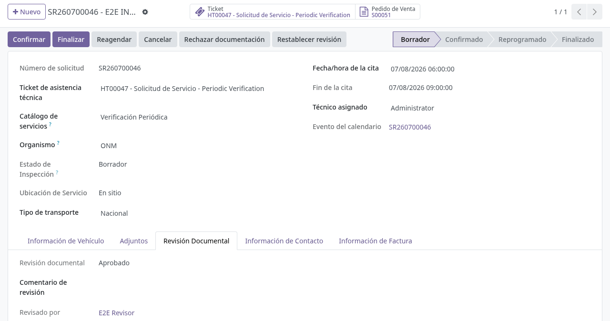
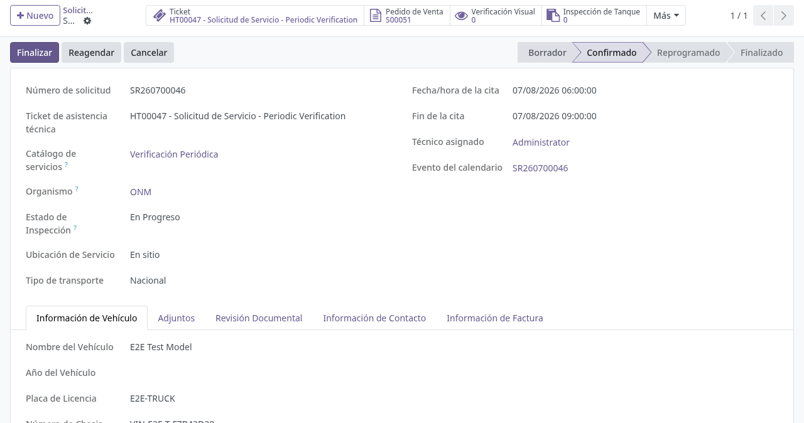
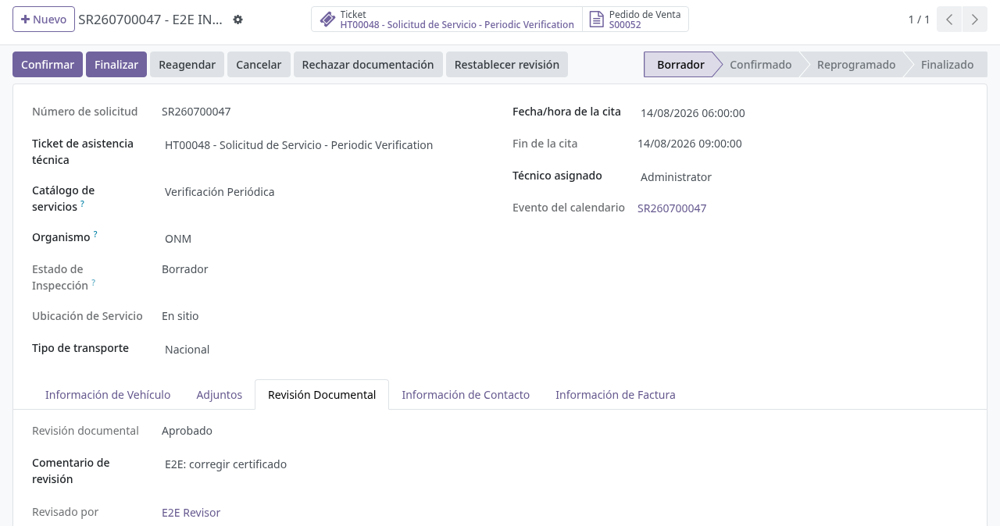
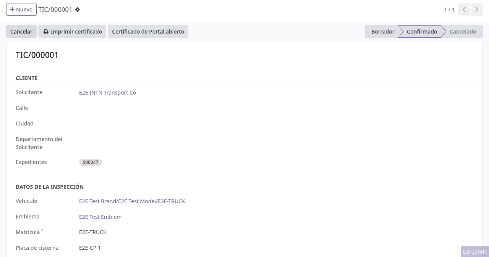

# Revisión documental transversal

## Para quién es esta guía

- **Revisor de documentos INTN** (grupo *Revisor de documentos INTN* / *INTN Document Reviewer*) — aprueba, observa o rechaza la documentación que el cliente adjuntó.
- **Operador** (por ejemplo *Usuario de Cisterna*) — confirma la solicitud o el certificado; solo puede continuar si la revisión está **Aprobado**.

## Qué resuelve este proceso

Supervisa formalmente los archivos que el cliente subió **antes** de que INTN confirme el trámite o emita el documento oficial. Aplica de forma transversal a solicitudes de flota/cisternas, metrología de picos, solicitudes genéricas, certificados, constancias de entrega/inspección y METCI: todos comparten los mismos cuatro estados, los mismos botones y las mismas notificaciones.

El cliente **no** puede aprobar su propia documentación. Solo INTN aprueba.

## Dos roles obligatorios (no confundirlos)

| Rol | Grupo Odoo (nombre en pantalla) | Qué ve y qué hace |
|-----|----------------------------------|-------------------|
| **Revisor** | *Revisor de documentos INTN* | Botones **Observar**, **Aprobar documentación**, **Rechazar documentación**, **Restablecer revisión** |
| **Operador** | Por ejemplo *Usuario de Cisterna* u otro usuario interno del área | Botón **Confirmar**; si la revisión no está aprobada, aparece un mensaje de bloqueo |

- Un mismo usuario puede tener **ambos** grupos, pero conviene separar funciones con dos usuarios distintos.
- Si solo tiene el grupo de operador, **no** verá los botones de revisión aunque abra la misma solicitud.

### Qué botón se ve en cada estado (solo revisor)

| Estado actual | Observar | Aprobar documentación | Rechazar documentación | Restablecer revisión |
|---------------|----------|-----------------------|------------------------|----------------------|
| Pendiente de revisión | Sí | Sí | Sí | — |
| Observado | — | Sí | Sí | Sí |
| Aprobado | — | — | Sí | Sí |
| Rechazado | — | — | — | Sí |

## Configuración previa

**Asignar el grupo revisor:** *Ajustes → Usuarios y compañías → Usuarios* → usuario → pestaña *Derechos de acceso* → categoría *Ventas* → marcar *Revisor de documentos INTN*.

En **Ajustes → Ventas**, bloque **Solicitudes de servicio** (*Service Requests*):

| Opción | Efecto |
|--------|--------|
| *Exigir documentación aprobada antes de confirmar* | Bloquea **Confirmar** si el estado de revisión no es *Aprobado* (solicitud, certificado, etc.) |
| *Correo al observar o rechazar documentación* | Envía correo al cliente al observar o rechazar (activo por defecto) |

Si *Exigir documentación aprobada…* está **desactivado**, INTN puede confirmar sin aprobar la revisión documental, pero **siguen aplicando** el pago del certificado, confirmar primero la solicitud de servicio (flota) y la cadena técnica visual → inspección DINS → registro de medición cuando corresponda. Además, **Finalizar** una solicitud sigue exigiendo revisión aprobada.

## Antes de empezar

- El cliente ya subió los archivos desde el portal y la revisión quedó en *Pendiente de revisión*.

### Dónde abrir según el trámite (backend)

| Trámite | Menú / pantalla |
|---------|-----------------|
| Flota / cisternas | **Camiones Tanque → Operaciones → Solicitudes de Servicio** |
| Metrología picos | **Camiones Tanque → Operaciones → Solicitudes metrología surtidores** |
| Solicitud genérica | Menú de solicitudes de servicio del módulo correspondiente |
| Certificados | Formulario del expediente de certificado |
| Constancia de entrega / inspección | Formulario del documento |
| METCI | Formulario de solicitud METCI |

### Qué debe verse en pantalla (flota / cisternas)

1. **Cabecera** (solo revisor): **Observar**, **Aprobar documentación**, **Rechazar documentación**; **Restablecer revisión** si ya no está pendiente.
2. **Pestaña Revisión documental** (*Document Review*): estado (*Pendiente de revisión*, *Aprobado*, etc.), **Comentario de revisión**, **Revisado por** y **Fecha de revisión** (los dos últimos los completa el sistema al decidir).
3. **Pestaña Adjuntos**: archivos del cliente. El indicador de archivo cargado **no** significa que INTN aprobó la documentación. El sistema muestra solo la **versión vigente** de cada tipo de documento: si el cliente reenvió un archivo, el anterior del mismo tipo fue reemplazado.

## Pasos por rol

### Revisor de documentos INTN

1. Entre con un usuario que tenga *Revisor de documentos INTN*.

2. Abra la solicitud, el certificado o la constancia según la tabla anterior.

3. Revise los archivos (pestaña **Adjuntos**, ticket vinculado o historial).

4. Para **Observar** o **Rechazar**: complete primero el **Comentario de revisión** (obligatorio). Si está vacío, el sistema muestra *"Ingrese un comentario de revisión antes de marcar como observado."* o *"Ingrese un comentario de revisión antes de rechazar el documento."* El comentario es lo que el cliente lee en el portal y en el correo: escriba exactamente qué debe corregir.

5. Pulse **Aprobar documentación** cuando corresponda; el estado pasa a *Aprobado* (no requiere comentario).

   

6. Cada decisión queda registrada:
   - El historial (chatter) recibe la nota *"Revisión documental actualizada a (estado)."* y guarda revisor y fecha.
   - Al **Observar** o **Rechazar**, si la notificación está activa, el cliente recibe un correo con asunto *"Documentation observed - (número)"* o *"Documentation rejected - (número)"*, que incluye el comentario de revisión y, en solicitudes, el enlace directo a su trámite en el portal. Si el cliente no tiene correo, no se envía y queda la nota *"Document review notification was not sent: the customer has no email address."*
   - En el portal, el cliente ve el aviso amarillo (observado) o rojo (rechazado) con el comentario y el formulario para reenviar ([correccion-documentos.md](../../portal/documentos-pagos/correccion-documentos.md)).

7. **Restablecer revisión** devuelve el estado a *Pendiente de revisión* (borra revisor y fecha) y deja la nota *"Document review reset to pending for a new review cycle."* Úselo para reabrir una decisión tomada por error.

### Operador INTN

1. Verifique en **Revisión documental** que el estado sea **Aprobado** (o pida al revisor que apruebe).

2. Pulse **Confirmar**. La solicitud pasa a *Confirmado*.

   

3. Si aparece *"Document review must be approved before confirming (current state: …)"* (la revisión documental debe estar aprobada): vuelva al revisor o espere las correcciones del cliente.

### Ciclo de corrección

1. El cliente sube los archivos corregidos desde el portal. Cada archivo nuevo **reemplaza** al anterior del mismo tipo (también la copia del ticket) y la revisión vuelve **automáticamente** a *Pendiente de revisión*, con la nota *"The customer submitted documentation corrections for review."* en el historial.
2. El revisor reevalúa: **Aprobar documentación** si cumple, u **Observar / Rechazar** de nuevo con otro comentario (el ciclo puede repetirse las veces necesarias).
3. Con la revisión en *Aprobado*, el operador ya puede **Confirmar**.

## Estados que verá en pantalla

| Estado | Significado | Qué ve el cliente en el portal | Qué hacer |
|--------|-------------|-------------------------------|-----------|
| Pendiente de revisión | Aún no evaluada | Aviso azul *"Su documentación está pendiente de revisión por INTN."* | Revisor: revisar y decidir |
| Aprobado | Documentación OK; revisor y fecha registrados | El trámite sigue su curso | Operador: **Confirmar** |
| Observado | Requiere corrección puntual (comentario obligatorio) | Aviso amarillo con el comentario y el formulario de corrección | Cliente: subir y **Enviar correcciones** |
| Rechazado | No aceptada (comentario obligatorio) | Aviso rojo con el comentario y el formulario de corrección | Igual que observado |

## Casos especiales

- **Reapertura de solicitudes finalizadas:** si una solicitud ya **Finalizada** vuelve a *Observado*, *Rechazado* o *Pendiente*, retrocede sola a **Confirmado** con la nota *"Service request reopened to Confirmed because documentation requires review or correction."*
- **Finalizar también exige revisión aprobada:** aunque la exigencia al confirmar esté desactivada, **Finalizar** bloquea con *"The service request cannot be finalized until documentation is approved (current review state: …)"*.
- **Confirmación de certificados técnicos (LIE) desde DINS:** los certificados de flota que nacen de una solicitud con revisión **aprobada** heredan esa aprobación, por lo que se confirman desde el formulario DINS sin el error de "pendiente de revisión".

  

- **Formulario de corrección según el tipo:** el portal muestra solo los documentos que corresponden al tipo de trámite; una verificación anual rechazada reaparece **sin** el campo DINATRAN y una habilitación rechazada reaparece **con** el campo DINATRAN.
- **Certificados y constancias:** los formularios de certificado, constancia de entrega/inspección y METCI tienen los mismos botones y campos de revisión; en certificados, el correo al cliente se titula igual pero refiere al *expediente de certificado*.

## Si algo no funciona

| Problema | Causa habitual | Qué hacer |
|----------|----------------|-----------|
| Error al **Confirmar**, sin botones de aprobar | El usuario es operador, no revisor | Un usuario con *Revisor de documentos INTN* debe **Aprobar documentación** |
| No aparecen los botones Observar / Aprobar | Falta el grupo revisor | TI asigna *Revisor de documentos INTN* |
| *"Ingrese un comentario de revisión antes de marcar como observado."* | Comentario de revisión vacío | Completar el **Comentario de revisión** y volver a pulsar el botón |
| Archivos en **Adjuntos** marcados como subidos pero no confirma | Adjuntos ≠ aprobación de INTN | El revisor debe **Aprobar documentación** |
| El cliente subió archivos y sigue observado | Subió por fuera del formulario de corrección del portal | Pedirle que use **Enviar correcciones** en el detalle de su solicitud |
| No llega el correo al cliente | Notificación desactivada, o el cliente no tiene correo (queda nota en el historial) | Activar *Correo al observar o rechazar documentación*; completar el correo del cliente |
| Se aprobó por error | Decisión equivocada | **Restablecer revisión** y evaluar de nuevo |

## Guías relacionadas

- Solicitud de servicio unificada: [solicitud-servicio-unificada.md](solicitud-servicio-unificada.md)
- Gestión de solicitudes de cisternas (ONM): [../cisternas/gestion-solicitudes-onm.md](../cisternas/gestion-solicitudes-onm.md)
- Documentos internos (DMS) y auditoría: [documentos-dms.md](documentos-dms.md)
- Corrección de documentos del cliente en portal: [../../portal/documentos-pagos/correccion-documentos.md](../../portal/documentos-pagos/correccion-documentos.md)
