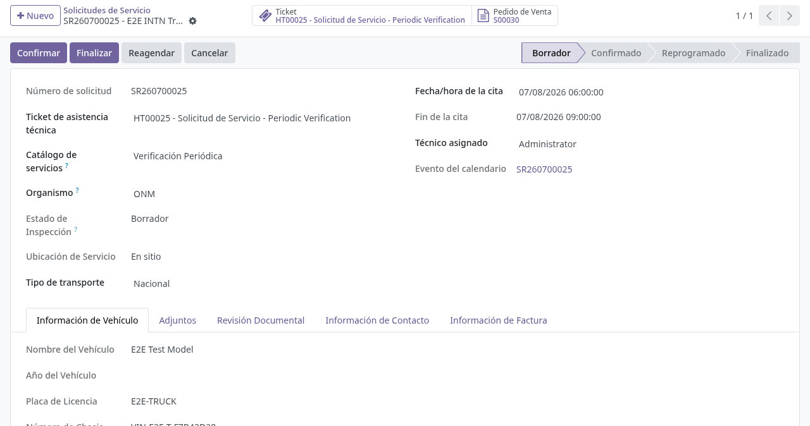
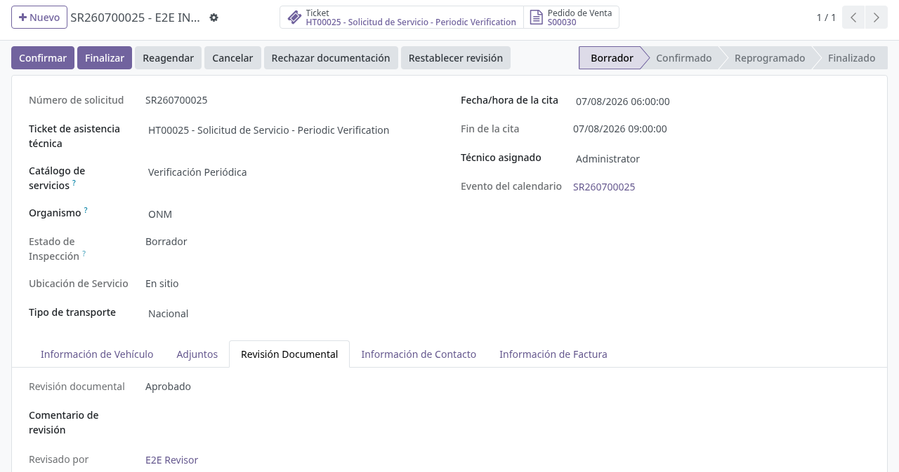
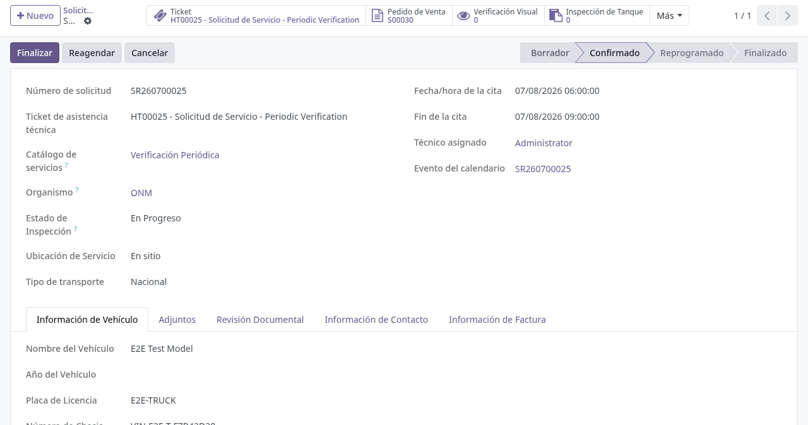
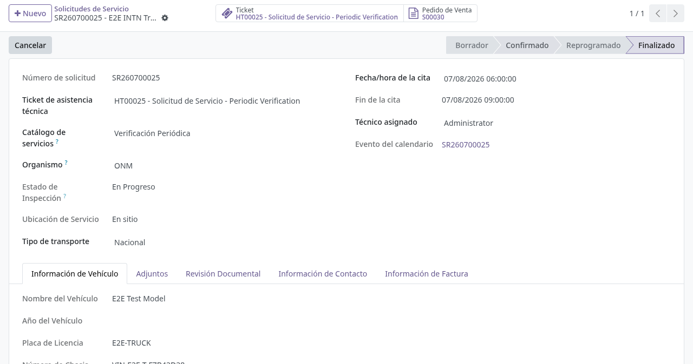

# Solicitud de servicio unificada (gestión en backoffice)

## Para quién es esta guía

- **Operador INTN** — confirma, reprograma, finaliza o cancela las solicitudes de servicio.
- **Revisor** — usuario del grupo *Revisor de documentos INTN*; aprueba la documentación cuando el trámite lo requiere.

## Qué resuelve este proceso

Centraliza en un solo expediente cada trámite de servicio (cisternas, metrología, etc.). Al crearse una solicitud —desde el portal o internamente— el sistema arma automáticamente:

- El **número de solicitud** correlativo (secuencia propia).
- El **ticket de asistencia** vinculado, que es el ancla de comunicación con el cliente (el campo **Cliente** de la solicitud proviene del ticket).
- El **pedido de venta** (expediente comercial), con líneas calculadas desde el **catálogo de servicios** y sus reglas de precio (producto, cantidad y variantes según capacidad u otros criterios).
- El **aviso a ATC**: mensaje en el canal de Discuss *Atención al Cliente (ATC)* con asunto *"New Service Request (número - cliente)"*, cliente, categoría, tipo de servicio y enlace a la solicitud; además, si hay direcciones configuradas, un correo a las casillas de notificación de ATC (flota y metrología tienen cada una su plantilla).

## Dónde se abre en el backend

| Trámite | Menú |
|---------|------|
| Flota / cisternas | **Camiones Tanque → Operaciones → Solicitudes de Servicio** (vista calendario, lista y formulario) |
| Metrología de picos | **Camiones Tanque → Operaciones → Solicitudes metrología surtidores** |

Ambos menús requieren el grupo *Usuario de Cisterna* (*Cistern User*). Cada menú filtra por su categoría; el registro es el mismo tipo de documento.

## Configuración previa

- Usuario interno con acceso a los menús de solicitudes de servicio.
- Catálogo de servicios cargado (categoría, tipo de servicio, reglas de precio y productos activos). Si al confirmar no se puede armar el pedido, aparecen errores explícitos (ver tabla final).
- Opciones en **Ajustes → Ventas**, bloque **Solicitudes de servicio** (*Service Requests*):

| Opción | Efecto |
|--------|--------|
| *Email when service is finalized* (correo al finalizar el servicio) | Al finalizar la solicitud (o confirmarse su certificado) se envía al cliente el correo *"Your service is ready - (número)"* con el enlace al portal. Activo por defecto |
| *Exigir documentación aprobada antes de confirmar* | Bloquea **Confirmar** si la revisión documental no está en *Aprobado* |
| *Correo al observar o rechazar documentación* | Envía correo al cliente al observar o rechazar la revisión |
| *Max overdue invoices for new service requests* (máximo de facturas vencidas) | Con este número o más de facturas vencidas impagas, el cliente no puede crear solicitudes nuevas. Por defecto **3**; `0` desactiva el control |

## Antes de empezar

- El cliente ya creó la solicitud desde el portal (o se creó internamente) y quedó en estado **Borrador**.
- Si el trámite exige revisión documental, la documentación debe estar **aprobada** antes de confirmar (ver [revision-documental.md](revision-documental.md)).

## Qué muestra el formulario

- **Cabecera:** botones **Confirmar** (solo en Borrador), **Finalizar** (oculto en Finalizado y Cancelado), **Cancelar** (oculto en Cancelado) y, en flota, **Reagendar** (en Borrador o Confirmado, abre un asistente con *nueva fecha de cita* y *motivo* obligatorios). Los usuarios con el grupo *Revisor de documentos INTN* ven además **Observar**, **Aprobar documentación**, **Rechazar documentación** y **Restablecer revisión**.
- **Datos principales:** Número de solicitud (solo lectura), Categoría de servicio (obligatoria), Catálogo de servicios, Tipo de servicio (solo lectura, lo fija el catálogo), Ticket, Cliente, **Gestor** (contacto que gestiona el trámite, obligatorio), **Beneficiario** (entidad legal que recibe el servicio y se factura, obligatorio), Compañía, Orden de venta (solo lectura) y el enlace del portal.
- **Botones inteligentes:** *Ticket* y *Orden de venta*, que abren los documentos vinculados.
- **Pestañas:** configuración del servicio o líneas (según el tipo de trámite), y en flota *Información del vehículo*, *Adjuntos*, *Información de contacto*, *Revisión documental* (*Document Review*), entre otras.

## Pasos por rol

### Operador INTN

1. Abrir la solicitud que llegó desde el portal (o se creó internamente), desde el menú correspondiente (ver tabla de menús).

   

2. Revisar los datos: ticket, pedido de venta, gestor/beneficiario y adjuntos.

3. Si el trámite requiere revisión documental, esperar a que la pestaña **Revisión documental** muestre **Aprobado** (ver [revision-documental.md](revision-documental.md)).

   

4. Pulsar **Confirmar**. El sistema, en este orden:
   - Crea y vincula el pedido de venta si aún no existe (con errores claros si no puede; ver tabla final).
   - Ejecuta las validaciones comerciales del área.
   - Verifica la revisión documental (si la exigencia está activa). Si no está aprobada, muestra el error *"Document review must be approved before confirming (current state: …)"* (la revisión documental debe estar aprobada antes de confirmar) y no avanza.
   - **Confirma automáticamente el pedido de venta** si estaba en presupuesto o presupuesto enviado.
   - Pasa la solicitud a **Confirmado**.

   

5. Al terminar el servicio, pulsar **Finalizar**. El sistema bloquea la finalización en tres casos, cada uno con su mensaje:
   - Solicitud cancelada: *"Cancelled service requests cannot be finalized."*
   - Revisión documental no aprobada: *"The service request cannot be finalized until documentation is approved (current review state: …)"*.
   - Facturas emitidas sin pagar: *"The service request cannot be finalized until all posted customer invoices are paid."*

   Al finalizar, la solicitud pasa a **Finalizado** y, si la opción está activa, el cliente recibe el correo *"Your service is ready - (número)"* indicando que su documentación está lista, con el enlace a su trámite en el portal.

   

6. Usar **Cancelar** solo si el trámite no debe continuar. La solicitud pasa a **Cancelado** y el área ejecuta su limpieza (citas, documentos vinculados).

### Revisor

1. Abrir la solicitud y la pestaña de **Revisión documental**.

2. Aprobar la documentación con **Aprobar documentación** cuando cumpla los requisitos.

3. Si la documentación no cumple, **Observar** o **Rechazar documentación** con el **Comentario de revisión** obligatorio (ver [revision-documental.md](revision-documental.md)).

## Estados que verá en pantalla

| Estado | Significado | Qué hacer |
|--------|-------------|-----------|
| Borrador | Recién creada, aún no confirmada | Revisar; aprobar documentación si aplica; **Confirmar** |
| Confirmado | Trámite en curso; el pedido de venta quedó confirmado | Operaciones según el tipo (verificación, certificado, etc.) |
| Reprogramado | Cita reprogramada con el asistente **Reagendar** | Seguir el flujo del área (cisternas / metrología) |
| Finalizado | Servicio terminado; el cliente recibe el correo de servicio listo (si está activo) | Consultar documentos emitidos |
| Cancelado | Trámite cerrado sin completar | No avanzar; revisar el motivo en el historial |
| No Show | El cliente no se presentó a la cita (flota) | Seguir el procedimiento de inasistencias del área |

## Casos especiales

- **Finalización vía certificado:** al confirmarse un certificado vinculado al mismo pedido de venta, las solicitudes de ese pedido se finalizan solas si cumplen las condiciones (revisión aprobada y facturas pagadas). Si no cumplen, quedan como están y el sistema deja una nota en el historial: *"Linked certificate was confirmed but the service request was not finalized: …"* con el motivo.
- **Reapertura automática:** si después de finalizada la revisión documental vuelve a *Observado*, *Rechazado* o *Pendiente*, la solicitud retrocede a **Confirmado** y queda la nota *"Service request reopened to Confirmed because documentation requires review or correction."*
- **Bloqueo por facturas vencidas:** al crear una solicitud (portal o backend) para un cliente con el máximo de facturas vencidas alcanzado, el sistema la rechaza con el mensaje *"You cannot request a new service because you have (N) overdue invoices. The maximum allowed is (M). Please pay overdue invoices before requesting a new service."*
- **Aviso a ATC:** cada solicitud nueva publica el aviso en el canal *Atención al Cliente (ATC)* y, si hay casillas configuradas, envía el correo del área; ATC puede coordinar con el cliente si falta información antes de confirmar.

## Si algo no funciona

| Problema | Mensaje / causa | Qué hacer |
|----------|-----------------|-----------|
| No deja **Confirmar** | *"Document review must be approved before confirming (current state: …)"* | El revisor debe **Aprobar documentación** (ver [revision-documental.md](revision-documental.md)) |
| No deja **Confirmar** y no hay pedido | *"Cannot confirm the service request: no commercial partner is set. Link a helpdesk ticket with a customer or set a beneficiary."* | Vincular un ticket con cliente o completar el **Beneficiario** |
| No se genera el pedido de venta | *"Cannot confirm the service request: no sale order line could be built. Check the service catalog and product configuration for …"* o *"No pricing rule matches this request. Contact support."* | Administrador / ventas revisan el catálogo de servicios, sus reglas de precio y productos |
| No deja **Finalizar** | Facturas emitidas sin pagar o revisión no aprobada (mensajes de arriba) | Cobrar el expediente / aprobar la revisión |
| El cliente no puede crear una solicitud nueva | Facturas vencidas por encima del máximo, o cuenta no habilitada | Regularizar pagos; ATC habilita la cuenta (ver [aprobacion-cuentas-atc.md](aprobacion-cuentas-atc.md)) |
| El cliente no recibió el correo de servicio listo | Opción *Email when service is finalized* desactivada, o el cliente no tiene correo | Activar la opción en Ajustes → Ventas; completar el correo del cliente |
| El cliente no ve su solicitud | Sesión con el usuario de otra empresa | Verificar que inició sesión con la cuenta correcta |

## Guías relacionadas

- Habilitación de cuentas por ATC: [aprobacion-cuentas-atc.md](aprobacion-cuentas-atc.md)
- Revisión documental: [revision-documental.md](revision-documental.md)
- Gestión de solicitudes ONM (cisternas): [../cisternas/gestion-solicitudes-onm.md](../cisternas/gestion-solicitudes-onm.md)
- Trámite del cliente en portal (cisternas): [../../portal/cisternas/solicitud-verificacion-onm.md](../../portal/cisternas/solicitud-verificacion-onm.md)
