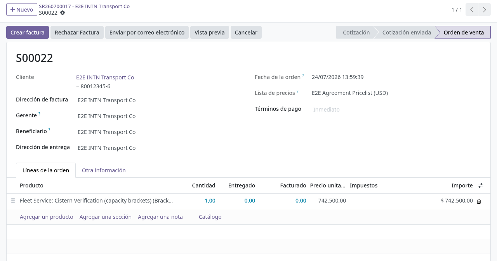
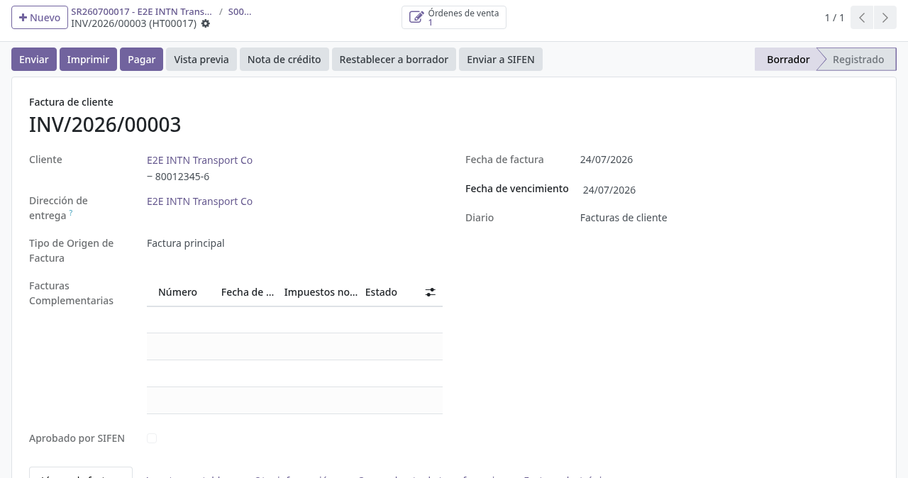
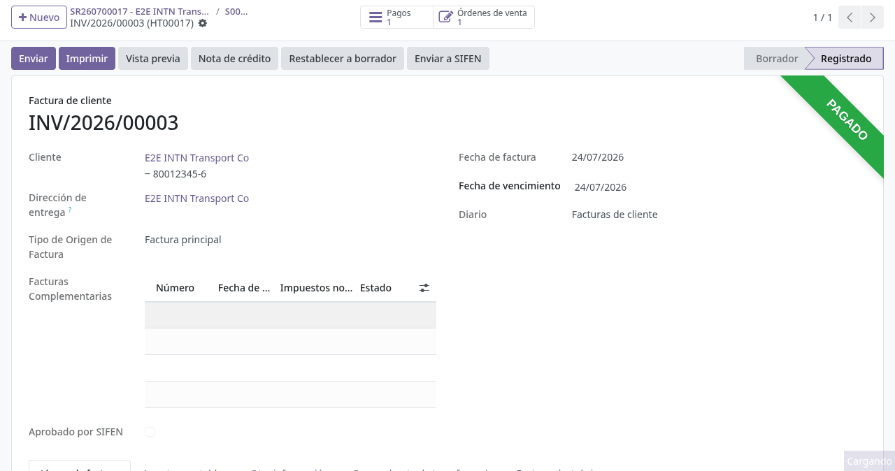
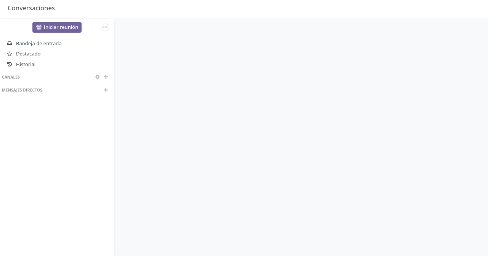
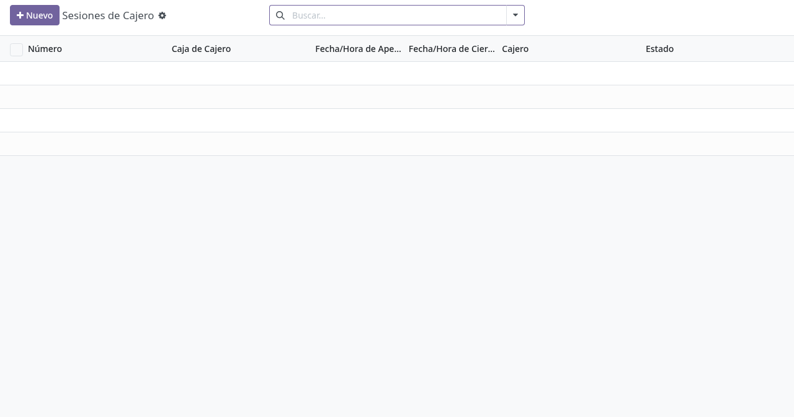

# Pagos, caja y cobranza en backoffice

## Para quién es esta guía

- **Cajero** — cobra en ventanilla, registra recibos y cierra la sesión de caja.
- **Cobrador** — arma recibos agrupados / grupos de pago sobre las facturas del cliente (grupo **Recaudador de Comprobantes**).
- **Facturación** — valida el RUC y publica la factura electrónica (SIFEN/SEGEL).
- **Usuario de órdenes de pago** — gestiona las órdenes de pago a proveedores (grupo **Payment Order User**).
- **Tesorería** — aprueba o rechaza los comprobantes de transferencia bancaria subidos por los clientes (grupo **Gestor de transferencias bancarias**).

## Qué resuelve este proceso

Cobra los expedientes de servicio, cumple los requisitos fiscales (RUC, factura electrónica SIFEN) y desbloquea las descargas de informes en el portal cuando el pago queda registrado.

## Configuración previa

- **Diarios de caja** (Contabilidad → Configuración → Diarios): marcar la casilla **Diario de Cajero** en los diarios de banco/efectivo que podrán usarse en las cajas. Existen además las casillas **Diario de Diferencia de Caja** (para registrar diferencias de arqueo) y **PagoPar Journal** (diario donde se registran los pagos en línea de PagoPar).
- **Cajas de Cajero** (Contabilidad → Clientes → Cajero INTN → Cajas de Cajero): cada caja define su **Nombre**, sus **Diarios de Pago** (solo diarios de banco/efectivo marcados como diario de cajero) y sus **usuarios autorizados**. Si la lista de usuarios queda vacía, cualquier usuario contable con acceso a caja puede abrir sesión en esa caja; si tiene usuarios, solo ellos (y los administradores). Cada caja genera automáticamente su propia secuencia de sesiones (Caja/año/mes/día/número).
- Caja marcada como **PagoPar Box** para las sesiones automáticas de los cobros en línea (opcional; la rotan tareas programadas).
- Credenciales **PagoPar** (claves pública y privada en el proveedor de pago, solo administradores) y SIFEN/SEGEL configuradas por administración.
- Grupo **Recaudador de Comprobantes** para confirmar recibos; grupo **Cancelar Recibos** para anularlos.
- Datos fiscales de la compañía y facturación electrónica habilitados (pestaña **Electronic Invoicing** de la compañía: producción, prueba o «no enviar a SIFEN»).

## Antes de empezar

- Pedido facturado o listo para facturar ([expediente comercial y convenios](expedientes-ventas-convenios.md)).
- Sesión de **caja** abierta para el cobro presencial (si usa el módulo de cajero).

## Pasos por rol

### Facturación

1. Verificar los datos fiscales del cliente (**RUC**) antes de publicar.

2. Facturar el pedido: se genera la factura en **borrador**.

   

3. **Publicar** la factura. Si la validación con **DNIT** está activada y el RUC no coincide con la razón social registrada, la publicación se bloquea con el mensaje *"DNIT validation failed for «cliente»: RUC «ruc» does not match the registered legal name."*; corregir la ficha del cliente y reintentar. Si el servicio de DNIT no responde: *"DNIT validation is temporarily unavailable. Please try again later or disable DNIT validation in settings."*.

4. Completar el timbrado electrónico: en la factura publicada, pestaña **Factura electrónica**, usar el botón **Submit to SIFEN**. La pestaña muestra la barra de estado SIFEN (Draft → Pending submission → Sent to SIFEN → Approved / Rejected), el **Estado e-Invoice**, el último error, el **CDC** y el código **QR e-kuatia**. El botón solo actúa sobre facturas de cliente publicadas (*"Only posted customer invoices can be submitted to SIFEN."*).

   

5. Entregar el PDF con **CDC/QR** al cliente.

6. **Factura aprobada por SIFEN:** queda bloqueada para edición; cualquier intento de modificarla muestra *"Cannot modify fields … on an invoice already approved by SIFEN. Generate a complementary invoice instead."*. Si después se agregan costos adicionales al pedido, al facturar de nuevo el sistema genera una **Factura complementaria** vinculada a la principal, solo con los conceptos nuevos.

### Cajero

1. Abrir **sesión de caja** al iniciar el turno. Dos caminos:
   - Desde el **indicador de caja** (punto de color en la barra superior): elegir la caja disponible y comenzar la sesión.
   - Desde **Contabilidad → Clientes → Cajero INTN → Sesiones de Cajero**: crear la sesión, elegir la **Caja de Cajero**, usar el botón **Saldo de Apertura** para contar el efectivo inicial (control de efectivo por denominaciones) y pulsar **Iniciar Sesión**.

   Reglas de apertura (mensajes exactos, aún sin traducción):
   - Una sola sesión abierta por caja: *"There is already an open session for this box"*.
   - Una sola sesión abierta por usuario: *"There is already an open session for this user"*.
   - Solo el cajero asignado puede iniciarla: *"Only the assigned cashier can start this session."*.
   - Usuario no autorizado en la caja: *"You are not authorized to open a session on cashier box «nombre»."*.

2. Localizar la factura o el pedido del cliente. Las facturas que el cajero publica y los pedidos que confirma durante el turno quedan **ligados automáticamente** a su sesión (se listan en las pestañas **Facturas** y de pedidos de la sesión).

3. Registrar el cobro con un **Grupo de Pagos** (recibo): ver los pasos del cobrador más abajo; la sesión de caja del cajero se precarga sola en el recibo. La factura pasa a *Pagada* / *En proceso de pago*.

   

4. Imprimir el comprobante para el cliente si aplica.

5. Al final del turno, pulsar **Cerrar Sesión**. El sistema **impide cerrar** si quedan facturas de contado del día sin cobrar: *"You cannot close the session while cash invoices remain unpaid."*.

6. Hacer el **arqueo**: en estado *Cierre*, el botón **Saldo de Cierre** abre el control de efectivo para contar el dinero real. La sesión muestra **Saldo de Apertura**, **Transacciones**, **Saldo de Cierre Teórico**, **Saldo de Cierre Real** y **Diferencia de Caja**. Con el conteo correcto (idealmente sin diferencia), pulsar **Validar y Registrar Entradas**: la sesión pasa a *Cerrado y Registrado* y queda solo para consulta.

   

### Cobrador / recibos agrupados

1. Abrir **Contabilidad → Clientes → Cajero INTN → Grupos de Pagos** y crear un recibo. Solo los usuarios del grupo **Recaudador de Comprobantes** pueden registrar recibos de cobro (*"You do not have permission to register receipts"*); las órdenes de pago requieren el grupo **Payment Order User** (*"You do not have permission to register payment orders"*).

2. Completar la cabecera: **Cliente** (el RUC se muestra solo), **Fecha**, tipo (**Recibir** para cobros / **Enviar** para órdenes de pago) y **Sesión de caja** (se precarga con la sesión abierta del usuario). El **Tipo de Comprobante** (Efectivo / Crédito) se determina automáticamente según las fechas de las facturas seleccionadas y define la numeración.

3. En la pestaña **Facturas**, asignar las facturas publicadas del cliente; en **Notas de Crédito**, las notas a aplicar. No se pueden mezclar facturas de contado y de crédito: *"Cash and credit invoices cannot be mixed in the same receipt"*.

4. En la pestaña **Pagos**, cargar una línea por medio de pago: Fecha, Diario, Cliente, **Método de Pago INTN**, Importe, Banco y Número de Documento. Métodos disponibles: **Efectivo, Cheque, Retención, Transferencia, Descuento, Depósito Bancario, Aqui Pago, PagoPar, Otro** y **Transferencia bancaria** (portal). Campos exigidos según el método:

   | Método | Campos adicionales obligatorios |
   |--------|--------------------------------|
   | Cheque | Banco, Número de Cheque, Fecha del Cheque, Fecha de Vencimiento del Cheque |
   | Transferencia | Banco, Número de Documento, Número de Documento del Cliente |
   | Depósito Bancario | Banco, Número de Documento |
   | Retención / Aqui Pago / Otro | Número de Documento |

   Controles automáticos: si el número de documento de una transferencia ya existe, aparece la advertencia *"Duplicated transfer — Transfer «nº» already exists in payment «pago»."*; un cheque repetido del mismo banco bloquea el guardado con *"Check already exists: «banco» «nº»"*.

5. Verificar los totales: **Deuda Seleccionada** (residual de las facturas) vs **Total de Pagos**; el indicador **Tiene Diferencia Menor** avisa cuando el pago no cubre toda la deuda seleccionada.

6. Pulsar **Confirmar**: se publican los pagos, el recibo recibe su número definitivo (RC/año/…… para contado o pagos Aquí Pago, RCR/año/…… para crédito, OP/año/…… para órdenes de pago) y el expediente y la solicitud de servicio vinculados reciben la nota automática *"Payment receipt «nº» confirmed. Service processing may begin."*.

7. **Cancelar** un recibo exige el grupo **Cancelar Recibos** (*"You do not have permission to cancel receipts"*). **Reiniciar a Borrador** devuelve los pagos a borrador para corregirlos.

### Tesorería — aprobación de transferencias bancarias

1. Buscar las facturas con comprobante pendiente: en la lista de facturas, filtro **Verificar comprobante bancario** (comprobantes del pago por transferencia del portal) o **Verify Receipt** (comprobantes subidos en la página de la factura).

2. Abrir la factura, pestaña **Transferencia bancaria**: muestra el estado del comprobante (Pendiente de revisión / Aprobado / Rechazado), la fecha de carga, el archivo y una **vista previa** (imagen o PDF) para revisarlo sin descargar. La pestaña es visible para los grupos **Visor de transferencias bancarias** y **Gestor de transferencias bancarias**.

3. Verificar el ingreso en el banco y pulsar **Aprobar transferencia**: el estado pasa a *Aprobado*, el cliente recibe el aviso *"Comprobante de transferencia aprobado."*, y el sistema **registra el pago automáticamente** en el diario del proveedor de transferencias y concilia la factura. En los trámites de cisternas, la aprobación además **confirma automáticamente** la solicitud de servicio vinculada que siga en borrador (si falla, queda una nota en la factura pidiendo confirmarla a mano).

4. Si el comprobante no coincide, pulsar **Rechazar transferencia**: se abre una ventana que exige escribir el **motivo de rechazo** (no deja confirmar si queda vacío). Al confirmar, el estado pasa a *Rechazado*, el motivo queda visible en la misma pestaña y el cliente recibe el aviso *"Comprobante de transferencia rechazado."* junto con el motivo escrito, tanto por correo como en el detalle de su factura en el portal, donde también puede subir un comprobante nuevo. Al subir uno nuevo, el motivo anterior desaparece. Restricciones (mensajes exactos, aún sin traducción):
   - Solo el gestor puede decidir: *"Only Bank Transfer Managers can approve or reject bank transfer receipts."*
   - Solo comprobantes pendientes: *"Only receipts pending review can be approved or rejected."*
   - Factura ya pagada: *"Cannot reject a receipt for an invoice that has already been paid. Reverse the payment first."*
   - Motivo vacío: *"Rejection reason is required."*

5. Existe además un circuito simple de comprobantes en la página de la factura (pestaña **Transfer Receipt**, botones **Approve Transfer Receipt** / **Reject Transfer Receipt**, disponibles para el grupo de facturación): ese circuito solo marca el comprobante como aprobado o rechazado; el pago debe registrarse aparte con un recibo.

### Pagos en línea (PagoPar) — qué hace el sistema solo

- Cuando el cliente paga con PagoPar en el portal, la notificación del proveedor **registra el pago y el recibo automáticamente** en el diario marcado como PagoPar y la factura queda pagada, sin intervención del cajero.
- Las facturas cobradas por la red **Aquí Pago** muestran la insignia **Paid with Aquipago** en el formulario.
- Tareas programadas opcionales rotan a diario la sesión de la caja PagoPar y actualizan las comisiones por medio de pago. Los avisos recibidos quedan en un registro de notificaciones consultable por administración.

## Estados que verá en pantalla

| Estado (factura) | Significado | Qué hacer |
|------------------|-------------|-----------|
| Borrador | No emitida | Completar y publicar |
| Publicada | Válida fiscalmente | Cobrar; enviar a SIFEN |
| Pagada / En proceso de pago | Cobrada o con pago en conciliación | Cerrar el expediente comercial |

| Estado SIFEN (pestaña Factura electrónica) | Significado |
|--------------------------------------------|-------------|
| Draft | Sin gestión electrónica |
| Pending submission | Pendiente de envío (o SIFEN desactivado) |
| Sent to SIFEN | Enviada, esperando respuesta |
| Approved | Aprobada; la factura queda bloqueada para edición |
| Rejected | Rechazada; revisar el último error |

| Estado (sesión de caja) | Significado |
|-------------------------|-------------|
| Apertura | Contando el efectivo inicial; aún no cobra |
| En Progreso | Puede cobrar; facturas y pedidos se ligan a la sesión |
| Cierre | Arqueo en curso (saldo real vs teórico) |
| Cerrado y Registrado | Validada; solo consulta |

| Estado (recibo / grupo de pagos) | Significado |
|----------------------------------|-------------|
| Borrador | En preparación; editable |
| Confirmado | Pagos publicados y numerados |
| Cancelado | Anulado (requiere grupo Cancelar Recibos) |

| Estado (comprobante de transferencia) | Significado |
|---------------------------------------|-------------|
| Pendiente de revisión | Subido por el cliente; esperando a Tesorería |
| Aprobado | Verificado; pago registrado automáticamente |
| Rechazado | No coincide; el cliente debe subir otro |

## Casos especiales

- **Configuración de caja:** cada cajero opera dentro de una sesión de caja; el indicador de la barra superior muestra si tiene sesión activa y permite abrirla sin salir de la pantalla.

  

- **Transferencia bancaria:** el pago no se refleja hasta que Tesorería aprueba el comprobante subido por el cliente; al aprobar, el pago y la conciliación son automáticos.
- **Sesión de otra persona:** cualquier acción de cierre o validación sobre una sesión ajena se bloquea con *"The session is assigned to another user"* (los administradores sí pueden intervenir).
- **Pago por API (Aquí Pago / Infonet):** los cobros hechos en redes de cobranza externas llegan por integración y registran el pago automáticamente sobre la factura.

## Si algo no funciona

| Problema | Causa habitual | Qué hacer |
|----------|----------------|-----------|
| No publica la factura (DNIT) | RUC no coincide con la razón social: *"DNIT validation failed for …"* | Corregir la ficha del cliente |
| DNIT no responde | *"DNIT validation is temporarily unavailable…"* | Reintentar más tarde o pedir a administración desactivar la validación |
| Error SIFEN / timbrado | Estado *Rejected* con detalle en **SIFEN Last Error** | Facturación revisa el error + administrador |
| No puede modificar una factura | Ya aprobada por SIFEN | Emitir factura complementaria o nota de crédito |
| No puede crear el recibo | Sin grupo **Recaudador de Comprobantes** (o **Payment Order User** para OP) | Solicitar el rol a TI |
| No puede confirmar el recibo | Facturas de contado y crédito mezcladas | Separar en dos recibos |
| No puede cerrar la sesión | Facturas de contado del día sin pagar | Cobrarlas o corregirlas antes del cierre |
| No puede abrir sesión | Ya hay sesión abierta (propia o de la caja) o usuario no autorizado | Cerrar la sesión previa / pedir autorización en la caja |
| Cliente no descarga el PDF tras pagar | Pago no conciliado o comprobante sin aprobar | Verificar el recibo / PagoPar / aprobar la transferencia |
| Transferencia pendiente | Comprobante sin aprobar | Tesorería aprueba desde la factura (filtro **Verificar comprobante bancario**) |
| Cheque o transferencia duplicados | Número de documento repetido | Verificar con el cliente; corregir el número |

## Guías relacionadas

- Expediente comercial y convenios: [expedientes-ventas-convenios.md](expedientes-ventas-convenios.md)
- Presupuesto y costos: [costos-presupuesto.md](costos-presupuesto.md)
- Solicitud de servicio unificada: [../registro-documentos/solicitud-servicio-unificada.md](../registro-documentos/solicitud-servicio-unificada.md)
- Trámite del cliente en portal: [../../portal/documentos-pagos/facturas-y-pagos.md](../../portal/documentos-pagos/facturas-y-pagos.md)
