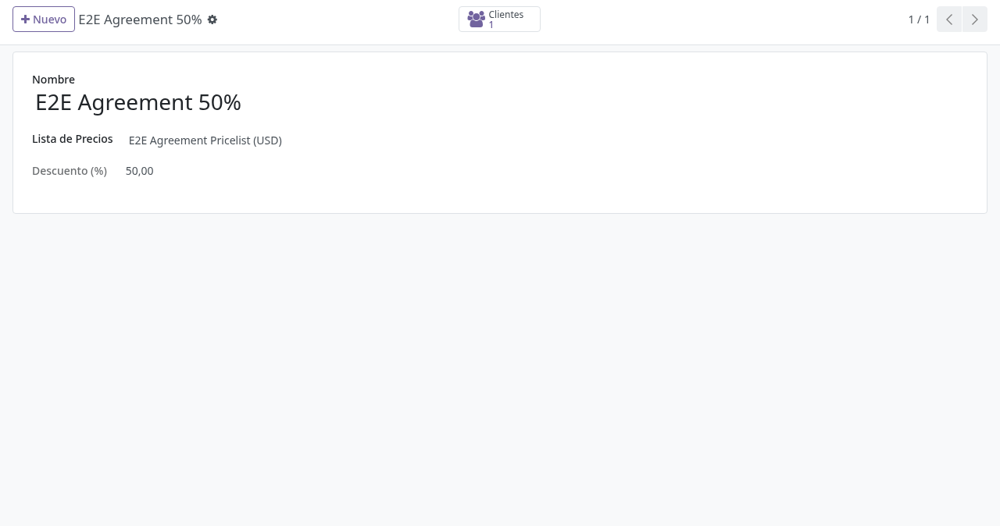
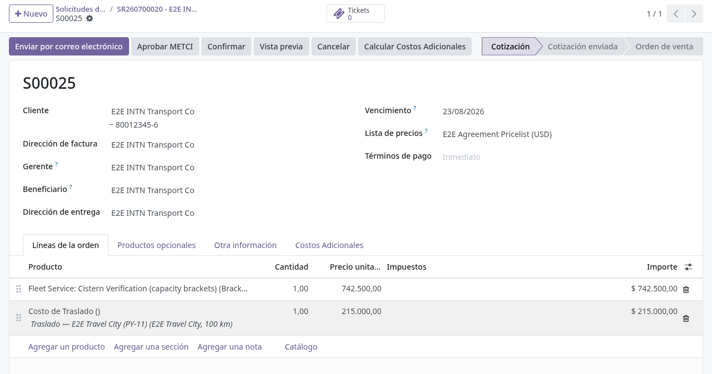

# Presupuesto y costos en backoffice

## Para quién es esta guía

- **Presupuesto y Costos** — ajusta las líneas y los costos extra del pedido ligado a la solicitud; mantiene las tarifas (grupo **Gerente de Costos Adicionales**).
- **ATC** — crea la solicitud y el expediente, y verifica los datos del contacto antes de cotizar.

## Qué resuelve este proceso

Explica cómo se reflejan en Odoo los costos adicionales (traslado, viáticos, administrativos) y los convenios al armar un presupuesto ligado a una solicitud de servicio, ya sea creada por el cliente desde el portal o por ATC al cotizar directamente.

> **Verificado el 28/07/2026** contra el código commiteado en `a43632c8`.
>
> **Verificación de cisternas:** el precio base **no** es fijo. Sale de un tramo
> calculado por capacidad × cantidad de compartimientos (6 tramos, de 1.375.000 a
> 2.750.000 Gs), sobre el que después se suman los costos adicionales que explica
> esta guía. Los tramos fueron reconstruidos del histórico de `intn_v12` y
> **siguen pendientes de firma del área comercial de ONM** — ver
> [spec RF 2.7](../../project/specs/rf-2.7-presupuesto-en-portal.md).

## Configuración previa

Los cuatro catálogos de tarifas viven en **Ventas → Configuración → Costos Adicionales** y solo los ve el grupo **Gerente de Costos Adicionales**:

- **Precios de Combustible** — precio por litro vigente; el asistente toma el precio activo (o el del vehículo elegido).
- **Zonas de Viaje** — por zona: distancia por defecto, **Costo de Peaje (Ida y Vuelta)**, porcentaje de mantenimiento y montos de viático **Con Pernocte** / **Sin Pernocte**.
- **Tipos de Costo Administrativo** — cada tipo apunta a un producto y a un porcentaje; el monto sugerido es el precio de lista del producto por ese porcentaje.
- **Vehículos** — los vehículos **propios del INTN** usados en los servicios in situ: nombre, chapa, **Km por Litro** y el combustible de referencia. Son los únicos que ofrece el asistente; los camiones de clientes no participan del costeo.

Además:

- Catálogo de servicios actualizado ([solicitud de servicio unificada](../registro-documentos/solicitud-servicio-unificada.md)).
- Reglas de convenio cargadas como **Tipos de Convenio** ([expediente comercial y convenios](expedientes-ventas-convenios.md)).
- Vehículos del INTN cargados en **Ventas → Configuración → Costos Adicionales → Vehículos**, con su rendimiento (Km/L) y su combustible.

## Antes de empezar

- La solicitud de servicio y su expediente (pedido) ya existen —creados por el cliente desde el portal o por ATC— y el pedido está vinculado ([expediente comercial y convenios](expedientes-ventas-convenios.md)).
- Catálogo de servicios actualizado.
- Reglas de convenio acordadas con el cliente.
- El pedido debe estar en **borrador** o **enviado**: los costos adicionales no pueden agregarse a un pedido ya confirmado (*"Additional costs can only be added on draft or sent quotes."*).

## Pasos por rol

### Presupuesto

1. Abrir el pedido vinculado a la solicitud ([expediente comercial y convenios](expedientes-ventas-convenios.md)).

2. Verificar el **convenio**: si el cliente tiene un tipo de convenio activo, su lista de precios se aplica sola al presupuesto y las líneas se recalculan con el descuento.

   

3. Pulsar el botón **Calcular Costos Adicionales** (visible en presupuestos en borrador o enviados, para usuarios de ventas). El asistente muestra el **Total General** arriba y tres pestañas:

   

   - **Traslado** — elegir **Vehículo** (trae su rendimiento Km/L y el precio de combustible de referencia) y **Zona de Viaje** (precarga **Distancia (Km)**, **Costo de Peaje** y el % de mantenimiento). El **Subtotal Traslado** se calcula solo: combustible ida y vuelta + mantenimiento, redondeado al millar, más peaje; la fórmula usada se muestra debajo, y sin vehículo se indica que se omite el combustible.
   - **Viáticos** — indicar **Técnicos**, modalidad **Con Pernocte / Sin Pernocte** y **Días**. El monto por día se sugiere desde la zona de viaje según la modalidad y puede ajustarse; **Subtotal Viáticos** = técnicos × días × monto.
   - **Administrativos** — agregar líneas por **Tipo de Costo Administrativo**; cada línea muestra el monto **Sugerido** (precio de lista × %) y permite ajustar el monto final.

4. Pulsar **Aceptar**. El asistente:
   - agrega al pedido una línea por concepto, marcada con su categoría (Traslado / Viáticos / Administrativos);
   - registra en el chatter del pedido la nota **Costos Adicionales Calculados** con el desglose y, si se modificó algún valor sugerido (distancia, peaje, viático o costo administrativo), la lista de esos cambios para auditoría;
   - habilita en el pedido la pestaña **Costos Adicionales** con el total de estos conceptos.

   Validación: no se puede aplicar un cálculo en cero (*"Cannot apply a zero-amount cost calculation."*).

5. Enviar el presupuesto al cliente. En el portal, el cliente ve estos conceptos en una sección propia **Costos Adicionales**, agrupados por categoría con subtotales.

6. **Costos agregados después de facturar:** si la factura principal del pedido ya fue **aprobada por SIFEN**, al volver a facturar el sistema genera una **factura complementaria** solo con los costos añadidos después de esa aprobación. Si no hay nada nuevo que facturar, aparece *"Nothing new to invoice. The primary invoice for «pedido» is SIFEN-approved and no additional costs have been added since."* (ver [pagos, caja y cobranza](contabilidad-caja-pagos.md)).

### Gerente de Costos Adicionales

1. Mantener al día **Precios de Combustible** (el histórico puede imprimirse con el reporte de historial de precios), **Zonas de Viaje** (distancias, peajes, viáticos) y **Tipos de Costo Administrativo**.

2. Revisar en el chatter de los pedidos las notas **Costos Adicionales Calculados** cuando haya valores modificados respecto a los sugeridos.

### ATC

1. Verificar los datos del contacto antes de cotizar ([aprobación de cuentas ATC](../registro-documentos/aprobacion-cuentas-atc.md)).

## Estados que verá en pantalla

Estados del presupuesto/pedido: borrador, enviado, confirmado (ver [expediente comercial y convenios](expedientes-ventas-convenios.md)). El botón **Calcular Costos Adicionales** solo aparece en borrador y enviado.

## Casos especiales

- **Tarifa de viaje faltante:** si no hay zona de viaje configurada, el asistente no puede sugerir distancia, peaje ni viáticos; configurar la zona con el Gerente de Costos Adicionales.
- **Sin vehículo elegido:** los vehículos del catálogo siempre tienen Km/L y combustible (ambos obligatorios), así que el subtotal de traslado solo queda en cero cuando no se eligió ningún vehículo. Elegir el vehículo del INTN que hará el viaje.
- **Valores ajustados a mano:** el asistente permite pisar los valores sugeridos, pero cada ajuste queda registrado en el chatter del pedido (sugerido → usado).
- **Pedido ya confirmado:** los costos adicionales solo se agregan en borrador o enviado; si el servicio ya avanzó, coordinar con ventas la factura complementaria.
- **Precio no coincide con el Excel histórico:** escalar a Costos para parametrizar la lista de precios en Odoo.

## Si algo no funciona

| Problema | Causa habitual | Qué hacer |
|----------|----------------|-----------|
| No aparece el botón **Calcular Costos Adicionales** | Pedido confirmado o usuario sin permiso de ventas | Usar un presupuesto en borrador/enviado; pedir el rol |
| Falta tarifa de viaje | Zona de viaje sin configurar | Configurar la zona con el Gerente de Costos Adicionales |
| Subtotal de traslado en cero | No se eligió vehículo | Elegir el vehículo del INTN en la pestaña **Traslado** |
| El desplegable **Vehículo** está vacío | Catálogo de Vehículos sin cargar | Registrar los vehículos del INTN en **Configuración → Costos Adicionales → Vehículos** |
| No puede aplicar el cálculo | Total general en cero: *"Cannot apply a zero-amount cost calculation."* | Cargar al menos un concepto con monto |
| No ve los menús de tarifas | Sin grupo **Gerente de Costos Adicionales** | Solicitar el rol a TI |
| Al facturar de nuevo: "Nothing new to invoice…" | Factura principal aprobada por SIFEN sin costos nuevos posteriores | Solo facturar cuando haya costos agregados después de la aprobación |
| Precio no coincide con Excel histórico | Lista de precios sin parametrizar | Escalar a Costos para parametrizar la lista en Odoo |

## Guías relacionadas

- Expediente comercial y convenios: [expedientes-ventas-convenios.md](expedientes-ventas-convenios.md)
- Pagos, caja y cobranza: [contabilidad-caja-pagos.md](contabilidad-caja-pagos.md)
- Solicitud de servicio unificada: [../registro-documentos/solicitud-servicio-unificada.md](../registro-documentos/solicitud-servicio-unificada.md)
- Trámite del cliente en portal: [../../portal/documentos-pagos/facturas-y-pagos.md](../../portal/documentos-pagos/facturas-y-pagos.md)
