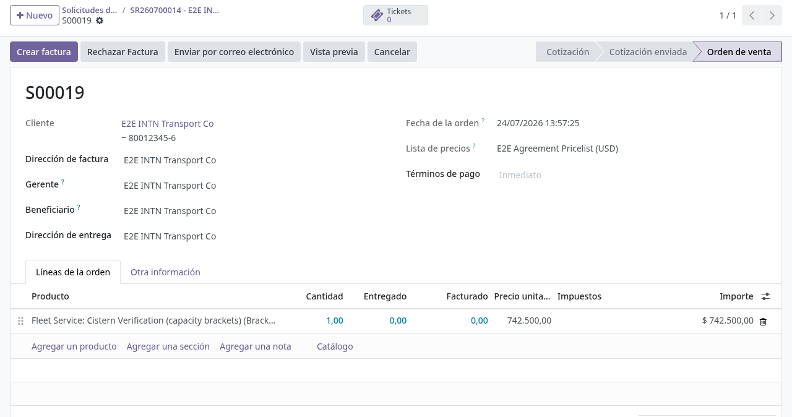
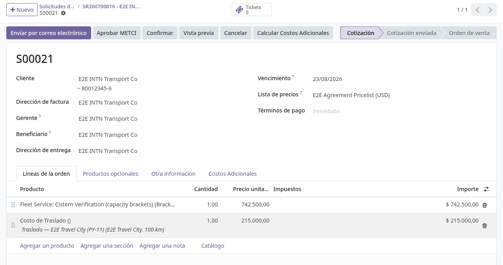
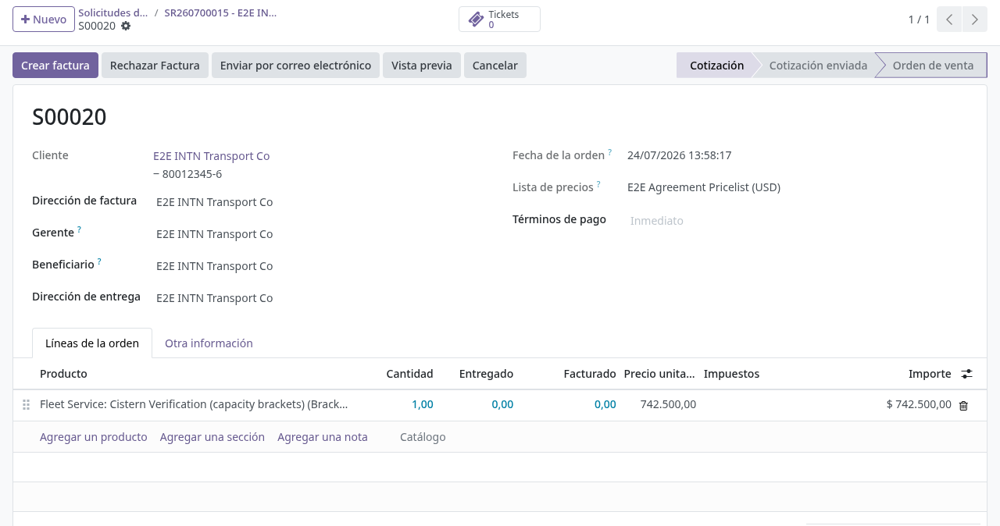
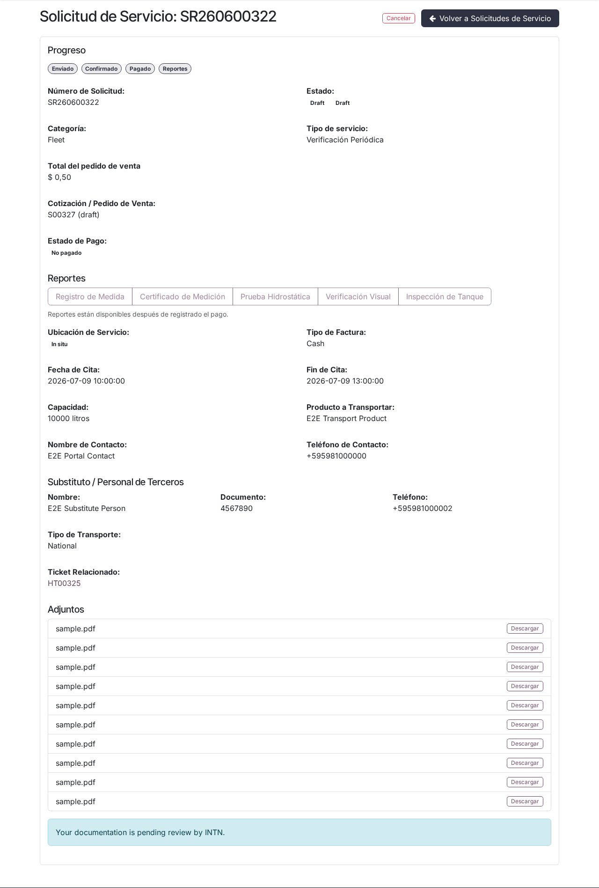
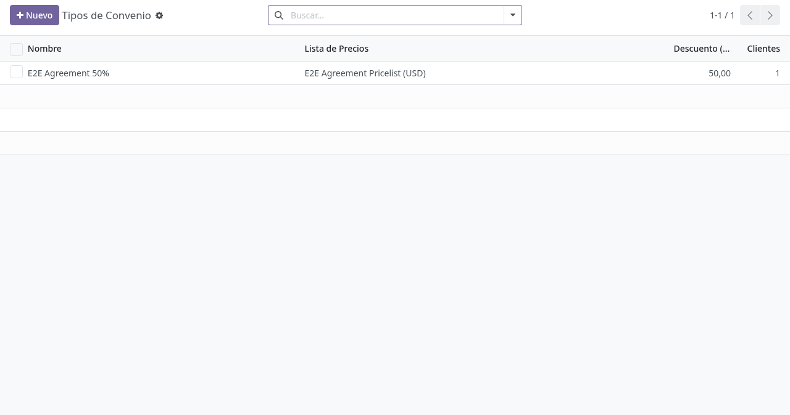

# Expediente comercial y convenios en backoffice

## Para quién es esta guía

- **Ventas / operaciones** — edita las líneas del pedido vinculado a la solicitud, aplica costos y convenios, confirma y solicita facturación.
- **Gestor de convenios** — mantiene los tipos de convenio comercial acordados con clientes institucionales (grupo **Administrador de Convenios**).
- **Gestor de crédito** — autoriza o rechaza las ventas a crédito y las restricciones de pago al contado (grupo **Gerente de Crédito**).

## Qué resuelve este proceso

Cada solicitud de servicio —que el cliente crea desde el portal, o que ATC crea internamente en su nombre— genera un **pedido de venta** (expediente) con precios, convenios, costos adicionales y seguimiento de pago, para facturar el trámite INTN de forma unificada.

## Configuración previa

- Usuario interno con acceso a **Ventas** y a la solicitud de servicio vinculada.
- Catálogo de servicios configurado por administración (productos por servicio). Si falta el producto del servicio, el expediente no puede crearse.
- Grupo **Administrador de Convenios** para mantener los tipos de convenio (menú **Ventas → Configuración → Tipos de Convenio**).
- Grupo **Gerente de Crédito** para editar la autorización de crédito, el límite y la restricción de pago al contado en la ficha del cliente.
- Para que el control de crédito actúe, la compañía debe tener activado el **límite de crédito** en los ajustes de Contabilidad.

## Antes de empezar

- El cliente ya creó la solicitud de servicio desde el portal (o se creó internamente) ([solicitud de servicio unificada](../registro-documentos/solicitud-servicio-unificada.md)). Al crearse, el sistema genera automáticamente el expediente (pedido de venta) si la solicitud tiene cliente y el catálogo tiene producto para ese servicio.
- Catálogo de servicios cargado para el tipo de trámite.
- Para convenios o crédito: permisos del rol correspondiente.

## Pasos por rol

### Ventas / operaciones

1. Desde la **solicitud de servicio**, abrir el expediente con el botón inteligente **Orden de venta** (visible solo cuando la solicitud ya tiene pedido vinculado). El mismo pedido también aparece en **Ventas → Pedidos**.

   

2. Verificar **gestor** y **beneficiario** del trámite en la solicitud. El beneficiario es la entidad legal que recibe el servicio y a la que se factura.

3. Revisar las líneas generadas desde el catálogo de servicios; ajustar cantidades si la política lo permite.

4. Si el servicio requiere **costos adicionales** (traslado, viáticos, administrativos), usar el botón **Calcular Costos Adicionales** del pedido, disponible mientras el presupuesto está en borrador o enviado (ver [presupuesto y costos](costos-presupuesto.md)).

   

5. Verificar el **convenio**: si el cliente tiene un **Tipo de Convenio** activo en su ficha, la lista de precios del convenio se aplica **automáticamente** al presupuesto en borrador y las líneas se recalculan solas con el descuento. No hace falta cambiar la lista de precios a mano; si el convenio del cliente cambia, el pedido en borrador se actualiza.

   

6. Confirmar el pedido. Al **confirmar la solicitud de servicio**, el pedido en borrador o enviado se confirma automáticamente junto con ella. Si el usuario que confirma tiene una **sesión de caja** abierta, el pedido queda asociado a esa sesión (ver [pagos, caja y cobranza](contabilidad-caja-pagos.md)).

   

7. Solicitar **facturación** cuando el servicio esté listo para cobrar (ver [pagos, caja y cobranza](contabilidad-caja-pagos.md)). Cuando caja confirma el recibo, el expediente y la solicitud reciben una nota automática indicando que el pago fue confirmado y que el servicio puede continuar.

### Gestor de convenios

1. Abrir **Ventas → Configuración → Tipos de Convenio**.

   

2. Crear o editar el tipo de convenio. Campos de la ficha:

   | Campo | Obligatorio | Descripción |
   |-------|-------------|-------------|
   | Nombre | Sí | Nombre del convenio (por ejemplo, el organismo o programa) |
   | Lista de Precios | Sí | Lista de precios que se aplicará a los pedidos de los clientes con este convenio |
   | Descuento (%) | No (solo lectura) | Porcentaje leído de la primera regla global porcentual de la lista de precios |

   El botón inteligente con el contador de **clientes** abre la lista de contactos asignados al convenio.

3. Asignar el convenio al cliente: en la ficha del contacto, campo **Tipo de Convenio** (debajo de las etiquetas). En la lista de contactos existe el filtro **Clientes Exonerados** (contactos con convenio activo) y la agrupación por **Tipo de Convenio**.

4. Para suspender un convenio sin borrarlo, archivarlo: deja de aplicarse a los nuevos presupuestos de sus clientes.

### Gestor de crédito

1. Abrir la ficha del cliente, pestaña **Límites de Crédito** (visible para usuarios de contabilidad). Ahí se ven el crédito ya utilizado, los días promedio de cobro y el interruptor de límite de crédito con su monto. Solo el **Gerente de Crédito** puede modificar la autorización, el monto del límite y la casilla **Restringir a pago al contado**; para el resto de los usuarios los campos son de solo lectura.

2. Cuando un pedido con **plazo de pago diferido** (crédito) queda bloqueado, el formulario del pedido muestra una alerta roja con el motivo y **oculta el botón de confirmar**. Mensajes exactos que verá ventas (aún sin traducción):
   - Cliente sin autorización de crédito: *"The customer «Nombre» is not authorized for credit. Contact a Credit Manager to authorize this order."*
   - Límite superado: *"The customer «Nombre» has exceeded their credit limit (usado / límite). Contact a Credit Manager to authorize this order."*

3. Para autorizar: activar el límite de crédito del cliente y/o aumentar el monto en la pestaña **Límites de Crédito**. La alerta del pedido desaparece sola y ventas puede confirmar.

4. Clientes **restringidos a contado**: si un pedido de un cliente con **Restringir a pago al contado** usa un plazo diferido, aparece una alerta amarilla y el pedido tampoco se puede confirmar; al elegir el plazo, ventas ve la advertencia *"This customer is restricted to cash payment. Please select an immediate payment term."*. La solución es elegir un plazo de pago inmediato (o que el gestor quite la restricción). En Contactos existen los filtros **Clientes restringidos (contado)** y de clientes con crédito.

## Estados que verá en pantalla

| Estado (pedido) | Significado | Qué hacer |
|-----------------|-------------|-----------|
| Presupuesto | En preparación | Ventas completa líneas, costos y convenio |
| Presupuesto enviado | Enviado al cliente | Esperar aceptación o confirmar |
| Pedido de venta | Confirmado comercialmente | Facturar cuando corresponda |
| Facturado | Con factura | Cobrar ([pagos, caja y cobranza](contabilidad-caja-pagos.md)) |
| Cancelado | Anulado | No facturar |

En la solicitud de servicio, el campo de **estado comercial** resume el avance del expediente (etiquetas visibles aún sin traducción):

| Indicador en solicitud | Significado |
|------------------------|-------------|
| Quotation / Quotation Sent | El pedido sigue en presupuesto (borrador / enviado) |
| Sales Order | Pedido confirmado, todavía sin factura publicada |
| Cancelled | Pedido cancelado |
| Invoiced - Not Paid | Factura publicada sin cobrar |
| Invoiced - Partially Paid | Factura con pago parcial |
| Invoiced - In Payment | Pago registrado, en proceso de conciliación |
| Invoiced - Paid | Factura cobrada; se desbloquean los informes del portal |

## Casos especiales

- **Venta a crédito bloqueada:** con plazo diferido, el pedido no muestra el botón de confirmar mientras el cliente no esté autorizado o supere su límite; solo el **Gerente de Crédito** puede destrabarlo desde la ficha del cliente.
- **Cliente solo contado:** la restricción no impide vender, solo obliga a usar un plazo de pago inmediato.
- **Solicitud sin expediente:** si al confirmar la solicitud no se puede crear el pedido, la confirmación falla con un mensaje que indica la causa: falta el cliente comercial (*"Cannot confirm the service request: no commercial partner is set…"*) o falta el producto en el catálogo para esa categoría/servicio (*"Cannot confirm the service request: no sale order line could be built…"*).
- **Total portal distinto al backend:** el portal puede mostrar una estimación mientras el pedido oficial aún no está confirmado; el importe se ajusta al confirmar el pedido.
- **Convenio archivado:** los pedidos en borrador de esos clientes vuelven a la lista de precios estándar en el próximo recálculo.

## Si algo no funciona

| Problema | Causa habitual | Qué hacer |
|----------|----------------|-----------|
| Pedido sin líneas | Catálogo sin producto para ese servicio | Administrador revisa el catálogo |
| No aparece el botón de confirmar en el pedido | Crédito bloqueado o restricción de contado (alerta roja/amarilla visible) | Gerente de Crédito autoriza o se cambia el plazo de pago |
| El convenio no se aplica | Cliente sin **Tipo de Convenio** o convenio archivado; pedido ya confirmado | Asignar el convenio en la ficha; solo actúa sobre presupuestos en borrador |
| El descuento del convenio no coincide | La lista de precios del convenio no tiene la regla esperada | Administrador de Convenios revisa la lista de precios |
| No puede confirmar la solicitud (sin expediente) | Falta cliente comercial o producto del catálogo | Completar beneficiario / catálogo y reintentar |
| Cliente no ve el pedido en portal | Pedido no publicado o regla de portal | Ventas verifica el partner del pedido |
| Total portal distinto al backend | Estimación vs pedido final | Normal en estimación; confirmar el pedido oficial |

## Guías relacionadas

- Pagos, caja y cobranza: [contabilidad-caja-pagos.md](contabilidad-caja-pagos.md)
- Presupuesto y costos: [costos-presupuesto.md](costos-presupuesto.md)
- Solicitud de servicio unificada: [../registro-documentos/solicitud-servicio-unificada.md](../registro-documentos/solicitud-servicio-unificada.md)
- Trámite del cliente en portal: [../../portal/documentos-pagos/facturas-y-pagos.md](../../portal/documentos-pagos/facturas-y-pagos.md)
