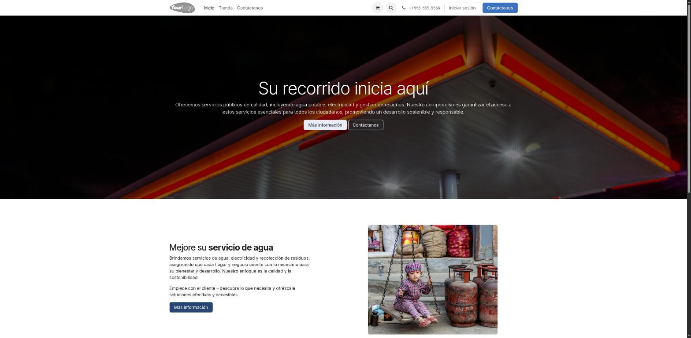
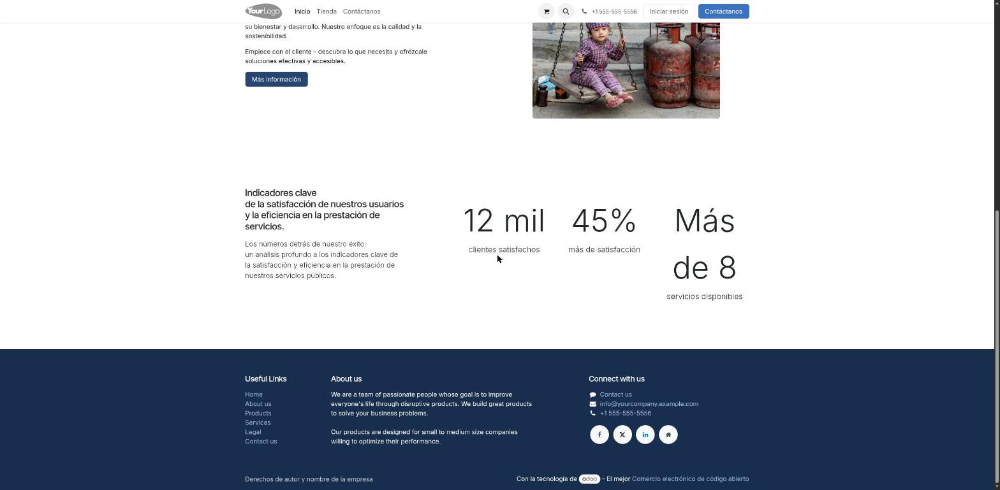

# Página de inicio pública (`/`)

> Estado: **propuesta** (2026-07-28), verificada contra `intn_demo` corriendo en
> 8069 y contra el sitio institucional www.intn.gov.py.
>
> Complementa [`portal_navegacion.md`](portal_navegacion.md), que cubre la
> navegación **una vez dentro** del portal. Este documento cubre lo que ve
> alguien **antes de iniciar sesión**.

---

## 1. Qué hay hoy en `/`



La home es la plantilla que genera el asistente de Odoo, sin tocar. La página
entera son tres bloques:

| Bloque | Contenido real hoy |
|---|---|
| Hero | «Su recorrido inicia aquí» — *«Ofrecemos servicios públicos de calidad, incluyendo agua potable, electricidad y gestión de residuos»*, sobre una foto de una estación de servicio |
| Sección | «Mejore su **servicio de agua**», con una foto de garrafas de GLP |
| Indicadores | «12 mil clientes satisfechos», «45% más de satisfacción», «Más de 8 servicios disponibles» |



Y alrededor:

- **Cabecera:** logo `YourLogo`, menú `Inicio / Tienda / Contáctanos`, carrito,
  teléfono `+1 555-555-5556`, «Iniciar sesión».
- **Pie:** textos de demo en inglés («We are a team of passionate people…»),
  `info@yourcompany.example.com`, «Con la tecnología de Odoo – El mejor
  Comercio electrónico».
- **Compañía:** `res.company` id 1 sigue siendo *My Company (San Francisco)*,
  con teléfono y dirección de EE. UU. `intn_brand_theme` escribe el logo, los
  colores y el favicon (`data/res_company_branding.xml`, `noupdate="1"`), pero
  no el nombre, el teléfono, el correo ni la dirección: por eso la cabecera y
  el pie siguen mostrando los datos de demo.
- **Websites:** siguen existiendo los dos registros sin dominio (`My Website`,
  `My Website 2`), con 4 menús cada uno. Es el punto §5.1 de
  `portal_navegacion.md`, todavía sin resolver.

Ninguno de esos textos, fotos ni números tiene que ver con el INTN. Los
indicadores además son **cifras inventadas por el generador**: publicarlas desde
un organismo público es un problema en sí mismo.

---

## 2. El punto de partida: esto no es el sitio institucional

Es la decisión que ordena todo lo demás. **www.intn.gov.py ya es el sitio
institucional del INTN** y cubre:

- `Institución` (misión, estructura, autoridades, marco legal), `Acreditaciones`,
  `Transparencia`, `Denuncias`, `Contáctenos`.
- Los seis organismos: **OIAT** (Investigación y Asistencia Tecnológica),
  **ONC** (Certificación), **ONN** (Normalización), **ONI** (Inspección),
  **ONM** (Metrología) y **DSE** (Seguridad Eléctrica).
- Noticias, campañas («Paraguay Exige Calidad»), memberships (ISO, IEC),
  enlaces a ministerios, redes sociales, barra de accesibilidad.
- Un bloque de accesos rápidos donde una de las entradas es, literalmente,
  **«Portal de Clientes»**.

O sea: **este Odoo es el destino de ese enlace**. No es un competidor del sitio
institucional ni una landing de captación — el visitante ya decidió que quiere
hacer un trámite y viene derivado.

De ahí salen las cuatro tareas de la home, y ninguna es de marketing:

1. **Dejar entrar** al que ya es cliente.
2. **Dejar registrarse** al que no lo es, diciéndole de entrada que el alta
   requiere aprobación.
3. **Responder «¿qué trámites puedo hacer acá y qué necesito para hacerlos?»**
   antes de pedirle credenciales.
4. **Resolver lo poco que no necesita sesión** (ver §3.D).

Corolario: no duplicar noticias, organigrama, transparencia ni «quiénes somos».
Eso vive en intn.gov.py y ahí hay que enlazarlo.

---

## 3. Estructura propuesta

```
┌─────────────────────────────────────────────────────────────┐
│ [logo INTN]  Portal de Clientes        [ir a intn.gov.py] ▸  │  A
│              Trámites   Normas   Ayuda      [Iniciar sesión] │
├─────────────────────────────────────────────────────────────┤
│  Portal de Clientes del INTN                                 │
│  Solicite, dé seguimiento y descargue sus certificados.      │  B
│  [ Iniciar sesión ]  [ Crear cuenta ]                        │
├─────────────────────────────────────────────────────────────┤
│  ¿Qué trámites puede hacer?                                  │
│  ┌────────┐ ┌────────┐ ┌────────┐ ┌────────┐ ┌────────┐      │  C
│  │  ONM   │ │  ONI   │ │  OIAT  │ │  ONC   │ │  ONN   │      │
│  └────────┘ └────────┘ └────────┘ └────────┘ └────────┘      │
├─────────────────────────────────────────────────────────────┤
│  Sin iniciar sesión:  Normas Paraguayas · Verificar doc.     │  D
├─────────────────────────────────────────────────────────────┤
│  Antes de empezar: requisitos de la cuenta                   │  E
├─────────────────────────────────────────────────────────────┤
│  Pie institucional (dirección, horario, atención al cliente) │  F
└─────────────────────────────────────────────────────────────┘
```

### A. Cabecera con identidad real

Logo del INTN, la leyenda **«Portal de Clientes»** al lado (para que quede claro
que no es intn.gov.py) y un enlace de vuelta al sitio institucional.

Se van: `YourLogo`, `+1 555-555-5556`, «Contáctanos» como botón primario.
El carrito depende de §4.

### B. Entrada, no hero de marketing

Una franja institucional sobria — color de marca, sin foto de stock — con el
nombre del portal, **una** línea que diga para qué sirve y dos acciones:
`Iniciar sesión` y `Crear cuenta` (`/web/signup`, ya existe en
`rf_customer_registration`).

Sin fotos de archivo: un organismo de metrología y certificación se presenta con
tipografía y datos, no con banco de imágenes.

### C. «¿Qué trámites puede hacer?» — por organismo

El bloque principal. Una tarjeta por organismo, y dentro los trámites que el
portal **realmente** ofrece hoy:

| Organismo | Trámites que ya existen en el portal |
|---|---|
| **ONM** — Metrología | Verificación de cisternas (inicial, periódica, eventual, complementaria); surtidores/picos; aprobación de modelo |
| **ONI** — Inspección | Metalurgia, materiales de construcción, textil, muestreo, seguridad industrial, maquila, programa de inspección |
| **OIAT** — Investigación y Asistencia Tecnológica | Muestras de alimentos; combustibles y lubricantes (Normal, MIC, Barcazas) |
| **ONC** — Certificación | Certificación de personas, productos y sistemas |
| **ONN** — Normalización | Marca INTN; venta de Normas Paraguayas |

Cada tarjeta: qué es, **qué necesita tener a mano el cliente**, y un botón que
lleva a `/web/login?redirect=<ruta del formulario>` — quien ya tiene sesión cae
directo en el formulario; quien no, se loguea y llega igual.

> **DSE (Seguridad Eléctrica)** aparece en intn.gov.py pero **no tiene trámites
> en el portal**. No se lista, o se lista como «no disponible en línea» con el
> enlace institucional. Prometer un trámite que no existe es peor que no
> mencionarlo.

**Cómo se llenan estas tarjetas** es la decisión técnica de fondo: escritas a
mano envejecen mal (cada módulo nuevo de organismo las desactualiza). La
alternativa es derivarlas del catálogo que ya existe —
`service.request.category` y el catálogo de servicios—, filtrando lo publicado
en el portal. Ver §6.

### D. Lo que no necesita sesión

Acá hay que ser honestos con lo que hoy existe:

| Acceso | Estado real |
|---|---|
| **Normas Paraguayas** (`/shop`) | La tienda existe pero su catálogo **no está migrado** (0 de 887 productos). Es la Fase D de `portal_navegacion.md`. Hasta entonces no se anuncia. |
| **Verificar un documento por código** | Hoy la verificación pública sólo funciona por **enlace con token** desde el QR impreso (`/brand/verify/...`). Una página «ingrese el código del certificado» **no existe**: es trabajo nuevo. |
| **Consultar/pagar una factura** | `/pago/factura` y `/consultar/facturas/<ruc>` son **endpoints JSON de la API** (`intn_api_invoices`), no páginas. Tampoco hay página pública hoy. |

Es decir: **el bloque D arranca vacío**. O se pospone, o se decide construir la
página de verificación por código — que es, de las tres, la que más consultas
telefónicas ahorra.

### E. «Antes de empezar»

Tres o cuatro líneas con lo que hoy sorprende al cliente nuevo: el registro
**requiere aprobación** del INTN antes del primer acceso (ver
`docs/portal/cuenta/registro-y-aprobacion.md`), qué datos de la empresa hacen
falta (RUC, establecimiento), y que la descarga de certificados se habilita
**una vez pagada** la factura.

Decirlo en la home evita el «me registré y no puedo entrar».

### F. Pie institucional

Reemplaza el pie de demo: dirección real, teléfonos, horario de atención,
correo de atención al cliente, y enlaces a intn.gov.py (Institución,
Transparencia, Denuncias). Se quitan «Powered by Odoo – Open Source eCommerce»,
`info@yourcompany.example.com` y el copyright de plantilla.

---

## 4. Qué no poner

- **Indicadores inventados.** Si se quieren cifras, tienen que salir del
  sistema y tener fuente; si no, no van.
- **Noticias y novedades.** Las publica intn.gov.py.
- **Fotos de stock.**
- **El carrito visible mientras la tienda no tenga catálogo.** Hoy `/shop`
  publica **26 muebles de la demo de Odoo**. Despublicarlos es la Fase A de
  `portal_navegacion.md` y es condición previa a enlazar «Normas» desde la home.

---

## 5. Bloqueos previos

1. **Decidir cuál de los dos websites sirve `/`.** Sigue sin resolverse
   (`portal_navegacion.md` §5.1) y acá pesa igual: el contenido se escribe
   contra un `website_id`, y si es el equivocado el trabajo no se ve.
2. **Completar la identidad de la compañía.** Nombre, RUC, dirección, teléfono
   y correo de `res.company` id 1 son los de la demo de Odoo y se filtran a la
   cabecera, al pie, a los correos y a los reportes.
3. **Idioma y textos.** El sitio sirve es_PY; todo texto nuevo tiene que entrar
   por `.po`, no hardcodeado en español dentro de la plantilla, salvo que se
   decida que el portal es monolingüe.

---

## 6. Cómo implementarlo

| Camino | A favor | En contra |
|---|---|---|
| **(a) Editor de website** | Inmediato; comunicación lo mantiene sin tocar código | No versiona en git, no se reproduce en otra base, no se testea con Playwright |
| **(b) Plantilla QWeb en un módulo** | Versionada, reproducible, traducible por `.po`, testeable | Cada cambio de texto pasa por deploy |

**Recomendación: (b), con matiz.** El contenido de la home es **estructural**
—qué organismos hay y qué trámites ofrecen—, no editorial: cambia cuando cambia
el sistema, no cuando cambia una campaña. Va como plantilla QWeb en un módulo
(`intn_portal_home`, o dentro de `intn_brand_theme` si se prefiere no sumar
módulos), con:

- las tarjetas del bloque C **derivadas del catálogo de servicios**, para que un
  organismo nuevo aparezca solo;
- los datos institucionales del bloque F leídos de `res.company`, no escritos en
  la plantilla;
- los textos de los bloques B y E como cadenas traducibles.

Y la verificación, como el resto del portal: un spec de Playwright que recorra
`/` sin sesión y deje las capturas en `docs/portal/_images/`.
