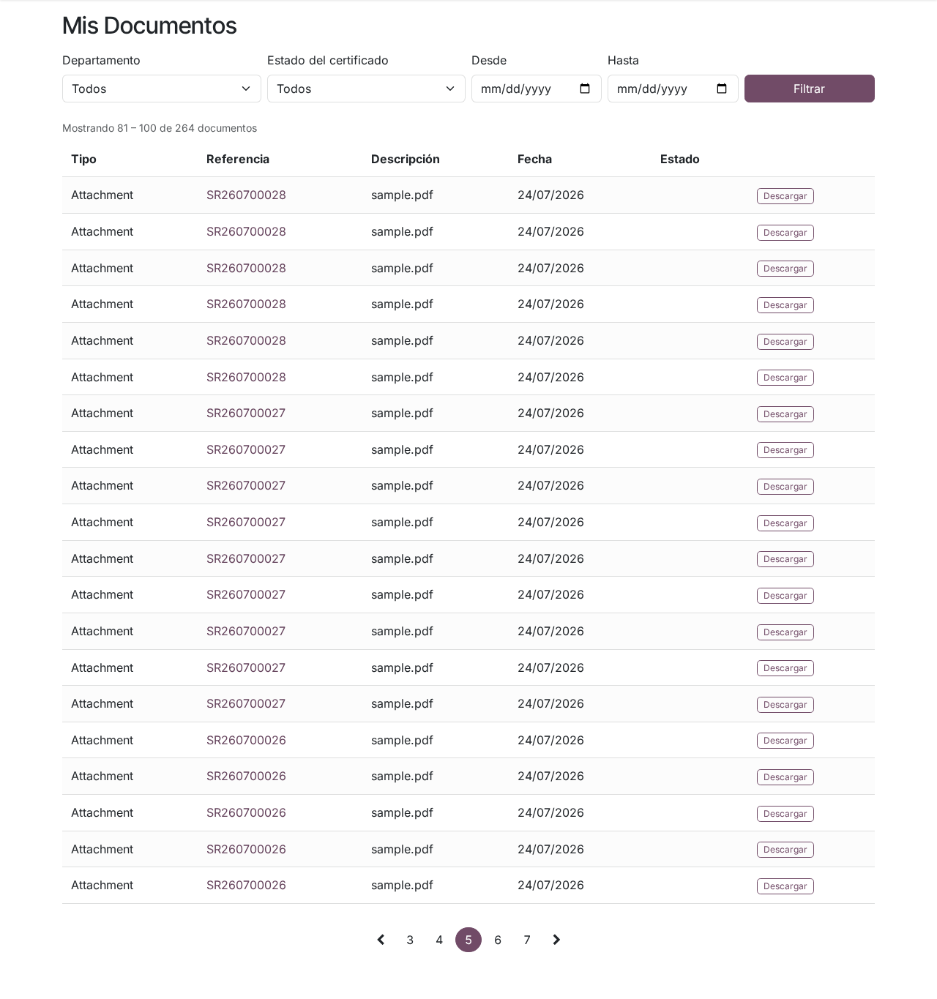

# Certificados de cisterna

## Para quién es esta guía

Clientes que necesitan consultar o descargar los certificados de cisterna emitidos por el INTN (con resultado aprobado, rechazado o de imposibilidad).

## Qué necesita antes de empezar

- Cuenta de portal habilitada ([registro y aprobación](../cuenta/registro-y-aprobacion.md)).
- Que el INTN haya **confirmado** el certificado del vehículo.
- **Pago** del expediente regularizado: para habilitar la descarga, todas las facturas emitidas del expediente deben estar pagadas, en proceso de pago o con pago parcial. Si el certificado no está asociado a un expediente de venta, la descarga no exige pago.

## Dónde encontrar sus certificados

Tiene tres caminos, todos con el mismo control de acceso (solo ve los certificados de su empresa y sus sucursales):

1. **Mis Certificados** (`/my/certificates`): tarjeta "Certificados" en la página principal de **Mi cuenta**.
2. **Mis documentos** (`/my/documents`): lista unificada de certificados y adjuntos de solicitudes.
3. El **detalle de la solicitud de servicio**: botón *Certificado de Inspección de Tanque* en la sección Reportes, disponible cuando el certificado está confirmado.

## Pasos

1. Ingrese al portal y abra **Mis Certificados**.

2. Ubique el certificado en la tabla, que muestra: **Número de Certificado**, **Tipo**, **Vehículo**, **Fecha de Verificación**, **Fecha de Vencimiento**, **Estado** y las acciones **Ver** y **Descargar**. Puede filtrar por estado (Todos, Confirmado, Vencido, Borrador) y ordenar por fecha de verificación, número o fecha de vencimiento.

3. Pulse **Ver** para abrir el detalle (`/my/certificate/<número>`): número, tipo, vehículo, solicitante, fecha de verificación, fecha de vencimiento y estado. En los certificados confirmados se muestra además un **código QR** que enlaza a la página del certificado para verificar su autenticidad en línea.

4. Pulse **Descargar** para obtener el **PDF**. Si la descarga aún no está habilitada, el botón aparece deshabilitado con una leyenda que indica el motivo (ver la sección siguiente).

   

5. Como alternativa, en **Mis documentos** puede filtrar por departamento, estado, rango de fechas o número de solicitud; cada fila de tipo "Certificado" ofrece el mismo botón de descarga, y las filas de tipo "Adjunto" permiten volver a bajar los documentos que usted subió con la solicitud.

## Condiciones para descargar

La descarga del PDF se habilita únicamente cuando se cumplen todas estas condiciones:

| Regla | Detalle | Mensaje si no se cumple |
|-------|---------|--------------------------|
| **Descarga permitida para el tipo** | INTN puede deshabilitar la descarga en portal para ciertos tipos de certificado | *"Download is disabled for this certificate type."* (la descarga está deshabilitada para este tipo de certificado) |
| **Pago registrado** | Deben existir facturas emitidas del expediente y todas deben estar pagadas, en proceso de pago o con pago parcial. Ciertos tipos de certificado pueden estar exentos de esta regla por política de INTN | En la lista: *"Disponible después de registrado el pago."* — en el detalle: *"Este certificado está disponible después de registrado el pago."* — al forzar la descarga: *"Este certificado no está disponible hasta que el servicio relacionado se pague."* |
| **Límite de descargas** | Cada versión del certificado admite un máximo de descargas por portal (2 por defecto; INTN puede cambiarlo por tipo o dejarlo ilimitado) | *"The maximum number of portal downloads for this certificate has been reached."* (se alcanzó el máximo de descargas) |

Cada descarga queda **registrada** por INTN (usuario, fecha y dirección IP). Si se emite una nueva versión del certificado, el contador de descargas comienza de nuevo.

## Estados y vigencia

- Estados del certificado: **Borrador** (en preparación), **Confirmado**, **Cancelado** y **Vencido**. El código QR de verificación solo se genera en certificados confirmados.
- El resultado registrado puede ser **Aprobado**, **Rechazado** o **Imposibilidad** (cuando la verificación no pudo realizarse; el certificado documenta el motivo).
- La **fecha de vencimiento** se calcula automáticamente a partir de la fecha de verificación más el período de validez definido para el tipo de certificado.
- Si desvincula el tracto de una cisterna desde **Mis vehículos**, los certificados vigentes de esa cisterna se cancelan (ver la [guía de solicitudes](solicitud-verificacion-onm.md)).

## Qué esperar después

- El certificado se descarga como archivo **PDF** en su navegador o dispositivo.
- Solo verá los certificados emitidos a su empresa (incluidas sus sucursales); las descargas dependen del pago y de la política del tipo de certificado.
- Los mensajes de bloqueo pueden mostrarse en inglés según la configuración de idioma del sistema.

## Si algo sale mal

| Problema | Causa habitual | Qué hacer |
|----------|----------------|-----------|
| No aparece el certificado | Aún no fue confirmado por el INTN, o corresponde a otra empresa | Espere la confirmación o verifique que ingresó con el usuario correcto; pruebe el filtro "Todos" |
| Botón Descargar deshabilitado con *"Disponible después de registrado el pago."* | Facturas del expediente pendientes de pago | Regularice el pago del expediente y vuelva a intentar |
| Mensaje *"The maximum number of portal downloads for this certificate has been reached."* | Se agotó el cupo de descargas de esa versión (2 por defecto) | Contacte a INTN si necesita descargas adicionales |
| Mensaje *"Download is disabled for this certificate type."* | La política de INTN no habilita la descarga en portal para ese tipo | Solicitar el documento directamente a INTN |
| El certificado figura **Vencido** | Pasó la fecha de vencimiento | Agendar la Verificación Periódica ([guía de solicitudes](solicitud-verificacion-onm.md)) |

## Trámites relacionados

- [Solicitud de verificación ONM](solicitud-verificacion-onm.md)
- [Multas y bloqueos del vehículo](multas-y-bloqueos.md)
- Gestión interna de certificados (backoffice): [../../admin/cisternas/certificados-cisterna.md](../../admin/cisternas/certificados-cisterna.md)
