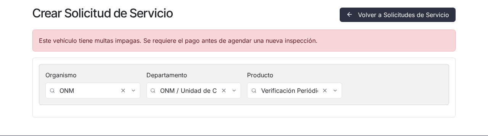
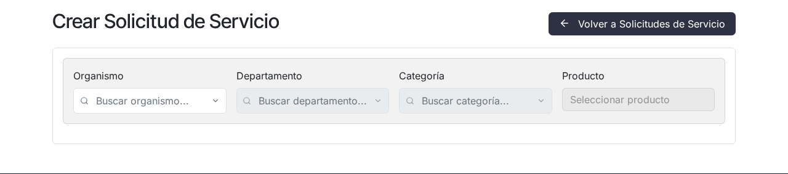

# Multas y bloqueos del vehículo

## Para quién es esta guía

Clientes que no pueden crear o confirmar una solicitud de verificación porque el vehículo tiene una multa impaga, un bloqueo activo o una restricción de agendamiento.

## Qué necesita antes de empezar

- Cuenta de portal habilitada.
- La chapa o identificación del vehículo afectado.
- Conocer el mensaje exacto que aparece al intentar solicitar el servicio (los mensajes de este tipo pueden mostrarse en inglés según la configuración de idioma del sistema).

## Por qué se bloquea una solicitud

Al pulsar **Enviar solicitud**, el portal verifica la situación del camión elegido. Existen tres impedimentos distintos:

1. **Multa impaga.** El vehículo tiene una multa de tipo "multa de vehículo" confirmada por INTN y aún no pagada. El formulario muestra en rojo:

   > *"This vehicle has unpaid fines. Payment is required before scheduling a new inspection."*
   > (Este vehículo tiene multas impagas; se requiere el pago antes de agendar una nueva inspección.)

2. **Bloqueo activo.** El vehículo tiene un bloqueo vigente, originado por irregularidades detectadas en la verificación o por **no presentarse a una cita agendada**. El mensaje es:

   > *"This vehicle has an active block. The block must be lifted before scheduling a new inspection."*
   > (Este vehículo tiene un bloqueo activo; debe levantarse antes de agendar una nueva inspección.)

3. **Restricción de agendamiento de 30 días.** Se aplica al camión cuando **cancela una cita con menos de 48 horas** de anticipación (plazo configurable por INTN) o tras una inasistencia registrada. En este caso el impedimento se ve **antes de enviar**: en el selector el camión aparece con el sufijo "(restringido)" y, al elegirlo, se muestra la alerta:

   > *"Scheduling Restriction: This truck has a scheduling restriction for 30 days due to a previous no-show or late cancellation. Available from <fecha>."*
   > (Restricción de agendamiento: este camión tiene una restricción de 30 días por una inasistencia o cancelación tardía previa; disponible a partir de la fecha indicada.)

   Mientras la restricción esté activa, el botón de envío queda deshabilitado.

Estos controles se repiten cuando INTN intenta **confirmar** la cita, por lo que una multa registrada después del envío también puede frenar la confirmación.

Las sanciones vinculadas a precintos se gestionan por otro circuito y no impiden, por sí mismas, agendar una nueva verificación.

## Qué pasa si no asiste a la cita

Un proceso automático diario revisa las solicitudes en borrador o confirmadas cuya cita ya pasó sin que se haya registrado la inspección. Para cada una:

- Se genera un **bloqueo automático** del vehículo con el detalle *"Did not attend the scheduled inspection/review."* (no asistió a la inspección/revisión agendada).
- La solicitud pasa a estado **Cancelado** (sigue visible en **Mis solicitudes** con el filtro "Cancelado").
- La cita se elimina de **Mis citas**.

Además, si usted mismo cancela una cita dentro de las 48 horas previas, el portal se lo advierte antes de confirmar:

> *"Your appointment is in less than 48 hours. Cancelling now will result in a 30-day scheduling restriction."*
> (Su cita es en menos de 48 horas; cancelar ahora genera una restricción de agendamiento de 30 días.)

Si confirma la cancelación, el camión queda con la restricción de 30 días descrita arriba.

## Pasos

1. Ingrese al portal e intente crear una nueva solicitud para el vehículo afectado. El mensaje de multa o bloqueo aparece en un recuadro rojo en la parte superior del formulario al enviarlo; la restricción de 30 días se muestra directamente junto al selector de camión.

   

2. Anote el mensaje exacto y la chapa del vehículo; con eso INTN identifica si se trata de una multa, un bloqueo o una restricción temporal.

3. Según el caso:
   - **Multa impaga:** contacte al área de cisternas de INTN para regularizar el pago. Cuando INTN registra el pago, el vehículo vuelve a estar habilitado para agendar.
   - **Bloqueo activo:** el bloqueo debe ser **levantado por INTN** (por ejemplo, tras aclarar la inasistencia o la irregularidad). No tiene "pago" asociado en el portal.
   - **Restricción de 30 días:** no requiere gestión; vence sola en la fecha indicada en la alerta ("disponible a partir de …").

4. Una vez que INTN registre el pago o levante el bloqueo (o venza la restricción), vuelva a intentar la solicitud: el formulario ya le permitirá continuar.

   

## Qué esperar después

- Mientras la multa figure impaga o el bloqueo esté activo, no podrá agendar nuevas verificaciones para ese vehículo, y las solicitudes pendientes de ese vehículo no podrán ser confirmadas por INTN.
- Tras el pago registrado o el desbloqueo por parte de INTN, el vehículo queda habilitado de inmediato para nuevas solicitudes.
- Si su solicitud fue cancelada por inasistencia, no se reactiva: deberá crear una **nueva** solicitud una vez liberado el vehículo (y vencida la restricción de 30 días, si aplica).
- El portal no envía correos por multas o bloqueos; el estado se ve al intentar agendar.

## Si algo sale mal

| Problema | Mensaje que puede ver | Qué hacer |
|----------|-----------------------|-----------|
| Sigue bloqueado tras pagar | *"This vehicle has unpaid fines. Payment is required before scheduling a new inspection."* | INTN aún no marcó la multa como pagada: contactar al área de cisternas para completar el registro del pago |
| Bloqueo que no se levanta | *"This vehicle has an active block. The block must be lifted before scheduling a new inspection."* | El bloqueo se levanta solo desde INTN; consultar el motivo (irregularidad o inasistencia) y pedir el desbloqueo |
| Camión "(restringido)" en el selector | *"Scheduling Restriction: This truck has a scheduling restriction for 30 days due to a previous no-show or late cancellation. Available from <fecha>."* | Esperar a la fecha indicada; la restricción vence automáticamente a los 30 días |
| Aparece una multa o bloqueo que no esperaba | Detalle *"Did not attend the scheduled inspection/review."* | Se generó por inasistencia a una cita agendada; consultar con INTN y regularizar |
| Su solicitud "desapareció" | — | Fue cancelada (por inasistencia o cancelación): sigue visible en **Mis solicitudes** con el filtro "Cancelado"; cree una nueva solicitud tras la liberación del vehículo |

## Trámites relacionados

- [Solicitud de verificación ONM](solicitud-verificacion-onm.md)
- Gestión interna de multas y bloqueos (backoffice): [../../admin/cisternas/multas-bloqueos.md](../../admin/cisternas/multas-bloqueos.md)
