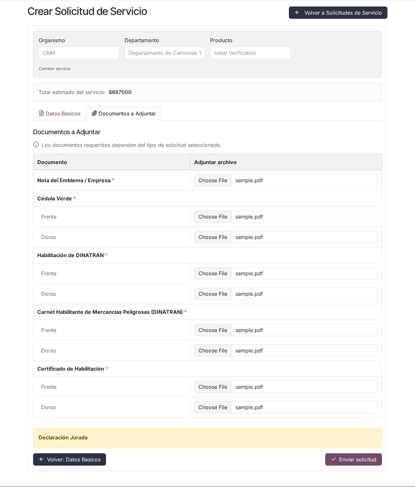
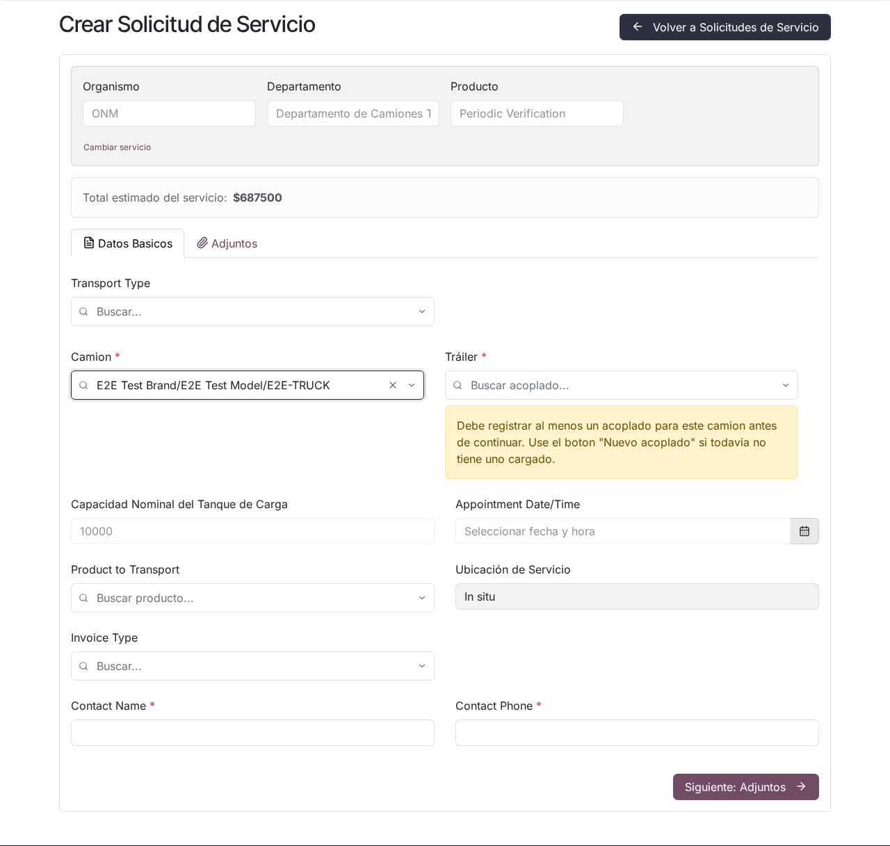
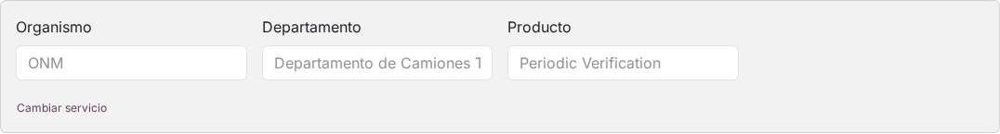
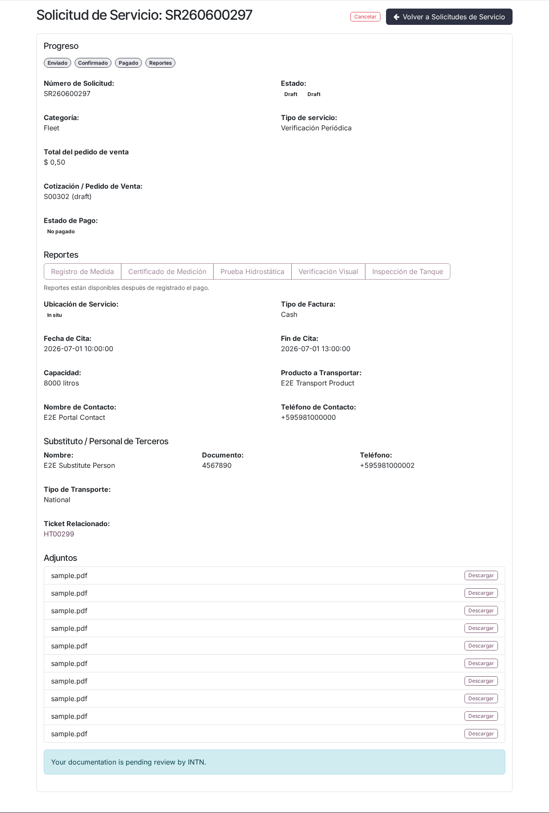
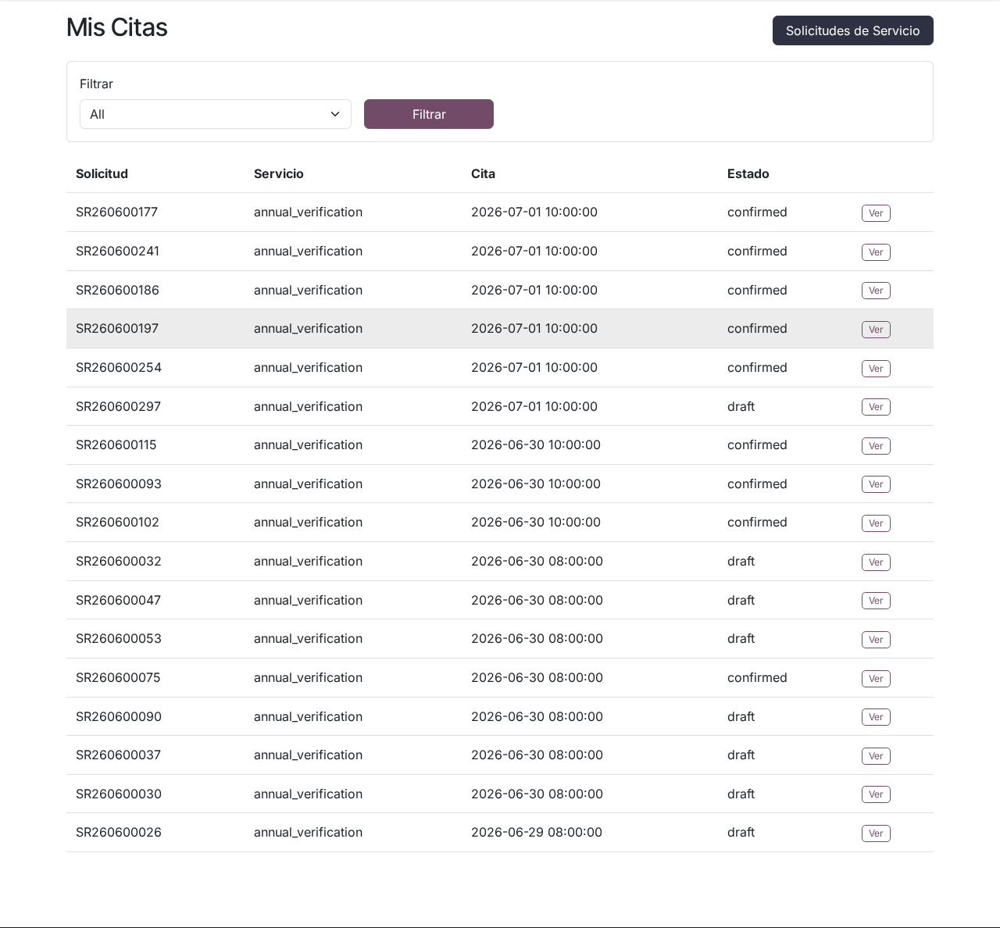
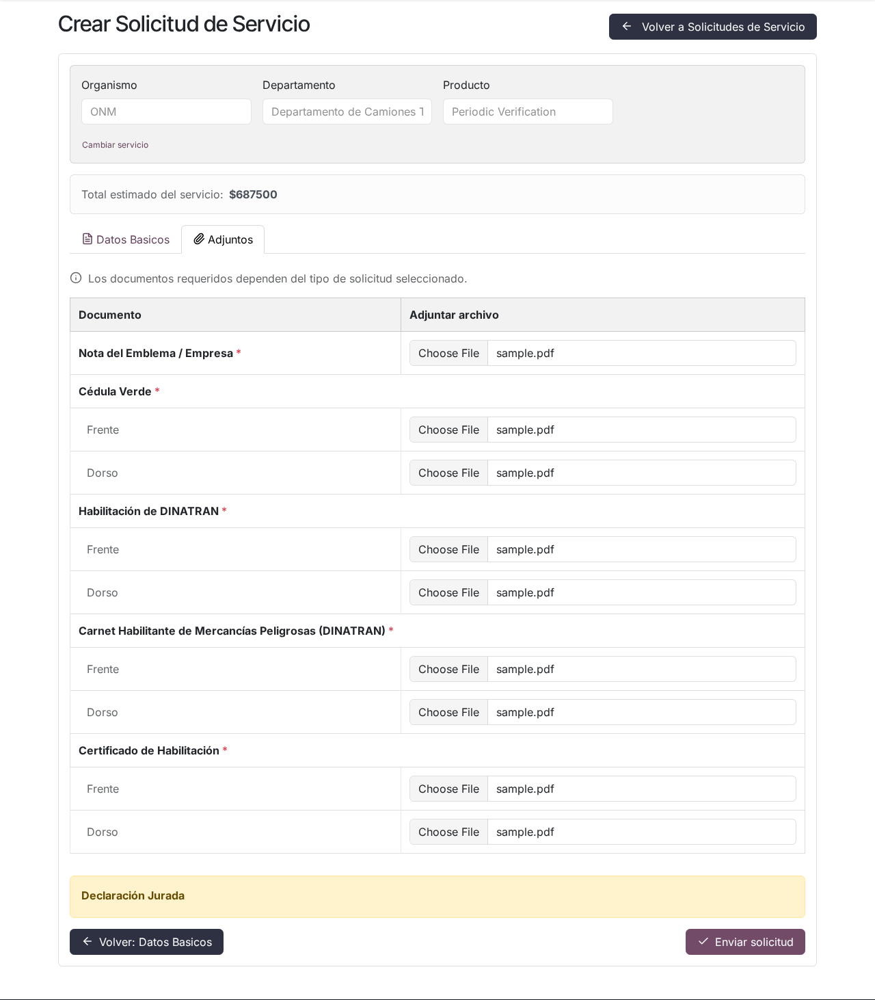
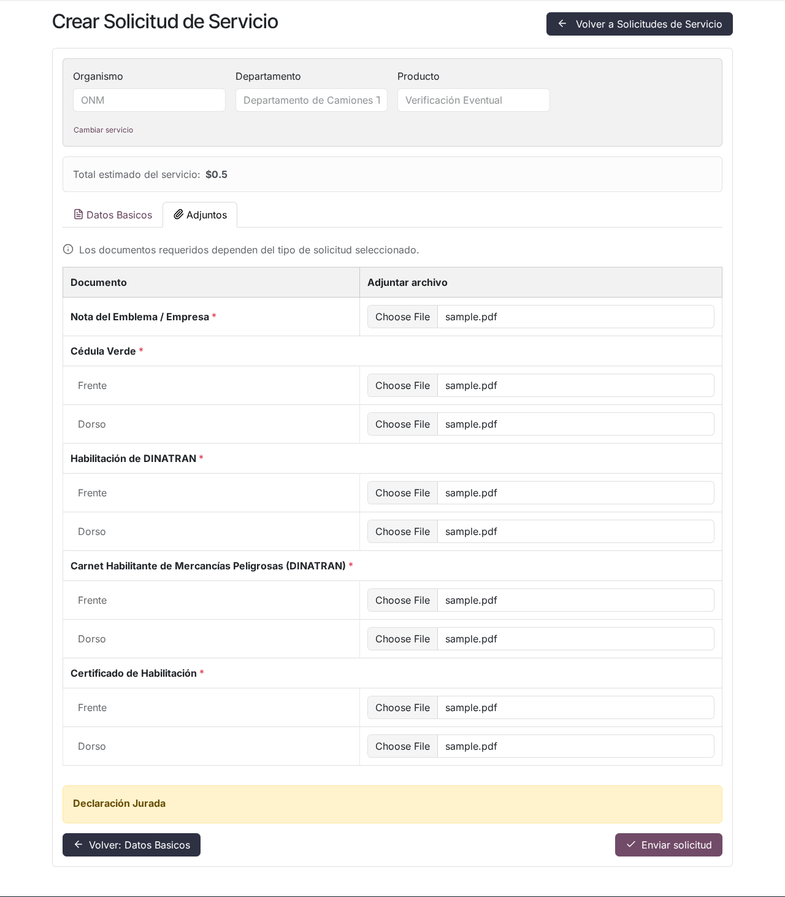
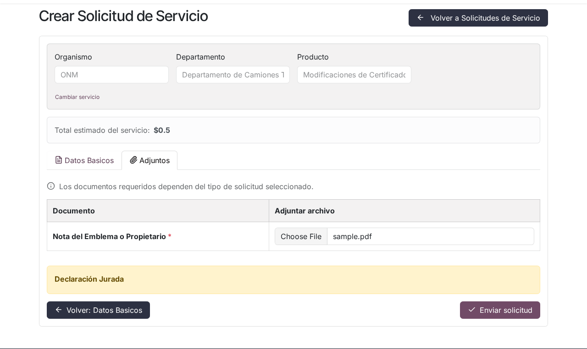
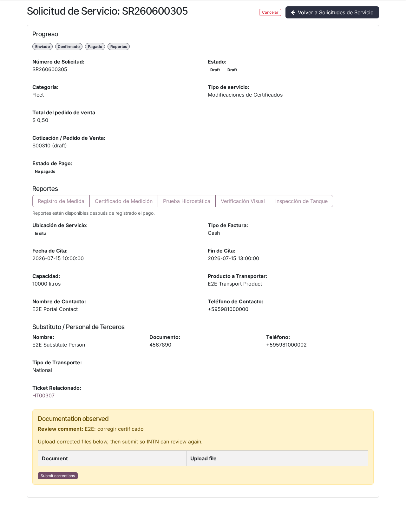

# Solicitud de verificación de cisternas (ONM) en el portal

## Para quién es esta guía

Empresas transportistas que necesitan agendar en línea servicios de cisternas: habilitación inicial, verificación periódica, eventual, complementaria o modificaciones de certificados. Usted elige el vehículo, la fecha de cita y adjunta los documentos obligatorios.

## Qué necesita antes de empezar

- Cuenta de portal **habilitada** ([registro y aprobación](../cuenta/registro-y-aprobacion.md)).
- Camión y remolque (cisterna) registrados en el portal, o crearlos desde el mismo formulario (solo disponible en Verificación Inicial).
- Los documentos digitalizados según el tipo de servicio (ver la tabla de abajo). El formulario acepta archivos **PDF, JPG y PNG**.
- El vehículo sin multas impagas, sin bloqueos y sin restricción de agendamiento vigente (ver [Multas y bloqueos](multas-y-bloqueos.md)).
- Para todo servicio que **no** sea Verificación Inicial: el camión (o su cisterna) debe tener un certificado de Verificación Inicial **vigente y confirmado**. Los camiones que no lo tienen ni siquiera aparecen en el selector; en ese caso el formulario muestra la aclaración: *"None of your company's trucks have an active Initial Verification, which is required for this type of service."* (ninguno de los camiones de su empresa tiene una Verificación Inicial activa).

### Documentos obligatorios por tipo de servicio

| Tipo de servicio | Cantidad de archivos | Documentos |
|------------------|----------------------|------------|
| **Verificación Inicial** (habilitación) | 9 | Cédula Verde (frente y dorso); Habilitación de DINATRAN (frente y dorso); Carnet Habilitante de Mercancías Peligrosas — DINATRAN (frente y dorso); Certificado de Habilitación (frente y dorso); Nota del Emblema / Empresa |
| **Verificación Periódica** | 9 | Iguales que en Verificación Inicial |
| **Verificación Eventual** | 9 | Iguales que en Verificación Inicial |
| **Verificación Complementaria** | 9 | Iguales que en Verificación Inicial |
| **Modificaciones de certificados** | 1 | Nota del Emblema o Propietario |

Los documentos "frente y dorso" se cargan como **dos archivos separados** (una fila *Frente* y una fila *Dorso* en la tabla de adjuntos). Todos los adjuntos de la tabla son obligatorios: si falta alguno, el envío se rechaza con el mensaje *"Missing required attachments: …"* seguido de la lista de documentos faltantes.

## Pasos

1. En **Mi cuenta**, abra **Mis solicitudes de servicio** y pulse **Nueva solicitud de servicio** (el formulario está en `/my/service_request/new`).

   

2. Complete la **cabecera en cascada** con selectores de búsqueda: **Organización** (ONM) → **Departamento** (Departamento de Camiones Tanque) → **Categoría** (si solo hay una opción, el portal la selecciona automáticamente y omite el paso) → **Producto** (Verificación Inicial, Verificación Periódica, Verificación Eventual, Verificación Complementaria o Modificaciones de Certificados). Pulse **Continuar** para desplegar el cuerpo del formulario. Si luego quiere cambiar de servicio, use el botón **Cambiar servicio** de la misma cabecera.

   

3. En la pestaña de **datos básicos**, complete:

   | Campo | Obligatorio | Comportamiento |
   |-------|-------------|----------------|
   | **Tipo de transporte** | Sí | Desplegable con dos opciones: **Nacional** o **Internacional** |
   | **Sucursal** | No | Solo aparece si su empresa tiene sucursales registradas; filtra los camiones y acoplados de esa sucursal |
   | **Camión** | Sí | Buscador con los camiones de su empresa. Fuera de Verificación Inicial, solo lista camiones con certificado vigente. Un camión con restricción de agendamiento aparece con el sufijo "(restringido)" |
   | **Tráiler** (cisterna) | Sí | Buscador de cisternas. Al elegir el camión, su cisterna vinculada se carga automáticamente; una cisterna ya vinculada a **otro** camión no se puede elegir. Si el camión no tiene ninguna cisterna, verá el aviso de que debe registrar al menos un acoplado antes de continuar |
   | **Capacidad Nominal del Tanque de Carga** | Sí | Campo de solo lectura: se completa automáticamente (en litros) al elegir el vehículo, sumando camión y cisterna |
   | **Fecha de agendamiento** | Sí | Calendario propio del portal; ver la sección "Cómo funciona la cita" |
   | **Producto a ser transportado** | Sí | Buscador sobre el catálogo de productos de transporte activos |
   | **Ubicación del servicio** | — | Solo lectura; el portal la deriva del servicio elegido (**En sitio** o **Laboratorio**) |
   | **Tipo de factura** | Sí | **Contado** o **Crédito** |
   | **Nombre de contacto** y **Teléfono de contacto** | Sí | Texto libre |

   - En **Verificación Inicial**, en lugar del bloque simple de contacto se piden tres secciones: **Datos del Representante Legal de la Empresa** (nombre, número de documento y correo obligatorios; teléfono opcional), **Datos del contacto de la empresa** (nombre, documento y correo obligatorios; teléfono opcional) y **Datos de Conductor Autorizado** (nombre y documento obligatorios; correo y teléfono opcionales). Si falta alguno, el envío se rechaza con un mensaje específico (por ejemplo *"Legal representative name is required."*).
   - En **Verificación Periódica, Complementaria y Eventual**, al elegir un camión ya habilitado el portal completa automáticamente la cisterna, el producto transportado y los datos de contacto a partir de la última habilitación confirmada; todos los campos siguen siendo editables.
   - En **Modificaciones de certificados** se agregan los campos propios de la modificación (ver el apartado de ese tipo de servicio, más abajo).

4. Observe el **Subtotal estimado del servicio**: se recalcula automáticamente al cambiar el servicio o la capacidad.

5. Si necesita dar de alta vehículos (solo en Verificación Inicial), use los botones **Nuevo Camión Tanque** o **Nuevo acoplado** (ver la sección "Alta de vehículos desde el formulario").

6. Pulse **Siguiente: Adjuntos** y suba **todos** los documentos del tipo de servicio elegido. En Verificación Inicial la pestaña se llama **Documentos a Adjuntar**; en los demás tipos, **Adjuntos**. Debajo de la tabla se muestra el texto de **Declaración Jurada** definido por INTN, que usted acepta al enviar. Si vuelve a subir un archivo para el mismo documento, el nuevo reemplaza al anterior.

7. Pulse **Enviar solicitud**. Si hay errores, el portal lo lleva al primer campo faltante o muestra el mensaje en un recuadro rojo en la parte superior. Si todo está correcto, se le redirige al detalle de la solicitud.

   - El botón de envío queda **deshabilitado** mientras la fecha elegida sea inválida (cupo lleno, feriado, etc.) o mientras el camión elegido tenga una restricción de agendamiento.
   - Si ya existe una solicitud **abierta** (borrador, confirmada o reagendada) del mismo tipo para ese camión o esa cisterna, el portal no crea un duplicado: lo redirige a la solicitud existente.

   

8. En el detalle verá: barra de **Progreso** (Enviado → Confirmado → Pagado → Reportes), estado, tipo de servicio, total (estimado o del pedido de venta), estado de pago, cita (fecha de inicio y fin), capacidad, producto, contacto, adjuntos enviados (descargables) y el vínculo al ticket de seguimiento. La cita también aparece en **Mis citas** (`/my/appointments`), con filtros **Próximas / Pasadas / Todas**.

   

9. Tras el pago (si corresponde), descargue los informes desde la sección **Reportes** del detalle: **Registro de Medida**, **Certificado de Medición**, **Prueba Hidrostática**, **Verificación Visual**, **Inspección de Tanque** y, cuando el certificado está confirmado, **Certificado de Inspección de Tanque**. Mientras el pago no esté registrado, los botones están deshabilitados y se muestra: *"Reportes están disponibles después de registrado el pago."*. Cada informe admite un número máximo de descargas (2 por defecto); superado el límite verá: *"The maximum number of portal downloads for this report has been reached."*. Los certificados también están en **Mis certificados** y **Mis documentos** ([guía de certificados](certificados.md)).

## Cómo funciona la cita (fecha y horario)

- El calendario del formulario solo permite fechas **a partir del día siguiente**; el día de hoy y fechas pasadas están deshabilitados.
- Al abrir el calendario, el portal consulta la disponibilidad del mes y **deshabilita (gris)** los días no seleccionables:
  - **Sábados y domingos** (si INTN mantiene activo el bloqueo de fines de semana, que es lo predeterminado).
  - **Feriados de INTN**.
  - Días **sin horario de atención** en el calendario laboral de INTN.
  - Para los tipos con cupo (Inicial, Periódica, Complementaria y Eventual): días en los que, sumando la capacidad de su vehículo a lo ya agendado, se **superaría el cupo diario de litros**; si cambia el vehículo (y con él la capacidad), el calendario se actualiza. Las fechas fuera de los rangos de cupo configurados por INTN también quedan bloqueadas.
- La **hora** se elige junto a la fecha (08:00 por defecto) y debe caer dentro del horario de atención.
- La validación se repite al enviar. Mensajes exactos que puede ver:
  - *"Cannot schedule on weekends."* — no se agenda en fines de semana.
  - *"Cannot schedule on holidays."* — no se agenda en feriados.
  - *"No puede seleccionar fuera del horario establecido por INTN: 08:00-12:00, …"* — la hora está fuera del horario de atención (se indican las franjas del día).
  - *"Limite de agendamientos alcanzado para la fecha. La siguiente fecha sugerida es: AAAA-MM-DD"* — cupo diario de litros completo; el sistema le sugiere la próxima fecha disponible.
  - *"Missing appointment date."* — no eligió fecha.
- **Modificaciones de certificados** exige fecha de cita pero está exenta de las reglas de cupo.

## Alta de vehículos desde el formulario

Solo disponible con el servicio **Verificación Inicial**. Los botones **Nuevo Camión Tanque** y **Nuevo acoplado** abren ventanas emergentes sin salir de la solicitud.

**Nuevo Camión Tanque** — sección *Datos del Tracto Camión*: Empresa (si tiene varias), Marca, Modelo (filtrado por la marca), Chasis, Año de Fabricación, Placa de Licencia, Código de Camión y Emblema; todos obligatorios. El alta de un camión nuevo **siempre incluye los datos del tanque** (cisterna): marca/modelo de la cisterna, chasis, chapa, año de fabricación, **Número de Compartimientos**, **Capacidad por Compartimiento (litros)** y la **Capacidad Nominal Total del Tanque de Carga**, calculada automáticamente a partir de los compartimientos.

**Nuevo acoplado** — datos del remolque cisterna: Empresa, Marca, Modelo, Chasis, Año de Fabricación, Placa, Código, compartimientos y capacidades, con las mismas reglas.

Validaciones que puede ver:

- Mientras escribe, el portal verifica duplicados: *"Ya existe un vehículo registrado con este valor."* junto al chasis o a la chapa repetidos, y al guardar: *"Corrija los errores de chasis o matrícula antes de guardar."*.
- Al enviar la solicitud, el servidor vuelve a controlar duplicados: *"This chassis number is already registered."* (chasis ya registrado), *"This license plate is already registered."* (chapa ya registrada) o *"This cistern plate is already registered."* (chapa de cisterna ya registrada).
- Las marcas, modelos y emblemas se **eligen del catálogo aprobado por INTN**; no se pueden crear desde el portal.

Importante: el vehículo cargado en la ventana emergente queda **pendiente** dentro del formulario (aparece en el selector como camión/acoplado nuevo) y **recién se registra cuando usted envía la solicitud**. Si abandona el formulario, no queda ningún vehículo a medias. Si intenta adjuntar un vehículo nuevo en otro tipo de servicio, el envío se rechaza: *"New vehicles can only be registered when the service type is Initial Verification."*.

## Tipos de servicio

### Verificación Inicial

Habilita por primera vez un conjunto camión–cisterna. Sube los **9** archivos de la tabla y completa las tres secciones de contactos (representante legal, contacto de la empresa y conductor autorizado); luego INTN revisa la documentación, confirma la solicitud e inicia la cadena técnica (verificación visual, inspección de tanque, hidrostática y medición) hasta emitir el certificado. Si no tiene vehículos registrados, puede darlos de alta desde el mismo formulario antes de enviar.

### Verificación Periódica

Renueva anualmente el certificado de un conjunto ya habilitado. Mismos **9** adjuntos. Al elegir un camión ya registrado, el portal completa automáticamente el remolque, el producto transportado y los contactos a partir de la última habilitación confirmada; todos los campos siguen siendo editables.

### Verificación Complementaria

Reemplazo o gestión complementaria de precintos u operaciones asociadas. Mismos **9** adjuntos y mismo autocompletado desde la última habilitación. No activa el ciclo de inspección técnica.

### Verificación Eventual

Verificación fuera del calendario periódico habitual. Mismos **9** adjuntos y mismo autocompletado desde la última habilitación.

### Modificaciones de certificados

Solicita cambios sobre un certificado vigente. El formulario pide el **Tipo de Modificación** con cuatro opciones: **Cambio de Emblema**, **Cambio de RUC** (puede figurar como *RUC Change*), **Cambio de Nombre de Compañía** o **Cambio de Nombre de Compañía y Emblema**. Según el subtipo:

- **Emblema**: el portal muestra en *Datos actuales* el emblema vigente (solo lectura, tomado del vehículo/certificado) y usted elige el **Nuevo emblema** del catálogo. El nuevo debe ser distinto del actual (*"New emblem must differ from the current emblem."*).
- **RUC**: se muestra el RUC actual y usted ingresa el **Nuevo RUC**, que debe ser distinto y ya estar registrado en el sistema; de lo contrario: *"The new RUC must already be registered in the system. Contact support if this company needs to be added first."*.
- **Nombre de compañía** (y su variante combinada con emblema): se muestra el nombre actual y usted ingresa el nuevo, que debe ser distinto del actual.

Requiere **1 adjunto obligatorio**: la **Nota del Emblema o Propietario**. También pide vehículo, cisterna, fecha de cita, producto y contacto, como los demás tipos, pero sin reglas de cupo diario.

## Cancelación de la cita

- En **Mis solicitudes** o en el detalle, las solicitudes en estado **Borrador** o **Confirmado** muestran el botón **Cancelar**. Se abre una ventana de confirmación: *"¿Está seguro de que desea cancelar esta solicitud?"*.
- Si cancela con **menos de 48 horas** de anticipación a la cita (plazo configurable por INTN), el portal pide una segunda confirmación con el aviso: *"Your appointment is in less than 48 hours. Cancelling now will result in a 30-day scheduling restriction."* (su cita es en menos de 48 horas; cancelar ahora genera una restricción de agendamiento de 30 días). Si confirma, el camión queda con **restricción de 30 días** (ver [Multas y bloqueos](multas-y-bloqueos.md)).
- Tras cancelar, la solicitud pasa a estado **Cancelado** y el cupo del día se libera.

## Correcciones tras una observación o rechazo

Si INTN **observa** o **rechaza** su documentación, verá una alerta en el detalle de la solicitud — *"Documentación observada"* o *"Documentación rechazada"* — con el comentario del revisor, y recibirá además un **correo electrónico** con asunto *"Documentation observed - <número>"* o *"Documentation rejected - <número>"* que incluye el comentario y el enlace directo a la solicitud.

En la misma alerta hay una tabla para subir los archivos corregidos (PDF, JPG o PNG) y el botón **Enviar correcciones**. Al subir al menos un archivo, la revisión vuelve automáticamente al estado *"Su documentación está pendiente de revisión por INTN."*. Los documentos solicitados dependen del tipo de servicio:

- **Verificación Inicial:** se vuelven a mostrar los **mismos 9** documentos del envío original.
- **Verificación Periódica:** el formulario de corrección pide la **Cédula Verde (frente y dorso)** y el **Certificado de verificación anterior** (no vuelve a pedir los documentos de DINATRAN).
- **Verificaciones Complementaria y Eventual:** los mismos 9 documentos del envío original.
- **Modificaciones de certificados:** la **Nota del Emblema o Propietario**.

Si envía el formulario de corrección sin adjuntar ningún archivo, la solicitud permanece observada.

## Mis vehículos — baja de camión y desvincular tracto

Desde **Mis vehículos** (`/my/vehicles`) puede gestionar el par camión–cisterna:

| Acción | Cuándo usarla | Efecto |
|--------|---------------|--------|
| **Desvincular tracto** (*Unlink tractor*) | Cambia de camión pero la cisterna sigue operativa | Cierra el vínculo tracto–cisterna y cancela los certificados vigentes de la cisterna; no archiva ningún vehículo |
| **Desvincular camión** (*Deactivate truck*) | Vende o deja de operar el tracto | Archiva el camión y lo desvincula de la cisterna; ya no aparece en nuevas solicitudes; se conserva el historial |

En el detalle de una **cisterna** (remolque) verá el tracto vinculado y el botón *Unlink tractor* cuando aplique. En el detalle de un **camión** activo verá *Deactivate truck*. Los datos maestros del vehículo no se pueden modificar desde el portal.

## Qué esperar después

- La solicitud queda en **Borrador** con la revisión documental **pendiente**. INTN revisa la documentación antes de confirmar.
- Cuando INTN **confirma** la solicitud, usted recibe un **correo electrónico** con asunto *"Service Request Confirmed - <número>"* que detalla la fecha y hora de la cita, el vehículo, el tipo de servicio y la capacidad, con enlace al detalle en el portal. Preséntese en la fecha elegida; las operaciones se realizan en planta.
- Si su documentación es observada o rechazada, recibe el correo correspondiente (ver sección anterior). No se envían otros avisos automáticos por correo.
- Para Verificación Inicial o Periódica, tras la confirmación sigue la cadena técnica y, al finalizar y con el pago registrado, podrá descargar informes y certificado desde el detalle, **Mis certificados** o **Mis documentos**.
- Si **no se presenta** a la cita, el sistema puede cancelar la solicitud y bloquear el vehículo automáticamente ([Multas y bloqueos](multas-y-bloqueos.md)).

## Si algo sale mal

| Problema | Mensaje que puede ver | Qué hacer |
|----------|-----------------------|-----------|
| El día aparece gris en el calendario | — | Fin de semana, feriado de INTN, día sin atención o cupo de litros completo: elija otro día |
| No acepta la fecha/hora al enviar | *"Cannot schedule on weekends."* / *"Cannot schedule on holidays."* / *"No puede seleccionar fuera del horario establecido por INTN: …"* / *"Limite de agendamientos alcanzado para la fecha. La siguiente fecha sugerida es: …"* | Elegir otro día u horario (el último mensaje ya le sugiere la próxima fecha libre) |
| No envía el formulario por adjuntos | *"Missing required attachments: …"* | Completar todos los archivos de la tabla (9 en las verificaciones; la nota en Modificaciones) |
| Faltan datos básicos | *"You must select a vehicle."*, *"You must select a trailer."*, *"Capacity is required"*, *"Product to transport is required."*, *"Contact name and phone are required."*, entre otros | Completar el campo indicado y reenviar |
| El camión no aparece en el selector | *"None of your company's trucks have an active Initial Verification, which is required for this type of service."* | Completar primero una Verificación Inicial para ese conjunto |
| Vehículo duplicado al darlo de alta | *"Ya existe un vehículo registrado con este valor."* / *"This chassis number is already registered."* / *"This license plate is already registered."* | Verificar chasis y chapa; si el vehículo ya existe, selecciónelo del buscador en lugar de crearlo |
| Bloqueo al crear la solicitud | *"This vehicle has unpaid fines. Payment is required before scheduling a new inspection."* / *"This vehicle has an active block. …"* | Regularizar la multa o el bloqueo ([Multas y bloqueos](multas-y-bloqueos.md)) |
| Camión restringido | *"Scheduling Restriction: This truck has a scheduling restriction for 30 days due to a previous no-show or late cancellation. Available from <fecha>."* | Esperar el fin de la restricción de 30 días |
| Vehículo sin certificado vigente | *"This vehicle has no valid certificate. An Initial Verification must be completed before requesting this service type."* | Solicitar primero la Verificación Inicial |
| No puede descargar los informes | *"Reportes están disponibles después de registrado el pago."* | Regularizar el pago del expediente |

Algunos mensajes de validación pueden mostrarse en inglés según la configuración de idioma del sistema.

## Trámites relacionados

- Registro y habilitación de la cuenta: [../cuenta/registro-y-aprobacion.md](../cuenta/registro-y-aprobacion.md)
- Certificados de cisterna en el portal: [certificados.md](certificados.md)
- Multas y bloqueos del vehículo: [multas-y-bloqueos.md](multas-y-bloqueos.md)
- Seguimiento interno de INTN (backoffice): [../../admin/cisternas/gestion-solicitudes-onm.md](../../admin/cisternas/gestion-solicitudes-onm.md)
