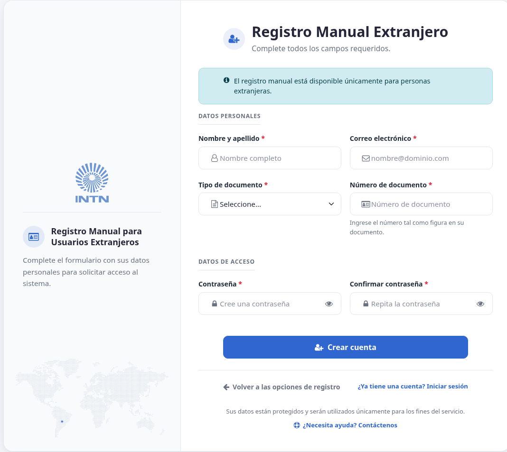
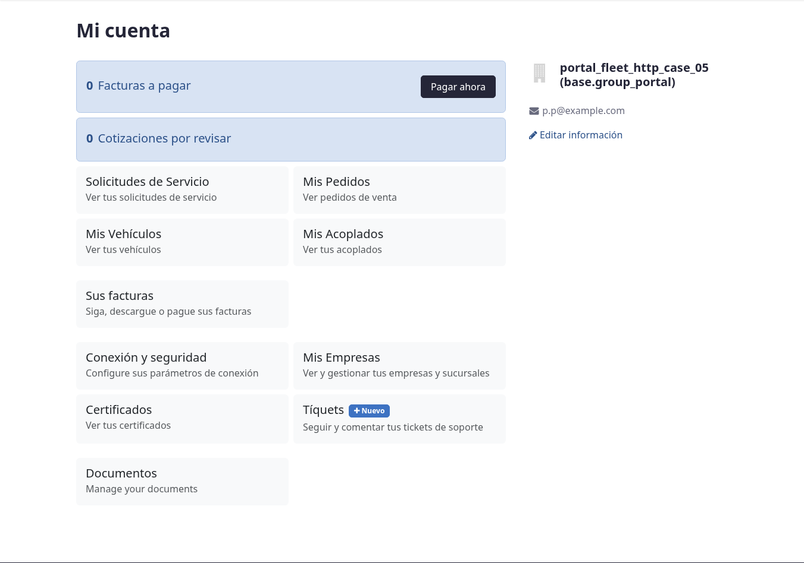
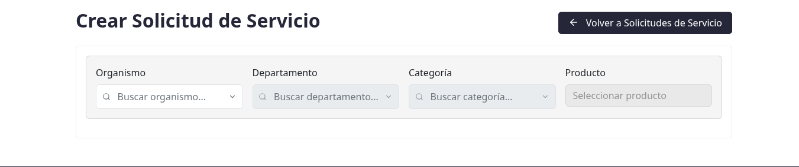

# Registro y habilitación de la cuenta

## Para quién es esta guía

Empresas nuevas que quieren registrarse en el sitio web de INTN para solicitar servicios, hacer seguimiento de sus trámites y comprar en línea.

## Qué necesita antes de empezar

- RUC y datos de la empresa a mano.
- Un correo electrónico válido (será su usuario y recibirá avisos en esa dirección).
- Un número de celular de contacto.
- Definir una contraseña para el acceso al portal.

## Pasos

1. Abra el sitio web de INTN y elija **Registrarse** (o **Sign up**).

   

2. Complete los campos del formulario. Los marcados con asterisco rojo son obligatorios:

   | Campo | Obligatorio | Detalle |
   |-------|-------------|---------|
   | Correo electrónico (*Your email*) | Sí | Será su usuario de acceso |
   | Documento de Identidad / RUC | Sí | Formato de ejemplo: `80012345-6` |
   | Razón Social / Nombre completo | Sí | Nombre de la empresa o de la persona |
   | Celular (*Mobile*) | Sí | Ejemplo: `+595 981 123456` |
   | Teléfono (*Phone*) | No | Ejemplo: `+595 21 123456` |
   | Contraseña y Confirmar contraseña | Sí | Deben coincidir y cumplir el largo mínimo configurado |

   Si deja un campo obligatorio vacío, verá el aviso debajo del campo: *"El campo Correo Electrónico es obligatorio."*, *"El campo RUC es obligatorio."*, *"El campo Razón Social / Nombre es obligatorio."* o *"El campo Celular es obligatorio."*. Si las contraseñas difieren: *"Las contraseñas no coinciden."*

   Al ingresar el RUC, el sistema puede consultarlo en línea y mostrar un mensaje de verificación debajo del campo (cuando INTN tiene activa esa consulta).

3. Si prefiere identificarse con un proveedor externo, use el botón **"Iniciar sesión con Identidad Electrónica (Solo Paraguayos)"** (MITIC) y siga las instrucciones en pantalla. En ese caso sus datos de identidad provienen de MITIC y no se editan manualmente.

4. Envíe el formulario. A partir de aquí pueden darse dos situaciones:

   - Si su empresa **ya estaba habilitada** por INTN, podrá iniciar sesión y entrar a **Mi cuenta** (`/my`) de inmediato.
   - Si su empresa **aún no está habilitada**, verá la pantalla **"Usuario registrado exitosamente"**: su solicitud fue recibida y su cuenta está en estado **Pendiente**. La misma pantalla indica: *"Nuestro equipo revisará su información y se pondrá en contacto con usted pronto. Una vez que su cuenta esté habilitada, podrá acceder al portal."*, muestra su **usuario registrado** (el correo) y el botón **Volver al login**.

5. Mientras la cuenta esté pendiente:

   - Si intenta iniciar sesión verá el aviso de que su cuenta fue creada correctamente pero está **pendiente de aprobación** y que será contactado para habilitar el acceso (*"Your account has been created successfully, but it is pending approval. We will contact you shortly to enable your access."*).
   - En la tienda en línea solo verá los productos públicos; no podrá comprar ni crear solicitudes.

6. La habilitación la realiza el personal de Atención al Cliente (ATC) de INTN, que recibe el aviso de su registro en el momento en que usted envía el formulario. El sistema **no envía un correo automático** al habilitarse la cuenta: el equipo de INTN se comunicará con usted, o bien puede probar iniciar sesión pasado un tiempo prudencial.

   

7. Ya habilitado, desde **Mi cuenta** podrá crear su primera solicitud de servicio.

   

## Qué esperar después

- Mientras la cuenta esté **pendiente de aprobación**, no podrá iniciar sesión, agregar productos al carrito, comprar ni crear solicitudes.
- Una vez habilitada, tendrá acceso completo al portal: solicitudes de servicio, seguimiento de trámites y tienda, según las reglas de INTN.
- Los tiempos de habilitación dependen de la verificación de sus datos por parte de ATC.

## Si algo sale mal

| Problema | Causa habitual | Qué hacer |
|----------|----------------|-----------|
| No puede entrar al portal tras registrarse (mensaje de cuenta pendiente de aprobación) | La empresa aún no fue habilitada por INTN | Esperar la habilitación; si demora, contactar a Atención al Cliente |
| No puede agregar productos al carrito ni comprar | Misma causa: cuenta no habilitada | Esperar la habilitación de la cuenta |
| Su cuenta ya fue habilitada pero sigue bloqueado | Sesión antigua o usuario incorrecto | Cerrar sesión y volver a iniciar sesión |
| El formulario no avanza | Falta un campo obligatorio (correo, RUC, nombre o celular) o las contraseñas no coinciden | Revisar los avisos en rojo debajo de cada campo |
| Error al validar el RUC | Servicio de validación no disponible temporalmente | Reintentar más tarde o contactar a INTN |
| Se registró dos veces por error | El aviso a INTN se envía una sola vez por empresa | No es necesario reenviar; contactar a ATC si tiene dudas |

## Trámites relacionados

- Solicitud de verificación de cisternas (ONM): [../cisternas/solicitud-verificacion-onm.md](../cisternas/solicitud-verificacion-onm.md)
- Aprobación de la cuenta por INTN (backoffice): [../../admin/registro-documentos/aprobacion-cuentas-atc.md](../../admin/registro-documentos/aprobacion-cuentas-atc.md)
