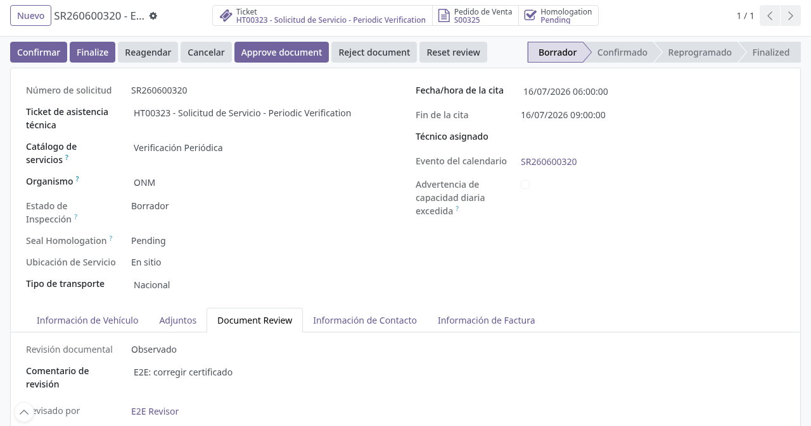
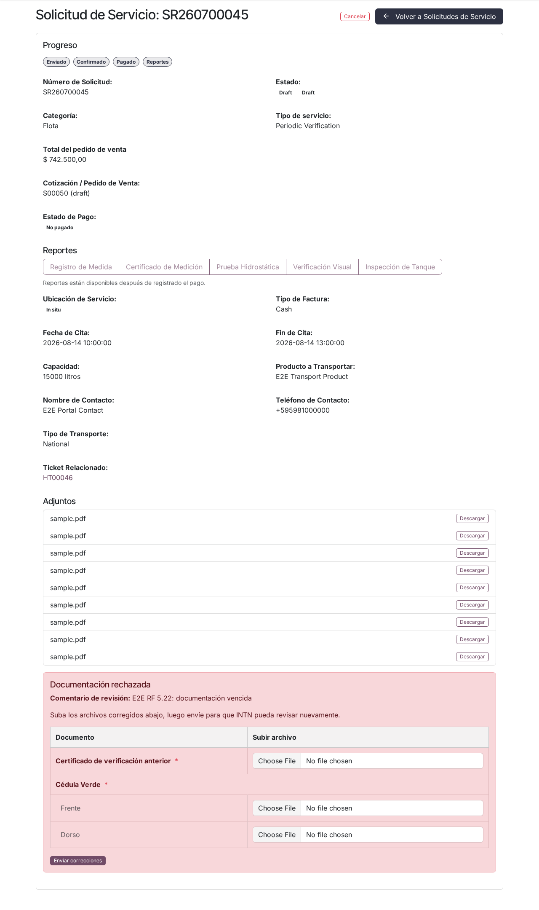
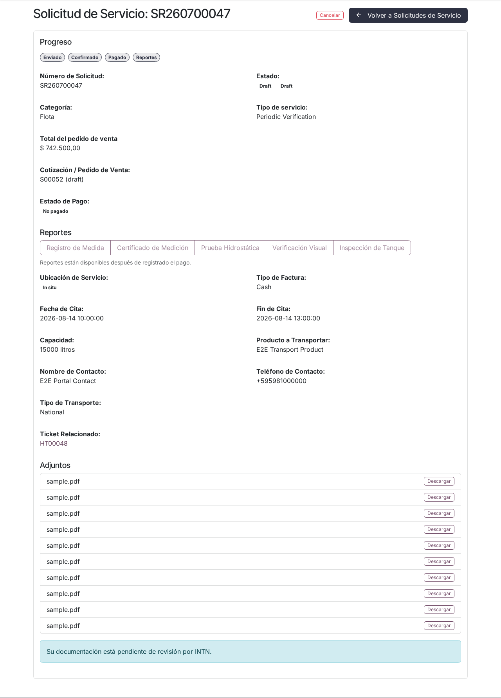
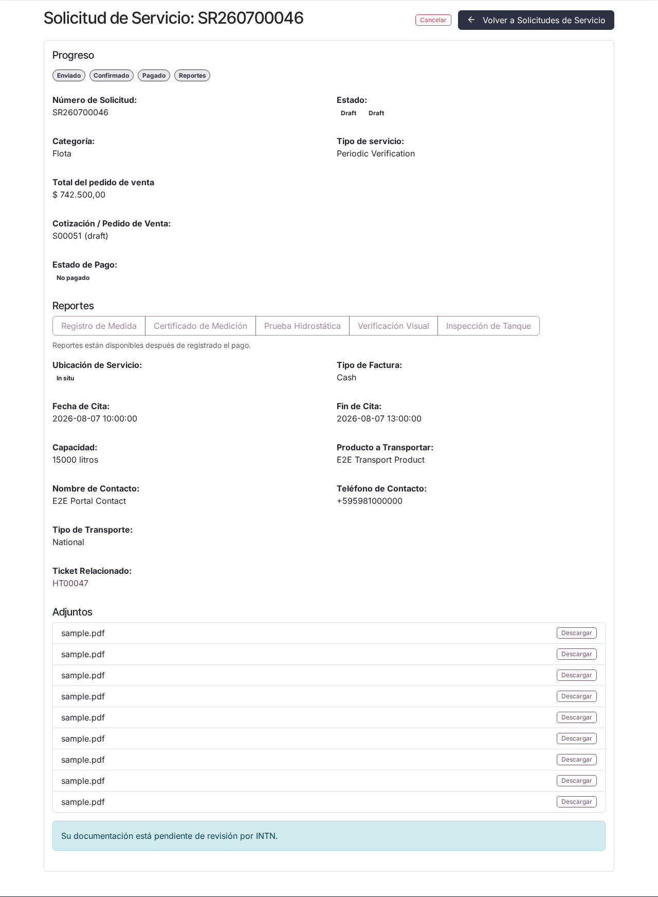

# Corrección de documentación observada o rechazada

## Para quién es esta guía

Clientes a quienes INTN **observó** o **rechazó** la documentación de un trámite (flota/cisternas, metrología de picos u otras solicitudes). Aquí verá cómo leer el aviso, subir los archivos corregidos y reenviarlos para una nueva revisión.

Usted **no** puede aprobar su propia documentación: solo INTN la aprueba. Su parte es subir los archivos correctos y reenviarlos.

## Qué necesita antes de empezar

- Cuenta de portal habilitada e iniciada con el usuario de su empresa ([registro y aprobación](../cuenta/registro-y-aprobacion.md)).
- El correo o el aviso de INTN indicando que la documentación fue observada o rechazada.
- Los archivos corregidos, según el comentario del revisor. El formulario acepta **PDF, JPG, JPEG y PNG**.

## Cómo se entera de la observación o el rechazo

- **Por correo** (si INTN tiene activa la notificación): recibirá un mensaje con asunto *"Documentation observed - (número de solicitud)"* (documentación observada) o *"Documentation rejected - (número)"* (documentación rechazada). El correo incluye el **comentario de revisión** de INTN y, en las solicitudes, el enlace directo a su trámite en el portal.
- **En el portal**: el detalle de su solicitud muestra un aviso destacado (ver pasos).

## Pasos

1. En **Mi cuenta**, abra la lista de solicitudes (`/my/service_requests`) y entre al detalle de la solicitud (`/my/service_request/...`; los enlaces antiguos de metrología redirigen automáticamente a esta misma página).

2. Lea el aviso y el **comentario de revisión** de INTN:
   - Aviso **amarillo** con el título **"Documentación observada"**: hay que corregir algo puntual.
   - Aviso **rojo** con el título **"Documentación rechazada"**: debe subsanarla y reenviarla.

   En ambos casos el aviso muestra el comentario del revisor y la indicación de subir los archivos corregidos y reenviarlos para que INTN revise de nuevo.

   

3. Dentro del mismo aviso hay una tabla con los **documentos del trámite** (solo los obligatorios, marcados con asterisco rojo; algunos, como la cédula verde, tienen fila de **frente** y **dorso**). Cargue el archivo corregido en la fila que indica el comentario. El formulario muestra los documentos propios de su tipo de trámite; por ejemplo, una verificación anual rechazada reaparece **sin** el campo de habilitación DINATRAN inicial.

   

   No necesita volver a subir todos los documentos: cada archivo nuevo **reemplaza** al anterior del mismo tipo; los que no toque se conservan.

4. Pulse **Enviar correcciones** (*Submit corrections*). Con al menos un archivo cargado, la solicitud vuelve sola a **Pendiente de revisión**; si no cargó ningún archivo, el envío se rechaza (*"Upload at least one corrected file before submitting."* — suba al menos un archivo corregido).

5. Verifique que el aviso cambió al recuadro azul **"Su documentación está pendiente de revisión por INTN."** Espere la nueva evaluación.

   

## Qué esperar después

- Mientras la documentación esté **pendiente de revisión**, no debe hacer nada: INTN la evaluará y le responderá.

  

- Si INTN vuelve a **observar** o **rechazar**, recibirá otro aviso con un nuevo comentario; repita el proceso las veces que haga falta.
- Cuando INTN **apruebe**, el trámite continúa su curso normal (confirmación, cadena técnica y emisión del documento, según corresponda). No recibirá un correo específico por la aprobación de la documentación; el avance se ve en el estado de la solicitud, y al finalizar el servicio recibirá el correo *"Your service is ready - (número)"* (su servicio está listo) si INTN tiene activo ese aviso.
- El formulario de corrección solo aparece con la documentación observada o rechazada; en cualquier otro estado no es posible reenviar (*"Corrections can only be submitted when the document is observed or rejected."*).

## Si algo sale mal

| Problema | Causa habitual | Qué hacer |
|----------|----------------|-----------|
| Pulsó Enviar correcciones y nada cambió | No cargó ningún archivo en la tabla | Cargar el archivo corregido en la fila indicada y volver a enviar |
| Subió archivos y sigue *observado* | Subió los archivos por otra vía, fuera del formulario del aviso | Usar la tabla del aviso amarillo/rojo y **Enviar correcciones** |
| No llega el correo de aviso | Notificación desactivada en INTN o correo desactualizado | Consultar el detalle de la solicitud en el portal directamente |
| No sabe qué corregir | Comentario del revisor poco claro | Contactar al área de INTN indicada en el aviso |
| El archivo no se adjunta | Formato no admitido | Usar PDF, JPG, JPEG o PNG |
| El trámite no avanza pese a aprobar | Falta pago o pasos técnicos posteriores | Revisar el pago del expediente y el estado del trámite |

## Trámites relacionados

- Mis documentos y descargas: [mis-documentos.md](mis-documentos.md)
- Solicitud de verificación de cisternas (ONM): [../cisternas/solicitud-verificacion-onm.md](../cisternas/solicitud-verificacion-onm.md)
- Revisión documental en INTN (backoffice): [../../admin/registro-documentos/revision-documental.md](../../admin/registro-documentos/revision-documental.md)
