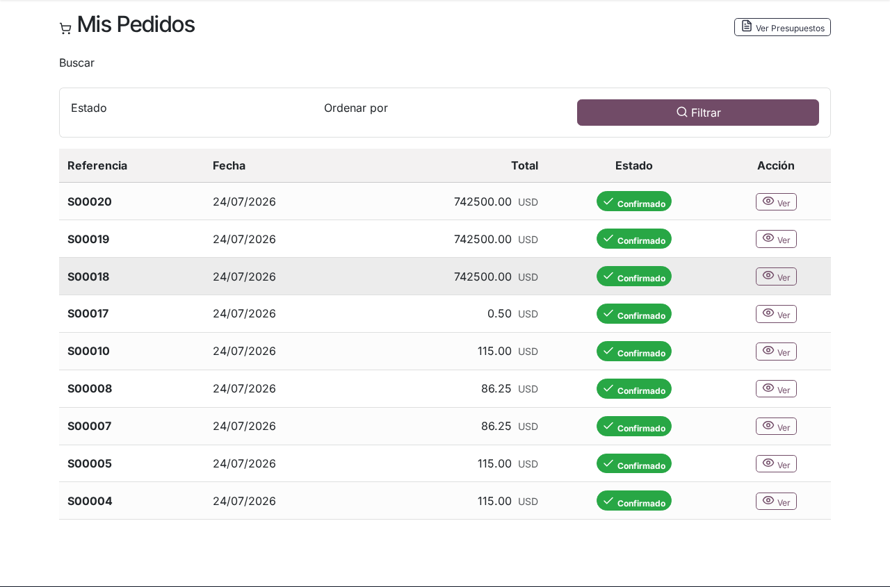
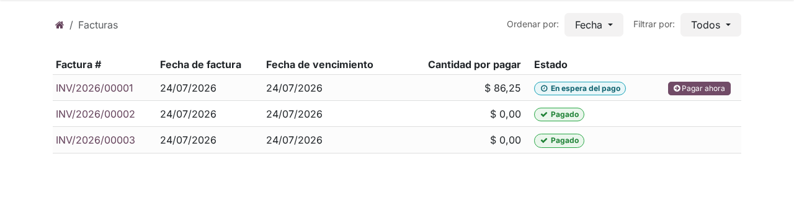

# Facturas y pagos en el portal

## Para quién es esta guía

Clientes que necesitan consultar el pedido y la factura de un trámite INTN, pagar en línea o por transferencia bancaria, y descargar los informes una vez acreditado el pago.

## Qué necesita antes de empezar

- Cuenta de portal **habilitada** ([registro y aprobación](../cuenta/registro-y-aprobacion.md)).
- Una solicitud de servicio ya creada, con su pedido o presupuesto asociado.
- Si va a pagar por transferencia: el comprobante bancario en **PDF, JPG o PNG**.

## Pasos

### Consultar su pedido o presupuesto

1. Ingrese al portal y abra el **pedido** o presupuesto asociado a su solicitud (si está publicado).

   

2. Revise las líneas, los importes y el estado: **presupuesto**, **pedido de venta** o **facturado**.

3. Si su trámite incluye traslado, viáticos o gastos administrativos, el pedido muestra una sección **Costos Adicionales** con esos conceptos agrupados por categoría (Traslado, Viáticos, Administrativos) y sus subtotales, separados de las líneas del servicio.

4. En el detalle de su **solicitud de servicio** también puede ver el número del pedido, su estado y el **estado de pago** del trámite (**Pagado** / **No pagado**).

### Consultar y pagar la factura

1. Abra la sección de **facturas** del portal o el enlace de pago que le comparta INTN. En la lista de facturas, cada factura muestra su estado y, si usted subió un comprobante de transferencia, una insignia con la revisión: **A verificar**, **Aprobado** o **Rechazado**.

   

2. **Para pagar en línea con PagoPar:** inicie el pago desde la factura y elija PagoPar. Será redirigido al sitio seguro de PagoPar, donde puede elegir el medio: tarjetas de crédito, QR, PIX, transferencia, Zimple, Tigo Money, Billetera Personal, pago móvil, Wally, Claro Money, Wepa, Aquí Pago, Pago Express o Infonet Cobranzas.
   - Complete el pago dentro de los **10 minutos**; si el tiempo expira, vuelva a iniciar el pago desde la factura.
   - Al terminar, PagoPar lo devuelve a la página de su factura en el portal. El pago se **acredita automáticamente**: la factura queda registrada como pagada sin trámites adicionales.

3. **Para pagar por transferencia bancaria:** inicie el pago desde la factura y elija la opción de transferencia bancaria. La página de estado del pago le muestra:
   - **Datos para la transferencia**: banco, número de cuenta, RUC de INTN y las instrucciones (visibles hasta que envíe su primer comprobante).
   - El formulario **Adjunte su comprobante** para subir el archivo (PDF, JPG o PNG) con el botón **Enviar comprobante**.

   Realice la transferencia en su banco, suba el comprobante y espere la verificación. Verá un aviso confirmando que el comprobante se subió correctamente y que Tesorería de INTN lo revisará; si olvidó adjuntar el archivo, verá un aviso de error pidiendo seleccionar un comprobante antes de enviar.

4. **Seguimiento del comprobante de transferencia:**
   - **A verificar** — Tesorería de INTN revisará su comprobante. Puede descargar el archivo que subió para verificarlo.
   - **Aprobado** — verá el aviso *"Comprobante de transferencia aprobado."* y el pago se registra automáticamente sobre su factura; no necesita hacer nada más.
   - **Rechazado** — verá *"Comprobante de transferencia rechazado."* y el mensaje *"Comprobante rechazado. Por favor suba uno nuevo."*; corrija el problema (monto, legibilidad, referencia) y use **Enviar un nuevo comprobante**. Cada nuevo envío vuelve el estado a **A verificar**.

   La página de una factura publicada y pendiente de pago también incluye un recuadro **Comprobante de transferencia** con el mismo formulario **Adjunte su comprobante** / **Enviar comprobante**, por si necesita subir o reemplazar el archivo sin repetir el proceso de pago.

### Descargar los informes

1. Una vez que el pago quede **acreditado** (todas las facturas del pedido pagadas o con pago en proceso), el detalle de la solicitud muestra el estado **Pagado** y se habilitan los botones de descarga de los informes del trámite. También puede descargarlos desde **Mis documentos** ([mis documentos](mis-documentos.md)).

2. Mientras el pago no esté acreditado, los botones de informes aparecen deshabilitados con el aviso *"Reportes están disponibles después de registrado el pago."*; si intenta abrir un informe igualmente, verá la página **Reporte bloqueado** con el mensaje *"Este reporte no está disponible hasta que el servicio relacionado se pague."* y el enlace **Volver a la solicitud**.

## Qué esperar después

- Mientras el pedido no está confirmado, el portal puede mostrar un **total estimado**; el importe definitivo se refleja al confirmar el pedido oficial.
- Con **PagoPar**, el pago se acredita en el momento de forma automática; por **transferencia**, INTN debe aprobar el comprobante antes de registrar el pago y habilitar las descargas.
- Tras el pago acreditado se **desbloquean** las descargas de informes en el portal, y la solicitud pasa a mostrar **Pagado** con la fecha de habilitación de los reportes.
- En los trámites de **cisternas**, la aprobación de su transferencia también confirma automáticamente la solicitud para que continúe la etapa técnica.
- Los informes tienen un **límite de descargas** por documento; si lo alcanza, contacte a INTN para que le habiliten nuevas descargas.

## Si algo sale mal

| Problema | Causa habitual | Qué hacer |
|----------|----------------|-----------|
| No ve el pedido en el portal | Pedido no publicado o sesión con otro usuario | Verifique que inició sesión con la cuenta correcta; contacte a Ventas de INTN |
| El total del portal no coincide con la factura | Estimación vs pedido final | Es normal en estimación; el importe se ajusta al confirmar el pedido |
| El pago con PagoPar no se completó | Tiempo de pago vencido (10 minutos) o pago interrumpido | Vuelva a iniciar el pago desde la factura |
| Subió el comprobante pero no pasa nada | Estado **A verificar**: la revisión de Tesorería está pendiente | Espere la aprobación de INTN; recibirá el aviso en la factura |
| Su comprobante fue **Rechazado** | Datos ilegibles, monto o referencia incorrectos | Suba un comprobante nuevo con **Enviar un nuevo comprobante** |
| Aviso de que no se adjuntó archivo | Envió el formulario sin seleccionar el archivo | Seleccione el PDF o la imagen y vuelva a enviar |
| No puede descargar el informe tras pagar | Pago aún no conciliado o transferencia sin aprobar | Espere la acreditación; verá **Pagado** en la solicitud cuando esté lista |
| Página "Reporte bloqueado" al abrir un informe | El servicio aún figura sin pagar, o se alcanzó el límite de descargas | Espere la acreditación del pago; si ya pagó y persiste, contacte a INTN |

## Trámites relacionados

- Mis documentos: [mis-documentos.md](mis-documentos.md)
- Seguimiento interno del expediente (backoffice): [../../admin/ventas-caja/expedientes-ventas-convenios.md](../../admin/ventas-caja/expedientes-ventas-convenios.md)
- Pagos y caja (backoffice): [../../admin/ventas-caja/contabilidad-caja-pagos.md](../../admin/ventas-caja/contabilidad-caja-pagos.md)
