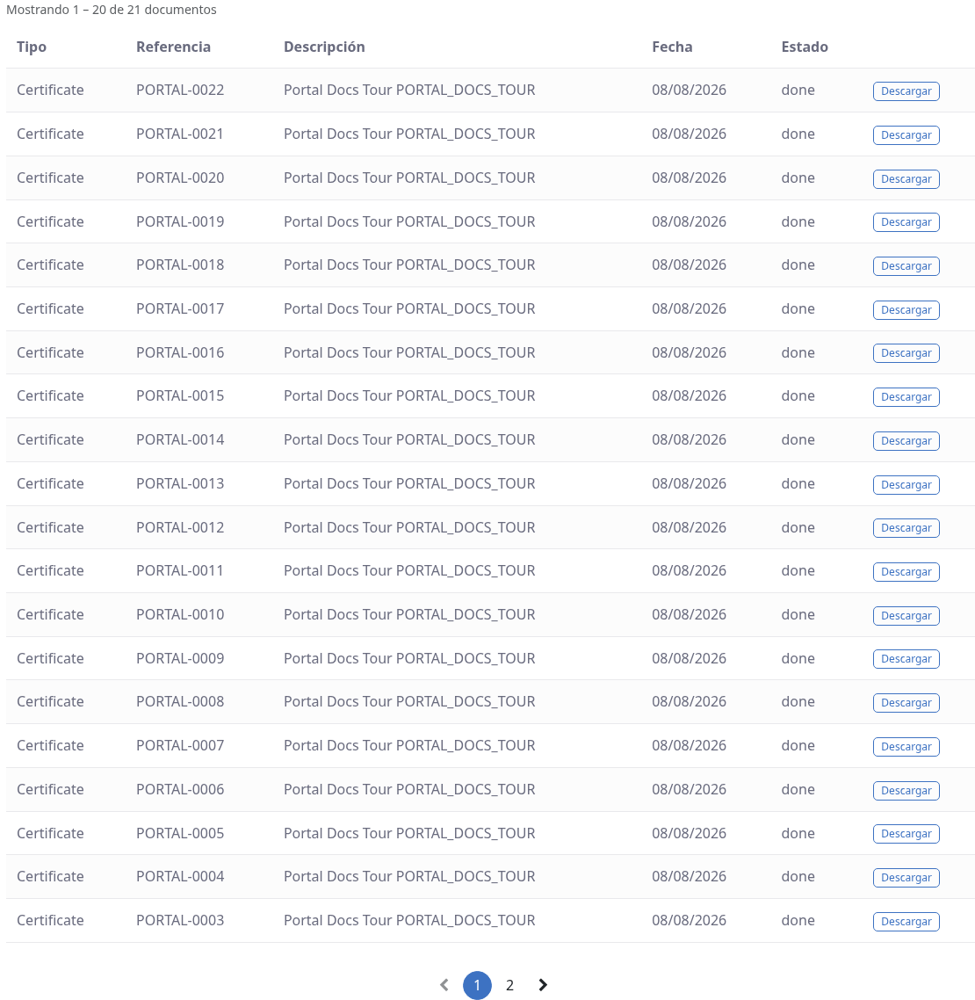
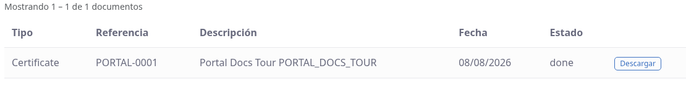
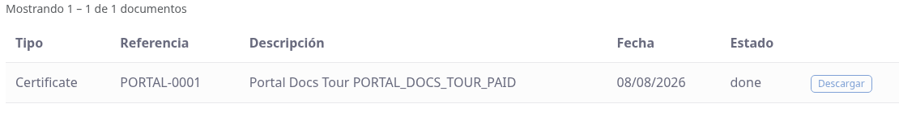

# Mis documentos y descargas en el portal

## Para quién es esta guía

Clientes que necesitan consultar y descargar los PDF oficiales de sus trámites: certificados emitidos, informes de solicitudes de flota y adjuntos que subió. Desde aquí también verá cuándo un documento está bloqueado por un pago pendiente o por haber agotado sus descargas.

## Qué necesita antes de empezar

- Cuenta de portal habilitada e iniciada con el usuario de su empresa ([registro y aprobación](../cuenta/registro-y-aprobacion.md)).
- Los trámites que generan el documento ya finalizados por INTN. Un certificado aparece en la lista solo cuando está **confirmado** (o vencido); mientras esté en preparación no se muestra.
- Los pagos al día si el documento exige cobro previo.

## Pasos

1. Inicie sesión en el portal y abra **Mis documentos** (`/my/documents`).

   

2. Revise la lista unificada. Cada fila indica el tipo (**Certificado** o **Adjunto**), la referencia (número del certificado o de la solicitud), la descripción (tipo de certificado o nombre del archivo), la fecha, el estado del certificado y el botón de descarga. En los adjuntos, la referencia muestra el número de la solicitud a la que pertenecen.

3. Si tiene muchos archivos, use los **filtros** de la parte superior y pulse **Filtrar** (*Filter*):

   | Filtro | Opciones |
   |--------|----------|
   | Departamento | Todos / Flota (*Fleet*) / Metrología (*Metrology*) / Genérico (*Generic*) |
   | Estado del certificado | Todos / Confirmado (*Confirmed*) / Vencido (*Expired*) |
   | Desde / Hasta | Rango de fechas (fecha de verificación del certificado o fecha de subida del adjunto) |

   La lista muestra **20 archivos por página**, con el texto "Showing X – Y of Z documents" (mostrando X a Y de Z) y el paginador al final.

4. Pulse el botón de **descarga** (*Download*) en el archivo que necesite. El PDF se guarda en su equipo. Los **adjuntos que usted subió** se descargan siempre, sin límite; los **certificados** pasan por los controles del punto siguiente.

   

5. Si el certificado está bloqueado, el botón aparece deshabilitado o al intentar descargar verá la página **"Descarga de certificado bloqueada"** con uno de estos tres mensajes:

   | Mensaje | Motivo | Qué hacer |
   |---------|--------|-----------|
   | *"Este certificado no está disponible hasta que el servicio relacionado se pague."* | El expediente tiene facturas pendientes | Regularizar el pedido o la factura ([facturas-y-pagos.md](facturas-y-pagos.md)) y reintentar |
   | *"The maximum number of portal downloads for this certificate has been reached."* (se alcanzó el máximo de descargas) | Agotó el cupo de descargas de esa versión del documento | Contactar a INTN para una copia adicional |
   | *"Download is disabled for this certificate type."* (descarga deshabilitada para este tipo) | INTN no habilita la descarga en línea de ese tipo de certificado | Retirar el documento por el canal que indique INTN |

   

6. Para un adjunto o un informe concreto de una solicitud, también puede descargarlo desde el **detalle de la solicitud** (`/my/service_request/...`), sin pasar por Mis documentos. Los **informes** de la solicitud exigen igualmente el expediente pagado y tienen su propio límite de descargas.

## Límite de descargas en el portal

Cada certificado tiene un tope de descargas desde el portal (por defecto **2 por documento y versión**; INTN puede fijar otro tope por tipo de certificado o dejarlo sin límite). Al alcanzarlo verá el mensaje de límite y el PDF no se descargará. Si necesita una copia adicional, contacte a INTN: la reimpresión que hace INTN en el backend no consume su cupo del portal y genera una nueva versión del documento.

## Qué esperar después

- No hay un único "estado" del documento para el cliente; lo relevante es si el archivo está listado y si puede descargarlo.
- Cada descarga que hace desde el portal queda registrada en la auditoría interna de INTN (fecha, usuario y dirección de conexión).

## Si algo sale mal

| Problema | Causa habitual | Qué hacer |
|----------|----------------|-----------|
| No descarga el PDF y ve el mensaje de pago | Facturas del expediente sin pagar | Regularizar el pago ([facturas-y-pagos.md](facturas-y-pagos.md)) |
| Mensaje de límite de descargas | Ya usó las descargas permitidas en el portal | Contactar a INTN para una copia adicional |
| Mensaje de descarga deshabilitada | El tipo de certificado no se entrega en línea | Consultar a INTN el canal de retiro |
| El certificado no aparece en la lista | Aún no fue confirmado por INTN, o es de un tipo que no se publica en el portal | Esperar la confirmación; consultar a INTN |
| Lista vacía o "No documents found." | Sin certificados emitidos ni adjuntos, o los filtros son demasiado restrictivos | Quitar los filtros; verificar que el trámite esté en curso |
| Error 403 / acceso denegado | Sesión con el usuario de otra empresa | Cerrar sesión y entrar con la cuenta correcta |

## Trámites relacionados

- Corrección de documentos observados o rechazados: [correccion-documentos.md](correccion-documentos.md)
- Facturas y pagos (para desbloquear descargas): [facturas-y-pagos.md](facturas-y-pagos.md)
- Gestión interna de INTN (backoffice): [../../admin/registro-documentos/documentos-dms.md](../../admin/registro-documentos/documentos-dms.md)
