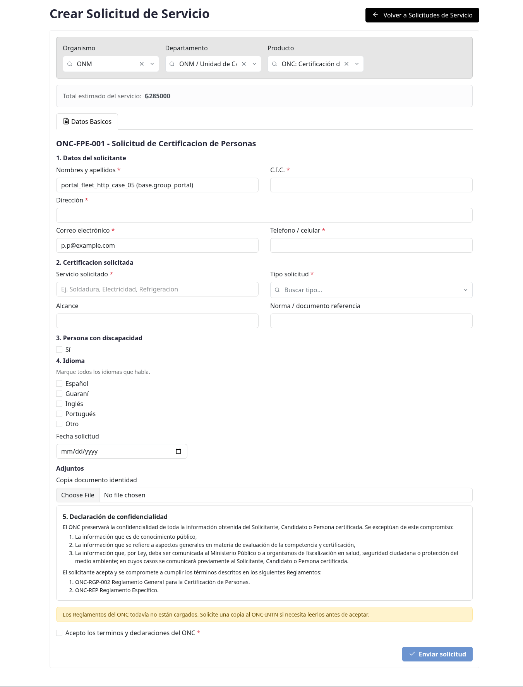
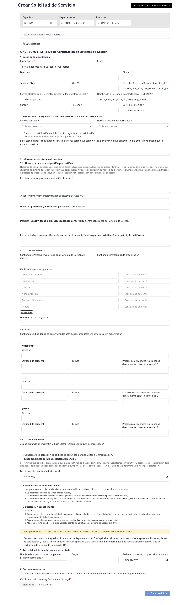
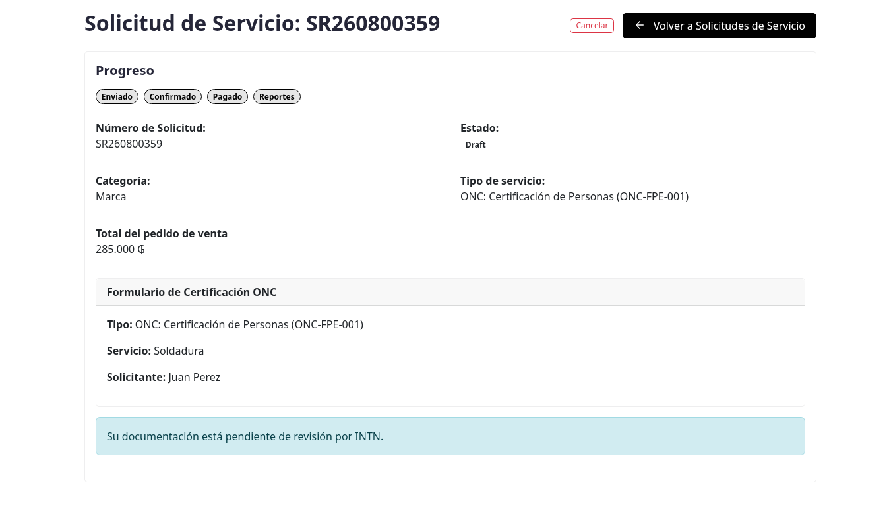
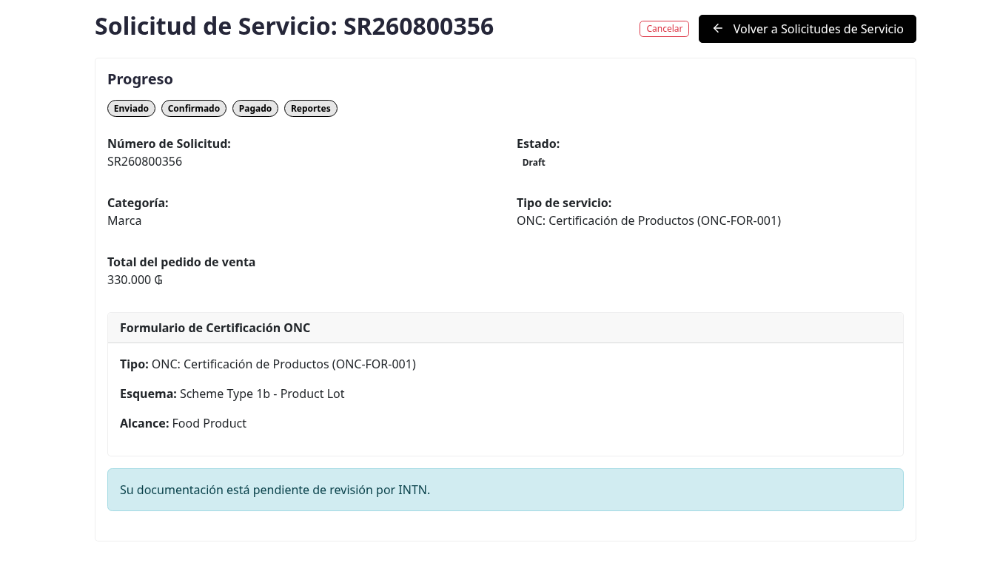
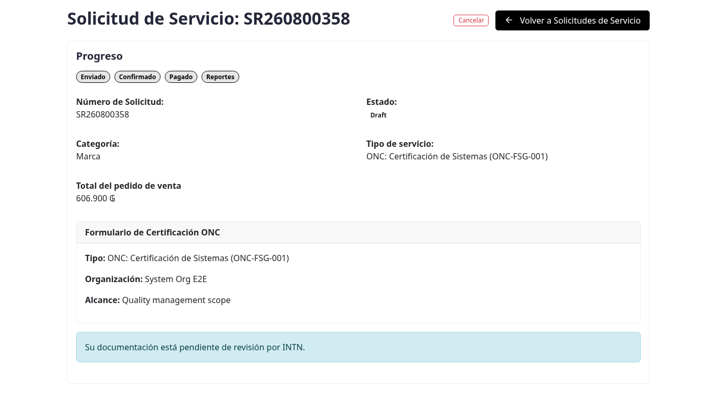

# Certificación ONC en el portal (productos, personas y sistemas)

## Para quién es esta guía

Clientes que necesitan solicitar ante el ONC la certificación de **productos** (formulario **ONC-FOR-001**), de **personas** (formulario **ONC-FPE-001**) o de **sistemas de gestión** (formulario **ONC-FSG-001**), enviando el formulario institucional desde el portal, sin adjuntar el PDF por correo.

## Qué necesita antes de empezar

- Cuenta de portal **habilitada** ([registro y aprobación](../cuenta/registro-y-aprobacion.md)).
- Tener actualizados los datos de su empresa en el portal (razón social, RUC, dirección, correo, teléfono): el sistema los usa para completar automáticamente varios campos del formulario.
- Para productos (**ONC-FOR-001**): tenga definido el **esquema de certificación** antes de empezar, porque tanto las secciones del formulario como los documentos obligatorios cambian según el esquema (1b, 2, 4, 5 o 6). Los esquemas 1b y 2 piden 6 documentos; el 4 y el 5, diez.
- Los documentos digitalizados que correspondan a su trámite (se aceptan PDF, JPG y PNG):
  - **Productos:** documentos obligatorios según el esquema elegido (vea la tabla más abajo).
  - **Personas:** la copia del documento de identidad es **obligatoria** desde agosto de 2026; sin ella el envío se rechaza.
  - **Sistemas:** certificado de existencia y representación legal **obligatorio**; el certificado de otro organismo y las autorizaciones de funcionamiento solo si corresponden a su caso.

## Pasos

1. En **Mi cuenta**, abra **Nueva solicitud de servicio** (`/my/service_request/new`).

   

2. En la cabecera del formulario, complete con los buscadores:
   - **Organismo**: **ONM**.
   - **Departamento**: **Departamento de Marcas y Certificacion**.
   - **Producto** (servicio), según el trámite:
     - Personas: **ONC: Person Certification (ONC-FPE-001)**.
     - Productos: **ONC: Product Certification (ONC-FOR-001)**.
     - Sistemas: **ONC: System Certification (ONC-FSG-001)**.

   Si eligió mal, use **Cambiar servicio** para volver a seleccionar; el sistema le pedirá confirmar porque se pierden los datos cargados.

3. Complete el formulario institucional que aparece en la pestaña **Datos Basicos**. Los campos marcados con asterisco rojo son obligatorios.

   **Personas (ONC-FPE-001):**
   - Datos del solicitante: **Nombres y apellidos**, **C.I.C.** (número de documento), **Dirección**, **Correo** y **Teléfono / celular** — todos obligatorios; varios se completan solos con los datos de su cuenta.
   - Sección **2. Certificación solicitada**: **Certificación solicitada** y **Tipo de solicitud**, ambos como listas desplegables que administra el ONC (ya no son texto libre).

     Al elegir la certificación, el formulario **acota el alcance y fija la norma**: solo verá los alcances de esa certificación, y la norma o documento de referencia aparece resuelta sola. Por ejemplo, al elegir **Técnico Electricista** el alcance ofrece únicamente **Categoría Electricista Tipo B1** y **Tipo B2**, y la norma queda en **Decreto N.º 9265/2018 / Res. DSE N.º 002/2021**. Mientras no elija una certificación, el alcance muestra el aviso "Elija primero una certificación".

     Si su caso no está en la lista, elija **Otros** y el formulario habilita un campo de texto para que lo especifique. Una certificación puede no tener alcance ni norma configurados; en ese caso esos campos quedan vacíos y no se piden.
   - Sección **4. Idioma**: marque **todos los idiomas que habla**, igual que en el formulario en papel (español, guaraní, inglés, portugués u otros). Debe marcar al menos uno; si marca **Otros**, el formulario le pide cuál.
   - En **Adjuntos**, la **Copia documento identidad** es **obligatoria**.
   - El formulario **ya no pide la fecha de solicitud**: la registra el sistema al recibirla.

   **Productos (ONC-FOR-001):**
   - Datos del solicitante: **Razón social**, **Representante legal**, **Correo** y **Dirección** (obligatorios; se completan con los datos de la empresa cuando existen).
   - **Esquema de certificación** (obligatorio). Cada opción muestra debajo el departamento del INTN que atiende ese esquema, porque desde la reestructuración de julio de 2026 este formulario cubre dos:
     - **Esquema Tipo 1b - Lote de Productos**, **Tipo 2**, **Tipo 4** y **Tipo 5 - Marca de Conformidad** → Departamento de Certificación de Productos (DCPR).
     - **Esquema Tipo 6 - Marca INTN Servicios** → Departamento de Certificación de Procesos y Servicios (DCPS).

     La lista la administra el ONC desde el backoffice, así que puede cambiar sin aviso previo en esta guía.
   - **Producto / alcance** (obligatorio): producto, familia, proceso o servicio a certificar.
   - Los datos de facturación y de la declaración se completan con la información registrada de su empresa; si falta algún dato exigido por el formulario institucional, el envío se rechaza indicando el campo faltante.

   **Sistemas (ONC-FSG-001):**

   El formulario sigue el orden del formulario en papel ONC-FSG-001 Rev.04, punto por punto.

   - **1. Datos de la organización:** **Razón social**, **RUC**, **Dirección**, **Ciudad**, teléfono/fax, sitio web, **Gerente, Director o Representante Legal** y su **correo electrónico**, más la **persona de contacto con el ONC-INTN** (nombre, cargo, teléfono y correo). Los marcados con asterisco son obligatorios; varios se completan solos con los datos de su cuenta.
   - **2. Servicio solicitado y norma:** **Servicio solicitado** (Preauditoría, Inicial, Renovación o Ampliación/Reducción) y **Norma o documento normativo** (**ISO 9001:2015**, **NP 38 004 17**, **NP 38 002 16** u **Otros**). Ambas listas las administra el ONC desde el backoffice. Si elige **Otros** en cualquiera de las dos, el formulario habilita un campo de texto para que especifique cuál.
     En este mismo punto se declara si **cuenta con certificación emitida por otro organismo** (al marcarlo se le pide cuál, y más abajo el certificado) y si contrató **consultoría o auditoría interna**.
   - **3.1 Alcance del sistema de gestión:** el alcance propuesto, cuánto tiempo lleva implementado, los productos y/o servicios, las actividades o procesos realizados por terceros, y los requisitos de la norma que son excluibles con su justificación.
   - **3.2 Datos del personal:** cantidad involucrada en el SGC, cantidad total de la organización, el detalle por área (con botón para agregar filas) y los horarios y turnos.
   - **3.3 Sitios:** cantidad de sitios y, por cada uno, dirección, cantidad de personal, turnos y procesos relacionados con el alcance.

     El formulario abre con tres sitios, como el papel, pero **ya no está limitado a tres**: el botón **Agregar otro sitio** suma los que necesite, y cada sitio agregado tiene un **Quitar** para sacarlo. El sitio principal es obligatorio y no se puede quitar.
   - **3.4 Datos adicionales:** distancia de la casa matriz a los otros sitios, y si las visitas requieren equipos de seguridad (al marcarlo se le pide detallarlos).
   - **4. Fechas esperadas:** fecha prevista para la auditoría inicial. Es tentativa y no implica aceptación.
   - **5 y 6. Declaraciones:** el texto de la declaración de confidencialidad del ONC y de la declaración del solicitante se muestra **en pantalla**, tal como figura en el formulario en papel. Léalo y **marque la casilla de aceptación**; sin esa casilla el formulario no se envía. Si el ONC cargó los Reglamentos, aparece además un botón para descargarlos.
   - **7. Autenticidad:** nombre y cargo de quien completó el formulario, y la fecha.

   

4. Suba los documentos. En los formularios de ONC los adjuntos se piden **dentro del mismo formulario** —en la sección que corresponda a cada trámite— y no en una pestaña aparte:
   - **Productos:** el formulario **sólo muestra los casilleros que corresponden al esquema elegido**, según la tabla del punto 6 del formulario institucional ONC-FOR-001 Rev. 08. Mientras no elija un esquema no se muestra ninguno.

     La lista la administra el ONC desde el backoffice: si agregan o quitan un documento, el formulario lo refleja sin que cambie esta guía. En agosto de 2026 el **ONC-RG-008** pasó a pedirse en los cinco esquemas.

     | Documento | 1b | 2 | 4 | 5 | 6 |
     |-----------|----|---|---|---|---|
     | Constancia de conformidad con el ONC-RG-001 (Reglamento General de Certificación de Productos) | Sí | Sí | Sí | Sí | Sí |
     | Declaración de conformidad del reglamento específico ONC RE | Sí | Sí | Sí | Sí | Sí |
     | Declaración de conformidad Reglamento General de Suspensión ONC-RG-008 | Sí | Sí | Sí | Sí | Sí |
     | Copia autenticada del acta de constitución del fabricante | — | — | Sí | Sí | — |
     | Poder legalizado del representante (empresas extranjeras) | — | — | Sí | Sí | — |
     | Registro Sanitario (RSPA y RE del INAN, o Certificado de la DINAVISA) | — | — | Sí | Sí | — |
     | Registro de la Marca Comercial del fabricante (MIC) | — | — | Sí | Sí | — |
     | Especificaciones del producto, incluyendo el diseño del empaque | Sí | Sí | Sí | Sí | Sí |
     | Documentos de Producción y/o del Sistema de Gestión de Calidad del fabricante | — | — | Sí | Sí | — |
     | Identificación del lote a ser certificado | Sí | — | — | — | — |
     | Documentos legales | Sí | Sí | Sí | Sí | Sí |

     En total: **1b y 2 piden 5 documentos; 4 y 5 piden 10**.

     > **Sobre el Esquema Tipo 6.** La tabla del punto 6 del formulario en papel no tiene columna para este esquema, aunque el punto 2 indica que le aplica. Hasta que el ONC lo defina, el portal le pide los cuatro documentos que el formulario exige a todos los esquemas por igual. Si su trámite es Tipo 6, consulte con el ONC antes de preparar la documentación.

   - **Personas:** la copia del documento de identidad es **opcional**.
   - **Sistemas:** el **certificado de existencia y representación legal** es **obligatorio**; el **certificado de otro organismo** y las **autorizaciones de funcionamiento** se exigen solo si declaró que cuenta con otra certificación o que requiere esas autorizaciones.

5. Marque la casilla **Acepto los terminos y declaraciones del ONC** (obligatoria) y pulse **Enviar solicitud**. Si falta un dato, el sistema muestra el mensaje del campo faltante (por ejemplo, "You must accept the declarations." si no marcó la declaración, o "Missing required attachments: …" con la lista de documentos obligatorios que no subió).

6. Al enviar, el sistema crea automáticamente y en un solo paso:
   - la **solicitud de servicio** (número tipo `SR…`) en estado **Borrador**;
   - el **ticket de atención** para el equipo **ONC Certification Requests**;
   - el **pedido de venta** (expediente) del servicio;
   - el registro del **formulario ONC** enviado, enlazado a la solicitud.

   Si por un problema de conexión envía dos veces el mismo formulario, el sistema detecta el reenvío y lo lleva a la misma solicitud, sin duplicarla.

7. El navegador lo lleva al **detalle de la solicitud**, donde verá la barra de **Progreso** (Enviado → Confirmado → Pagado → Reportes), el **Estado**, la **Categoría** (Brand), el **Tipo de servicio**, el **Total del pedido de venta** y el panel **ONC Certification Form** con el resumen de lo declarado (tipo, esquema/servicio y alcance). Mientras INTN no revise los documentos, se muestra el aviso "Your documentation is pending review by INTN." (su documentación está pendiente de revisión).

   

   

   

8. Verifique el avance en **Mis solicitudes** y, si aplica, pague el expediente ([facturas y pagos](../documentos-pagos/facturas-y-pagos.md)).

## Qué esperar después

- La solicitud queda en **Borrador** con expediente y ticket creados automáticamente. INTN revisa los datos y los adjuntos antes de continuar; la solicitud no puede confirmarse hasta que la revisión documental esté aprobada.
- Una vez **Confirmada**, el trámite sigue su curso; consulte el estado en **Mis solicitudes**.
- Si INTN observa la documentación, corrija y vuelva a subir el documento según el comentario del revisor.
- Desde el detalle puede **Cancelar** la solicitud mientras esté en trámite, o volver con **Volver a Solicitudes de Servicio**.

### Estados que verá en el detalle

| Estado | Significado | Qué hacer |
|--------|-------------|-----------|
| Borrador (Draft) | Creada, pendiente de INTN | Revisar datos y adjuntos; esperar la revisión documental |
| Confirmado | En trámite | Seguir el expediente y pagar si corresponde |
| Finalizado | Servicio cerrado | Consultar resultados |
| Cancelado | No continúa | Revisar el motivo con INTN |

## Si algo sale mal

| Problema | Causa habitual | Qué hacer |
|----------|----------------|-----------|
| No aparece el servicio ONC en la cabecera | Organismo o departamento incorrecto | Elegir **ONM** → **Departamento de Marcas y Certificacion** y buscar el producto **ONC: …** |
| El formulario aparece vacío o pide elegir el tipo | No se seleccionó el producto/servicio ONC | Elegir el servicio en el buscador **Producto** |
| Mensaje "You must accept the declarations." | Declaración sin marcar | Marcar **Acepto los terminos y declaraciones del ONC** |
| Mensaje "Certification scheme is required." | Esquema sin elegir (productos) | Seleccionar el esquema **antes** de enviar |
| Mensaje "Missing required attachments: …" | Faltan documentos obligatorios del esquema o del trámite | Subir los documentos listados en el mensaje y reenviar |
| Mensaje "Please select at least one language." | No marcó ningún idioma (personas) | Marcar al menos un idioma en la sección 4 |
| Mensaje "Please specify the language." | Marcó el idioma **Otros** sin detallarlo (personas) | Escribir el idioma en el campo de detalle |
| Mensaje "… is required." sobre un dato que no ve en pantalla | Falta ese dato en el perfil de su empresa | Completar los datos de la cuenta (dirección, ciudad, RUC, contacto) y reenviar |
| Se confunde con normas ONN | Es otro trámite y otra página | Usar [Compra de normas ONN](normas-onn.md) |

## Trámites relacionados

- Compra de normas ONN: [normas-onn.md](normas-onn.md)
- Etiquetas y trazabilidad de uso de marca: [etiquetas-trazabilidad.md](etiquetas-trazabilidad.md)
- Mis documentos: [../documentos-pagos/mis-documentos.md](../documentos-pagos/mis-documentos.md)
- Facturas y pagos: [../documentos-pagos/facturas-y-pagos.md](../documentos-pagos/facturas-y-pagos.md)
- Seguimiento interno de INTN (backoffice): [../../admin/marcas-onc/gestion-certificacion-onc.md](../../admin/marcas-onc/gestion-certificacion-onc.md)
