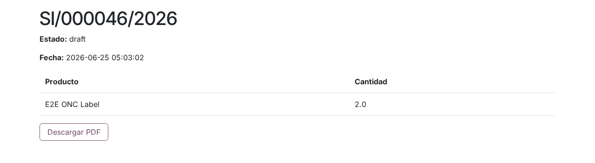
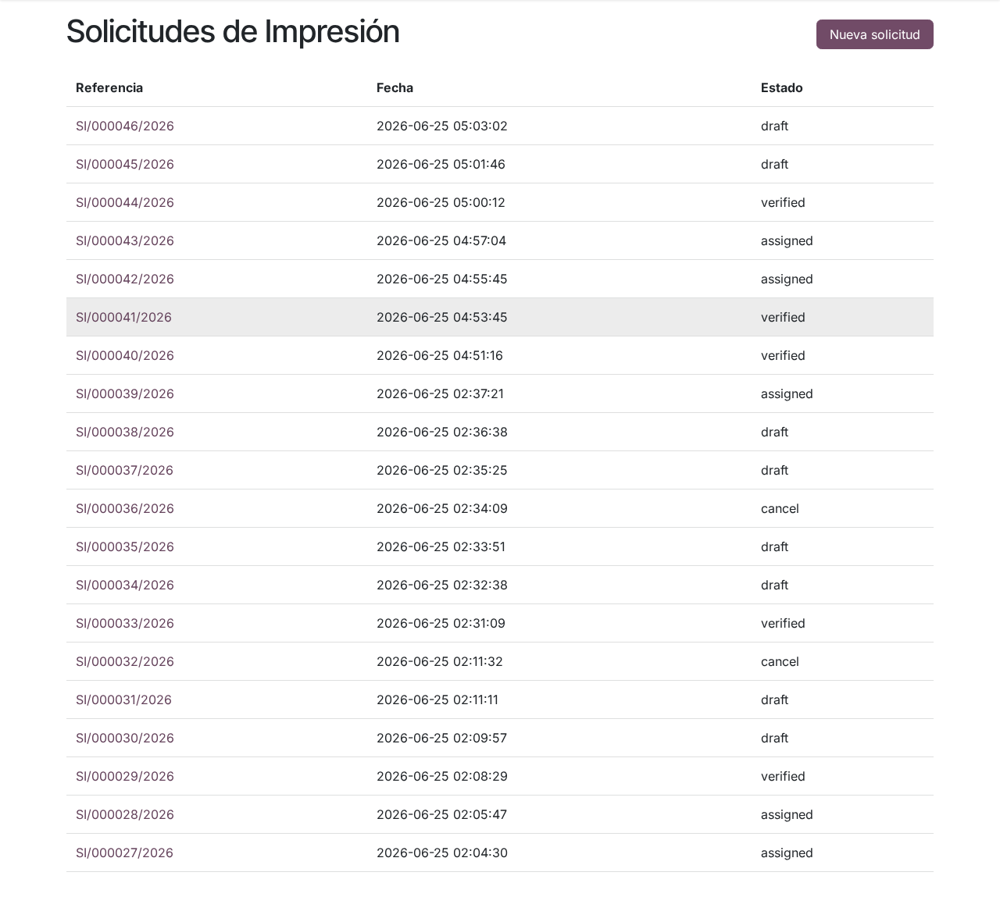

# Etiquetas ONC y saldo de impresión en el portal

## Para quién es esta guía

Clientes con licencia de uso de marca ONC que necesitan solicitar la **impresión de etiquetas** oficiales, consultar el estado de sus pedidos y los **saldos** disponibles para imprimir (certificados de lote y facturas/comprobantes de anillos).

## Qué necesita antes de empezar

- Cuenta de portal **habilitada** ([registro y aprobación](../cuenta/registro-y-aprobacion.md)).
- **Licencia de uso de marca** vigente a nombre de su empresa (la administra el ONC).
- **Saldo disponible** para imprimir. Según su caso puede provenir de:
  - **certificados de conformidad de lote** confirmados con kilos disponibles, y/o
  - **facturas / comprobantes** de compra de anillos confirmados por el ONC, y/o
  - el **saldo de impresión** general que el ONC carga a su nombre.
- La cantidad y el tipo de etiquetas o anillos que necesita imprimir.

## Pasos

1. Desde el portal, abra **Solicitudes de Impresión** (`/my/brand_print_requests`) y pulse **Nueva solicitud**.

2. En la página **Nueva Solicitud de Impresión** complete:
   - **Etiqueta**: elija el producto (etiqueta oficial) de la lista.
   - **Cantidad**: unidades a imprimir.
   - **Certificados de lote**: marque los certificados contra los que se descuenta la impresión; cada casilla muestra el saldo disponible en kg.
   - **Facturas / comprobantes**: marque los comprobantes de compra de anillos que respaldan el pedido.

   Pulse **Enviar**. El sistema crea el pedido con una referencia del tipo `SI/000000/AAAA` y avisa al ONC que la solicitud llegó desde el portal.

3. El navegador lo lleva al **detalle del pedido**, con el **Estado**, la **Fecha**, la tabla de **Producto** y **Cantidad**, y el botón **Descargar PDF** para obtener la constancia de la solicitud.

   

4. Consulte el avance en la lista de **Solicitudes de Impresión**: cada fila muestra **Referencia**, **Fecha** y **Estado** (se muestra abreviado: `draft` = borrador, `assigned` = asignada, `verified` = verificada, `cancel` = cancelada).

   

5. Cuando el ONC termina y verifica la impresión, recibirá el aviso de que sus etiquetas impresas están **listas para retirar en la oficina del ONC** ("Your printed labels are ready for pickup at the ONC office…").

### Otras consultas disponibles en el portal

- **Certificados de conformidad de lote** (`/my/brand_batch_certificates`): lista de sus certificados confirmados, con detalle y descarga en PDF de cada uno.
- **Control de etiquetas vendidas** (`/my/brand_label_controls`): permite subir la planilla Excel de control de etiquetas comercializadas (**Upload control**); el sistema registra la fecha y la cantidad de filas cargadas.

## Qué esperar después

- El ONC **asigna** la solicitud a un impresor; en ese momento se descuentan las cantidades de sus saldos (kilos de los certificados de lote, unidades de los comprobantes y saldo de impresión general).
- Terminada la impresión, el ONC la marca como **verificada** y le avisa para el retiro.
- Si el pedido se **cancela** después de asignado, los saldos consumidos se revierten.
- Si su solicitud no tiene saldo suficiente, el ONC no podrá asignarla hasta ampliar el saldo autorizado.
- Si hay un expediente vinculado, coordine el cobro con el ONC.

## Si algo sale mal

| Problema | Causa habitual | Qué hacer |
|----------|----------------|-----------|
| No ve la opción de nueva solicitud en el portal | Autogestión aún no habilitada para su cuenta | Enviar el pedido por correo al ONC, que lo registra en su sistema |
| El pedido queda en `draft` mucho tiempo | Saldo insuficiente o pendiente de asignación | Consultar al ONC; ampliar el saldo o los comprobantes si hace falta |
| Saldo insuficiente | La cantidad supera el saldo disponible | Ajustar la cantidad o solicitar ampliación del saldo al ONC |
| No ve pedidos de otra sucursal | El portal muestra solo los pedidos de su misma empresa | Verificar que las cuentas pertenezcan a la misma razón social |
| No puede modificar un pedido enviado | En el portal los pedidos son de solo lectura | Pedir la corrección o cancelación al ONC |

## Trámites relacionados

- Certificación ONC: [certificacion-onc.md](certificacion-onc.md)
- Compra de normas ONN: [normas-onn.md](normas-onn.md)
- Gestión interna de INTN (backoffice): [../../admin/marcas-onc/trazabilidad-etiquetas.md](../../admin/marcas-onc/trazabilidad-etiquetas.md)
