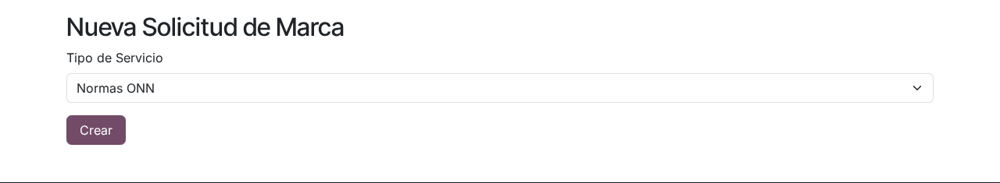
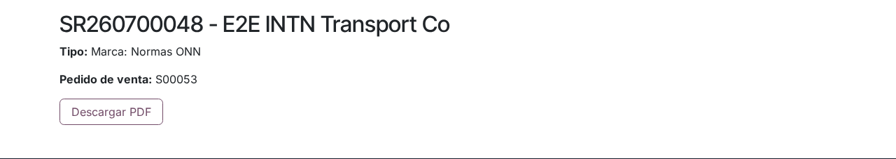

# Compra de normas ONN en el portal

## Para quién es esta guía

Clientes del organismo ONN que necesitan **comprar** o **reimprimir** una norma técnica y descargar el PDF una vez pagado el expediente.

> **Verificado el 28/07/2026** contra el código commiteado en `a43632c8`.
>
> La compra de normas se hace **por solicitud de marca**, tal como describe esta
> guía. El tile **Ecommerce** del inicio del portal (`/my/ecommerce`) todavía
> **no** sirve para comprar normas: la tienda no tiene el catálogo cargado.
> Ese circuito es RF 2.9 y está pendiente — ver
> [spec RF 2.9](../../project/specs/rf-2.9-ecommerce-normas.md).

## Qué necesita antes de empezar

- Cuenta de portal **habilitada** ([registro y aprobación](../cuenta/registro-y-aprobacion.md)).
- Conocer el **código** o **título** de la norma que desea adquirir (se coordina con el ONN por el ticket del trámite).
- Tenga en cuenta la política de **una sola descarga** del PDF: planifique guardar el archivo apenas lo descargue.

## Pasos

1. Ingrese al portal y abra la lista de **solicitudes de marca** (`/my/brand_requests`), donde se muestran sus trámites con **Referencia**, **Type** (tipo) y **Estado**. Pulse el botón **New** para crear una nueva.

2. En la página **New Brand Request**, elija en **Service Type** el tipo de trámite:
   - **ONN Norms** — compra de una norma.
   - **ONN Norms Reprint** — reimpresión de una norma ya adquirida.

   Luego pulse **Create**.

   

3. Al crearla, el sistema genera automáticamente:
   - la **solicitud** (número tipo `SR…`) en estado borrador;
   - un **ticket de atención** para el equipo de marcas de INTN;
   - el **pedido de venta** (expediente) del servicio.

   El navegador lo lleva al **detalle de la solicitud**, donde verá el tipo (**Type**), el número del pedido (**Sale order**) y el botón **Download PDF**.

4. Pague el pedido del expediente ([facturas y pagos](../documentos-pagos/facturas-y-pagos.md)). La descarga queda bloqueada hasta que el servicio esté facturado y pagado:
   - Si el pedido aún no fue facturado, al intentar descargar verá el mensaje "Report not available until the related service is invoiced.".
   - Si la factura existe pero no está pagada, verá "Report not available until the related service is paid.".

5. Con el pago confirmado, pulse **Download PDF** en el detalle de la solicitud y **guarde el archivo**. Se permite **una sola descarga**: si vuelve a intentarlo verá el mensaje "This document can only be downloaded once.".

   

6. Si más adelante necesita otra copia, cree una **nueva solicitud** con el tipo **ONN Norms Reprint** y repita el circuito de pago y descarga.

## Qué esperar después

En la lista de solicitudes el estado se muestra abreviado (por ejemplo, `draft` para borrador):

| Estado | Significado | Qué hacer |
|--------|-------------|-----------|
| Borrador (`draft`) | Solicitud creada | Completar el pago del pedido del expediente |
| Confirmado (`confirmed`) | Trámite en curso | Esperar la habilitación de la descarga |
| Finalizado (`done`) | Cerrado | Conservar la copia descargada |

## Si algo sale mal

| Problema | Causa habitual | Qué hacer |
|----------|----------------|-----------|
| Mensaje "Report not available until the related service is invoiced." | Pedido sin facturar | Consultar por el ticket; el área de ventas debe facturar el expediente |
| Mensaje "Report not available until the related service is paid." | Factura pendiente de pago | Regularizar el pago del expediente |
| Mensaje "This document can only be downloaded once." | Política de una sola descarga | Solicitar una **reimpresión** (**ONN Norms Reprint**) como nuevo trámite |
| Mensaje "Missing sale order for this request." | La solicitud quedó sin expediente | Contactar a INTN por el ticket para regenerarlo |
| Mensaje "Invalid service type" al crear | Tipo de servicio no válido | Elegir **ONN Norms** u **ONN Norms Reprint** en el desplegable |

## Trámites relacionados

- Certificación ONC: [certificacion-onc.md](certificacion-onc.md)
- Mis documentos: [../documentos-pagos/mis-documentos.md](../documentos-pagos/mis-documentos.md)
- Facturas y pagos: [../documentos-pagos/facturas-y-pagos.md](../documentos-pagos/facturas-y-pagos.md)
- Seguimiento interno de INTN (backoffice): [../../admin/marcas-onc/normas-onn.md](../../admin/marcas-onc/normas-onn.md)
