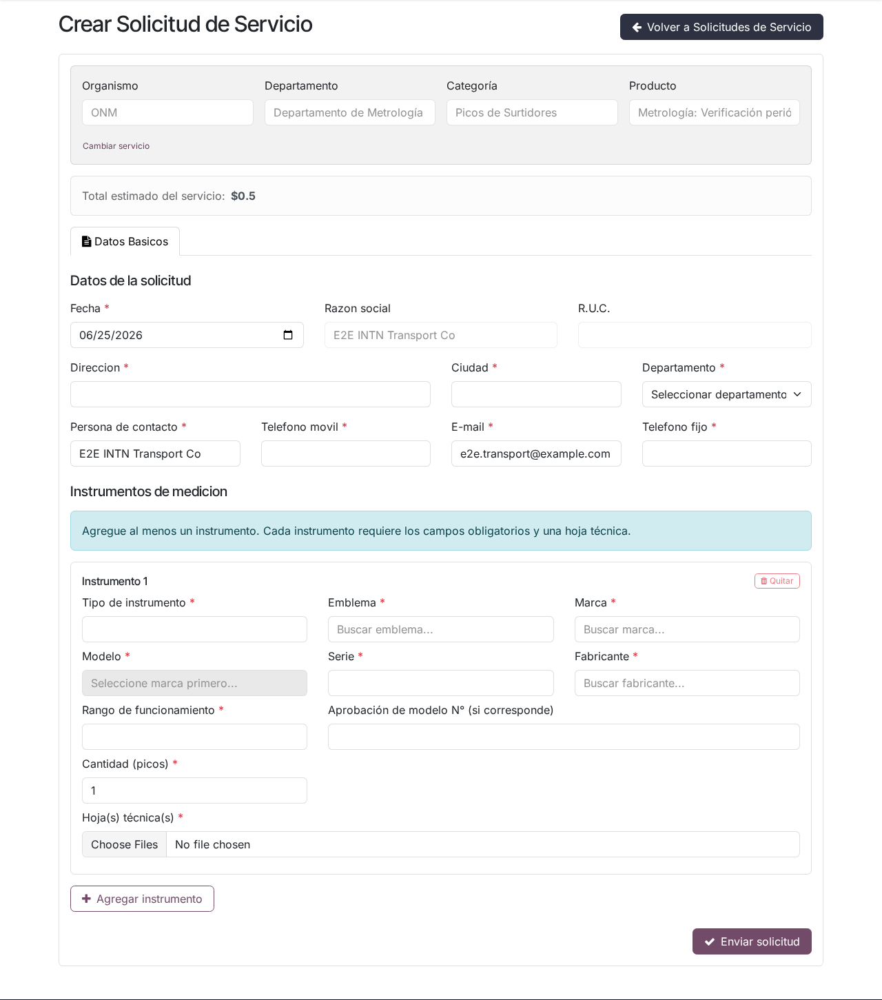
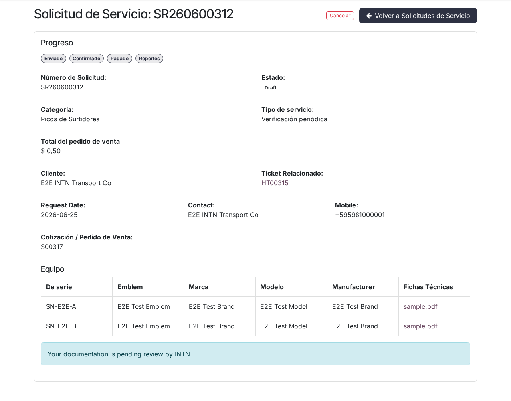
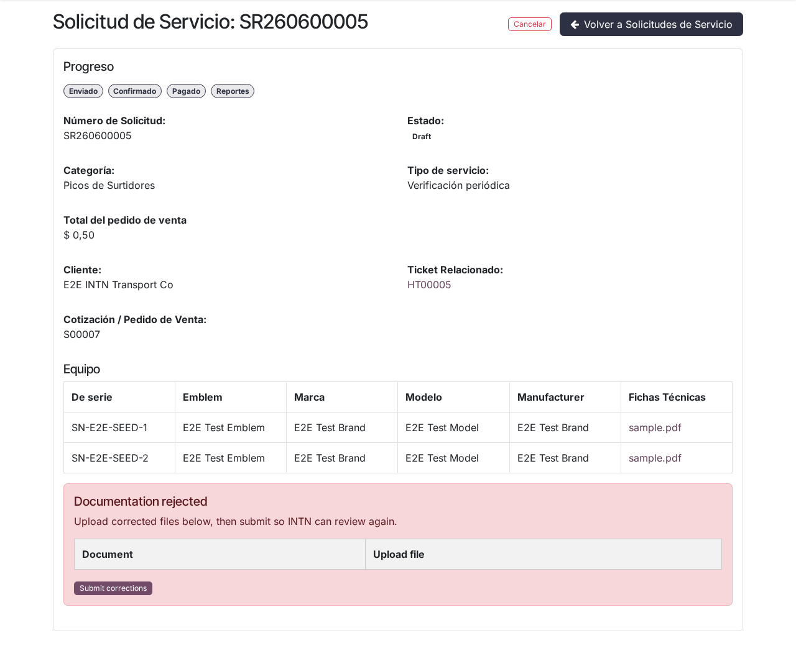

# Solicitud de picos de surtidores (metrología) en el portal

## Para quién es esta guía

Clientes de metrología que necesitan solicitar servicios de surtidores (picos): verificación inicial, periódica, eventual o complementaria. Usted carga una solicitud con una línea por cada equipo, adjunta la ficha técnica de cada uno y sigue el expediente como cualquier otro servicio INTN.

## Qué necesita antes de empezar

- Cuenta de portal **habilitada** ([registro y aprobación](../cuenta/registro-y-aprobacion.md)).
- El **tipo de servicio** de metrología que va a solicitar. Los servicios disponibles son: *Picos de Surtidores: Verificación inicial*, *Verificación periódica*, *Verificación eventual* y *Verificación complementaria* (además de *Aprobación de modelo*, que tiene su propio formulario).
- Una **ficha técnica** por cada equipo (pico/surtidor) que cargue como línea. Sin la ficha de cada línea no podrá enviar la solicitud.
- Los datos técnicos de cada equipo: emblema, marca, modelo, fabricante, número de serie, año de fabricación, rango de funcionamiento y cantidad de picos.

> Para **aprobación de modelo** de picos use el trámite dedicado: [aprobación de modelo de picos](aprobacion-modelo-picos.md) (formulario sin líneas de equipo).

## Pasos

1. En **Mi cuenta**, abra **Solicitudes de Servicio** y pulse **Crear Solicitud de Servicio**.

   

2. En la cabecera del formulario elija el servicio en cascada: **Organismo** (ONM) → **Departamento** (Departamento de Metrología) → **Categoría** (Picos de Surtidores) → **Producto** (el tipo de servicio, por ejemplo *Picos de Surtidores: Verificación periódica*). Cada campo se habilita al completar el anterior. Si luego quiere cambiar el servicio, use el enlace **Cambiar servicio**.

3. Complete la sección **Datos administrativos para la facturación**:
   - **Fecha** (obligatoria; viene precargada con la fecha del día).
   - **Razón social** y **R.U.C.**: se completan solos con los datos de su empresa y no se pueden editar.
   - **Email**, **Dirección**, **Departamento** y **Ciudad** (todos obligatorios; se precargan con los datos registrados de su empresa cuando existen). Departamento y ciudad se eligen con un buscador.

4. Complete la sección **Persona de contacto**: nombre, **teléfono móvil**, **email** y **teléfono fijo** (los cuatro obligatorios; se precargan con los datos de su cuenta cuando existen).

5. En **Datos del instrumento**, cargue una tarjeta por cada equipo. El formulario indica: *"Agregue al menos un instrumento. Cada instrumento requiere los campos obligatorios y una ficha técnica."* Por cada instrumento:
   - **Tipo de instrumento** (texto, obligatorio).
   - **Emblema**, **Marca**, **Modelo** y **Fabricante** (obligatorios; se eligen con buscadores sobre los catálogos INTN). El campo Modelo se habilita recién al elegir la marca y solo ofrece modelos de esa marca.
   - **Año de fabricación** (obligatorio, 4 dígitos, por ejemplo 2024).
   - **Número de serie** (obligatorio).
   - **Rango de funcionamiento** (obligatorio).
   - **Aprobación de modelo N°** (opcional, si el equipo ya tiene una aprobación de modelo).
   - **Cantidad (picos)** (obligatoria, mínimo 1).
   - **Hoja(s) técnica(s)**: adjunte uno o más archivos por instrumento (obligatorio).

   Use **Agregar instrumento** para sumar equipos (hasta **10 por solicitud**) y **Quitar** para eliminar una tarjeta (siempre debe quedar al menos una).

   

6. Revise que cada instrumento tenga su ficha técnica cargada.

   

7. **Envíe** la solicitud. Si falta algún dato, el sistema muestra el error arriba del formulario y no envía. Mensajes posibles:
   - *"Instrumento N: … es obligatorio."* (indica el instrumento y el campo que falta).
   - *"Instrumento N: La cantidad (picos) debe ser al menos 1."*
   - *"Cada línea de equipo debe incluir al menos un archivo de ficha técnica."*
   - *"Agregue al menos una línea de equipo con número de serie."*
   - *"… es obligatorio."* para los campos de cabecera que falten (fecha, email, dirección, departamento, ciudad, datos de contacto).
   - Si el modelo no corresponde a la marca elegida, el sistema también lo rechaza.

8. Consulte el estado y los documentos en el detalle de la solicitud (**Solicitudes de Servicio → Ver**). El detalle muestra:
   - la barra de **Progreso** (Enviado → Confirmado → Pagado → Reportes),
   - sus datos de contacto y el **ticket** asociado,
   - el **presupuesto/pedido de venta** generado para el servicio,
   - la tabla **Equipo** con serie, emblema, marca, modelo, fabricante y las fichas técnicas descargables de cada línea.

> **Nota:** Los enlaces antiguos del tipo "solicitud surtidor" en el portal redirigen a este formulario unificado de solicitud.

## Correcciones tras una observación

- Mientras su documentación está en revisión, el detalle muestra: *"Su documentación está pendiente de revisión por INTN."*
- Si INTN **observa** o **rechaza** su documentación, recibirá un **correo con el comentario del revisor** y verá en el detalle una alerta (*Documentación observada* o *Documentación rechazada*) con ese mismo comentario.
- Si a alguna línea le falta la ficha técnica y la solicitud sigue en borrador, sobre esa línea aparece el formulario **para subir la ficha** (solo archivos PDF). Suba el archivo y pulse el botón de carga.
- Use **Enviar correcciones** en la alerta para avisar a INTN que ya corrigió; su documentación vuelve a quedar pendiente de revisión.

## Qué esperar después

| Estado | Significado | Qué hacer |
|--------|-------------|-----------|
| Borrador | Creada, pendiente de INTN | INTN revisa la documentación y confirma |
| Confirmado | En trámite | Laboratorio / metrología interna avanza el trabajo |
| Finalizada | Servicio cerrado | Consulte resultados y documentos en el detalle |
| Cancelado | No continúa | Revise el motivo con INTN |

- Al enviar la solicitud se crea también un **ticket** de atención con sus adjuntos, que puede seguir desde el portal.
- Para **verificación inicial**, INTN emite una **habilitación temporal** antes de confirmar; cuando esté emitida aparecerá en el detalle el botón para **descargar la habilitación temporal** (ver [aprobación de modelo y verificación técnica de picos](aprobacion-modelo-picos.md)).
- Al finalizar la evaluación técnica (verificación inicial y aprobación de modelo) podrá descargar el **informe de evaluación** (certificado o informe de rechazo) desde el detalle; el botón aparece recién cuando INTN confirma la evaluación.
- Mientras la solicitud está en **Borrador** o **Confirmado**, usted puede **cancelarla** desde la lista o el detalle con el botón **Cancelar**.

## Si algo sale mal

| Problema | Causa habitual | Qué hacer |
|----------|----------------|-----------|
| No aparece el tipo de servicio | Catálogo sin la fila de metrología | Contacte a INTN para que actualice el catálogo de servicios |
| El formulario aparece vacío | Usó una URL antigua de metrología | Use **Crear Solicitud de Servicio** y elija la categoría **Picos de Surtidores** |
| No puede elegir el modelo | Falta elegir primero la marca | Seleccione la marca; el buscador de modelos se habilita después |
| No encuentra su marca/modelo/emblema | El catálogo INTN no lo tiene cargado | Contacte a INTN para que lo agregue |
| El envío se rechaza con "Instrumento N: …" | Falta un dato obligatorio en ese instrumento | Complete el campo indicado y reenvíe |
| INTN no puede confirmar | Falta la ficha en alguna línea | Suba la ficha técnica faltante desde el detalle y pulse **Enviar correcciones** |
| Documentación observada o rechazada | El revisor solicitó correcciones | Lea el comentario (correo y detalle), corrija y pulse **Enviar correcciones** |
| Necesita cargar más de 10 equipos | Límite del formulario | Cree una segunda solicitud con el resto |

## Trámites relacionados

- Aprobación de modelo y verificación técnica de picos: [aprobacion-modelo-picos.md](aprobacion-modelo-picos.md)
- Registro y habilitación de la cuenta: [../cuenta/registro-y-aprobacion.md](../cuenta/registro-y-aprobacion.md)
- Seguimiento interno de INTN (backoffice): [../../admin/metrologia/gestion-solicitudes-picos.md](../../admin/metrologia/gestion-solicitudes-picos.md)
