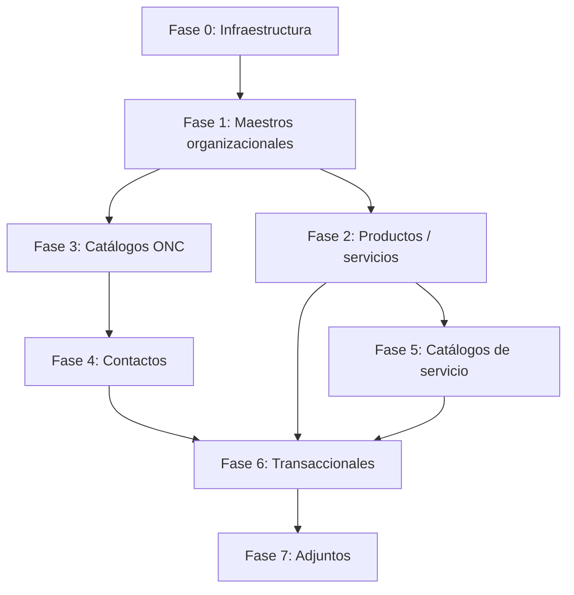

# Plan de migración de datos — Odoo 12 → Odoo 18

Documento **único y maestro** para la migración de datos productivos del INTN
desde Odoo 12 (`intn_v12`) hacia la implementación modular en Odoo 18
(`custom_addons/`). Consolida el plan de fases, la homologación de modelos/campos
y el índice de artefactos que antes vivían en archivos separados.

**Última revisión:** 2026-08-05
**Estado general:** plan vigente; 2 pipelines implementados (contactos, productos);
resto de dominios pendientes de pipeline. Ver [§4 Estado actual por fase](#4-estado-actual-por-fase).

> **Nota sobre métricas:** este documento describe el estado **estructural** (qué
> está implementado, parcial o pendiente). No fija conteos ni ratios de corrida,
> porque son volátiles: dependen de un `intn_v18` reconstruido y de los artefactos
> regenerables en `migration_exports/` (gitignored). Las cifras se obtienen
> re-ejecutando los pipelines de verificación — ver [§9](#9-verificación-y-criterios-de-aceptación).

---

## 1. Propósito y alcance

### 1.1 Objetivo

Migrar datos maestros y operacionales desde `intn_v12` hacia `intn_v18` con:

- Limpieza y depuración previa (especialmente contactos y productos).
- Transformación a la estructura modular v18 (sin replicar deuda técnica v12).
- Trazabilidad v12→v18 mediante prefijos de referencia y mapas JSON.
- Doble validación en ambiente de pruebas antes del corte productivo.

### 1.2 Alcance contractual

Según [`matriz-pliego-relevamiento.md`](../relevamiento/matriz-pliego-relevamiento.md):

| Atributo | Valor |
|----------|-------|
| Estado de alcance | Alineado (In-Scope) |
| Priorización | **Must Have** |
| Impacto | **Alto** |
| Observaciones clave | Volumen elevado; limpieza obligatoria; doble validación v12/v18; replicar lógica v12 afectaría mejoras v18 |

### 1.3 Fuera de alcance inmediato (confirmar con INTN)

- Rediseño de procesos no acordados en relevamiento.
- Migración de sistemas externos (app offline básculas, facturación electrónica legacy como sistema independiente).
- Histórico completo si INTN opta por migración solo vigente (ver cuestionario de alcance).
- Cálculos de laboratorio en Excel (OIAT) — no se migran fórmulas, solo trazabilidad acordada.

### 1.4 Precedencia documental

1. Código y modelos en `custom_addons/` (fuente de verdad de nombres v18).
2. Este plan.
3. Homologación por dominio ([`v12-v18-terminology.md`](../v12-v18-terminology.md), [`v12-v18-gap-matrix.md`](../v12-v18-gap-matrix.md)).
4. Relevamiento y minutas ([`docs/project/relevamiento/`](../relevamiento/)).
5. Pliego legal (PDF en `docs/original_docs/`, fuera de git).

---

## 2. Principios de migración

| # | Principio | Detalle |
|---|-----------|---------|
| P1 | **No copiar estructura v12 ciegamente** | Productos v12 mezclan nombre + determinación + organismo de forma no escalable; v18 usa plantillas, variantes y atributos. |
| P2 | **Limpiar antes de cargar** | Duplicados de RUC, contactos basura, VAT placeholder (`0000000000000`) requieren clasificación manual o merge. |
| P3 | **Maestros antes que transaccionales** | Organización → productos → contactos → catálogos de servicio → expedientes → documentos. |
| P4 | **Trazabilidad reversible** | `ref`/`default_code` con prefijo (`V12PART-`, `V12MIG-`) + `partner_map.json` / `product_map.json`. |
| P5 | **Remap post-carga** | Tras insertar registros v18, actualizar FKs en modelos dependientes vía fase `remap`. |
| P6 | **Validar por dominio** | Cada fase con pipeline tiene `verify` con checks automatizados + revisión manual (`manual_review.csv`). |
| P7 | **Migración parcial donde aplique** | Cisternas: relevamiento indica migración parcial (no todo el histórico de certificados). |

---

## 3. Grafo de dependencias



**Orden de ejecución recomendado:** F0 → F1 → F2 + F3 (paralelo) → F4 → F5 → F6 → F7.

---

## 4. Estado actual por fase

Semáforo estructural (no depende de cifras de corrida):

- 🟢 **Implementado** — pipeline ETL completo y ejecutable.
- 🟡 **Parcial** — hay artefactos o remap, pero no pipeline completo.
- 🔴 **Pendiente** — sin ETL; solo homologación y/o exports Excel.

| Fase | Dominio | Estado | Qué existe hoy | Qué falta |
|------|---------|--------|----------------|-----------|
| 0 | Infraestructura / prerequisitos | 🟡 | `config.yaml`, mapas de FK, rutas filestore | ETL de `ir.attachment`; reconstruir `intn_v18` de staging |
| 1 | Maestros organizacionales | 🟡 | Exports Excel + datos base en `intn_organization/data/` | Diff automatizado de paridad v12 ↔ v18 |
| 2 | Productos / servicios | 🟢 | Pipeline `scripts/migration/products/` completo | Cerrar checks de verify (org, precios, FK residuales) |
| 3 | Catálogos ONC / marca | 🔴 | Exports Excel + homologación completa | Pipeline automatizado (extract→load→remap) |
| 4 | Contactos | 🟢 | Pipeline `scripts/migration/partners/` completo | Aclarar métrica `plan_count`; decidir carga usuarios portal |
| 5 | Catálogos de servicio | 🟡 | Remap de `main_product_id` en el pipeline de productos | Cobertura completa de catálogos + validación |
| 6 | Transaccionales | 🔴 | Nada (homologación ONC/METCI sí existe) | **El grueso**: ventas, cisternas, OIAT/ONI/DSE, ONC operativo, METCI, contabilidad/CxC |
| 7 | Adjuntos / filestore | 🔴 | Rutas en `config.yaml` | ETL de binarios y DMS |

**Lectura ejecutiva:** de 7 fases, solo 2 dominios (contactos y productos) tienen
pipeline ejecutable. La superficie transaccional (F6) — que es donde vive el valor
operativo — no tiene ETL. Migrar maestros "en el vacío" no habilita el arranque:
el `partner_fk_inventory.json` inventaría ~120 columnas FK sobre partner en ~105
tablas v12, y esas referencias solo cobran sentido al migrar F6.

---

## 5. Inventario de entidades por fase

Los nombres de modelo v18 de esta sección están **verificados contra el código**
en `custom_addons/` (2026-08-05).

### Fase 0 — Infraestructura y prerequisitos

| Entidad | v12 | v18 | Estado | Notas |
|---------|-----|-----|--------|-------|
| Bases de datos | `intn_v12` | `intn_v18` | Config | `scripts/migration/config.yaml`; reconstruir `intn_v18` para staging |
| Filestore adjuntos | `filestore_v12_path` | `filestore_v18_path` | Pendiente | Migración de `ir.attachment` sin automatizar |
| Repo v12 (referencia) | `intn_repo_viejo` | — | Disponible | Solo lectura para homologación |

### Fase 1 — Maestros organizacionales

| Entidad v12 | Modelo v18 (real) | Artefacto | Notas |
|-------------|-------------------|-----------|-------|
| `intn_organismos` | `intn.organization` | `migration_exports/phase_01/intn_organismos.xlsx` | También en datos base v18 |
| `intn_unidades` | `intn.unit` | `phase_01/intn_unidades.xlsx` | |
| `intn_departamentos` | `intn.department` | `phase_01/intn_departamentos.xlsx` | |
| `intn_coordinaciones` | `intn.coordination` | `phase_01/intn_coordinaciones.xlsx` | |
| `intn_laboratorios` | `intn.laboratory` | `phase_01/intn_laboratorios.xlsx` | |

**Dependencias:** ninguna (raíz del grafo).
**Carga v18:** datos base presentes en `intn_organization/data/`; validar paridad con exports v12 antes del corte.

### Fase 2 — Productos y servicios

| Entidad v12 | Modelo v18 | Pipeline | Notas |
|-------------|------------|----------|-------|
| `product.template` / `product.product` | `product.template` / `product.product` | `scripts/migration/products/` | Núcleo del dominio |
| Determinaciones (texto en nombre) | Atributo `Determinación` | classify `A_DET_ONLY`, `B_DET_PRICE`, … | Ver estrategias abajo |
| Organismo en producto | `intn_organization_id`, unidad, depto | `OrgResolver` | Umbral de resolución objetivo ≥95% |
| Lista de precios | `product.pricelist` | verify `INTN Tarifa servicios` | Smoke de precios |

**Estrategias de clasificación (productos):**

| Código | Significado | Acción |
|--------|-------------|--------|
| `SINGLE` | Un producto v12 = una plantilla v18 | Carga directa |
| `A_DET_ONLY` | Varias determinaciones, mismo precio | Variantes por atributo |
| `B_DET_PRICE` | Varias determinaciones, precios distintos | Variantes + `price_extra` |
| `C_DUP_DET_PRICE` | Determinaciones duplicadas | Revisión + merge |
| `F_MANUAL` | Caso no automático | `manual_review.csv` (omitible con `skip_manual`) |

**Artefactos:** `migration_exports/products/` (`products_raw.json`, `load_plan.json`, `product_map.json`, `manual_review.csv`).

### Fase 3 — Catálogos ONC / Trazabilidad de marca

| Entidad v12 | Modelo v18 | Artefacto | Homologación |
|-------------|------------|-----------|--------------|
| `marca.producto` | `intn.brand.product.brand` | `phase_03/marca_producto.xlsx` | [terminology](../v12-v18-terminology.md) |
| `fabricante.producto` | `intn.brand.product.manufacturer` | `phase_03/fabricante_producto.xlsx` | |
| `normas.licencia` | `intn.brand.license.norm` | `phase_03/normas_licencia.xlsx` | |
| `reglamentos.licencia` | `intn.brand.license.regulation` | `phase_03/reglamentos_licencia.xlsx` | |
| `uso_marca_nombre_etapas` | `intn.brand.stage` | `phase_03/uso_marca_nombre_etapas.xlsx` | |
| `uso_marca_sub_etapas` | `intn.brand.substage` | `phase_03/uso_marca_sub_etapas.xlsx` | |
| Licencias, impresiones, controles | `intn.brand.*`, `certificate.management` | — | **Pendiente**; ver [gap matrix](../v12-v18-gap-matrix.md) |

**Pipeline automatizado:** no existe aún; solo exports Excel + homologación documentada.

### Fase 4 — Contactos (clientes, proveedores, sujetos de inspección)

| Entidad v12 | Modelo v18 | Pipeline | Notas |
|-------------|------------|----------|-------|
| `res.partner` (raíz) | `res.partner` | `scripts/migration/partners/` | Núcleo del dominio |
| Contactos hijo / establecimientos | `res.partner` (type) | Estrategia `CHILD`, `HYBRID` | Empresas híbridas detectadas por heurística |
| Campos marca (`state_uso_marca`, etc.) | `brand_usage_state`, etc. | field_mapping | Hijos de marca → `manual_review` |
| Usuarios portal | `res.users` | `load_portal_users` (opcional) | Deshabilitado por config (`false`) |
| Cuentas por cobrar / deudas | `account.move` | — | **Pendiente** (F6); Must Have por pliego |

**Estrategias de clasificación (contactos):**

| Código | Significado |
|--------|-------------|
| `SINGLE` | Partner único, carga directa |
| `UNIPERSONAL` | Empresa + contacto misma persona |
| `MERGE_COMPANY` / `MERGE_PERSON` | Duplicados por RUC; canonical + alias |
| `CHILD` | Hijo bajo padre (establecimiento, marca) |
| `HYBRID` | Empresa con establecimiento separado |
| `MANUAL` | Placeholder VAT, triple+ duplicados, etc. |

**Artefactos:** `migration_exports/partners/` (`load_plan.jsonl`, `partner_map.json`, `manual_review.csv`).

### Fase 5 — Catálogos de servicio y configuración portal

| Entidad | Modelo v18 | Estado | Notas |
|---------|------------|--------|-------|
| Catálogo de servicio | `service.request.service.catalog` | Parcial | `remap` de `main_product_id` desde pipeline de productos |
| Formularios portal | `ir.ui.view` + OWL | Desarrollo v18 | No migrar vistas v12; re-mapear por código de servicio |
| Tipos solicitud cisternas | `service.request` + fleet mixins | Demo/E2E | Ver [`v12-reference-subset.md`](../demo-data/v12-reference-subset.md) |

### Fase 6 — Datos operacionales transaccionales

| Dominio | Entidades v12 | Estado | Alcance relevamiento |
|---------|---------------|--------|----------------------|
| Ventas / expedientes | `sale.order`, cotizaciones, estados | 🔴 | Must Have; depende de productos + contactos |
| Cisternas | Vehículos, solicitudes, certificados METCI | 🔴 parcial | Migración parcial acordada |
| OIAT | Solicitudes, informes, constancias | 🔴 | Proceso OIAT |
| ONI | Informes, muestreo | 🔴 | Proceso ONI |
| DSE | Inspecciones, MO | 🔴 | Proceso DSE |
| ONC operativo | Licencias, impresiones, etiquetas | 🔴 | [gap matrix](../v12-v18-gap-matrix.md) |
| METCI | Calibración, instrumentos | 🔴 | Datos técnicos en hojas Excel |
| Contabilidad | Facturas, pagos, caja, saldos iniciales | 🔴 | Saldos iniciales por definir con INTN |
| Documentos / DMS | `ir.attachment`, expedientes | 🔴 | Integrado a `intn_documents` |

### Fase 7 — Adjuntos y filestore

| Entidad | Estado | Notas |
|---------|--------|-------|
| `ir.attachment` binarios | 🔴 | Rutas en `config.yaml`; sin script ETL |
| PDFs emitidos / DMS | 🔴 | `emitted_pdf_attachment_id` en v18 |
| Firmas, QR en certificados | N/A | Se regeneran en v18 |

---

## 6. Matriz modelo → campo (v12 → v18)

Matriz **parcial y verificada** para los dominios con pipeline (organización,
productos, contactos). Los dominios ONC/METCI tienen su matriz completa —
incluyendo campos, secuencias, wizards y rutas portal — en
[`v12-v18-terminology.md`](../v12-v18-terminology.md); **no se duplica aquí**.

### 6.1 Maestros organizacionales

| v12 modelo | v18 modelo | Campo v12 → v18 |
|------------|------------|-----------------|
| `intn_organismos` | `intn.organization` | `name` → `name`; código/sigla → campos del modelo |
| `intn_unidades` | `intn.unit` | jerarquía por `organization_id` |
| `intn_departamentos` | `intn.department` | jerarquía por `unit_id` |
| `intn_coordinaciones` | `intn.coordination` | jerarquía por `department_id` |
| `intn_laboratorios` | `intn.laboratory` | jerarquía por `department_id` |

Fuente de resolución de jerarquía: `scripts/migration/products/lib/org_resolver.py`.

### 6.2 Productos y servicios

Fuente: [`products/rules/field_mapping.yaml`](../../../scripts/migration/products/rules/field_mapping.yaml).

| Nivel | Campo origen (normalizado v12) | Campo destino v18 |
|-------|--------------------------------|-------------------|
| template | `clean_name` | `name` |
| template | `list_price_base` | `list_price` |
| template | `target_type` (forzado `service`) | `type` |
| template | `intn_organization_name` | `intn_organization_id` |
| template | `intn_unit_name` | `intn_unit_id` |
| template | `intn_department_name` | `intn_department_id` |
| template | `intn_service_location_mode` | `intn_service_location_mode` |
| template | `intn_show_in_service_list` | `intn_show_in_service_list` |
| template | `default_code` | `default_code` (prefijo `V12MIG-`) |
| variant | `determinacion_label` | atributo `Determinación` |
| variant | `list_price` | `lst_price` |
| variant | `price_extra` | `price_extra` |

### 6.3 Contactos

Fuente: [`partners/rules/field_mapping.yaml`](../../../scripts/migration/partners/rules/field_mapping.yaml).

**Campos estándar** (copia directa): `name`, `vat`, `is_company`, `parent_id`,
`type`, `street`, `street2`, `city`, `zip`, `phone`, `mobile`, `email`,
`website`, `comment`, `function`, `lang`, `active`, `customer`, `supplier`.

**Campos custom v12 → v18:**

| v12 | v18 |
|-----|-----|
| `es_extranjero` | `intn_origin_type` |
| `es_entidad_estado` | `intn_company_type` |
| `obviar_validacion` | `skip_ruc_validation` |
| `nombre_impresion` | `comment` |

Campos de marca en partner (`state_uso_marca`, `cod_uso_marca`,
`licencia_servicios_ids`, …) → ver homologación ONC.

### 6.4 ONC / marca / METCI

Matriz completa (modelos, campos, secuencias `ir.sequence`, wizards, rutas
portal) en [`v12-v18-terminology.md`](../v12-v18-terminology.md).
Brechas de cobertura v12↔v18 en [`v12-v18-gap-matrix.md`](../v12-v18-gap-matrix.md).

### 6.5 Pendiente por dominio (F6)

No hay matriz campo-a-campo para ventas, cisternas, OIAT/ONI/DSE, contabilidad ni
DMS. Debe construirse por dominio **antes** de codificar cada pipeline, cruzando
el repo v12 (`v12_repo_path` en config) con los modelos v18 en `custom_addons/`.

---

## 7. Reglas de limpieza y depuración

### 7.1 Contactos (acordado en relevamiento)

| Problema v12 | Regla | Implementación |
|--------------|-------|----------------|
| Duplicados por RUC | Merge a canonical por score de actividad | `classifier.py` → `MERGE_*` |
| RUC placeholder `0000000000000` | Excluir o revisión manual | `placeholder_vats.json` → `MANUAL` |
| Triple o más con mismo RUC | Revisión manual | `manual_review.csv` |
| Hijos de marca (`marca_id`) | Estrategia `CHILD` | Revisar vínculo post-carga ONC |
| VAT inválido en hijos | Strip en establecimientos | `strip_child_vat: true` |
| Contactos sin actividad | Evaluar exclusión | Criterio de negocio pendiente con INTN |

Fuente: minuta [2025-12-12](../relevamiento/minutas/2025-12-12.md), cuestionario [alcance](../relevamiento/cuestionario-alcance-2025-12.md).

### 7.2 Productos

| Problema v12 | Regla | Implementación |
|--------------|-------|----------------|
| Nombre con determinación embebida | Normalizar + atributo | `name_patterns.json` |
| Mismo nombre, distintos organismos | Split por organismo | `classifier.py` |
| Precio cero | Flag `zero_price` en manual review | Validar si activo u obsoleto |
| Tipo `consu` vs servicio | Forzar `service` en v18 | `target_type: service` en config |
| Organismo no resuelto | Warning + revisión | `OrgResolver`; umbral 95% |

### 7.3 General

- INTN indicó que **toda la información está interconectada** pero acepta **propuesta de limpieza** (ej. contactos).
- Confirmar con INTN: histórico completo vs solo vigente **antes de Fase 6**.

---

## 8. Pipelines técnicos

Ambos pipelines siguen 6 etapas: `extract → classify → transform → load → remap → verify`.

### 8.1 Contactos

```bash
python scripts/migration/partners/cli.py \
  --config scripts/migration/config.yaml \
  --phase all \
  --target-db intn_v18
```

| Fase | Script | Salida principal |
|------|--------|------------------|
| extract | `extract_v12.py` | `partners_raw.json` |
| classify | `classify_partners.py` | `partner_groups.json` |
| transform | `transform_load_plan.py` | `load_plan.jsonl`, `load_plan_meta.json` |
| load | `load_v18.py` (odoo shell) | registros en `res.partner` |
| remap | `remap_references.py` | FKs actualizadas |
| verify | `verify_migration.py` | `verify_report.json` |

### 8.2 Productos

```bash
python scripts/migration/products/cli.py \
  --config scripts/migration/config.yaml \
  --phase all \
  --target-db intn_v18
```

Misma estructura de fases; salidas en `migration_exports/products/`.

### 8.3 Configuración clave (`scripts/migration/config.yaml`)

| Parámetro | Valor actual | Efecto |
|-----------|--------------|--------|
| `source.database` | `intn_v12` | Origen |
| `target.database` | `intn_v18` | Destino |
| `products.default_code_prefix` | `V12MIG-` | Trazabilidad plantillas |
| `partners.ref_prefix` | `V12PART-` | Trazabilidad contactos |
| `partners.load_portal_users` | `false` | No crea usuarios portal aún |
| `dry_run` | `false` | Ejecución real |

> **Requisito de entorno:** ambos pipelines requieren `intn_v12` (origen) e
> `intn_v18` (destino) accesibles en el servidor PG de `config.yaml`. Si `intn_v18`
> no existe (staging desmontado), la fase `load`/`verify` no corre y los artefactos
> en `migration_exports/*/` quedan obsoletos.

---

## 9. Verificación y criterios de aceptación

Los pipelines de contactos y productos emiten un reporte de verificación
(`verify_report.json`, `migration_report.json`). **Estos archivos son
regenerables (gitignored):** reflejan la última corrida local y deben
re-generarse contra un `intn_v18` reconstruido antes de firmar conformidad.

### 9.1 Checks del pipeline de contactos

- `migrated_roots_by_ref` — raíces migradas identificables por prefijo `ref`.
- `root_vat_unique` — 0 duplicados de VAT en raíces.
- `partner_map_sample_exists` — muestra del mapa v12→v18 resuelve a registros vivos.
- `hybrid_establishment_sample` — empresas híbridas con establecimiento hijo.
- `partner_map_count` — **revisar semántica**: el `plan_count` reportado (orden de
  1M) no equivale al número de partners; parece contar entradas de remap/FK.
  Aclarar antes de usarlo como criterio de aceptación.

### 9.2 Checks del pipeline de productos

- `variant_map_count` — todas las variantes del plan mapeadas.
- `org_resolved_ratio` — organismo resuelto ≥ 95% (objetivo).
- `price_sample` — 0 mismatches en muestra de precios.
- `remap_residual_v12_ids` — 0 FKs con IDs v12 sin remapear.
- `sale_order_smoke_price` — smoke de lista `INTN Tarifa servicios`.

### 9.3 Criterios de aceptación por fase

| Fase | Criterio | Evidencia |
|------|----------|-----------|
| 1 | 100% organismos v12 con equivalente v18 | Diff Excel vs `intn_organization` |
| 2 | ≥95% productos con org resuelto; 0 FK residuales; smoke precios OK | `migration_report.json` |
| 3 | Catálogos ONC cargados; paridad conteos ± tolerancia | Query v12 vs v18 + spot check |
| 4 | 0 duplicados VAT raíz; manual review resuelto o excluido documentado | `verify_report.json` + acta |
| 5 | Catálogos servicio apuntan a productos migrados | Tests `intn_service_request` |
| 6 | Expedientes abiertos migrados; estados coherentes | UAT por organismo |
| 7 | Adjuntos críticos accesibles en portal/DMS | HttpCase / muestreo |

**User story relacionada:** US-S11-03 (Sprint 11) — Limpieza y migración de contactos.

---

## 10. Trazabilidad y auditoría de la migración

> **Decisión (2026-08-05):** la trazabilidad v12→v18 se conserva de forma
> **permanente** para auditoría. El módulo `intn_migration` **no se desinstala**
> tras el post-mortem; queda como capa pasiva de linaje y consulta. Esto elimina
> las restricciones de desinstalación segura (cascada de `ir.model.data`,
> archivado previo) y permite que el módulo posea normalmente sus datos.

### 10.1 Objetivo

Poder responder en cualquier momento, sin reconstruir nada:

- **Linaje directo:** ¿de qué registro v12 proviene este registro v18?
- **Linaje inverso / cobertura:** ¿qué registros v12 **no** se migraron y por qué?
- **Reconciliación total:** que todo el origen esté contabilizado (ver §10.4).

### 10.2 Arquitectura — dos capas complementarias

**Capa 1 — Mapa de identidad vía `ir.model.data` (xmlid).**
Cada registro v18 creado lleva un external ID `intn_migration.<modelo>_<v12_id>`.
Aporta reversibilidad (query directa v18→v12), **idempotencia** (re-correr el load
hace *upsert* por xmlid, no duplica) y persistencia en la base destino. Al ser el
módulo permanente, la propiedad de estos xmlids no implica riesgo de borrado.

**Capa 2 — Ledger de resultado (`intn.migration.log`), append-only.**
Una fila por cada **decisión** de migración (no solo por registro creado): también
fusiones, exclusiones y pendientes de revisión. Es la fuente única del post-mortem.

### 10.3 Modelo `intn.migration.log`

| Campo | Tipo | Contenido |
|-------|------|-----------|
| `run_id` | char/int | Identificador de corrida (timestamped) |
| `domain` | selection | `partners`, `products`, `sales`, … |
| `source_model` | char | Modelo/tabla v12 |
| `source_id` | int | ID v12 |
| `source_key` | char | Clave natural (RUC, `default_code`) |
| `target_model` | char | Modelo v18 |
| `target_res_id` | int (reference) | ID v18 (vacío si excluido) |
| `strategy` | selection | `SINGLE`, `MERGE_COMPANY`, `A_DET_ONLY`, … |
| `action` | selection | `created`, `merged`, `skipped`, `excluded`, `manual`, `updated` |
| `status` | selection | `ok`, `warning`, `error` |
| `reason` | text | Motivo (obligatorio en `excluded`/`error`) |
| `created_at` | datetime | Marca temporal |

### 10.4 Invariante de reconciliación

El post-mortem es defendible ante INTN solo si **todo origen está contabilizado**:

```
total_v12 = migrados + fusionados(merge) + excluidos(con motivo) + pendientes(manual)
```

Si la suma cierra → cobertura demostrable. Si no cierra → el ledger identifica
exactamente qué registros v12 "desaparecieron" sin explicación (anti-join
origen ↔ ledger). Esta invariante se valida por dominio en la fase `verify`.

### 10.5 Instrumentación

Los puntos donde se escribe el ledger son las fases con efecto sobre v18:

| Fase / script | Qué registra |
|---------------|--------------|
| `load_v18.py` (contactos, productos) | `created`, `merged`, `excluded`, `manual` + xmlid |
| `remap_references.py` | `updated` (FKs remapeadas por modelo/campo) |
| `classify_*` | alimenta `strategy`/`reason` de exclusiones y pendientes |
| Pipelines F6 (a construir) | mismo contrato por dominio |

Se expone un helper `record_migration(...)` para que cada pipeline escriba con un
contrato uniforme.

### 10.6 Reporte post-mortem

Generado **por query** desde el ledger (no a mano), en QWeb/PDF (INTN) + Excel (equipo):

- Cobertura por dominio (origen → migrado/fusionado/excluido/pendiente) con la reconciliación §10.4.
- Ratios de calidad: dedup, resolución de organismo, mismatches de precio, FKs residuales.
- Burn-down de `manual_review`.
- Anti-join: registros v12 sin destino y su motivo.
- Trazabilidad inversa muestreada (v18 → v12).

### 10.7 Permanencia

El módulo queda instalado post-corte como referencia de solo-lectura; su costo de
runtime es ~cero (modelo pasivo). La trazabilidad de linaje sigue consultable en
vivo, no solo en el reporte exportado. **No se contempla desinstalarlo.**

---

## 11. Estrategia de corte

Basado en [`cuestionario-alcance-2025-12.md`](../relevamiento/cuestionario-alcance-2025-12.md):

| Tema | Estado | Acción requerida |
|------|--------|------------------|
| Fecha exacta de corte | **Sin definir** | Acordar con INTN |
| Información indispensable | INTN: todo interconectado | Priorizar por fases de este plan |
| Depuración previa | Acordada en principio | Ejecutar limpieza F4 antes de transaccionales |
| Histórico vs vigente | **Sin definir** | Workshop con áreas por organismo |
| Ambiente de pruebas pre-corte | Requerido | `intn_v18` + validación por dominio |
| Documento de conformidad | Requerido | Checklist por fase ([§9](#9-verificación-y-criterios-de-aceptación)) |
| Procesos día 1 | Ej.: expediente + presupuesto + factura | Alinear con Must Have del pliego |

### Secuencia de corte propuesta

1. **T-30 días:** congelar personalizaciones v12; completar Fases 1–5 en staging.
2. **T-7 días:** corrida final ETL + verify; firmar conformidad por dominio.
3. **T-0:** corte — bloquear v12, delta final, smoke operativo.
4. **T+1…7:** soporte intensivo; remediación `manual_review.csv`.

---

## 12. Brechas y trabajo pendiente

| ID | Brecha | Prioridad | Responsable sugerido |
|----|--------|-----------|----------------------|
| G1 | Matriz modelo→campo para dominios F6 (ventas, cisternas, OIAT/ONI/DSE, contabilidad, DMS) | Alta | Dev migración |
| G2 | Pipeline ONC (Fase 3 operativo) | Alta | Dev + ONC |
| G3 | Cerrar verify de productos (org ≥95%, precios, FK residuales, pricelist) | Alta | Dev migración |
| G4 | Pipeline ventas/expedientes (Fase 6) | Alta | Dev + Presupuesto |
| G5 | Migración cisternas (parcial) | Media | Dev fleet |
| G6 | Cuentas por cobrar / saldos iniciales | Alta | Dev contabilidad |
| G7 | Migración adjuntos/filestore | Media | Dev + DMS |
| G8 | Definir fecha de corte e histórico (completo vs vigente) | Alta | INTN + PM |
| G9 | Carga usuarios portal (hoy deshabilitada) | Media | Dev + seguridad |
| G10 | Resolver ítems `manual_review.csv` | Alta | INTN (negocio) + Dev |
| G11 | Aclarar semántica de `plan_count` en verify de contactos | Media | Dev migración |
| G12 | Reconstruir `intn_v18` de staging y re-generar reportes de verify | Alta | Dev migración |
| G13 | Módulo `intn_migration` (ledger + xmlids) permanente e instrumentación de los pipelines (ver §10) | Alta | Dev migración |
| G14 | Generador de reporte post-mortem con reconciliación §10.4 (QWeb + Excel) | Media | Dev migración |

---

## 13. Referencias

| Documento | Ruta |
|-----------|------|
| Matriz pliego | [`../relevamiento/matriz-pliego-relevamiento.md`](../relevamiento/matriz-pliego-relevamiento.md) |
| Cuestionario alcance | [`../relevamiento/cuestionario-alcance-2025-12.md`](../relevamiento/cuestionario-alcance-2025-12.md) |
| Minuta migración/limpieza | [`../relevamiento/minutas/2025-12-12.md`](../relevamiento/minutas/2025-12-12.md) |
| Cronograma contractual | [`../relevamiento/plan-freelancer-v2-resumen.md`](../relevamiento/plan-freelancer-v2-resumen.md) |
| Homologación ONC/METCI | [`../v12-v18-terminology.md`](../v12-v18-terminology.md) |
| Brechas ONC | [`../v12-v18-gap-matrix.md`](../v12-v18-gap-matrix.md) |
| Subconjunto referencia v12 | [`../demo-data/v12-reference-subset.md`](../demo-data/v12-reference-subset.md) |
| Config ETL | [`../../../scripts/migration/config.yaml`](../../../scripts/migration/config.yaml) |
| Field mapping contactos | [`../../../scripts/migration/partners/rules/field_mapping.yaml`](../../../scripts/migration/partners/rules/field_mapping.yaml) |
| Field mapping productos | [`../../../scripts/migration/products/rules/field_mapping.yaml`](../../../scripts/migration/products/rules/field_mapping.yaml) |
| Consultas referencia v12 | [`../../../scripts/extract-v12-demo-reference.sql`](../../../scripts/extract-v12-demo-reference.sql) |

---

## 14. Control de cambios

| Fecha | Cambio | Autor |
|-------|--------|-------|
| 2026-07-01 | Creación del plan maestro consolidando artefactos existentes | Equipo Appex |
| 2026-08-05 | Reanálisis y unificación en documento único: corrección de nombres de modelo v18 (`intn.unit`/`intn.department`/`intn.coordination`/`intn.laboratory`), rutas de referencia arregladas, matriz modelo→campo parcial incorporada, métricas volátiles retiradas, estado por fase reexpresado en semáforo estructural. Absorbe `README.md` y el stub `homologation/MODEL-FIELD-MATRIX.md` (eliminados). | Equipo Appex |
| 2026-08-05 | Nueva §10 Trazabilidad y auditoría: módulo `intn_migration` permanente (no desinstalable, por requisito de auditoría), ledger `intn.migration.log`, mapa de identidad vía xmlid, invariante de reconciliación y reporte post-mortem. Brechas G13/G14. | Equipo Appex |
