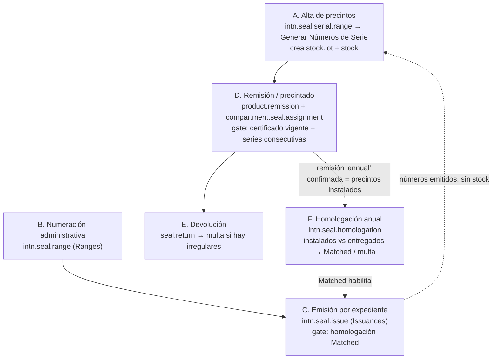

# Precintos: cadena real vs. cobertura E2E

**Fecha:** 2026-07-28 · **Rama:** 18.0 · **DB de pruebas:** `e2e_intn`

Responde a una pregunta concreta: *¿el E2E llega encadenado desde el alta de precintos hasta la remisión y la homologación, o son casos aislados?*

**Punto de partida (mañana del 2026-07-28):** eran **tramos sueltos**. La remisión + devolución (spec 06) sí era una cadena real por UI, pero la homologación (spec 09) corría sobre una remisión anual fabricada por el seed vía RPC, el alta de precintos no tenía ninguna prueba y la emisión tampoco.

**Estado al cierre del día:** la cadena está **encadenada de punta a punta** en la journey `J1-full` (03 → 04 → 05 → 06 → 07 → 09): la remisión anual la crea la propia cadena por UI y es la base de instalados que consume la homologación, que a su vez habilita la emisión de los precintos nuevos. Quedan como dato sembrado los lotes de precintos del spec 06 y los rangos de numeración (§3.4).

---

## 1. La cadena de negocio completa



Puntos clave del modelo (código, no interpretación):

| Eslabón | Dónde vive | Efecto real |
|---------|-----------|-------------|
| Alta de códigos | `intn.seal.serial.range.action_generate_lots` (`intn_fleet_cistern_certificates`) | Crea un `stock.lot` por número (`prefijo`+`n`), estado `available`; con **Load to Inventory** carga 1 unidad por serie (idempotente) |
| Rangos administrativos | `intn.seal.range` (`intn_fleet_seal_ranges`) | Reparte numeración por organismo; **no** crea lotes |
| Emisión | `intn.seal.issue.action_confirm` | Asigna `issue_from`/`issue_to` del rango; exige certificado de medición confirmado+aprobado y, en verificación anual, `homologation_state == matched`; `issue_lot_ids` sólo *empareja por nombre* los lotes existentes |
| Remisión | `product.remission.action_confirm` | Valida certificado del vehículo, que los lotes estén `available` y que las series sean **consecutivas**; genera y valida el picking; deja los lotes en `used` |
| Instalados | `fleet.vehicle._intn_installed_seal_remission` | Última remisión `state=done` con `seal_operation_type='annual'`; *fallback*: última remisión `done` cuya `service_request_id.service_type ∈ {enabling, annual_verification}` |
| Homologación | `intn.seal.homologation.action_validate_homologation` | Compara instalados (snapshot) vs entregados presentes → `matched` (y descarta los viejos) o `mismatched` + multa `seal_mismatch` |

---

## 2. Qué cubre hoy el E2E

| Tramo | Spec / helper | Cómo se ejecuta | Veredicto |
|-------|---------------|-----------------|-----------|
| A. Alta de precintos | `specs/fleet/06a` (nuevo, 2026-07-28) | Menú real → nuevo rango → *Generar Números de Serie* con carga a inventario; verifica estado `available`, 1 unidad de stock por serial e idempotencia | ✅ **Cubierto por UI** desde hoy. Los lotes del resto de las pruebas (`E2E-PREC-001/002`, seriales v12) siguen creándose por RPC en `seed_e2e_data.py` |
| B. Rangos | seed | `_ensure_homologation_e2e` crea los rangos `E2E-H` y `E2E-ISS` por RPC | ⚠️ Dato maestro sembrado; la pantalla de **Rangos** no se ejercita |
| C. Emisión (`Emisiones`) | `specs/fleet/09` FUNC 09-8 + journey J1-full | Menú real → nueva emisión → solicitud + rango → **Confirmar**; verifica los números asignados y que la solicitud quede **Sellado / Aprobado** | ✅ **Cubierto por UI**, con el gate real (certificado aprobado + homologación coincidente) |
| D. Remisión | `specs/fleet/06` UAT 1-2 + `lib/flows/cistern-seals.ts` | Menú real → *Nuevo* → captura de precintos con el widget `intn_seal_capture` → guardar → **Confirmar** → validar el picking | ✅ **E2E real por UI** |
| E. Devolución | `specs/fleet/06` UAT 3-4 | Menú real → nueva devolución ligada a la remisión → confirmar | ✅ **E2E real por UI** |
| Informe | `specs/fleet/06` UAT 5 | Asistente + descarga y validación de bytes del PDF | ✅ |
| F. Homologación | `specs/fleet/09` UAT 2-3 (fixture) + journey J1-full (encadenada) | En 09 valida el registro sembrado; en la journey abre la homologación desde la solicitud de la propia cadena y valida contra los precintos que colocó su remisión anual | ✅ **Encadenada** en la journey; el spec 09 sigue cubriendo la pantalla de forma aislada |
| Cadena larga | `specs/journeys/integration-journey-cisterna-full.spec.ts` (`@journey J1-full`) | 03 → 04 → 05 → 06 → 07 → **09 (homologación + emisión)** encadenados de verdad | ✅ Cadena completa (ver §3) |

---

## 3. Los dos cortes que había, y cómo se cerraron

### 3.1 La remisión del spec 06 no podía ser base de la homologación

`createRemissionHeaderViaOperador` (`e2e/lib/flows/cistern-seals.ts`) completaba ubicación, cliente, vehículo, producto y ubicación de precinto — pero **no** seteaba `seal_operation_type` (quedaba en el default `daily`) ni `service_request_id`. Como `_intn_installed_seal_remission` sólo mira remisiones `annual` o ligadas a una solicitud `enabling`/`annual_verification`, esa remisión **nunca aparecía** como precinto instalado.

**Cerrado.** `createSealRemissionDraft` acepta ahora `SealRemissionOptions`:

```ts
await createSealRemissionDraft(page, sealSeed, {
  sealOperationType: "annual",     // <select> del formulario, bilingüe
  serviceRequestId: requestId,     // m2o resuelto por el número de solicitud
});
```

El spec 06 sigue creando remisiones `daily` (su caso de negocio); la journey usa `annual` + solicitud, que es lo que produce la base de instalados.

### 3.2 La homologación corría sobre datos fabricados por RPC

- `_ensure_installed_seal_remission` (seed) crea una `product.remission` con `seal_operation_type='annual'` y le escribe `state='done'` **directamente**, sin pasar por `action_confirm`.
- En `runCisternFullBackofficeChain` el bloque de homologación estaba detrás de una comparación contra el id del fixture (`resolvedRequestId === state.homologation_e2e.request_id`) que **nunca se cumplía**, porque la cadena crea una solicitud nueva → la homologación se salteaba en silencio.

**Cerrado.** La journey ya no compara ids: abre la homologación desde su propia solicitud con `runHomologationForServiceRequest`, que

1. abre el registro por el botón estadístico (lo crea y toma la instantánea de instalados),
2. lee cuántos precintos quedaron como esperados (`readHomologationExpectedCount`) y falla si son cero,
3. nombra al conductor, verifica el checklist y valida.

Y a continuación emite los precintos nuevos con `confirmSealIssuanceForRequest`, que ejercita el gate real: certificado de medición confirmado y aprobado + homologación **Coincidente**.

Ese gate destapó un eslabón que faltaba en la cadena: el certificado que mira `intn.seal.issue._validate_request_can_seal` es el del **registro de medición**, no el que confirma el helper de inspección de tanque. La cadena quedaba con ese certificado en borrador y la emisión respondía *"No se puede confirmar la emisión: el certificado de medición debe confirmarse primero."*. Se agregó `ensureMeasurementCertificateConfirmed`, que lo aprueba (si su revisión documental no venía aprobada) y lo confirma antes de homologar.

El spec 09 conserva su fixture para probar la pantalla de forma aislada y barata (incluidos los caminos de cancelación y corrección), y suma **FUNC 09-8**, que emite precintos tras validar la homologación y comprueba que la solicitud queda en **Sellado / Aprobado**.

### 3.3 Interferencias que aparecieron al encadenar (y cómo quedaron resueltas)

Encadenar la journey sobre el mismo camión que usa el fixture del spec 09 destapó dos choques de datos:

- **La base de instalados del fixture se movía.** `_intn_installed_seal_remission` devuelve la *última* remisión anual del vehículo por fecha; el precintado de la cadena pasaba a ser esa, y el spec 09 esperaba 6 seriales v12 pero encontraba 2. `resetHomologationE2eState` ahora reflota la remisión del fixture (`remission_datetime = now`, con `install_mode` porque el modelo bloquea escrituras fuera de borrador) antes de retomar la instantánea.
- **El spec del alta se quedaba sin stock.** La entrega de la remisión reserva stock **por producto**, así que consumía las existencias de los seriales `E2E-RANGE-*` generados por el spec 06a. Ahora 06a calcula un intervalo nuevo en cada corrida (a partir del mayor serial existente), que es lo que además refleja el uso real: cada talonario que llega es un rango nuevo.

### 3.4 Lo que sigue siendo dato sembrado

- Los lotes de precintos que consume el spec 06 (`E2E-PREC-001/002`) y los seriales v12 de la homologación siguen creándose por RPC en el seed; el alta por UI se prueba aparte (spec 06a) con su propio prefijo.
- Los rangos de numeración (`E2E-H`, `E2E-ISS`) se siembran por RPC: la pantalla de **Rangos** no tiene cobertura.

---

## 4. Resultado de la corrida (2026-07-28)

Entorno: Odoo del usuario en `localhost:8069`, DB `e2e_intn`.

| # | Acción | Resultado |
|---|--------|-----------|
| 1 | `CAPTURE_DOC_SCREENSHOTS=1 npx playwright test specs/fleet/06 specs/fleet/09` | ❌ 2 failed / 11 not run — **fallo de entorno**: `column fleet_vehicle.tanker_type does not exist` y `column service_request.model_approval_vui_number does not exist`. La DB e2e estaba atrasada respecto del código |
| 2 | `odoo-bin -d e2e_intn -u all --no-http --stop-after-init` + `npm run db:seed` | ✅ esquema sincronizado |
| 3 | misma corrida de specs | ✅ **spec 06: 8/8 verde** (remisión → confirmación → devolución → confirmación → informe PDF, todo por UI). ❌ **spec 09 UAT 2-3**: el helper busca el menú con `/^homologations$/i` y el módulo ya trae la traducción es_PY **"Homologaciones"** → timeout buscando el menú; los 3 tests siguientes quedan sin correr por el modo serial |
| 4 | Fix en `e2e/lib/flows/homologation.ts`: regex bilingüe `/^homologations$\|^homologaciones$/i` (mismo patrón que el resto de los helpers de flota) | — |
| 5 | `CAPTURE_DOC_SCREENSHOTS=1 npx playwright test specs/fleet/09` | ✅ **5/5 verde**, con la captura `09-uat-02-homologacion-validada.png` generada por primera vez |
| 6 | Spec nuevo `specs/fleet/06a-carga-precintos-inventario.spec.ts` | ✅ **1/1 verde** — cubre el hueco A: genera el rango por UI, verifica los 6 lotes en `available` con 1 unidad de stock cada uno y que regenerar no duplica |
| 7 | Corrida conjunta 06 + 06a + 09 | ✅ 13/14; 06a falló por una aserción frágil (contaba registros de `stock.quant` en vez de existencias por lote). Corregida: ahora agrupa por lote y exige cantidad ≥ 1 en depósito interno |
| 8 | Encadenado de la cadena (remisión anual + solicitud, homologación desde la solicitud propia, emisión) + rango `E2E-ISS` en el seed | — |
| 9 | `npx playwright test specs/fleet/09` | ✅ **6/6 verde**, incluida la emisión (FUNC 09-8) |
| 10 | Journey `J1-full` | ❌ falla al abrir la homologación desde la solicitud: **el botón estadístico no existía en ninguna solicitud** (ver hallazgo 3). Corregido en el módulo |
| 11 | Journey `J1-full` (2º intento) | ❌ falla antes, en el paso portal: `capacity` esperado 5000, persistido 15000 |
| 12 | Verificación dirigida del tramo nuevo sobre la solicitud que la journey ya había precintado por UI | ✅ **2 precintos homologados** contra su propia remisión anual y **emisión confirmada** (número 2 del rango `E2E-ISS`) — con el paso del certificado de medición agregado |
| 13 | Fix de la aserción de capacidad del portal (ver §4.1) + journey `J1-full` | ✅ **2/2 verde en 8,5 min**: la cadena recorre portal → pago → verificación técnica → certificados → precintado anual → devolución → constancia → **homologación** → **emisión** |
| 14 | Regresión de los tres specs tras la journey | ❌ 2 fallas por interferencia de datos (ver §3.3) → corregidas |
| 15 | `specs/fleet/06 + 06a + 09` | ✅ **15/15 verde en 7,4 min** con la journey ya corrida antes |

**Estado final: spec 06 → 8/8, spec 06a → 1/1, spec 09 → 6/6, journey J1-full → 2/2.**

**Hallazgo colateral 1 (i18n en la prueba):** el fallo de 09 no era del proceso de precintos sino de la prueba: era el único helper de flota con el nombre de menú en un solo idioma. Explica también por qué la captura `09-uat-02-homologacion-validada.png` nunca existió en `docs/admin/_images/cisternas/`.

**Hallazgo colateral 2 (bug de UI, corregido):** el grupo **Trazabilidad de Precinto** de `stock.lot` (`intn_fleet_cistern_seals/views/stock_lot_views.xml`) usaba `invisible="product_id.default_code != 'PRECINTO'"`. El cliente web de Odoo 18 **no evalúa rutas con punto** en los modificadores, así que el grupo quedaba siempre oculto, incluso en lotes del producto de precintos — verificado en la captura del formulario del lote y en el arch devuelto por `get_view`. Corregido con un campo `intn_product_default_code` (`related="product_id.default_code"`) leído por el modificador.

**Hallazgo colateral 3 (mismo bug, en el camino crítico):** el botón estadístico **Homologación** de la solicitud (`intn_fleet_seal_ranges/views/service_request_homologation_views.xml`) tenía la misma clase de modificador (`category_id.code != 'fleet'`) y por lo tanto **nunca se renderizaba en ninguna solicitud**. Nadie lo notó porque el spec 09 lo comprobaba con `expectStatButtonVisible(/homolog/i)` y el ticket del fixture se llama *"E2E Homologation CURRENT"*: el regex matcheaba el botón de **Ticket**, un falso positivo. Corregido dejando el modificador sólo sobre `service_type` (la vista extiende el formulario de flota, y `action_open_seal_homologation` revalida la categoría en Python), y el spec ahora ancla la aserción en `button[name="action_open_seal_homologation"]`.

> Los dos arreglos exigen `-u intn_fleet_cistern_seals,intn_fleet_seal_ranges`. Si el servidor de desarrollo ya estaba levantado, hay que reiniciarlo para que el cliente web vea los campos nuevos.

### 4.1 Aserción de capacidad del portal (falla ajena que bloqueaba la journey)

Antes de llegar a los precintos, la journey moría en el paso portal con *Expected 5000 / Received 15000*. No era una carrera: `service.request._onchange_vehicle_id` **declara la capacidad como camión + acoplado** (10000 + 5000), mientras el formulario portal muestra en `#capacity` la capacidad del acoplado (`intn_fleet_cistern/controllers/portal.py`). La verificación de persistencia comparaba el valor del DOM contra el valor calculado por el servidor, así que fallaba siempre que el camión tuviera acoplado.

`assertFleetServiceRequestPersisted` ahora comprueba la regla del servidor: sin acoplado, contra el DOM; con acoplado, contra la suma de las capacidades de ambos activos.

> Nota operativa: el `--update` del script `bootstrap-e2e-db.sh` sólo actualiza los módulos de la lista `E2E_MODULES`, y los campos que faltaban pertenecen a `intn_fleet_cistern` (no listado) e `intn_portal_metrology_dispenser_requests`. Para este tipo de desfase hace falta `-u all`.

---

## 5. Qué queda pendiente

Los cuatro puntos que se habían propuesto están hechos salvo el encadenamiento del alta:

| # | Propuesta | Estado |
|---|-----------|--------|
| 1 | Spec de alta de precintos por UI | ✅ `specs/fleet/06a-carga-precintos-inventario.spec.ts` |
| 2 | Parametrizar la remisión con operación anual + solicitud | ✅ `SealRemissionOptions` en `lib/flows/cistern-seals.ts` |
| 3 | Encadenar la homologación en la journey | ✅ `runHomologationForServiceRequest` en `lib/flows/cistern-full-chain.ts` |
| 4 | Cubrir la emisión (`Emisiones`) | ✅ `confirmSealIssuanceForRequest`, usado por la journey y por FUNC 09-8 |

Pendientes reales:

1. **Que la remisión consuma los seriales del alta.** Hoy el spec 06a genera su propio rango (`E2E-RANGE-*`) y el spec 06 remite los lotes sembrados (`E2E-PREC-001/002`). Encadenarlos exige que la remisión capture seriales recién generados y que el seed deje de crearlos.
2. **Pantalla de Rangos sin cobertura.** `E2E-H` y `E2E-ISS` se siembran por RPC; crear, reiniciar o cancelar un rango desde la UI no se prueba.
3. **Camino de discrepancia encadenado.** La homologación con faltantes (multa `seal_mismatch` + bloqueo de la verificación visual) sólo se ejercita sobre el fixture, no dentro de la cadena larga.
4. **Dos certificados por verificación.** La cadena confirma el certificado de inspección de tanque *y*, aparte, el del registro de medición (el que mira el gate de emisión). Vale revisar con el área si el proceso real debería producir uno solo.

---

## 6. Documentación funcional relacionada

- [Carga de precintos en inventario](../../admin/cisternas/carga-precintos-inventario.md) — alta de series y códigos (nuevo)
- [Precintos: remisión y devolución](../../admin/cisternas/precintos-remision-devolucion.md)
- [Homologación de rangos de precintos](../../admin/cisternas/homologacion-rangos-precintos.md)
- [Constancia de entrega](../../admin/cisternas/constancia-entrega.md)
