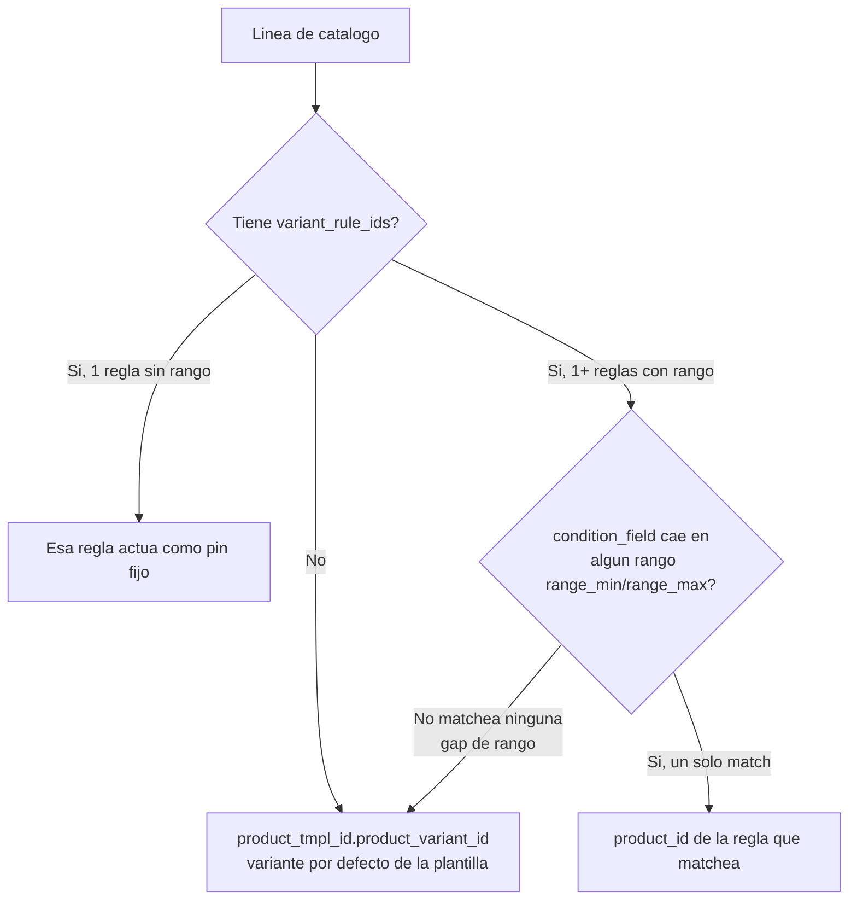

# Spec de pruebas — Resolución de producto/variante en Solicitudes de Servicio

**Estado:** Spec (no ejecutable). Insumo para escribir después pruebas automatizadas (Python `TestCase`/`HttpCase` y specs Playwright).

**Fecha del relevamiento:** 2026-07-17.

**No sustituye tests existentes por sí sola.** Los tests actuales que tocan los pickers de catálogo/producto (ver [§7](#7-tests-existentes-a-descartar-o-reescribir)) quedaron desalineados por el refactor reciente de widgets (`PortalSearchSelect`) y no cubren nada de lo documentado aquí. Se documentan primero los casos como spec; la conversión a código se hace después, sobre esta base.

---

## 1. Alcance y hallazgo clave del relevamiento

"Variante de producto" en este código **no es un selector de atributos visible para el cliente** (no hay UI de tipo talla/color/capacidad — no existe `attribute_line_ids`, `attribute_value_ids`, `ptav` ni `combination` en ningún módulo `intn_portal`). Es un motor **server-side** de reglas por rango numérico que resuelve, para cada solicitud, qué `product.product` se agrega como línea del `sale.order`.

Hallazgos del relevamiento de datos real (`custom_addons/*/data/service_catalog_*.xml`):

- **Ningún catálogo de producción/demo usa hoy `variant_rule_ids` ni `condition_field`.** Todas las líneas de catálogo existentes son incondicionales y apuntan a la variante única/por defecto de su `product.template`.
- El motor de reglas está **implementado y testeado a nivel de modelo** (`intn_base/intn_service_request/tests/test_service_request_service_catalog.py`), pero **nunca se ejerce end-to-end desde el portal** con datos reales — ningún test existente crea un catálogo con reglas y lo manda por HTTP.
- Por lo tanto, **todos los casos "con variantes" de este documento requieren datos de prueba nuevos** (propuesta en [§4](#4-datos-de-prueba-a-crear)); no existen hoy en ningún módulo.
- Los cambios recientes en el diff actual (`git status`) son un refactor de widgets (`<select>` nativo → `PortalSearchSelect`) y **no tocan la lógica de variantes** — no hay que confundir "probar los pickers nuevos" con "probar la resolución de variantes"; son dos frentes distintos y este documento cubre el segundo.

---

## 2. Arquitectura bajo prueba

| Capa | Archivo | Responsabilidad |
|------|---------|------------------|
| Modelo catálogo | `custom_addons/intn_base/intn_service_request/models/service_request_service_catalog.py` | `service.request.service.catalog`, `.line`, `.line.variant.rule` + constraints (rango no numérico, sin línea incondicional, rangos solapados) |
| Resolución | `custom_addons/intn_base/intn_service_request/models/service_request_sale_mixin.py:129-198` | `_catalog_line_matches`, `_resolve_catalog_line_product`, `_prepare_sale_order_line_vals_from_catalog`, `_service_catalog_line_quantity` |
| Entrada portal (estimación) | `custom_addons/intn_portal/intn_portal_fleet_requests/portal/_shared/controllers/service_request.py:1479` (`/my/service_request/estimate_total`, ruta compartida por todos los módulos) | Llama `portal_estimate_total()` con los vals del formulario en vivo |
| Entrada portal (envío real) | `_prepare_portal_sale_order_line_vals_list()` → creación de `sale.order.line` | Mismo motor, ejecutado al confirmar la solicitud |
| Admin (configuración) | `custom_addons/base_widgets/web_catalog_product_picker` | UI backoffice donde se cargan `condition_field`/`variant_rule_ids` (no hay UI portal equivalente) |
| Visualización cliente | `custom_addons/intn_portal/intn_portal_sale_orders/views/portal_templates.xml:405` | "Mis pedidos" imprime `line.product_id.name` (no `display_name`) |

Algoritmo de `_resolve_catalog_line_product(line)` (service_request_sale_mixin.py:141-160):

Puntos ya validados por constraints de modelo (no repetir en tests portal, solo referenciar):
- `condition_field`/`quantity_field` deben ser campos numéricos reales de `service.request` (`_check_condition_and_quantity_fields`).
- Cada catálogo debe conservar al menos una línea sin `condition_min`/`condition_max` (`_check_catalog_has_unconditional_line`).
- Los rangos de `variant_rule_ids` de una misma línea no pueden solaparse (`_check_ranges_do_not_overlap`).
- `variant_rule_ids.product_id` **no está restringido** a ser variante de la propia plantilla de la línea — puede ser cualquier `product.product` (línea 296-304 del modelo). Importante para diseñar el fixture: no hace falta crear atributos Odoo reales, alcanza con productos distintos.

---

## 3. Relevamiento de datos actual por módulo

| Módulo | Catálogo(s) (`data/service_catalog_*.xml`) | `condition_field` hoy | Driver numérico candidato real | `variant_rule_ids` hoy |
|--------|---------------------------------------------|------------------------|----------------------------------|--------------------------|
| `intn_portal_fleet_requests` (ONM) | `service_catalog_fleet_data.xml`, `service_catalog_fleet_onm_data.xml` | ninguno | `capacity` (Integer, `service_request_fleet_asset_mixin.py:57` — capacidad nominal del tanque) | ninguna |
| `intn_portal_metrology_dispenser_requests` | `service_catalog_metrology_data.xml` | ninguno | `metrology_equipment_line_count` (Integer computado, `metrology_dispenser_service_request.py:25`, hoy solo usado como `quantity_field`) | ninguna |
| `intn_portal_oiat_service_request` | `service_catalog_oiat_data.xml` | ninguno | `oiat_sample_quantity` (Float, `oiat_service_request.py:25`) | ninguna |
| `intn_portal_oiat_combustibles_lubricantes_service_request` | `service_catalog_oiat_combustibles_data.xml` | ninguno | ninguno directo en `service.request` (`oiat_fuel_volume` vive en `service.request.line`, no sirve como `condition_field`) | ninguna |
| `intn_portal_oni_seguridad_industrial` / `oni_muestreo` / `oni_textil` / `oni_maquila` | `service_catalog_oni*_data.xml` | ninguno | **sin driver numérico natural hoy** (solo `latitude`/`longitude`, no aptos para tiers de precio) | ninguna |
| `intn_brand_service_requests` / `intn_onc_certification_requests` | `service_catalog_brand_data.xml`, `service_catalog_onc_data.xml` | ninguno | fuera de alcance de este relevamiento (no está en el diff actual); mismo motor | ninguna |

**Gap detectado:** los módulos ONI no tienen hoy ningún campo numérico razonable para condicionar precio/producto por rango. Si el negocio pide variantes por rango en ONI más adelante, hace falta modelar el campo antes de poder escribir el caso — no es solo un tema de test.

---

## 4. Datos de prueba a crear

No hay fixture real de variantes múltiples en ningún módulo. Para automatizar §5 hace falta crear, en un módulo/archivo de test dedicado (no en `data/` de producción):

- 1 `product.template` tipo servicio con 3 `product.product` asociados vía `variant_rule_ids` (no requiere `product.attribute` real — alcanza con 3 productos distintos, ver nota de §2).
- 1 `service.request.service.catalog` + 1 `service.request.service.catalog.line` con:
  - `condition_field` = el driver real del módulo bajo prueba (`capacity`, `oiat_sample_quantity`, etc. — ver tabla §3).
  - **sin** `condition_min`/`condition_max` en la línea (debe quedar incondicional, para no violar el constraint de "al menos una línea siempre aplica").
  - 3 `variant_rule_ids`: `[0, 10]`, `[10.01, 50]`, `[50.01, ∞)` (dejar un hueco deliberado entre 15 y 20, por ejemplo, para el caso de gap de §5.C).
- Repetir el mismo patrón por familia (fleet, metrology, OIAT) reusando el driver ya existente de cada una; **no** inventar variantes para ONI hasta resolver el gap de §3.

---

## 5. Casos de prueba (Dado / Cuando / Entonces)

IDs con prefijo `VAR-` para poder referenciarlos 1:1 al convertirlos en nombres de test.

### A. Regresión — producto único, sin reglas (estado real de producción hoy)

| ID | Dado | Cuando | Entonces |
|----|------|--------|----------|
| VAR-A1 | Catálogo de fleet ONM sin `variant_rule_ids` (estado real) | Cliente envía solicitud con `capacity=8000` | `sale.order.line.product_id` = variante por defecto de la plantilla del catálogo; no hay error |
| VAR-A2 | Mismo catálogo | Cliente pide estimación (`/my/service_request/estimate_total`) antes de enviar | Precio mostrado en el formulario coincide con `product.list_price`/pricelist del producto por defecto |
| VAR-A3 | Catálogo de metrología sin reglas, 2 equipos cargados | Cliente envía solicitud | `metrology_equipment_line_count=2` se usa como cantidad (`quantity_field`), producto resuelto = default; línea con `product_uom_qty=2` |
| VAR-A4 | Catálogo OIAT sin reglas | Cliente envía con `oiat_sample_quantity=3` | Producto resuelto = default; `condition_field` no tiene reglas asociadas así que no afecta la selección de producto (comportamiento esperado por diseño, no bug) |

### B. Selección por "pin" (una sola regla sin rango)

| ID | Dado | Cuando | Entonces |
|----|------|--------|----------|
| VAR-B1 | Línea de catálogo con exactamente 1 `variant_rule_id` sin `range_min`/`range_max` | Cliente envía con cualquier valor de `capacity` (0, 100, 999999) | Siempre resuelve al `product_id` de esa única regla, sin importar el valor — es un pin, no un rango (confirmar contra `service_request_sale_mixin.py:151-152`) |

### C. Selección por rango (múltiples reglas)

Usando el fixture de §4: rangos `[0,10]` → Producto A, `[10.01,50]` → Producto B, `[50.01,∞)` → Producto C, hueco deliberado `(15,20)` sin cubrir dentro del rango B... *(ajustar el hueco fuera de B si se quiere aislar el caso; ver nota abajo)*.

| ID | Dado | Cuando | Entonces |
|----|------|--------|----------|
| VAR-C1 | Fixture de rangos §4 | `driver=5` (dentro de `[0,10]`) | Resuelve Producto A |
| VAR-C2 | Fixture de rangos §4 | `driver=10` (**exactamente** `range_max` de A) | Resuelve Producto A (límite inclusivo) |
| VAR-C3 | Fixture de rangos §4 | `driver=10.01` (**exactamente** `range_min` de B) | Resuelve Producto B — confirma que A y B no se pisan en el borde |
| VAR-C4 | Fixture de rangos §4 | `driver=30` (medio de B) | Resuelve Producto B |
| VAR-C5 | Fixture de rangos §4 | `driver=1000` (dentro de `[50.01,∞)`, sin upper bound) | Resuelve Producto C |
| VAR-C6 | Fixture con un hueco deliberado, ej. reglas `[0,10]` y `[20,30]` (sin cubrir 10.01–19.99) | `driver=15` (cae en el hueco) | Fallback silencioso a `product_tmpl_id.product_variant_id` (variante por defecto) — **no** error. Confirmar con negocio si este fallback silencioso es el comportamiento deseado antes de fijarlo como expected result definitivo |
| VAR-C7 | Fixture de rangos §4 | `driver=-5` (negativo, por debajo de todos los rangos con `range_min=0`) | Verificar si `0 >= -5` hace que **no** matchee ningún rango (ninguna regla tiene `range_min` vacío) → cae en fallback a variante por defecto |

### D. Validaciones de configuración (ya cubiertas a nivel de modelo — solo referenciar, no duplicar)

| ID | Ya cubierto en | Nota |
|----|-----------------|------|
| VAR-D1 | `test_service_request_service_catalog.py` | `condition_field` apuntando a campo no numérico → `ValidationError` |
| VAR-D2 | ídem | Catálogo sin ninguna línea incondicional → `ValidationError` |
| VAR-D3 | ídem | Rangos de `variant_rule_ids` solapados → `ValidationError` |

No reescribir — si al automatizar §5 se detecta que estos ya no alcanzan (p. ej. porque cambió el mensaje de error), actualizar ahí, no acá.

### E. Edge cases de entrada end-to-end (portal HTTP — capa nueva, sin cobertura hoy)

| ID | Dado | Cuando | Entonces |
|----|------|--------|----------|
| VAR-E1 | Fixture de rangos §4, campo `capacity` (Integer) | Formulario envía `capacity` vacío/`None` | `getattr(self, field, 0) or 0` → `0`; confirmar a qué producto resuelve (probablemente A si `range_min=0` está cubierto) y que no rompe |
| VAR-E2 | Igual | `capacity` como string no numérico (`"abc"`) | `portal_estimate_total` ya castea con `try/except` → `0.0` (línea ~217 de `service_request_sale_mixin.py`); confirmar que el mensaje al usuario en el formulario es claro y no un error crudo de servidor |
| VAR-E3 | Igual, `capacity` es `Integer` en el modelo | Front envía `capacity="12.5"` (decimal en campo entero) | Verificar si Odoo trunca a `12` silenciosamente al hacer `self.new(vals)`, y si eso mueve al cliente a un tier de precio distinto al que veía en el input — riesgo de discrepancia visual vs. backend |
| VAR-E4 | Fixture de rangos §4 | Regla apunta a un `product.product` que luego se archiva (`active=False`) | ¿La resolución falla silenciosamente, lanza error, o retorna un producto inactivo que después no se puede vender? |
| VAR-E5 | Plantilla sin variantes activas y sin `variant_rule_ids` | Cualquier envío | `product_tmpl_id.product_variant_id` vacío → línea se descarta (`if not prod: continue`) → si es la única línea del catálogo, `_prepare_sale_order_line_vals_from_catalog` lanza `ValidationError("No pricing rule matches this request. Contact support.")` — confirmar que este mensaje llega legible al portal, no como error 500 |
| VAR-E6 | Catálogo con 2 líneas: una con reglas, otra sin reglas, cantidades (`quantity_field`) distintas | Cliente envía un valor de driver | Cada línea resuelve producto y cantidad **independientemente**; ambas aparecen como líneas separadas del `sale.order` con el producto/cantidad correctos cada una |
| VAR-E7 | Formulario con debounce de 400ms en `estimate_total` (`portal_form_service.js`) | Usuario cambia `capacity` rápido cruzando dos tiers de precio antes de que responda el request anterior | En navegador: confirmar que el precio final mostrado corresponde al **último** valor tipeado, no a una respuesta desactualizada llegando tarde (race condition visual) |

### F. Visualización de la variante resuelta al cliente

| ID | Dado | Cuando | Entonces |
|----|------|--------|----------|
| VAR-F1 | Solicitud enviada resuelve a Producto B (de una plantilla con variantes que comparten nombre de plantilla) | Cliente entra a "Mis pedidos" (`intn_portal_sale_orders`) | **Riesgo detectado:** la plantilla imprime `line.product_id.name` (no `display_name`, `portal_templates.xml:405`) — si dos variantes comparten el mismo `name` de plantilla, el cliente no puede distinguir cuál se le vendió. Decidir si esto es un bug a corregir antes de fijarlo como expected result, o comportamiento aceptado porque hoy no hay variantes reales en producción |
| VAR-F2 | Precio estimado en el formulario antes de enviar (`portal_estimate_total`) | Cliente envía y se crea el `sale.order` real | El total de la `sale.order.line` creada coincide con el estimado mostrado (mismo driver, misma pricelist, mismo producto resuelto) |

---

## 6. Trazabilidad — dónde automatizar cada grupo

| Grupo | Capa recomendada | Ubicación sugerida |
|-------|-------------------|----------------------|
| A, D | Python `TransactionCase` (modelo, sin HTTP) | `intn_base/intn_service_request/tests/test_service_request_service_catalog.py` (D ya existe; A falta agregar como regresión explícita) |
| B, C | Python `TransactionCase`, motor de resolución | Nuevo archivo `intn_base/intn_service_request/tests/test_service_request_variant_resolution.py` |
| E | Python `HttpCase`, por módulo portal (ruta compartida `/my/service_request/estimate_total`) | `intn_portal_fleet_requests/tests/`, `intn_portal_metrology_dispenser_requests/tests/`, `intn_portal_oiat_service_request/tests/` (uno por familia, reusando el fixture de §4) |
| E7 (race condition UI), F | Playwright | `e2e/specs/` — nuevo spec o extensión de uno existente por familia |

---

## 7. Tests existentes a descartar o reescribir

Por el refactor de `PortalSearchSelect` (diff actual), estos specs Playwright tocan pickers de catálogo/producto y probablemente quedaron con selectores desalineados (no fue verificado corriendo la suite, solo por inspección del diff):

- `e2e/specs/02-solicitud-servicio-unificada.spec.ts`
- `e2e/specs/03-solicitud-fleet-cistern-portal.spec.ts` y `03-solicitud-fleet-cistern-derived-fields.spec.ts`
- `e2e/specs/10-metrologia-picos-portal.spec.ts`
- `e2e/specs/16-oiat-solicitud-muestras-portal.spec.ts`
- `e2e/specs/17-oni-informes.spec.ts` (si toca el picker "Producto/Determinación" de ONI)

**Recomendación:** no parchear estos specs selector por selector. Cuando se automatice este documento, reescribirlos usando los casos de §5 como guía — la cobertura de negocio que hace falta (resolución de variantes) es más amplia que lo que probaban antes (solo que el picker abría y filtraba), así que conviene tirarlos y rehacerlos en vez de mantenerlos vivos a medias.

---

## 8. Próximos pasos

1. Crear el fixture de catálogo multi-variante (§4) en un módulo/archivo de test — nunca en `data/` de producción.
2. Confirmar con negocio los comportamientos marcados como "silenciosos" (VAR-C6 gap, VAR-E1 valor vacío, VAR-E3 truncamiento decimal) antes de fijarlos como expected result definitivo — hoy son inferencias de leer el código, no decisiones de producto confirmadas.
3. Resolver el gap de driver numérico en los módulos ONI (§3) si el negocio efectivamente quiere variantes ahí.
4. Convertir cada fila de §5 en un test, usando el ID (`VAR-XX`) como nombre/marca del test para trazabilidad.
